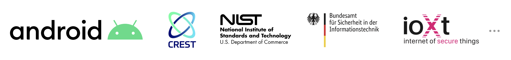

# 扉

## OWASP モバイルアプリケーションセキュリティテストガイドについて

[OWASP モバイルアプリケーションセキュリティ (Mobile Application Security, MAS)](https://mas.owasp.org/) フラグシッププロジェクトの一部である [OWASP モバイルアプリケーションセキュリティテストガイド (Mobile Application Security Testing Guide, MASTG)](https://mas.owasp.org/MASTG/0x01-Foreword) はモバイルアプリケーションセキュリティ解析時に使用されるプロセス、技法、ツールを網羅する包括的なマニュアルです。 [OWASP モバイルアプリケーションセキュリティ検証標準 (Mobile Application Security Verification Standard, MASVS)](https://mas.owasp.org/MASVS/0x01-Foreword) に記載されている要件を検証するための一連のテストケースを網羅し、完全かつ一貫したセキュリティテストのためのベースラインを提供します。

OWASP MASVS と MASTG は以下のプラットフォームプロバイダ、標準化機関、政府機関、教育機関から信頼を得ています。 [詳細はこちらをご覧ください](0x02b-MASVS-MASTG-Adoption.md) 。

## 執筆者

### Bernhard Mueller

Bernhard はあらゆる種類のシステムをハックする才能を持つサイバーセキュリティの専門家です。業界で10年以上にわたり、MS SQL Server, Adobe Flash Player, IBM Director, Cisco VOIP, ModSecurity などのソフトウェアに対するゼロデイエクスプロイトを多数公表しています。それに名前をつけることができても、おそらく少なくとも一度はそれを破棄しているでしょう。BlackHat USA は Pwnie Award for Best Research でモバイルセキュリティの先駆的な取り組みを賞賛しました。

### Sven Schleier

Sven は経験豊かなウェブおよびモバイルのペネトレーションテスト技術者であり、歴史上有名な Flash アプリケーションからプログレッシブモバイルアプリまでのすべてを評価しています。彼はセキュリティエンジニアでもあり、SDLC の中でエンドツーエンドで多くのプロジェクトをサポートし「セキュリティを構築」しています。彼はローカルおよびインターナショナルの会議やカンファレンスで講演し、ウェブアプリケーションやモバイルアプリのセキュリティに関するハンズオンワークショップを行っています。

### Jeroen Willemsen

Jeroen は主要なセキュリティアーキテクトであり、モバイルセキュリティとリスク管理に対する情熱を持っています。彼はセキュリティコーチ、セキュリティエンジニアとして企業をサポートしておりフルスタックの開発者としてどんな仕事でもこなします。彼は、セキュリティ問題からプログラミングの課題まで、技術的な問題を議論するのが大好きです。

### Carlos Holguera

Carlos はモバイルセキュリティリサーチエンジニアです。彼はモバイルアプリや自動車のコントロールユニットや IoT デバイスなどの組込みシステムのセキュリティテストの分野で長年の実務経験を積んできました。彼はモバイルアプリのリバースエンジニアリングと動的計装に熱心に取り組んでおり、継続的に学び、知識を共有しています。

## 共同執筆者

共同執筆者は一貫して質の高いコンテンツを寄稿しており、GitHub リポジトリに少なくとも 2,000 件の追加が記録されています。

### Romuald Szkudlarek

Romuald はウェブ、モバイル、IoT、クラウドの分野で 15 年以上の経験を持つ情熱的なサイバーセキュリティおよびプライバシーの専門家です。彼のキャリアの中で、彼はソフトウェアとセキュリティの分野を進歩させることを目標に、さまざまなプロジェクトに余暇をささげていました。彼はさまざまな機関で定期的に指導しています。彼は CISSP, CCSP, CSSLP, CEH の資格を保持しています。

### Jeroen Beckers

Jeroen はモバイルセキュリティのリーダーであり、モバイルセキュリティプロジェクトの品質保証とモバイルに関するあらゆることの研究開発を担当しています。彼はプログラマとしてのキャリアをスタートさせたものの、モノを組み立てるよりも分解する方が楽しいと感じ、すぐにセキュリティへ切り替えました。Android セキュリティに関する修士論文以来、Jeroen はモバイルデバイスとその (非) セキュリティに関心を持ち続けています。彼は高専、大学、クライアント、カンファレンスでの多くの講演や研修で明らかなように、他の人たちと自分の知識を共有することを大事にしています。

### Vikas Gupta

Vikas はモバイルセキュリティの専門知識を持つ経験豊富なサイバーセキュリティ研究者です。これまでのキャリアではフィンテック、銀行、政府機関などさまざまな業界のアプリケーションをセキュアにすることに取り組んできました。リバースエンジニアリング、特に難読化されたネイティブコードと暗号化を得意としています。セキュリティとモバイルコンピューティングの修士号と OSCP 資格を保有しています。彼は自分の知識を共有し、アイデアを交換することに常にオープンです。

## 旧版

モバイルセキュリティテストガイドは2015年に Milan Singh Thakur によって開始されました。元のドキュメントは Google ドライブでホストされていました。ガイド開発は2016年10月に GitHub に移されました。

### OWASP MSTG "Beta 2" (Google Doc)

| 執筆者 | レビュー担当者 | 主寄稿者 |
| --- | --- | --- |
| Milan Singh Thakur, Abhinav Sejpal, Blessen Thomas, Dennis Titze, Davide Cioccia, Pragati Singh, Mohammad Hamed Dadpour, David Fern, Ali Yazdani, Mirza Ali, Rahil Parikh, Anant Shrivastava, Stephen Corbiaux, Ryan Dewhurst, Anto Joseph, Bao Lee, Shiv Patel, Nutan Kumar Panda, Julian Schütte, Stephanie Vanroelen, Bernard Wagner, Gerhard Wagner, Javier Dominguez | Andrew Muller, Jonathan Carter, Stephanie Vanroelen, Milan Singh Thakur  | Jim Manico, Paco Hope, Pragati Singh, Yair Amit, Amin Lalji, OWASP Mobile Team|

### OWASP MSTG "Beta 1" (Google Doc)

| 執筆者 | レビュー担当者 | 主寄稿者 |
| --- | --- | --- |
| Milan Singh Thakur, Abhinav Sejpal, Pragati Singh, Mohammad Hamed Dadpour, David Fern, Mirza Ali, Rahil Parikh | Andrew Muller, Jonathan Carter | Jim Manico, Paco Hope, Yair Amit, Amin Lalji, OWASP Mobile Team  |

<!-- \pagebreak -->

## 更新履歴

すべての更新履歴は OWASP MASTG GitHub リポジトリからオンラインで入手できます。 Releases ページを参照してください。

<https://github.com/OWASP/owasp-mastg/releases>

## 免責事項

MASTG の資料を利用してモバイルアプリに対するテストを実行する場合はに、事前に各国の法律をご確認ください。MASTG に記載されている内容で法律に違反することはお控えください。

[行動規範] に詳細があります: <https://github.com/OWASP/owasp-mastg/blob/master/CODE_OF_CONDUCT.md>

OWASP はこのガイドの作成に尽力された多くの著者、レビュー担当者、編集者に感謝します。ご意見やご提案がありましたら <https://mas.owasp.org/#connect-with-us> までご連絡ください。

矛盾や誤植を見つけた場合は、OWASP MASTG Github リポジトリ <https://github.com/OWASP/owasp-mastg> で issue を開いてください。

## 著作権とライセンス

Copyright © The OWASP Foundation. 本著作物は [Creative Commons Attribution-ShareAlike 4.0 International License](https://creativecommons.org/licenses/by-sa/4.0/ "Creative Commons Attribution-ShareAlike 4.0 International License") の下でライセンスされています。再使用または配布する場合は、他者に対し本著作物のライセンス条項を明らかにする必要があります。

