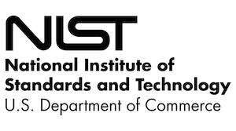
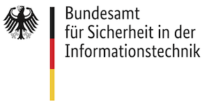

# OWASP MASVS と MSTG の採用

OWASP MASVS と MSTG は以下のプラットフォームプロバイダ、標準化機関、政府機関、教育機関から信頼を得ています。

## モバイルプラットフォームプロバイダ

### Google Android

2021 年以降、Google は OWASP Mobile Security プロジェクト (MSTG/MASVS) への支援を表明し、[App Defense Alliance (ADA)](https://appdefensealliance.dev/) とその [MASA (Mobile Application Security Assessment) プログラム](https://appdefensealliance.dev/masa) を通じて MASVS リファクタリングプロセスへの継続的で価値の高いフィードバックの提供を開始しました。

MASA により、Google は世界的に認められたモバイルアプリセキュリティ標準をモバイルアプリエコシステムに活用することの重要性を認識しました。開発者は Authorized Lab パートナーと直接連携してセキュリティ評価を開始できます。Google は一連の MASVS レベル 1 の要件に対してアプリケーションを自主的に検証した開発者を評価し、データ安全性のセクションでこれを紹介する予定です。

Google、ADA、およびそのすべてのメンバーの支援と、モバイルアプリエコシステムを保護するための優れた取り組みに感謝します。

## 標準化機関

### NIST (米国国立標準技術研究所)

[米国国立標準技術研究所 (National Institute of Standards and Technology, NIST)](https://www.nist.gov/about-nist) は 1901 年に設立され、現在は米国商務省の一部となっています。NIST は米国で最も古い物理科学研究所の一つです。議会は当時の米国の産業競争力に対する大きな課題であった二流の測定インフラストラクチャを取り除くためにこの期間を設立しました。このインフラストラクチャは英国やドイツなどの経済的ライバルに後れを取っていました。

- [NIST.SP.800-163 "Vetting the Security of Mobile Applications" Revision 1, 2019](https://csrc.nist.gov/news/2019/nist-publishes-sp-800-163-rev-1 "National Institute of Standards and Technology")
- [NIST.SP.800-218 "Secure Software Development Framework (SSDF) v1.1: Recommendations for Mitigating the Risk of Software Vulnerabilities" v1.1, 2022](https://nvlpubs.nist.gov/nistpubs/SpecialPublications/NIST.SP.800-218.pdf)

### BSI (ドイツ連邦情報セキュリティ局(Bundesamt für Sicherheit in der Informationstechnik, Germany))

BSI は "Federal Office for Information Security" の略で、ドイツにおける IT セキュリティの推進を目的とし、連邦政府の IT セキュリティサービスプロバイダの中心的な役割を担っています。

- [Technical Guideline BSI TR-03161 Security requirements for eHealth applications v1.0, 2020](https://www.bsi.bund.de/SharedDocs/Downloads/EN/BSI/Publications/TechGuidelines/TR03161/TR-03161.pdf)
- [Prüfvorschrift für den Produktgutachter des „ePA-Frontend des Versicherten“ und des „E-Rezept-Frontend des Versicherten v2.0, 2021](https://www.bsi.bund.de/SharedDocs/Downloads/DE/BSI/DigitaleGesellschaft/Pruefvorschrift_Produktgutachter_ePA-Frontend.pdf)

### ioXt

[ioXt Alliance](https://www.ioxtalliance.org/) の使命は複数の利害関係者、国際的、調和的、標準的なセキュリティとプライバシーに関する要件、製品コンプライアンスプログラム、およびこれらの要件とプログラムの公開の透明性を通じて Internet of Things 製品の信頼性を構築することです。

2021 年に ioXt は [モバイルアプリケーションプロファイルを通じてセキュリティ原則を拡張](https://www.ioxtalliance.org/news-events-blog/ioxt-alliance-expands-certification-program-for-mobile-and-vpn-security) し、アプリ開発者は自らの製品が OWASP MASVS や VPN Trust Initiative などの高いサイバーセキュリティ標準で構築され維持できるようにしました。ioXt モバイルアプリケーションプロファイルはクラウドに接続されるあらゆるモバイルアプリに適用されるセキュリティ標準であり、利用者および商用モバイルアプリのセキュリティに市場で必要とされる透明性を提供します。

- [ioXt Base Profile v2.0](https://static1.squarespace.com/static/5c6dbac1f8135a29c7fbb621/t/6078677c7d7b84799f1eaa5b/1618503553847/ioXt_Base_Profile.pdf)

## 政府機関

| 名称 | 文書 | 年号 |
| --- | -------------------- | - |
| European Payments Council | [Payment Threats and Fraud Trends Report](https://www.europeanpaymentscouncil.eu/sites/default/files/kb/file/2021-12/EPC193-21%20v1.0%202021%20Payments%20Threats%20and%20Fraud%20Trends%20Report.pdf) | 2021 |
| European Payments Council | [Mobile Initiated SEPA Credit Transfer Interoperability Implementation Guidelines, including SCT Instant (MSCT IIGs)](https://www.europeanpaymentscouncil.eu/document-library/guidance-documents/mobile-initiated-sepa-instant-credit-transfer-interoperability) | 2019 |
| ENISA (European Union Agency for Cybersecurity) | [Good Practices for Security of SMART CARS](https://www.enisa.europa.eu/publications/smart-cars) | 2019 |
| Government of India, Ministry of Electronics & Information Technology | [Adoption of Mobile AppSec Verification Standard (MASVS) Version 1.0 of OWASP](http://egovstandards.gov.in/sites/default/files/Adoption%20of%20Mobile%20AppSec%20Verification%20Standard%20%28MASVS%29%20Version%201.0%20of%20OWASP_0.pdf) | 2019 |
| Finish Transport and Communication Agency (TRAFICOM) | [Assessment guideline for electronic identification services (Draft)](https://www.traficom.fi/sites/default/files/media/file/DRAFT%20Traficom%20guideline%20211%202019%20conformity%20assessment%20of%20eID%20service.pdf) | 2019 |
| Gobierno de España INCIBE | [Ciberseguridad en Smart Toys](https://www.incibe.es/sites/default/files/contenidos/guias/doc/guia_smarttoys_final.pdf) | 2019 |

## 教育機関

| 名称 | 文書 | 年号 |
| --- | -------------------- | - |
| University of Florida, Florida Institute for Cybersecurity Research, United States | ["SO{U}RCERER : Developer-Driven Security Testing Framework for Android Apps"](https://arxiv.org/pdf/2111.01631.pdf) | 2021 |
| University of Adelaide, Australia and Queen Mary University of London, United Kingdom | [An Empirical Assessment of Global COVID-19 Contact Tracing Applications](https://arxiv.org/pdf/2006.10933.pdf) | 2021 |
| School of Information Technology, Mapúa University, Philippines | [A Vulnerability Assessment on the Parental Control Mobile Applications Security: Status based on the OWASP Security Requirements](http://www.ieomsociety.org/singapore2021/papers/1104.pdf) | 2021 |

## 科学研究への応用

- [STAMBA: Security Testing for Android Mobile Banking Apps](https://link.springer.com/chapter/10.1007/978-3-319-28658-7_57 "Advances in Signal Processing and Intelligent Recognition Systems pp 671-683")

## 書籍

- [Hands-On Security in DevOps](https://books.google.co.uk/books?id=bO1mDwAAQBAJ&pg=PA40&lpg=PA40&dq=owasp+mobile+security+testing+guide&source=bl&ots=pHhAasVgeC&sig=ACfU3U0yodcqH0O8Sjx3ADTN2m1tbHeCsg&hl=nl&sa=X&ved=2ahUKEwio2umM8tbiAhXgVBUIHehnAEU4UBDoATAIegQICRAB#v=onepage&q=owasp%20mobile%20security%20testing%20guide&f=false "Hands-On Security in DevOps in Google books")
