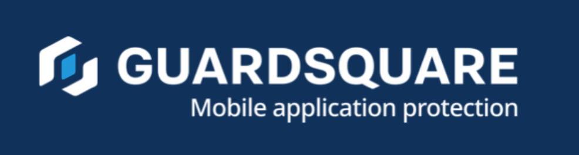

# 謝辞

## 寄稿者

すべての寄稿者は OWASP MAS ウェブサイトの Contributing セクションに記載しています。

<https://mas.owasp.org/contributing/>

## MAS 支持者 (MAS Advocates)

「MAS 支持者」になることは企業が OWASP MAS プロジェクトで達成できる最高のステータスであり、期待以上の成果を認めるものであり、**明確で大きい影響を持つ時間と専任のリソースを費やしてプロジェクトを継続的にサポートしています**。

このステータスを獲得するには、プロジェクトに **一貫して影響力の高い貢献をしている** ことを明示する必要があります。**最低限の意味のある毎月の貢献** は以下のとおりです。

- **1 件の重要な PR**。これには弱点＋テスト＋デモの完全なセットを含みます。
    - あるいは、これは現在優先しているものとして、v1 から v2 へのテストの移植 (上記と同等の労力、テストごとに少なくとも一つのデモを含まなければなりません) に焦点を当てた PR もいくつかあります。
- **2 ～ 3 件の詳細な PR レビューまたは issue サポート**
    - トピックを明確に理解していることを示す徹底的な分析、建設的なフィードバック、実用的な提案を含みます。
    - レビューは表面的なコメントにとどまらず、必要であれば調査を行い、十分な情報に基づいた洞察を提供します。
- MAS タスクフォースへの **積極的な参加**。これには以下を含みます。
    - 作業内容を発表すること、質問すること、新しいアイデアや変更点を議論すること。
    - タスクやイニチアチブの積極的なフォローアップ。

**重要な注意事項**: 貢献は OWASP 品質ガイドラインとプロジェクトの優先順位に準拠する必要があります。

**初期評価期間**: 継続的な期間 (最低 6 か月) にわたる一貫性が基本です。6 か月という期間はあくまで最低期間であり、貢献の性質と影響に応じて延長する可能性があることに注意してください。

### メリット

- メインの README とメインの OWASP プロジェクトサイトに会社のロゴが表示されます。
- 寄稿された PR を含む各 MASTG リリースに特別な謝辞が表示されます。

### 応募方法

応募を希望の場合は [Sven Schleier](mailto:sven.schleier@owasp.org) と [Carlos Holguera](mailto:carlos.holguera@owasp.org) に電子メールを送信してプロジェクトリーダーに連絡してください。彼らが応募内容を確認し、_貢献レポート_ を提供します。

初期評価期間 (上記を参照) の後、その期間に「**最低限意味のある月間の貢献**」に沿って行われたものを示す十分な証跡 (PR へのリンクなど) を含む貢献レポートを送り返す必要があります。

### 重要な免責事項

#### 更新

**MAS 支持者 (AS Advocate)** ステータスが付与され、それを維持したい場合、初期評価期間を超えて貢献を継続しなければなりません。支持者は証跡の収集を継続し、**年間貢献レポート** を提出しなければなりません。

#### 寄付金

寄付金は MAS 支持者ステータスの資格基準に **含みません**。

#### 非推奨

支持企業は OWASP MAS ロゴを使用し、コミュニケーションで MASVS/MASTG リソースを参照できます。しかし、これを **OWASP による推奨** として提示したり、ソフトウェアやサービスの **推奨プロバイダ** であることを示唆することは **できません**。

#### MAS 支持者ステータスの失効

企業がガイドラインに従わない場合、MAS 支持者ステータスは **直ちに失効します**。以下に例を示します。

- **許容される使用**: ウェブサイトのホームページ、営業プレゼンテーションの「会社情報」スライド、営業資料に MAS 支持者ステータスを記載すること。
- **準拠していない使用**: OWASP 認定、OWASP 承認、OWASP または MAS プロジェクトの **推奨ベンダー** であると主張すること。

#### 非認定および非審査免責事項

OWASP は、ベンダー、ソフトウェア、認証マークを **認定、検証、審査することはありません**。MASVS/MASTG/MASWE 準拠の主張は OWASP や OWASP MAS プロジェクトによって **公式に認められたものではありません**。組織はこのような主張に依拠する際には注意を払う必要があります。

#### ベンダー中立性

**OWASP Foundation** はベンダーに対して厳密に中立であり、そのサポーターを **推奨することはありません**。

#### ガバナンスと編集の独立性

MAS 支持者はディスカッションに参加したり、フィードバックを提供したり、OWASP MAS リソースへの改善を提案できます。しかし、最終的なコンテンツについて **意思決定権はなく**、OWASP MAS プロジェクトリーダーの管理下にあります。

## 私たちの MAS 支持者

### NowSecure

**2022 年以来、プロジェクトを前進させたいと考えている他の潜在的な貢献者にとっての青写真となる模範的な貢献をしてくれた [NowSecure](https://www.nowsecure.com) に感謝します。** [彼らの道程の詳細についてはこちらをご覧ください。](https://github.com/OWASP/owasp-mastg/blob/master/docs/news/posts/2025-04-09-celebrating-3-years-advocate-nowsecure.md)

**影響力の大きな貢献:**

- 数百ものプルリクエストとレビューにより、MAS のリソースを大幅に強化しました。
- プロジェクトを MSTG から OWASP MAS にリブランディングする上で重要な役割を果たしました。
- 抽象化とテストプロファイルに関するフィードバックを含む、MASVS v2.0.0 への主要な貢献をしました。
- フレームワークのモジュール化を含む、MASTG リファクタリングへの貢献をしました。
- MASVS-PRIVACY と MASWE の導入に多大な貢献をしました。
- MAS タスクフォースのリーダーシップにより、ロードマップの推進に貢献しました。
- Android および iOS 向けの MAS テストアプリの開発をサポートしました。

**OWASP Project Summit 2024** での NowSecure の貢献は特に注目に値します。同社はモバイルアプリのセキュリティトラックを主導し、多くの貢献をレビューし、コラボレーションとイノベーションを促進しました。

過去には NowSecure もプロジェクトに貢献し、[Android UnCrackable L4](../apps/android/MASTG-APP-0015.md) を寄贈しています。

### Guardsquare

**OWASP MAS プロジェクトへの卓越した貢献により、2025 年に MAS 支持者ステータスを獲得した [Guardsquare](https://www.guardsquare.com) に感謝します。** [彼らの業績の詳細についてはこちらをご覧ください。](https://github.com/OWASP/owasp-mastg/blob/master/docs/news/posts/2025-05-23-new-advocate-guardsquare.md)

**影響力の大きな貢献:**

- 月例会議や積極的なフォローアップを含む、MAS タスクフォースに積極的に参加しました。
- v1 から v2 へのテストの移植に焦点を当てた多数のプルリクエストとデモに貢献しました。
- MASTG の品質を維持するためのピアレビューと実用的なフィードバックに貢献しました。

特に注目すべきは **OWASP Project Summit in November 2024** での Guardsquare の多大な貢献です。同社のチームはイベント時に作成された約 40 件のプルリクエストの大部分を提出しました。
