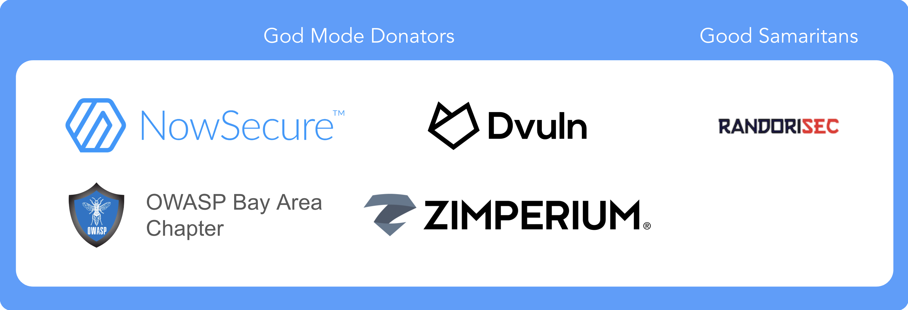

# 謝辞

## 🥇 MAS 支持者 (MAS Advocates)

MAS 支持者は OWASP MASVS および MASTG の業界採用者であり、一貫した影響力のある貢献を行い、継続的に情報を広めることによって、プロジェクトを推進するためにかなりの一貫した量のリソースを投資しています。

> 🥇 "MAS 支持者" であることは企業がプロジェクトを期待以上に支援していることに感謝し、プロジェクトでなせる最高のステータスです。

このステータスは以下のカテゴリに従って検証します。

1. **採用の表示**: 会社の公式ページを見るだけで OWASP MASVS や MASTG を採用していることが明らかであること。以下に例を示します。
     - サービス / 製品
     - リソース (ブログ投稿、プレスリリース、公開ペンテストレポートなど)
     - トレーニング
     - その他
2. **一貫した影響力のある貢献の提供**: OWASP MAS プロジェクトに対して明確で高い影響力があり時間と専用のリソースで継続的に支援すること。
     - コンテンツのプルリクエスト (例、既存テストの追加やアップグレード、ツール作成、コードサンプルのメンテナンスなど)
     - テクニカル PR レビュー
     - 自動化の改善 (GitHub Actions)
     - Crackmes のアップグレード、拡張、新規作成
     - GitHub ディスカッションのモデレート
     - プロジェクトや MASVS/MASTG リファクタリングなどの特別なイベントに価値の高いフィードバックの提供
     - その他
3. **情報を広めること** 毎年の多くのプレゼンテーション、公開トレーニング、ソーシャルメディアへの高い関与 (プロジェクトを宣伝するために、いいね、再共有、独自の投稿を行うなど) でプロジェクトを宣伝します。

_注釈: すべての箇条書きを満たす必要はありません (あくまで例です) 。ただし、プロジェクトへの貢献の継続性と高い影響力を明確に示すことができなければなりません。たとえば、"2." を満たすには最初の 6 か月間に影響力の大きいプルリクエストを送信しており、今後も継続するつもりであることを示します。_

### 🎁 メリット

- メインの README およびメインの OWASP プロジェクトサイトに会社のロゴを表示します。
- MASTG にリンクされたブログ投稿に会社名が記載されます。
- 貢献した PR を含む各 MASTG リリースに特別な謝辞を記載します。
- 新着情報に対して OWASP MAS アカウントから再共有 (リツイートなど) します。
- 初回と更新後は一年ごとに "ありがとう" の意を表します。

### 📝 応募方法

応募したい場合はプロジェクトリーダーにご連絡ください。 [Sven Schleier](mailto:sven.schleier@owasp.org) と [Carlos Holguera](mailto:carlos.holguera@owasp.org) に電子メールを送ると、あなたのアプリケーションを検証します。上記の三つのカテゴリに沿った 6 か月間の成果を示す十分な証跡 (通常、対応する要素にリンクする URL を含む _contribution report_ の形式で) を必ず含めてください。

### ❗ 重要な免責事項

- "MAS 支持者" ステータスが付与され、それを維持したい場合には、最初の期間以降も前述の貢献が一貫していなければなりません。この証跡を収集し、毎年 _contribution report_ をお送りください。
- [金銭的な寄付](https://mas.owasp.org/donate/) は資格基準の一部ではありませんが業績としてリストされます。
- MASTG テキストにリンクされる再共有された出版物やブログ投稿は **教育的** であり、モバイルセキュリティや MASVS/MASTG に焦点を当て、 **会社の製品やサービスを推奨していない** ことが必要です。
- 支持企業はコミュニケーションの一環としてロゴや MASVS/MASTG へのリンクを使用できますが、ソフトウェアやサービスの選定プロバイダとして OWASP が推奨しているものとして使用することはできません。
  - OK であるものの例: "MAS 支持者" ステータスをウェブサイトのホームページ、販売プレゼンテーションの会社スライド、販売資料に記載すること。
  - OK ではないものの例: "MAS 支持者" は OWASP の認定を受けていると主張することはできません。
- これらの企業による MASVS/MASTG のアプリケーションの品質について [MAS チームによる検証は行われていません](https://mas.owasp.org/MASVS/0x04-Assessment_and_Certification/#owasps-stance-on-masvs-certifications-and-trust-marks) 。

> OWASP Foundation はリストに記載されている個人および組織によるサポートに非常に感謝しています。ただし、OWASP Foundation は厳格にベンダー中立であり、サポーターを推奨するものではないこと注意してください。MAS 支持者は MASVS や MASTG のコンテンツにいかなる方法であっても影響をあたえることはありません。

## 私たちの MAS 支持者

[NowSecure](https://www.nowsecure.com) はプロジェクトに一貫して影響力のある貢献を提供し、普及の支援に成功しています。

**プロジェクトを後押ししたい他の潜在的な貢献者に対する青写真を示す模範的な貢献に対して NowSecure に感謝します。**

### MASVS/MASTG 採用者としての NowSecure

- サービス / 製品:
  - [NowSecure Debuts New OWASP MASVS Mobile Pen Tests](https://www.nowsecure.com/blog/2022/03/22/nowsecure-debuts-new-owasp-masvs-mobile-pen-tests/)
  - [NowSecure Platform for Automated Mobile Security Testing](https://www.nowsecure.com/products/nowsecure-platform/)
- リソース:
  - [The Essential Guide to the OWASP Mobile Security Project](https://discover.nowsecure.com/c/manager-guide-owasp?x=LIaYZt&xs=90367)
- トレーニング:
  - [Standards and Risk Assessment](https://academy.nowsecure.com/standards-and-risk-assessment)
  - [OWASP MASVS & MASTG Updates](https://academy.nowsecure.com/owasp-masvs-mstg-updates)
  - [Intro to Mobile App Security](https://academy.nowsecure.com/intro-to-mobile-app-security)

### NowSecure の MAS プロジェクトへの貢献

**影響力の大きな貢献 (時間と専用のリソース):**

- [コンテンツ PRs](https://github.com/OWASP/owasp-mastg/pulls?q=is%3Apr+%22%28by+%40NowSecure%29%22)
- PR に対するテクニカルレビュー
- GitHub ディスカッションへの参加

特筆すべきは **MASVS リファクタリングへの貢献** です。

- コミュニティと一緒に議論を進め、提案を作成するための多大な時間投資
- テスタビリティ分析
- 各カテゴリの提案に対するフィードバック
- 内部分析による統計

過去には NowSecure もプロジェクトに貢献し、"God Mode Sponsor" となって後援し、[UnCrackable App for Android Level 4: Radare2 Pay](0x08b-Reference-Apps.md#uncrackable-app-for-android-level-4) を寄贈しています。

**情報を広めること:**

- **ソーシャルメディアへの関与**: 継続的な Twitter や LinkedIn の活動 ([例](https://twitter.com/search?q=(MASVS%20OR%20MSTG)%20(from%3ANowSecureMobile)&src=typed_query) を参照)
- **ブログ投稿**:
  - [Integrate security into the mobile app software development lifecycle](https://www.scmagazine.com/perspective/devops/integrate-security-into-the-mobile-app-software-development-lifecycle)
  - [OWASP Mobile Security Testing Checklist Aids Compliance](https://www.nowsecure.com/blog/2022/02/23/owasp-mobile-security-testing-checklist-aids-compliance/)
- **プレゼンテーション**:
  - “Mobile Wanderlust”! Our journey to Version 2.0! (OWASP AppSec EU, Jun 10 2022
  - [Insiders Guide to Mobile AppSec with Latest OWASP MASVS (OWASP Toronto Chapter, Feb 10 2022)](https://www.meetup.com/owasp-toronto/events/283383269/)
  - [Insiders Guide to Mobile AppSec with Latest OWASP MASVS (OWASP Virtual AppSec 2021, Nov 11 2021)](https://www.youtube.com/watch?v=TcYtpUIIMYw)
  - [Insiders Guide to Mobile AppSec with OWASP MASVS (OWASP Northern Virginia Chapter, Oct 8 2021)](https://www.youtube.com/watch?v=fuLo64WH3SU)
  - その他いろいろ

## 寄稿者

**注意**: この寄稿者テーブルは [GitHub contribution statistics](https://github.com/OWASP/owasp-mastg/graphs/contributors "GitHub contribution statistics") に基づいて作成しています。これらの統計情報の詳細については、[GitHub Repository README](https://github.com/OWASP/owasp-mastg/blob/master/README.md "GitHub Repository README") を参照ください。手動でテーブルを更新しますので、あなたがすぐにリストに載らなくてもあわてないでください。

### 主要寄稿者

主要寄稿者は一貫して質の高いコンテンツを寄稿しており、GitHub リポジトリに少なくとも 500 件の追加が記録されています。

- Pawel Rzepa
- Francesco Stillavato
- Henry Hoggard
- Andreas Happe
- Kyle Benac
- Paulino Calderon
- Alexander Anthuk
- Caleb Kinney
- Abderrahmane Aftahi
- Koki Takeyama
- Wen Bin Kong
- Abdessamad Temmar
- Cláudio André
- Slawomir Kosowski
- Bolot Kerimbaev
- Lukasz Wierzbicki

### 寄稿者

寄稿者は質の高いコンテンツを寄稿しており、GitHub リポジトリに少なくとも 50 件の追加が記録されています。彼らの GitHub ハンドルは以下のとおりです。

kryptoknight13, DarioI, luander, oguzhantopgul, Osipion, mpishu, pmilosev, isher-ux, thec00n, ssecteam, jay0301, magicansk, jinkunong, nick-epson, caitlinandrews, dharshin, raulsiles, righettod, karolpiateknet, mkaraoz, Sjord, bugwrangler, jasondoyle, joscandreu, yog3shsharma, ryantzj, rylyade1, shivsahni, diamonddocumentation, 51j0, AnnaSzk, hlhodges, legik, abjurato, serek8, mhelwig, locpv-ibl and ThunderSon.

### 他の寄稿者

他の多くの寄稿者が単一の単語や文章など (追加数が 50 件未満) の少量のコンテンツをコミットしています。彼らの GitHub ハンドルは以下のとおりです。

jonasw234, zehuanli, jadeboer, Isopach, prabhant, jhscheer, meetinthemiddle-be, bet4it, aslamanver, juan-dambra, OWASP-Seoul, hduarte, TommyJ1994, forced-request, D00gs, vasconcedu, mehradn7, whoot, LucasParsy, DotDotSlashRepo, enovella, ionis111, vishalsodani, chame1eon, allRiceOnMe, crazykid95, Ralireza, Chan9390, tamariz-boop, abhaynayar, camgaertner, EhsanMashhadi, fujiokayu, decidedlygray, Ali-Yazdani, Fi5t, MatthiasGabriel, colman-mbuya and anyashka.

### レビュー担当者

レビュー担当者は GitHub issues および pull request コメントを通して有用なフィードバックを一貫して提供しています。

- Jeroen Beckers
- Sjoerd Langkemper
- Anant Shrivastava

### 編集者

- Heaven Hodges
- Caitlin Andrews
- Nick Epson
- Anita Diamond
- Anna Szkudlarek

### 支援者

MASVS と MASTG のいずれもコミュニティにより無償奉仕で作成および維持されていますが、時にはいくらかの外的支援が必要となることもあります。したがって、テクニカルエディタを雇うことができる資金を提供した支援者に感謝します。彼らの支援は MASVS や MASTG の内容にいかなる形であれ影響を与えないことに注意します。支援パッケージは私たちの [OWASP Project ページ](https://mas.owasp.org/donate/ "OWASP MAS Donation Packages") に記載されています。

