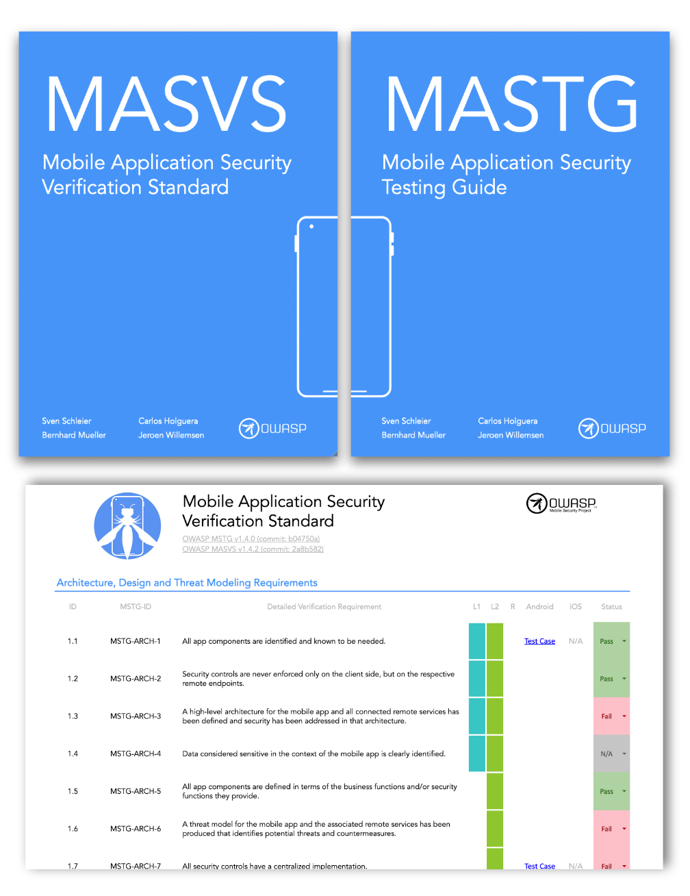

# OWASP モバイルアプリケーションセキュリティプロジェクトの序文

新しいテクノロジは常に新しいセキュリティリスクをもたらします。モバイルアプリのセキュリティに関する懸念事項は従来のデスクトップソフトウェアとは重要な点で異なります。現代のモバイルオペレーティングシステムは従来のデスクトップオペレーティングシステムよりもセキュアである傾向がありますが、開発者がモバイルアプリ開発の中でセキュリティを慎重に考慮していなければ問題はまだ発生する可能性があります。このようなセキュリティリスクは、データストレージ、アプリ間通信、暗号 API の適切な使用、セキュアなネットワーク通信など、通常の懸念事項を超えることがよくあります。

## モバイルアプリケーションセキュリティプロジェクトの使い方

まず、このプロジェクトでは、モバイルアプリのセキュリティモデルを定義し、モバイルアプリの一般的なセキュリティ要件を列挙する [OWASP モバイルアプリケーションセキュリティ検証標準 (Mobile Application Security _Verification Standard_, MASVS)](https://mas.owasp.org/MASVS/) をモバイルアプリのセキュリティ戦略のベースとすることを推奨します。MASVS はアーキテクト、開発者、テスト担当者、セキュリティ専門家、一般消費者がセキュアなモバイルアプリの品質を定義し理解するために使用できるように設計されています。OWASP MASVS がモバイルアプリのセキュリティモデルにどのように適用されるかを決定した後、このプロジェクトでは [OWASP モバイルアプリケーションセキュリティテストガイド (Mobile Application Security _Testing Guide_, MASTG)](https://mas.owasp.org/MASTG/) を使用することを提案します。このテストガイドは MASVS が提供するセキュリティ要件と同じ基本セットに対応しており、コンテキストに応じてそれらを個別に使用したり組み合わせたりして、さまざまな目的を達成するために使用できます。

たとえば、MASVS 要件はアプリの計画およびアーキテクチャ設計段階で使用できますが、チェックリストとテストガイドは手動セキュリティテストでのベースラインとしたり、開発中や開発後の自動セキュリティテストのテンプレートとして利用できます。 ["モバイルアプリのセキュリティテスト"](0x04b-Mobile-App-Security-Testing.md) の章ではチェックリストと MASTG をモバイルアプリのペネトレーションテストに適用する方法について説明します。

## モバイルテストガイドでカバーされるもの

このガイドでは、スマートフォンで動作する Android および iOS 向けのアプリに焦点を当てます。これらのプラットフォームは現在市場を席巻しており、タブレット、スマートウォッチ、スマートテレビ、車載インフォテイメントユニット、その他の組み込みシステムなどの他のデバイスクラスでも動作します。これらの追加のデバイスクラスがスコープ外であっても、ターゲットデバイスによっては多少の逸脱はありますが、このガイドで説明されるほとんどの知識とテスト技法を適用できます。

利用可能なモバイルアプリフレームワークは膨大な数があるため、そのすべてを網羅的にカバーすることは不可能です。そのため、私たちは各オペレーティングシステムの _ネイティブ_ アプリに焦点を当てます。なお、同じテクニックはウェブアプリやハイブリッドアプリを扱う際にも役立ちます (突き詰めると、フレームワークに関係なく、すべてのアプリはネイティブコンポーネントをベースにしています)。

## OWASP MASTG の案内

MASTG は MASVS で規定されているすべての要件の説明を含みます。MASTG には以下の主要なセクションがあります。

1. [総合テストガイド](0x04a-Mobile-App-Taxonomy.md) にはモバイルアプリのセキュリティテスト手法とモバイルアプリのセキュリティに適用される一般的な脆弱性解析技法があります。また、認証とセッション管理、ネットワーク通信、暗号など、OS に依存しない追加の技術的なテストケースもあります。

2. [Android テストガイド](0x05a-Platform-Overview.md) は Android プラットフォーム向けのモバイルセキュリティテストをカバーします。セキュリティの基本、セキュリティテストケース、リバースエンジニアリング技法と防止、改竄技法と防止などがあります。

3. [iOS テストガイド](0x06a-Platform-Overview.md) は iOS プラットフォーム向けのモバイルセキュリティテストをカバーします。iOS OS の概要、セキュリティテスト、リバースエンジニアリング技法と防止、改竄技法と防止などがあります。

## セキュリティ担当者はモバイルセキュリティテストにどのように取り組むべきか

多くのモバイルアプリのペネトレーションテスト担当者はネットワークやウェブアプリのペネトレーションテストの経験を持っており、これはモバイルアプリテストにとって貴重な資質です。ほとんどすべてのモバイルアプリはバックエンドサービスと通信しており、それらのサービスはデスクトップマシン上のウェブアプリでよく知られているのと同じタイプの攻撃を受けやすくなります。モバイルアプリは攻撃対象領域が小さいため、インジェクションや類似の攻撃に対するセキュリティは高くなります。代わりに、MASTG はモバイルセキュリティを高めるために、デバイスとネットワークのデータ保護を優先しています。

## OWASP MASVS 概要: モバイルアプリケーションセキュリティの主要な領域

### MASVS-STORAGE: データストレージとプライバシー (Data Storage and Privacy) 

この標準はユーザー資格情報や個人情報などの機密データの保護がモバイルセキュリティにとって極めて重要であるという原則に基づいています。アプリがオペレーティングシステム API 、特にローカルストレージやプロセス間通信 (IPC) を処理する API、を適切に使用していない場合、アプリは同じデバイスで実行している他のアプリに機密データを公開したり、意図せずにクラウドストレージ、バックアップ、キーボードキャッシュにデータを漏洩する可能性があります。また、モバイルデバイスは紛失や盗難に遭う可能性が高いため、攻撃者は実際にデバイスに物理的にアクセスできて、データの取得が容易になります。

したがって、モバイルアプリに保存されているユーザーデータを保護するために細心の注意を払わなければなりません。ソリューションの中には適切なキーストレージ API や (利用可能な場合) ハードウェア支援のセキュリティ機能の使用が含まれることがあります。

断片化は特に Android デバイスで扱う問題です。すべての Android がハードウェア支援のセキュアなストレージを提供するわけではありませんし、多くのデバイスでは時代遅れのバージョンの Android が動いています。これらの時代遅れのデバイスをサポートするアプリでは、重要なセキュリティ機能が不足している可能性のある古いバージョンの Android API を使用して作成する必要があります。セキュリティを最大限に高めるための最高の選択は、たとえ一部のユーザーを除外しても現行バージョンの API でアプリを作成することです。

### MASVS-CRYPTO: 暗号 (Cryptography) 

暗号はモバイルデバイスに保存されたデータを保護するうえで不可欠な要素です。また、標準的な慣例に従わない場合は特に、物事が恐ろしくうまくいかない領域でもあります。実績のある暗号ライブラリの使用、暗号プリミティブの適切な選択と構成、ランダム性が必要な場合の適切な乱数生成器など、業界のベストプラクティスに従ってアプリケーションで暗号を使用することが重要です。

### MASVS-AUTH: 認証と認可 (Authentication and Authorization) 

ほとんどの場合、ユーザーがリモートサービスへログインすることはモバイルアプリのアーキテクチャ全体の不可欠な要素です。ほとんどの認証と認可のロジックはエンドポイントで行われますが、モバイルアプリ側での実装上の課題もいくつかあります。ウェブアプリとは異なり、モバイルアプリでは指紋スキャンなどのユーザーとデバイス間の認証機能によりアンロックする長時間のセッショントークンを格納することがよくあります。これによりログインが速くなりユーザーエクスペリエンスは向上します (誰も複雑なパスワードを入力したくありません) が、さらなる複雑性とエラーの余地も生じます。

モバイルアプリアーキテクチャでは、別のサービスへ認証を委譲する認証フレームワーク (OAuth2 など) の導入や、認証プロバイダへの認証プロセスのアウトソースも増えています。OAuth2 を使用すると、クライアント側の認証ロジックを同じデバイス上の他のアプリ (システムブラウザなど) にアウトソースできます。セキュリティテスト技術者はさまざまな可能な認証フレームワークやアーキテクチャの長所と短所を知る必要があります。

### MASVS-NETWORK: ネットワーク通信 (Network Communication) 

モバイルデバイスは他の (潜在的に悪意のある) クライアントと共有されている公衆 Wi-Fi ネットワークなど、さまざまなネットワークに頻繁に接続しています。これにより、単純なものから複雑なもの、古いものから新しいものまで、多様なネットワークベースの攻撃を受ける機会が生まれます。モバイルアプリとリモートサービスエンドポイントの間でやり取りされる情報の機密性と完全性を維持することは非常に重要です。基本的な要件として、モバイルアプリは適切な設定の TLS プロトコルを使用して、ネットワーク通信用のセキュアな暗号化チャネルをセットアップする必要があります。

### MASVS-PLATFORM: モバイルプラットフォームとの相互連携 (Interaction with the Mobile Platform) 

モバイルオペレーティングシステムアーキテクチャは旧来のデスクトップアーキテクチャとは重要な点で異なります。例えば、すべてのモバイルオペレーティングシステムは特定の API へのアクセスを規制するアプリパーミッションシステムを実装しています。それらはアプリがシグナルやデータを交換できるように、多くの (Android) またはあまり豊富ではない (iOS) プロセス間通信 (IPC) 機能も提供します。これらのプラットフォーム固有の機能には独自の落とし穴があります。例えば、IPC API を悪用すると、機密データや機能をそのデバイス上で実行している他のアプリに意図せず公開する可能性があります。

### MASVS-CODE: コード品質とエクスプロイトの軽減 (Code Quality and Exploit Mitigation) 

従来のインジェクションやメモリ管理の問題は、アタックサーフェスがより小さいため、モバイルアプリではほとんど見られません。モバイルアプリは主に信頼できるバックエンドサーバーやその UI とのインタフェースであるため、アプリに多くのバッファオーバーフロー脆弱性が存在する場合でも、これらの脆弱性は通常、有用なアタックベクトルを開放しません。ウェブアプリでは非常に一般的なクロスサイトスクリプティング (XSS は攻撃者がウェブページ内にスクリプトを注入できます)  などのブラウザエクスプロイトについても同様に適用します。但し、常に例外があります。XSS は理論的にはモバイルで可能な場合もありますが、ある個人が悪用できる XSS の問題を見ることは非常にまれです。

このインジェクションやメモリ管理の問題からの保護は、アプリ開発者がいいかげんなコードを書くことを許すものではありません。セキュリティのベストプラクティスに従うと、改竄に対する耐性がある強固な (セキュアな) リリースビルドが実現します。コンパイラやモバイル SDK が提供するフリーのセキュリティ機能はセキュリティを向上し、攻撃を緩和するのに役立ちます。

### MASVS-RESILIENCE: 改竄防止とリバース防止 (Anti-Tampering and Anti-Reversing) 

宗教、政治、そしてコードの難読化。上品な会話では決して持ち出すべきではない三つのものです。多くのセキュリティ専門家はクライアント側の保護をあからさまに却下しています。しかし、ソフトウェア保護コントロールをモバイルアプリの世界で広く使用しているため、セキュリティテスト技術者はこれらの保護に対処する方法を必要としています。私たちは、明確な目的と現実的な期待を念頭に置いて保護を採用しており、セキュリティコントロールを置き換えるために使用していない場合、クライアント側の保護に利益があると考えています。
