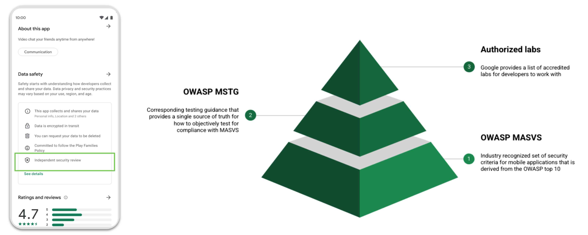

# モバイルアプリのユーザープライバシー保護

**重要な免責事項:** MASTG は法的なハンドブックではありません。したがって、ここでは GDPR やその他の関連しそうな法律について深く掘り下げることはしません。この章はトピックを紹介し、自分で調査を続けるために必要となる参考情報を提供することを目的としています。また OWASP MASVS に記載されているプライバシー関連の要件をテストするためのテストやガイドラインを提供できるよう最善を尽くします。

## 概要

### 主な問題点

モバイルアプリは識別情報や銀行情報から健康データまで、あらゆる種類の機密性の高いユーザーデータを扱います。このデータがどのように扱われ、どこに行き着くのか、懸念されるのは分かります。 "ユーザーがアプリを使うことで得られる恩恵" と (通常は残念ながら意識されませんが) "そのために支払っている本当の対価" についても話すことができます。

### 対応策 (2020年以前)

ユーザーを適切に保護するために、欧州では [一般データ保護規則 (General Data Protection Regulation, GDPR)](https://gdpr-info.eu/ "GDPR") などの法律が制定・公布され (2018年5月25日から施行) 、開発者は機密性の高いユーザーデータの取扱いについて、より透明性を高める必要が生じています。これは主にプライバシーポリシーを用いて実施されてきました。

### 課題

ここで考えるべき側面は大きく二つあります。

- **開発者のコンプライアンス**: プライバシーに関する原則は法律で定められているため、開発者はこれを遵守する必要があります。開発者は法的原則をよりよく理解し、コンプライアンスを維持するために何を実装する必要があるかを正確に知る必要があります。理想的には、少なくとも以下の条件を満たす必要があります。
  - **プライバシーバイデザイン** アプローチ (GDPR 第25条, "設計およびデフォルトでのデータ保護")
  - **最小権限の原則** ("システムのすべてのプログラムとすべてのユーザーは、ジョブを完了するために最小限の権限セットを使用して操作すべきである。")
- **ユーザーの教育**: ユーザーは機密性の高いデータについての教育を受け、(情報の安全な取り扱いと処理を確実にするために) アプリケーションを適切に使用する方法について通知を受ける必要があります。

> 注: アプリが特定のデータを扱うと謳っていても、実際にはそうではないことがよくあります。IEEE の論文 ["Engineering Privacy in Smartphone Apps: A Technical Guideline Catalog for App Developers" by Majid Hatamian](https://drive.google.com/file/d/1cp7zrqJuVkftJ0DARNN40Ga_m_tEhIrQ/view?usp=sharing) はこのトピックについて非常に優れた紹介をしています。

### データ保護における保護目標

アプリがそのビジネスプロセスのためにユーザーの個人情報を必要とする場合、ユーザーはそのデータがどうなるのか、なぜアプリがそれを必要とするのかについて通知を受ける必要があります。データの実際の処理を行うサードパーティがいる場合、アプリはそのこともユーザーに通知すべきです。

おそらく機密性、完全性、可用性というセキュリティ保護目標についてはよくご存じでしょう。しかし、データ保護に焦点を当てた三つの保護目標が提案されていることはあまり知られていないかもしれません。

- **非リンク可能性 (Unlinkability)**:
  - ユーザーのプライバシー関連データはドメイン外の他のプライバシー関連データセットとリンクできないようにしなければなりません。
  - 含まれるもの: データの最小化、匿名化、仮名化など。
- **透明性 (Transparency)**:
  - ユーザーはそれらについてアプリケーションが持つすべての情報を要求でき、この情報を要求する方法についての案内を受け取ることができるべきです。
  - 含まれるもの: プライバシーポリシー、ユーザー教育、適切なログ記録と監査の仕組みなど。
- **介入可能性 (Intervenability)**:
  - ユーザーは個人情報の修正、削除の要求、同意の取消がいつでも可能であり、その方法について案内を受け取ることができるべきです。
  - 含まれるもの: アプリ内で直接プライバシー設定ができること、個人の介入要求に対する窓口 (アプリ内チャット、電話番号、電子メールなど) が一本化されていることなど。

> 詳細については ENISA の ["Privacy and data protection in mobile applications"](https://www.enisa.europa.eu/publications/privacy-and-data-protection-in-mobile-applications "ENISA - Privacy and data protection in mobile applications") のセクション 5.1.1 "Introduction to data protection goals" を参照してください。

セキュリティとプライバシー保護の両方の目標に取り組むことは (多くの場合不可能ではないにせよ) 非常に困難な作業です。IEEE の出版物 [Protection Goals for Privacy Engineering](https://ieeexplore.ieee.org/document/7163220) には ["The Three Axes"](https://ieeexplore.ieee.org/document/7163220#sec2e) という興味深いビジュアルがあります。六つの目標それぞれを同時に 100% 保証することは不可能であることを表しています。

保護目標から導き出されるプロセスの大半は従来からプライバシーポリシーでカバーされています。しかし、このアプローチは必ずしも最適とは言えません。

- 開発者は法律の専門家ではありませんが、それでも準拠する必要があります。
- ユーザーは通常、長くて言葉の多いポリシーを読むことを要求されるでしょう。

### 新しいアプローチ (Google と Apple の考え方)

これらの課題に対処し、ユーザーが自分のデータをどのように収集、処理、共有されているかを容易に理解できるようにするため、Google と Apple は新しいプライバシーラベリングシステムを導入しました ([Consumer Software Cybersecurity Labeling](https://www.nist.gov/system/files/documents/2021/11/01/Draft%20Consumer%20Software%20Labeling.pdf) に関する NIST の提案に沿ったものです) 。

- App Store [Nutrition Labels](https://www.apple.com/privacy/labels/) (since 2020).
- Google Play [Data Safety Section](https://android-developers.googleblog.com/2021/05/new-safety-section-in-google-play-will.html) (since 2021).

両プラットフォームの新しい要件として、ユーザー保証を提供し、不正使用を軽減するために、これらのラベルは正確であることが重要です。

### Google ADA MASA プログラム

定期的なセキュリティテストを実施することで、開発者はアプリの主要な脆弱性を特定できます。Google Play では自主的なセキュリティ検証を完了した開発者がデータセーフティセクションでこれを紹介できます。これによりユーザーはセキュリティとプライバシーへのアプリの責任を信じられます。

アプリのセキュリティアーキテクチャの透明性を高めるため、Google は [App Defense Alliance (ADA)](https://appdefensealliance.dev/) の一環として [MASA (Mobile Application Security Assessment)](https://appdefensealliance.dev/masa) プログラムを導入しています。MASA により、Google はモバイルアプリエコシステムにモバイルアプリセキュリティに関する世界的に認められた標準を活用することの重要性を認識しています。開発者は Authorized Lab パートナーと直接連携してセキュリティ評価を開始できます。Google は一連の MASVS レベル 1 の要件に対してアプリケーションを自主的に検証した開発者を評価し、データセーフティセクションでこれを紹介します。

> 開発者の方で参加を希望される場合は、こちらの [フォーム](https://docs.google.com/forms/d/e/1FAIpQLSdBl_eCNcUeUVDiB2duiJLZ5s4AV5AhDVuOz_1u8S9qhcXF5g/viewform) に記入する必要があります。

テストの性質が限定的であるため、アプリケーションの完全な安全性を保障するものではないことに注意してください。この自主的なレビューは開発者のデータセーフティ宣言の正確性と完全性を検証するために行われるものではありません。開発者はアプリの Play ストアリストで完全かつ正確な宣言を行う責任を単独で負います。

### これが他の MASVS カテゴリのテストとどのように関係するか

以下はあなたがセキュリティテスト担当者として報告すべき [一般的なプライバシー違反](https://support.google.com/googleplay/android-developer/answer/10144311?hl=en-GB#1&2&3&4&5&6&7&87&9&zippy=%2Cexamples-of-common-violations) のリストです (ただしすべてを網羅したリストではありません) 。

- 例 1: ユーザーのインストール済みアプリのインベントリにアクセスするアプリで、このデータを個人データや機密データとして扱わず、ネットワーク経由で送信 (MSTG-STORAGE-4 に違反) したり、IPC メカニズムを介して他のアプリに送信 (MSTG-STORAGE-6 に違反) する場合。
- 例 2: アプリが生体情報などを介したユーザー認可なしにクレジットカードの詳細やユーザーパスワードなどの機密データを表示 (MSTG-AUTH-10 に違反) する場合。
- 例 3: ユーザーの電話や連絡帳のデータにアクセスするアプリがこのデータを個人データや機密データとして扱わず、さらに安全でないネットワーク接続を介して送信 (MSTG-NETWORK-1 に違反) する場合。
- 例 4: アプリが (おそらく適切に機能するには必要ではない) デバイスの位置情報を収集し、どの機能がこのデータを使用するかを説明する明確な開示がない (MSTG-PLATFORM-1 に違反) 場合。

> [Google Play Console Help (Policy Centre -> Privacy, deception and device abuse -> User data)](https://support.google.com/googleplay/android-developer/answer/10144311?hl=en-GB#1&2&3&4&5&6&7&87&9&zippy=%2Cexamples-of-common-violations) に、より一般的な違反があります。

このように他のテストカテゴリと深く関わっています。それらをテストする際に、間接的にユーザープライバシー保護のテストをしていることがよくあります。より良い、より包括的なレポートを提供するために、このことを心に留めておきます。多くの場合、ユーザープライバシー保護をテストするために、他のテストからの証跡を再利用することもできます (["ユーザー教育のテスト"](#testing-user-education-mstg-storage-12) の例を参照) 。

### さらに学ぶために

これと他のプライバシーに関するトピックについて、さらに学ぶにはこちらをご覧ください。

- [iOS App Privacy Policy](https://developer.apple.com/documentation/healthkit/protecting_user_privacy#3705073)
- [iOS Privacy Details Section on the App Store](https://developer.apple.com/app-store/app-privacy-details/)
- [iOS Privacy Best Practices](https://developer.apple.com/documentation/uikit/protecting_the_user_s_privacy)
- [Android App Privacy Policy](https://support.google.com/googleplay/android-developer/answer/9859455#privacy_policy)
- [Android Data Safety Section on Google Play](https://support.google.com/googleplay/android-developer/answer/10787469)
- [Preparing your app for the new Data safety section in Google Play](https://www.youtube.com/watch?v=J7TM0Yy0aTQ)
- [Android Privacy Best Practices](https://developer.android.com/privacy/best-practices)

## ユーザー教育のテスト (MSTG-STORAGE-12)

### アプリマーケットプレイスにおけるデータプライバシーでのユーザー教育のテスト

この時点では開発者がどのプライバシー関連情報を開示しているかを知り、それが妥当かどうかを評価しようとすることにのみ関心があります (パーミッションをテストする場合と同様です) 。

> 開発者が実際に収集や共有している特定の情報を宣言していない可能性がありますが、ここではこのテストを拡張する別のトピックになります。このテストの一環としてプライバシー違反の保証を提供することは想定されていません。

### 静的解析

以下の手順で行います。

1. 対応するアプリマーケットプレイス (Google Play, App Store など) でアプリを検索します。
2. ["Privacy Details"](https://developer.apple.com/app-store/app-privacy-details/) (App Store) または ["Safety Section"](https://android-developers.googleblog.com/2021/05/new-safety-section-in-google-play-will.html) (Google Play) のセクションに移動します。
3. 利用可能な情報があるかどうかを検証します。

開発者がアプリマーケットプレイスのガイドラインに準拠し、必要なラベルと説明を記載していればテストは合格です。アプリマーケットプレイスから得た情報を証跡として保存および提供して、後でプライバシーやデータ保護に対する違反の可能性を評価するために使用できるようにします。

### 動的解析

オプションの手順として、このテストの一部として何らかの証跡を提供することもできます。例えば、 iOS アプリをテストしている場合、アプリアクティビティの記録を有効にして、写真、連絡先、カメラ、マイク、ネットワーク接続などのさまざまなリソースへの詳細なアプリアクセスを含む [Privacy Report](https://developer.apple.com/documentation/network/privacy_management/inspecting_app_activity_data) を簡単にエクスポートできます。

この方法は他の MASVS カテゴリをテストする際に実に多くの利点があります。MASVS-NETWORK の [ネットワーク通信のテスト](0x06g-Testing-Network-Communication.md) や MASVS-PLATFORM の [アプリパーミッションのテスト](0x06h-Testing-Platform-Interaction.md#testing-app-permissions-mstg-platform-1) でとても役立つ情報を提供します。これらの他のカテゴリのテストをしている際に、他のテストツールを使用して同様の測定を行っているかもしれません。また、このテストの証跡としてこれを提供することもできます。

> 理想的には、利用可能な情報をアプリが実際に行うことを意図しているものと比較すべきです。しかし、これは簡単な作業ではなく、リソースや自動ツールのサポートによっては数日から数週間かかるかもしれません。また、アプリ機能やコンテキストに大きく依存するため、アプリ開発者と密接に連携したホワイトボックスセットアップで実施することが理想的でしょう。

### セキュリティベストプラクティスに関するユーザー教育のテスト

特に自動化を考えている場合、これをテストすることは難しいかもしれません。アプリを幅広く使用し、適用できるかどうか以下の質問に回答してみることをお勧めします。

- **指紋の使用**: リスクの高い取引や情報へのアクセスを提供する認証に指紋を使用する場合、

    _デバイスに他の人物の複数の指紋が登録されている場合の潜在的な問題について、アプリはユーザーに通知しますか？_

- **ルート化および脱獄**: ルートや脱獄の検出が実装されている場合、

    _デバイスが脱獄済みやルート化の状態により、特定のリスクの高いアクションがさらにリスクを伴うという事実を、アプリはユーザーに通知しますか？_

- **特定の資格情報**: ユーザーがリカバリコード、パスワード、PIN をアプリケーションから取得 (あるいは設定) する場合、

    _これを他の誰とも共有せず、そのアプリだけがそれを要求することを、アプリはユーザーに喚起しますか？_

- **アプリケーションの配布**: リスクの高いアプリケーションの場合に、ユーザーが危殆化されたバージョンのアプリケーションをダウンロードするのを防ぐために、

    _アプリの製造元はアプリの公式な配布方法 (Google Play や App Store など) を適切に伝えていますか？_

- **明確な開示**: いかなる場合においても、

    _アプリはデータアクセス、収集、使用、共有の明確な開示を表示していますか？例えば、アプリは iOS で許可を求めるために [App Tracking Transparency Framework](https://developer.apple.com/documentation/apptrackingtransparency) を使用していますか？_

## 参考情報

- Open-Source Licenses and Android - <https://www.bignerdranch.com/blog/open-source-licenses-and-android/>
- Software Licenses in Plain English - <https://tldrlegal.com/>
- Apple Human Interface Guidelines - <https://developer.apple.com/design/human-interface-guidelines/ios/app-architecture/requesting-permission/>
- Android App permissions best practices - <https://developer.android.com/training/permissions/requesting.html#explain>

### OWASP MASVS

- MSTG-STORAGE-12: "アプリは処理される個人識別情報の種類をユーザーに通知しており、同様にユーザーがアプリを使用する際に従うべきセキュリティのベストプラクティスについて通知している。"
