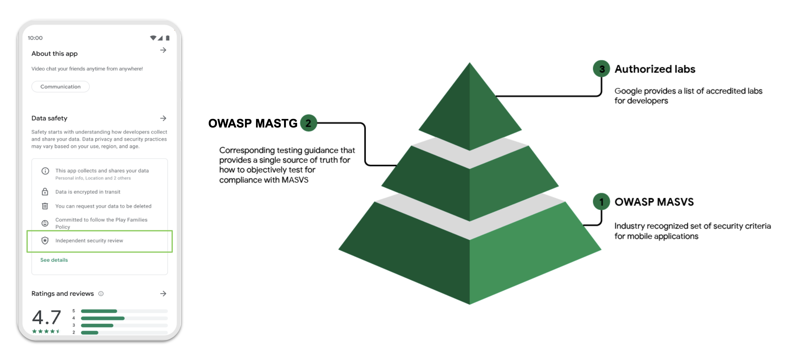

# モバイルアプリのユーザープライバシー保護

## 概要

**重要な免責事項:** MASTG は法的なハンドブックではないため、ここでは GDPR やその他の関連しそうな法律の詳細については触れません。その代わりに、この章はユーザーのプライバシー保護に関連するトピックを紹介し、自分で調査を行うために不可欠な参考情報を提供し、アプリが OWASP MASVS に記載されているプライバシー関連の要件を遵守しているかどうかを判断するテストやガイドラインを提供します。

### 主な問題点

モバイルアプリは識別情報や銀行情報から健康データまで、あらゆる種類の機密性の高いユーザーデータを扱うため、開発者も一般ユーザーも、このデータがどのように扱われ、どこに行き着くのか、懸念されるのは分かります。また、「ユーザーがアプリを使うことで得られる恩恵」と (通常は意識されませんが) 「そのために支払っている本当の対価」についても議論する価値があります。

### 対応策 (2020年以前)

ユーザーを適切に保護するために、欧州では欧州連合の [一般データ保護規則 (General Data Protection Regulation, GDPR)](https://gdpr-info.eu/ "GDPR") などの法律が制定・公布されました (2018 年 5 月 25 日から施行)。これらの法律は開発者が機密性の高いユーザーデータの取扱いについて、より透明性を高める必要が生じており、通常、プライバシーポリシーを用いて実施されてきました。

### 課題

モバイルアプリのプライバシーの以下の側面を考慮します。

- **開発者のコンプライアンス**: 開発者は自らの作業が準拠するように、ユーザープライバシーン関する法律を知る必要があります。理想的には、少なくとも以下の原則に従う必要があります。
    - **プライバシーバイデザイン** アプローチ (GDPR 第25条, "設計およびデフォルトでのデータ保護")
    - **最小権限の原則** ("システムのすべてのプログラムとすべてのユーザーは、ジョブを完了するために最小限の権限セットを使用して操作すべきである。")
- **ユーザーの教育**: ユーザーは機密性の高いデータについての教育を受け、(情報の安全な取り扱いと処理を確実にするために) アプリケーションを適切に使用する方法について通知を受ける必要があります。

#### !!! 注記
アプリが特定のデータを扱うと謳っていても、実際にはそうではないことがよくあります。IEEE の論文 ["Engineering Privacy in Smartphone Apps: A Technical Guideline Catalog for App Developers" by Majid Hatamian](https://drive.google.com/file/d/1cp7zrqJuVkftJ0DARNN40Ga_m_tEhIrQ/view?usp=sharing) はこのトピックについて非常に優れた紹介をしています。

### データ保護における目標

アプリがユーザーに個人情報を要求する場合、ユーザーはなぜアプリがそれを必要とするのか、そのデータがアプリでそのように使用されるのかを知る必要があります。データの実際の処理を行うサードパーティがいる場合、アプリはそのこともユーザーに伝えるべきです。

機密性、完全性、可用性という古典的な三つのセキュリティ保護目標と同様に、データ保護に対して提案されている三つの保護目標があります。

- **非リンク可能性 (Unlinkability)**:
    - ユーザーのプライバシー関連データはドメイン外の他のプライバシー関連データセットとリンクできません。
    - 含まれるもの: データの最小化、匿名化、仮名化など。
- **透明性 (Transparency)**:
    - ユーザーはアプリケーションが持つすべての情報を要求する方法を理解し、アプリが持つすべての情報を認識している必要があります。
    - 含まれるもの: プライバシーポリシー、ユーザー教育、適切なログ記録と監査の仕組みなど。
- **介入可能性 (Intervenability)**:
    - ユーザーはいつでも自分の個人情報を修正し、その削除を要求し、同意を撤回する方法を理解し、その方法について案内を受け取る必要があります。
    - 含まれるもの: アプリ内で直接プライバシー設定ができること、個人の介入要求に対する窓口 (アプリ内チャット、電話番号、電子メールなど) が一本化されていることなど。

> 詳細については ENISA の ["Privacy and data protection in mobile applications"](https://www.enisa.europa.eu/publications/privacy-and-data-protection-in-mobile-applications "ENISA - Privacy and data protection in mobile applications") のセクション 5.1.1 "Introduction to data protection goals" を参照してください。

セキュリティとプライバシー保護の両方の目標を同時に取り組むことは (多くの場合不可能ではないにせよ) 非常に困難な作業であるため、IEEE の出版物 [Protection Goals for Privacy Engineering](https://ieeexplore.ieee.org/document/7163220) にある ["The Three Axes"](https://ieeexplore.ieee.org/document/7163220#sec2e) とよばれるビジュアライゼーションを検討する価値があります。これは六つの目標それぞれを同時に 100% 達成できない理由を理解するのに役立ちます。

プライバシーポリシーは従来からこれらのプロセスのほとんどを保護していましたが、そのアプローチは以下の理由から常に最適とは限りません。

- 開発者は法律の専門家ではありませんが、それでも法律に準拠する必要があります。
- ユーザーはほとんどの場合、長くて言葉の多いポリシーを読む必要があります。

### 新しいアプローチ (Google と Apple)

これらの課題に対処し、ユーザーに適切な情報を提供するために、Google と Apple は (NIST の提案 [Consumer Software Cybersecurity Labeling](https://nvlpubs.nist.gov/nistpubs/CSWP/NIST.CSWP.02042022-1.pdf) にほぼ沿っている) 新しいプライバシーラベリングシステムを導入し、ユーザーが自分のデータをどのように収集、処理、共有されているかを容易に理解できるようにしました。このアプローチは以下で見ることができます。

- App Store [Nutrition Labels](https://www.apple.com/privacy/labels/) (since 2020).
- Google Play [Data Safety Section](https://developer.android.com/guide/topics/data/collect-share) (since 2021).

これは両プラットフォームの新しい要件であり、ユーザーを安心させて、不正使用を軽減するために、これらのラベルは正確でなければいけません。

### Google ADA MASA プログラム

定期的なセキュリティテストは開発者がアプリの主要な脆弱性を特定するのに役立つため、Google Play では自主的なセキュリティ検証を完了した開発者がデータセーフティセクションでこの事実を開示することでユーザーに通知できます。セキュリティとプライバシーへの開発者のコミットメントはユーザーを安心させるためのものです。

アプリのセキュリティアーキテクチャの透明性を高めるプロセスの一環として、Google は [App Defense Alliance (ADA)](https://appdefensealliance.dev/) の一環として [MASA (Mobile Application Security Assessment)](https://appdefensealliance.dev/masa) プログラムを導入しています。MASA はモバイルアプリエコシステムに対するモバイルアプリセキュリティの標準として世界的に認められているため、Google はこの業界におけるセキュリティの重要性を認識しています。開発者は認定ラボパートナーと直接連携して、一連の MASVS レベル 1 の要件に対して自主的に検証されるセキュリティ評価を開始できます。Google はこの取り組みを評価し、アプリのデータセーフティセクションでこれらのテストを公開することを許可します。

> 開発者の方で参加を希望される場合は、こちらの [Independent Security Review フォーム](https://docs.google.com/forms/d/e/1FAIpQLSdBl_eCNcUeUVDiB2duiJLZ5s4AV5AhDVuOz_1u8S9qhcXF5g/viewform "Google Play - Independent Security Review form") に記入します。

もちろんテストは限定的であり、アプリケーションの完全な安全性を保障するものではありません。この自主的なレビューは開発者のデータセーフティ宣言の正確性と完全性を検証するために行われるものではなく、開発者はアプリの Play ストアリストで完全かつ正確な宣言を行う責任を単独で負います。

### 参考情報

これと他のプライバシーに関するトピックについて、さらに学ぶにはこちらをご覧ください。

- [iOS App Privacy Policy](https://developer.apple.com/documentation/healthkit/protecting_user_privacy#3705073)
- [iOS Privacy Details Section on the App Store](https://developer.apple.com/app-store/app-privacy-details/)
- [iOS Privacy Best Practices](https://developer.apple.com/documentation/uikit/protecting_the_user_s_privacy)
- [Android App Privacy Policy](https://support.google.com/googleplay/android-developer/answer/9859455#privacy_policy)
- [Android Data Safety Section on Google Play](https://support.google.com/googleplay/android-developer/answer/10787469)
- [Preparing your app for the new Data safety section in Google Play](https://www.youtube.com/watch?v=J7TM0Yy0aTQ)
- [Android Privacy Best Practices](https://developer.android.com/privacy/best-practices)

## モバイルアプリでのプライバシーのテスト

セキュリティテスト担当者は Google Play の [一般的なプライバシー違反](https://support.google.com/googleplay/android-developer/answer/10144311?hl=en-GB#1&2&3&4&5&6&7&87&9&zippy=%2Cexamples-of-common-violations) に気を付ける必要がありますが、すべてを網羅したリストではありません。以下に例をいくつか示します。

- 例 1: ユーザーのインストール済みアプリのインベントリにアクセスするアプリで、このデータを個人データや機密データとして扱わず、ネットワーク経由で送信 (MSTG-STORAGE-4 に違反) したり、IPC メカニズムを介して他のアプリに送信 (MSTG-STORAGE-6 に違反) する場合。
- 例 2: アプリが生体情報などのユーザー認可なしにクレジットカードの詳細やユーザーパスワードなどの機密データを表示 (MSTG-AUTH-10 に違反) する場合。
- 例 3: ユーザーの電話や連絡帳のデータにアクセスするアプリがこのデータを個人データや機密データとして扱わず、さらに安全でないネットワーク接続を介して送信 (MSTG-NETWORK-1 に違反) する場合。
- 例 4: アプリが (おそらく適切に機能するには必要ではない) デバイスの位置情報を収集し、どの機能がこのデータを使用するかを説明する明確な開示がない (MSTG-PLATFORM-1 に違反) 場合。

> **Policy Centre -> Privacy, deception and device abuse -> User data** で移動すると [Google Play Console Help の common violations](https://support.google.com/googleplay/android-developer/answer/10144311?hl=en-GB#1&2&3&4&5&6&7&87&9&zippy=%2Cexamples-of-common-violations) に詳細があります。

ご想像のとおり、これらのテストカテゴリは相互に関連しています。それらをテストする際に、間接的にユーザープライバシー保護のテストをしていることがよくあります。この事実はより良い、より包括的なレポートを提供するのに役立ちます。多くの場合、ユーザープライバシー保護をテストするために、他のテストからの証跡を再利用することもできます。

## アプリマーケットプレイスにおけるデータプライバシー開示のテスト

このドキュメントは開発者がどのプライバシー関連情報を開示しているかを判断し、この情報が妥当かどうかを判断するためにどのように評価かについて説明することにのみ関心があります (パーミッションをテストする場合と同様です) 。

> 開発者が実際に収集や共有している特定の情報を宣言していない可能性がありますが、それは別のテストのトピックになります。このテストでは、プライバシー違反の保証を提供することは想定されていません。

### 静的解析

静的解析を実行するには、以下の手順で行います。

1. 対応するアプリマーケットプレイス (Google Play, App Store など) でアプリを検索します。
2. ["Privacy Details"](https://developer.apple.com/app-store/app-privacy-details/) (App Store) または ["Safety Section"](https://developer.android.com/guide/topics/data/collect-share) (Google Play) のセクションに移動します。
3. 利用可能な情報があるかどうかを判断します。

開発者がアプリマーケットプレイスのガイドラインに準拠し、必要なラベルと説明を記載している限り、アプリはテストに合格します。アプリマーケットプレイスにおける開発者の開示は証跡として保存すべきであり、後でプライバシーやデータ保護に対する違反の可能性を判断するために使用できるようにします。

### 動的解析

オプションの手順として、このテストの一部として何らかの証跡を提供することもできます。例えば、 iOS アプリをテストしている場合、アプリアクティビティの記録を有効にして、写真、連絡先、カメラ、マイク、ネットワーク接続などのさまざまなリソースへの詳細なアプリアクセスを含む [Privacy Report](https://developer.apple.com/documentation/network/privacy_management/inspecting_app_activity_data) を簡単にエクスポートできます。

動的解析は他の MASVS カテゴリをテストする際に実に多くの利点があり、MASVS-NETWORK の [ネットワーク通信のテスト](0x06g-Testing-Network-Communication.md) や MASVS-PLATFORM の [プラットフォームとのアプリ連携のテスト](0x06h-Testing-Platform-Interaction.md) でとても役立つ情報を提供します。これらの他のカテゴリのテストをしている際に、他のテストツールを使用して同様の測定を行っているかもしれません。また、このテストの証跡としてこれを提供することもできます。

> 利用可能な情報をアプリが実際に行うことを意図しているものと比較すべきが、これは簡単な作業ではなく、リソースや自動ツールの機能によっては数日から数週間かかるかもしれません。また、これらのテストはアプリ機能やコンテキストに大きく依存するため、アプリ開発者と密接に連携したホワイトボックスセットアップで実施することが理想的でしょう。

## セキュリティベストプラクティスに関するユーザー教育のテスト

アプリがユーザーを教育し、セキュリティニーズを理解するのに役立つかどうかを判断することは、プロセスを自動化することを考えている場合、特に困難です。アプリを幅広く使用し、適用できるかどうか以下の質問に回答してみることをお勧めします。

- **指紋の使用**: リスクの高い取引や情報へのアクセスを提供する認証に指紋を使用する場合、

    _デバイスに他の人物の複数の指紋が登録されている場合の潜在的な問題について、アプリはユーザーに通知しますか？_

- **ルート化および脱獄**: ルートや脱獄の検出が実装されている場合、

    _デバイスが脱獄済みやルート化の状態により、特定のリスクの高いアクションがさらにリスクを伴うという事実を、アプリはユーザーに通知しますか？_

- **特定の資格情報**: ユーザーがリカバリコード、パスワード、PIN をアプリケーションから取得 (あるいは設定) する場合、

    _これを他の誰とも共有せず、そのアプリだけがそれを要求することを、アプリはユーザーに喚起しますか？_

- **アプリケーションの配布**: リスクの高いアプリケーションの場合に、ユーザーが危殆化されたバージョンのアプリケーションをダウンロードするのを防ぐために、

    _アプリの製造元はアプリの公式な配布方法 (Google Play や App Store など) を適切に伝えていますか？_

- **明確な開示**: いかなる場合においても、

    _アプリはデータアクセス、収集、使用、共有の明確な開示を表示していますか？例えば、アプリは iOS で許可を求めるために [App Tracking Transparency Framework](https://developer.apple.com/documentation/apptrackingtransparency) を使用していますか？_

他の参考情報:

- Open-Source Licenses in Android - <https://www.bignerdranch.com/blog/open-source-licenses-and-android/>
- Software Licenses in Plain English - <https://tldrlegal.com/>
- Apple's approach to access private data - <https://developer.apple.com/design/human-interface-guidelines/privacy>
- Android app permissions best practices - <https://developer.android.com/training/permissions/requesting.html#explain>
