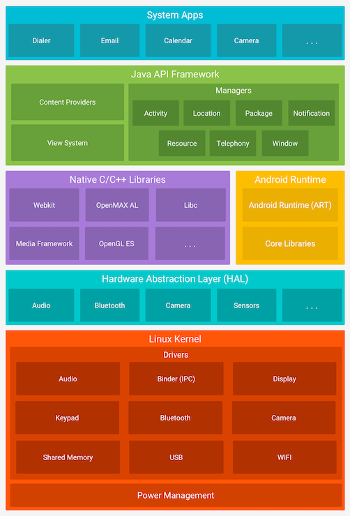
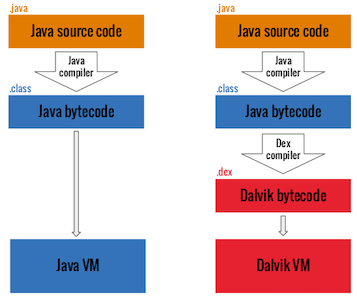
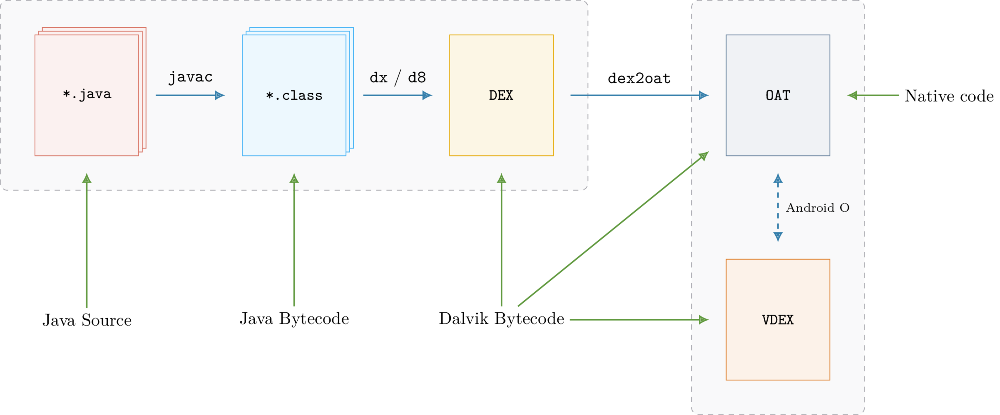
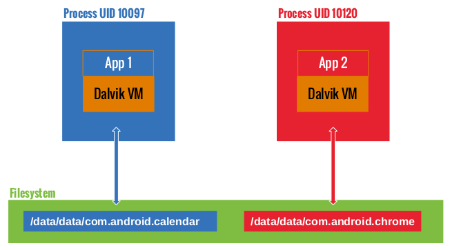
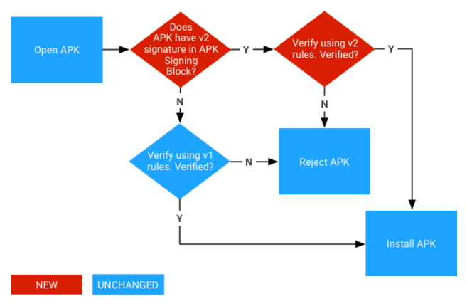
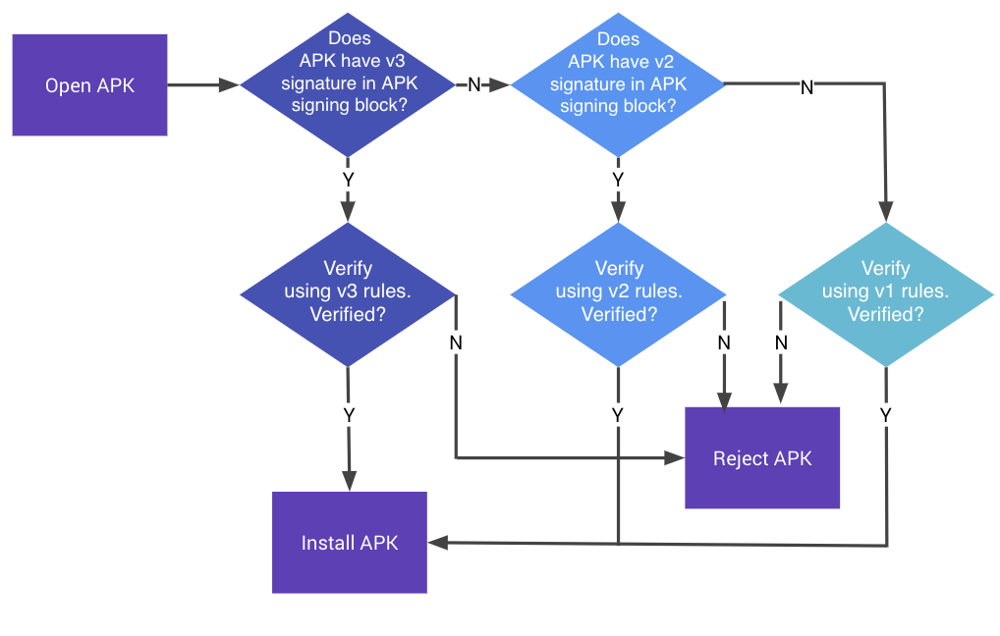

# Android プラットフォーム概要

この章ではアーキテクチャの観点から Android プラットフォームを紹介します。以下の五つの主要な領域について説明します。

1. Android アーキテクチャ
2. Android セキュリティ: 多層防御アプローチ
3. Android アプリケーション構造
4. Android アプリケーションの公開
5. Android アプリケーションのアタックサーフェイス

Android プラットフォームの詳細については [Android 開発者ドキュメントウェブサイト](https://developer.android.com/index.html) をご覧ください。

## Android アーキテクチャ

[Android](https://en.wikipedia.org/wiki/Android_\(operating_system\)) は [Open Handset Alliance](https://www.openhandsetalliance.com/) (Google を中心としたコンソーシアム) が開発した Linux ベースのオープンソースプラットフォームであり、モバイルオペレーティングシステム (OS) として機能します。現在、このプラットフォームはモバイルフォン、タブレット、ウェアラブル技術、テレビ、その他の「スマート」デバイスなど、さまざまな最新テクノロジの基盤となっています。典型的な Android ビルドにはさまざまなプリインストール (「ストック」) アプリが付属しており、 Google Play ストアや他のマーケットプレイスを通じてサードパーティアプリのインストールをサポートしています。

Android のソフトウェアスタックはいくつかの異なるレイヤで構成されています。各レイヤはインタフェースを定義し、特定のサービスを提供します。



**カーネル:** 最下層では、Android は [Low Memory Killer](https://source.android.com/devices/tech/perf/lmkd) 、ウェイクロック、 [Binder IPC](https://source.android.com/devices/architecture/hidl/binder-ipc) ドライバなどの重要な追加機能を含む [Linux カーネルのバリエーション](https://source.android.com/devices/architecture/kernel) をベースにしています。 MASTG では、Android が一般的な Linux ディストリビューションと大きく異なる、OS のユーザーモード部分に焦点を当てます。私たちにとって最も重要なコンポーネントはアプリケーションで使用されるマネージドランタイム (ART/Dalvik) と、glibc (GNU C ライブラリ) の Android 版である [Bionic](https://en.wikipedia.org/wiki/Bionic_\(software\)) の二つです。

**HAL:** カーネルの上には、ハードウェア抽象化レイヤ (Hardware Abstraction Layer, HAL) がビルトインのハードウェアコンポーネントと対話するための標準インタフェースを定義します。いくつかの HAL 実装では Android システムが必要に応じて呼び出す共有ライブラリモジュールにパッケージ化されています。これはアプリケーションがデバイスのハードウェアと対話できるようにするための基礎となります。たとえば、純正の電話アプリケーションがデバイスのマイクとスピーカーを使用できるようにします。

**ランタイム環境:** Android アプリは Java や Kotlin で書かれて [Dalvik バイトコード](https://source.android.com/devices/tech/dalvik/dalvik-bytecode) にコンパイルされます。バイトコード命令を解釈してターゲットデバイス上で実行するランタイムを使用して実行できます。Android では、これは [Android Runtime (ART)](https://source.android.com/devices/tech/dalvik/configure#how_art_works) です。これは Java アプリケーションの [JVM (Java Virtual Machine)](https://en.wikipedia.org/wiki/Java_virtual_machine) や .NET アプリケーションの Mono ランタイムに似ています。

Dalvik バイトコードは Java バイトコードの最適化バージョンです。作成にはまず Java または Kotlin コードをそれぞれ javac や kotlinc コンパイラを使用して Java バイトコードにコンパイルし .class ファイルを生成します。最後に、Java バイトコードは d8 ツールを使用して Dalvik バイトコードに変換されます。 Dalvik バイトコードは .dex ファイルの形で APK や AAB ファイルにパックされ、Android のマネージドランタイムによってデバイス上で実行されます。



Android 5.0 (API レベル 21) 以前は、Android は Dalvik Virtual Machine (DVM) 上でバイトコードを実行し、実行時にマシンコードに変換していました。 ジャストインタイム (_just-in-time_, JIT) コンパイルと呼ばれる処理です。これによりランタイムはコード解釈の柔軟性を維持しながら、コンパイルされたコードの速度の恩恵を受けられます。

Android 5.0 (API レベル 21) 以降、Android は DVM の後継である Android Runtime (ART) 上でバイトコードを実行するようになりました。ART は Java とネイティブスタック情報の両方を含めることで、パフォーマンスを向上させ、アプリのネイティブクラッシュレポートのコンテキスト情報を提供します。後方互換性を維持するために同じ Dalvik バイトコードを入力に使用します。しかし、ART は Dalvik バイトコードを異なる方法で実行します。 事前 (_ahead-of-time_, AOT) コンパイル、 ジャストインタイム (_just-in-time_, JIT) コンパイル、プロファイルガイドに基づくコンパイルを組み合わせたハイブリッドコンパイルを使用します。

* **AOT** は Dalvik バイトコードをネイティブコードにプリコンパイルし、生成されたコードはディスク上に .oat 拡張子 (ELF バイナリ) で保存されます。 dex2oat ツールはコンパイルの実行に使用され、Android デバイスの /system/bin/dex2oat にあります。 AOT コンパイルはアプリのインストール時に実行されます。これによりコンパイルが不要になるため、アプリケーションの起動が速くなります。しかし、これは JIT コンパイルに比べてインストール時間が長くなることも意味します。さらに、アプリケーションは常に OS の現行バージョンに対して最適化されているため、ソフトウェアのアップデートによって以前にコンパイルされたアプリケーションはすべて再コンパイルすることになり、システムアップデート時間が大幅に増加することを意味します。最後に、AOT コンパイルはユーザーが使用しない部分があってもアプリケーション全体をコンパイルします。
* **JIT** は実行時に発生します。
* **プロファイルガイドに基づくコンパイル** は AOT の欠点に対処するために Android 7 (API レベル 24) で導入されたハイブリッドアプローチです。最初に、アプリケーションは JIT コンパイルを使用し、Android はアプリケーションで頻繁に使用される部分すべてを追跡します。この情報はアプリケーションプロファイルに保存され、デバイスがアイドル状態のときにコンパイル (dex2oat) デーモンが実行され、プロファイルから特定された頻繁に使用されるコードパスを AOT コンパイルします。



入手元: [https://lief-project.github.io/doc/latest/tutorials/10\_android\_formats.html](https://lief-project.github.io/doc/latest/tutorials/10_android_formats.html)

**サンドボックス化:** Android アプリはハードウェアリソースに直接アクセスできず、各アプリはそれ自身の仮想マシンまたはサンドボックス内で動作します。これにより OS はデバイス上のリソースとメモリアクセスを正確に制御できます。例えば、アプリがクラッシュしてもその同じデバイス上で実行中の他のアプリには影響しません。 Android はアプリに割り当てられるシステムリソースの最大数を制御し、一つのアプリが多すぎるリソースを独占することを防ぎます。同時に、このサンドボックス設計は Android のグローバルな多層防御戦略における多くの原則の一つとみなすことができます。権限の低い悪意のあるサードパーティアプリケーションは自身のランタイムを抜け出して、同じデバイス上で狙ったアプリケーションのメモリを読み取ることはできないはずです。次のセクションでは Android オペレーティングシステムのさまざまな防御層について詳しく見ていきます。 ["ソフトウェアの分離"](0x05a-Platform-Overview.md#software-isolation) セクションで詳しく説明します。

より詳しい情報については Google Source 記事 ["Android Runtime (ART)"](https://source.android.com/devices/tech/dalvik/configure#how_art_works) 、 [Jonathan Levin による書籍 "Android Internals"](http://newandroidbook.com/) 、 [@\_qaz\_qaz によるブログ投稿 "Android 101"](https://secrary.com/android-reversing/android101/) をご覧ください。

## Android セキュリティ: 多層防御アプローチ

Android アーキテクチャは多層防御アプローチを可能にするさまざまなセキュリティ層を実装しています。これは機密性の高いユーザーデータやアプリケーションの機密性、完全性、可用性が単一のセキュリティ対策に依存していないことを意味します。このセクションでは Android システムが提供するさまざまな防御層の概要を説明します。セキュリティ戦略は大きく四つの異なるドメインに分類でき、それぞれが特定の攻撃モデルに対する保護に重点を置いています。

* システム全体のセキュリティ
* ソフトウェアの分離
* ネットワークセキュリティ
* エクスプロイト防止

### システム全体のセキュリティ

#### デバイス暗号化

Android は Android 2.3.4 (API レベル 10) からデバイス暗号化をサポートしており、それ以降いくつかの大きな変更が加えられています。 Google は Android 6.0 (API レベル 23) 以降を実行するすべてのデバイスがストレージ暗号化をサポートすることを課しています。ただし一部のローエンドデバイスではパフォーマンスに大きな影響を与えるため免除されています。

* [フルディスク暗号化 (Full-Disk Encryption, FDE)](https://source.android.com/security/encryption/full-disk): Android 5.0 (API レベル 21) 以降はフルディスク暗号化をサポートしています。この暗号化ではユーザーのデバイスパスワードで保護された単一の鍵を使用してユーザーデータパーティションを暗号化および復号化します。この種の暗号化は現在では非推奨とされており、可能な限りファイルベース暗号化を使用すべきです。フルディスク暗号化には、ユーザーがパスワードを入力してロック解除しないと、通話を受けられないことや再起動後にアラームが作動しないことなどの欠点があります。
* [ファイルベース暗号化 (File-Based Encryption, FBE)](https://source.android.com/security/encryption/file-based): Android 7.0 (API レベル 24) ではファイルベースの暗号化をサポートしています。ファイルベース暗号化はさまざまなファイルを異なる鍵で暗号化できるため、ファイルを個別に解読できます。このタイプの暗号化をサポートするデバイスは Direct Boot もサポートします。 Direct Boot により、ユーザーがデバイスをロック解除していなくても、デバイスはアラームやアクセシビリティサービスなどの機能にアクセスできます。

> \[!NOTE] [Adiantum](https://github.com/google/adiantum) について耳にしたことがあるかもしれません。Android 9 (API レベル 28) 以降を実行している CPU に AES 命令がないデバイス用に設計された暗号化方式です。 **Adiantum は ROM 開発者やデバイスベンダーにのみ関係します**。 Android は開発者がアプリケーションから Adiantum を使用するための API を提供していません。 Google が推奨しているように、 ARMv8 Cryptography Extensions を搭載した ARM ベースのデバイスや、 AES-NI を搭載した x86 ベースのデバイスを出荷する際に Adiantum を使用すべきではありません。これらのプラットフォームでは AES の方が高速です。 詳細については [Android ドキュメント](https://source.android.com/security/encryption/adiantum) を参照してください。

#### Trusted Execution Environment (TEE)

Android システムが暗号化を実行するには暗号化鍵をセキュアに生成、インポート、保存する方法が必要です。私たちは本質的に機密データをセキュアに保つという本題を暗号化鍵をセキュアに保つことにシフトしています。攻撃者が暗号化鍵をダンプまたは推測できる場合、暗号化された機密データを取り出すことができます。

Android は暗号化鍵をセキュアに生成および保護する問題を解決するために Trusted Execution Environment を提供します。これは Android システムの専用ハードウェアコンポーネントが暗号化鍵マテリアルの処理を担うことを意味します。これには三つの主要モジュールが関与します。

* [ハードウェア支援 KeyStore](https://source.android.com/security/keystore): このモジュールは Android OS およびサードパーティアプリに暗号化サービスを提供します。これによりアプリは暗号化鍵マテリアルを公開することなく TEE で暗号化にかかわる機密性の高い操作を実行できます。
* [StrongBox](https://developer.android.com/training/articles/keystore#HardwareSecurityModule): Android 9 (Pie) では、ハードウェア支援 KeyStore を実装するためのもう一つのアプローチとして StrongBox が導入されました。 Android 9 Pie までは、 Android OS カーネルの外部にある TEE 実装がハードウェア支援 KeyStore とされていました。 StrongBox は KeyStore が実装されるデバイスに追加される実際には完全に別のハードウェアチップで、 Android ドキュメントにも明確に定義されています。鍵が StrongBox にあるかどうかをプログラムで確認できます。ある場合、独自の CPU 、セキュアストレージ、 True Random Number Generator (TRNG) を備えたハードウェアセキュリティモジュールにより鍵が保護されていることを確認できます。すべての機密性の高い暗号化操作は StrongBox のセキュアな境界内にあるこのチップ上で行われます。
* [GateKeeper](https://source.android.com/security/authentication/gatekeeper): GateKeeper モジュールはデバイスパターンおよびパスワード認証を有効にします。認証プロセス時のセキュリティ上機密性の高い操作はデバイス上で利用可能な TEE の内部で行われます。 GateKeeper は三つの主要コンポーネントで構成されています。 (1) GateKeeper を公開するサービス `gatekeeperd` 、(2) ハードウェアインタフェースである GateKeeper HAL 、(3) TEE の GateKeeper 機能を実装する実際のソフトウェアである TEE 実装。

#### 検証済みブート (Verified Boot)

Android デバイスで実行されているコードが信頼できるソースからのものであり、その完全性が損なわれていないことを確認する方法が必要です。これを実現するために、 Android は検証済みブートの概念を導入しました。検証済みブートの目的はハードウェアとそのハードウェア上で実行される実際のコードとの間に信頼関係を確立することです。検証済みブートシーケンスでは、ハードウェア保護された Root-of-Trust (RoT) から最終的に実行されるシステムまで完全な信頼の連鎖が確立され、必要なすべてのブートフェーズを通して検証されます。 Android システムが最終的にブートした際、そのシステムが改竄されていないことが保証されます。実行されているコードが OEM により意図されたものであり、悪意を持ってあるいは偶発的に改変されたものではないことを暗号学的に証明できます。

詳細については [Android ドキュメント](https://source.android.com/security/verifiedboot) を参照してください。

#### Android Enterprise

[Android Enterprise](https://developer.android.com/work) (旧称 Android for Work) は企業や組織での使用向けに設計された機能とサービスのセットであり、標準の Android を超える強化されたセキュリティ、プライバシー、管理機能を提供します。組織は、仕事用アプリとデータ用に、個人用アプリとは隔離された、個別の暗号化されたコンテナを作成する仕事用プロファイルなどの機能を通じて、Android デバイスとアプリを安全にデプロイおよび管理できます。

主なセキュリティ機能には、強制暗号化、強化されたデバイス管理コントロール、常時接続 VPN、エンタープライズモビリティ管理 (EMM) ソリューションによって適用可能な厳格なセキュリティポリシーなどがあります。最近の Android バージョンに追加された新機能やアップデートについては [Android Enterprise ドキュメント](https://developer.android.com/work/versions) をご覧ください。

エンタープライズ環境向けアプリを構築する開発者は [Android の仕事用プロファイル APIs](https://developer.android.com/work/versions) やデバイスポリシー制限を認識し、IT 管理者がリモートでアプリを構成できるように [管理対象構成](https://developer.android.com/work/managed-configurations) などの機能を実装して、組織のセキュリティ要件への準拠を確保する必要があります。

### ソフトウェアの分離

#### Android ユーザーとグループ

Android オペレーティングシステムは Linux をベースにしていますが、他の Unix ライクなシステムと同じようにユーザーアカウントを実装してはいません。 Android では Linux カーネルのマルチユーザーサポートを使用してアプリをサンドボックス化しています。一部の例外を除いて、各アプリは別々の Linux ユーザーの下で実行しており、他のアプリやオペレーティングシステムの他の部分から実質的に分離されています。

ファイル [android\_filesystem\_config.h](https://android.googlesource.com/platform/system/core/+/master/libcutils/include/private/android_filesystem_config.h) には、システムプロセスに割り当てられる定義済みユーザーおよびグループのリストがあります。他のアプリケーション用の UID (userID) は後者がインストールされたときに追加されます。

例えば、 Android 9.0 (API レベル 28) では以下のシステムユーザーが定義されています。

```c
    #define AID_ROOT             0  /* traditional unix root user */
    #...
    #define AID_SYSTEM        1000  /* system server */
    #...
    #define AID_SHELL         2000  /* adb and debug shell user */
    #...
    #define AID_APP_START          10000  /* first app user */
    ...
```

#### SELinux

Security-Enhanced Linux (SELinux) は 強制アクセス制御 (Mandatory Access Control, MAC) システムを使用して、どのプロセスがどのリソースにアクセスする必要があるかをさらにロックダウンします。各リソースにはどのユーザーがどのタイプのアクションを実行できるかを定義する `user:role:type:mls_level` の形式でラベルが付けられます。例えば、あるプロセスはファイルを読むことしかできず、別のプロセスはそのファイルを編集または削除できることがあります。このように、最小特権の原則に取り組むことにより、脆弱なプロセスは特権昇格やラテラルムーブメントにより悪用することがより困難になります。

詳細については [Android ドキュメント](https://source.android.com/security/selinux) を参照してください。

#### パーミッション

Android はアクセス制御メカニズムとして使用される広範なパーミッションシステムを実装しています。これにより機密性の高いユーザーデータやデバイスリソースへの制御されたアクセスを保証します。 Android はパーミッションをさまざまな保護レベルを提供する異なる [タイプ](https://developer.android.com/guide/topics/permissions/overview#types) に分類しています。

> Android 6.0 (API レベル 23) より前では、アプリが要求したすべてのパーミッションはインストール時に付与されていました (インストール時パーミッション) 。 API レベル 23 以降、実行時に一部のパーミッション要求をユーザーが承認する必要があります (ランタイムパーンミッション) 。

詳細については [Android ドキュメント](https://developer.android.com/guide/topics/permissions/overview) を参照してください。いくつかの [考慮事項](https://developer.android.com/training/permissions/evaluating) や [ベストプラクティス](https://developer.android.com/training/permissions/usage-notes) もあります。

アプリパーミッションをテストする方法については "Android のプラットフォーム API" の章の [アプリパーミッションのテスト](0x05h-Testing-Platform-Interaction.md#app-permissions) セクションを参照してください。

### ネットワークセキュリティ

#### TLS by Default

デフォルトでは、 Android 9 (API レベル 28) 以降、すべてのネットワークアクティビティは敵対的環境で実行されているものとして扱われます。これは Android システムが Transport Layer Security (TLS) プロトコルを使用して確立されたネットワークチャネルを介してのみアプリが通信できることを意味します。このプロトコルはすべてのネットワークトラフィックを効果的に暗号化し、サーバーへのセキュアなチャネルを構築します。過去資産の理由のため、クリアなトラフィック接続を使用したい場合があります。このような場合にはアプリケーション内の `res/xml/network_security_config.xml` ファイルを適応させることで実現できます。

詳細については [Android ドキュメント](https://developer.android.com/training/articles/security-config.html) を参照してください。

#### DNS over TLS

システムワイドの DNS over TLS サポートは Android 9 (API レベル 28) から導入されました。これにより TLS プロトコルを使用して DNS サーバーへのクエリを実行できます。 DNS サーバーとの間にセキュアなチャネルが確立され、そのチャネルを通じて DNS クエリが送信されます。これにより DNS ルックアップ時に機密データが漏洩しないことが保証されます。

詳細については [Android 開発者ブログ](https://android-developers.googleblog.com/2018/04/dns-over-tls-support-in-android-p.html) を参照してください。

### エクスプロイト防止

#### ASLR, KASLR, PIE, DEP

アドレス空間配置のランダム化 (Address Space Layout Randomization, ASLR) は Android 4.1 (API レベル 15) 以降 Android の一部となっており、バッファオーバーフロー攻撃に対する標準的な保護です。アプリケーションと OS の両方がランダムなメモリアドレスにロードされるようにします。特定のメモリ領域やライブラリの正しいアドレスを取得することは困難になります。 Android 8.0 (API レベル 26) で、この保護はカーネルにも実装されました (KASLR) 。 ASLR 保護はアプリケーションがメモリ内のランダムな場所にロードできる場合にのみ可能です。これはアプリケーションの位置独立実行可能 (Position Independent Executable, PIE) フラグにより示されます。 Android 5.0 (API レベル 21) 以降、 PIE 非対応のネイティブライブラリのサポートは終了しました。最後に、データ実行防止 (Data Execution Prevention, DEP) はスタックおよびヒープのコード実行を防止します。これもバッファオーバーフローの悪用を阻止するために使用されます。

詳細については [Android Developers ブログ](https://android-developers.googleblog.com/2016/07/protecting-android-with-more-linux.html) を参照してください。

#### SECCOMP フィルタ

Android アプリケーションには C または C++ で記述されたネイティブコードを含めることができます。これらのコンパイル済みバイナリは Java Native Interface (JNI) バインディングを介して Android Runtime と通信することも、システムコールを介して OS と通信することもできます。一部のシステムコールは実装されていないか、通常のアプリケーションにより呼び出されることが想定されていません。これらのシステムコールはカーネルと直接通信するため、エクスプロイト開発者にとって最も重要なターゲットです。 Android 8 (API レベル 26) では、 Android はすべての Zygote ベースのプロセス (つまりユーザーアプリケーション) に対して Secure Computing (SECCOMP) フィルタのサポートが導入されています。このフィルタは利用可能な syscall を bionic を通じて公開されたものに制限します。

詳細については [Android Developers ブログ](https://android-developers.googleblog.com/2017/07/seccomp-filter-in-android-o.html) を参照してください。

## Android アプリケーション構造

### オペレーティングシステムとの通信

Android アプリは Android Framework を介してシステムサービスとやり取りします。 Android Framework は高レベル Java API を提供する抽象化レイヤです。これらのサービスの大部分は通常の Java メソッドコールを介して呼び出され、バックグラウンドで実行されているシステムサービスへの IPC コールに変換されます。システムサービスの例は以下のとおりです。

* コネクティビティ (Wi-Fi, Bluetooth, NFC, など)
* ファイル
* カメラ
* 位置情報 (GPS)
* マイク

このフレームワークは暗号化などの一般的なセキュリティ機能も提供しています。

API 仕様は Android の新しいリリースごとに変更されます。重要なバグ修正とセキュリティパッチは通常、以前のバージョンにも適用されます。

注目すべき [API バージョン](https://developer.android.com/guide/topics/manifest/uses-sdk-element#ApiLevels)。Android バージョンごとに導入されたセキュリティとプライバシー機能の詳細については [最新の minSdkVersion を使用する (Use Up-to-Date minSdkVersion)](../best-practices/MASTG-BEST-0010.md) を参照してください。

Android 開発リリースはユニークな構造になっています。それらはファミリーに編成され、おいしいお菓子にインスパイアされたアルファベット順のコードネームが付けられています。これらはすべて [Android ソースウェブサイト](https://source.android.com/docs/setup/about/build-numbers) で見ることができます。

### アプリサンドボックス

アプリは Android アプリケーションサンドボックス内で実行され、デバイス上の他のアプリからアプリデータとコードの実行を分離します。前述したように、この分離は第一の防御層を追加するものです。

新しいアプリをインストールすると、アプリパッケージから名付けられた新しいディレクトリが作成され、次のパス `/data/data/[package-name]` になります。このディレクトリはアプリのデータを保持します。 Linux ディレクトリパーミッションはディレクトリがアプリの一意の UID でのみ読み書きできるように設定されています。



これは `/data/data` フォルダのファイルシステムパーミッションを見ることで確認できます。例えば、 Google Chrome と Calendar にはそれぞれ一つのディレクトリが割り当てられており、異なるユーザーアカウントの下で実行されていることがわかります。

```bash
drwx------  4 u0_a97              u0_a97              4096 2017-01-18 14:27 com.android.calendar
drwx------  6 u0_a120             u0_a120             4096 2017-01-19 12:54 com.android.chrome
```

アプリに共通のサンドボックスを共有させたい開発者はサンドボックス化を回避できます。二つのアプリが同じ証明書で署名され、同じユーザー ID を明示的に共有している (_AndroidManifest.xml_ ファイルに _sharedUserId_ がある) 場合、それぞれが他方のデータディレクトリにアクセスできます。NFC アプリでこれを実現するには以下の例を参照してください。

```xml
<manifest xmlns:android="http://schemas.android.com/apk/res/android"
  package="com.android.nfc"
  android:sharedUserId="android.uid.nfc">
```

#### Linux ユーザー管理

Android は Linux ユーザー管理を利用してアプリを分離しています。このアプローチは従来の Linux 環境でのユーザー管理の使用方法とは異なります。従来は複数のアプリが同じユーザーにより実行されることがよくあります。 Android は Android アプリごとに一意の UID を作成し、別のプロセスでアプリを実行します。したがって、各アプリは自身のリソースにのみアクセスできます。この保護は Linux カーネルにより実施されます。

一般的に、アプリには 10000 から 99999 の範囲の UID が割り当てられます。 Android アプリはその UID に基づくユーザー名も受け取ります。例えば、 UID 10188 のアプリはユーザー名 `u0_a188` を受け取ります。アプリが要求したパーミッションが許可された場合、対応するグループ ID がアプリのプロセスに追加されます。例えば、以下のアプリのユーザー ID は 10188 です。グループ ID 3003 (inet) に属しています。そのグループは android.permission.INTERNET パーミッションに関連付けられています。 `id` コマンドの出力は以下のようになります。

```bash
$ id
uid=10188(u0_a188) gid=10188(u0_a188) groups=10188(u0_a188),3003(inet),
9997(everybody),50188(all_a188) context=u:r:untrusted_app:s0:c512,c768
```

グループ ID とパーミッションの関係は以下のファイルで定義されています。

[platform.xml](https://android.googlesource.com/platform/frameworks/base/+/master/data/etc/platform.xml)

```xml
<permission name="android.permission.INTERNET" >
    <group gid="inet" />
</permission>

<permission name="android.permission.READ_LOGS" >
    <group gid="log" />
</permission>

<permission name="android.permission.WRITE_MEDIA_STORAGE" >
    <group gid="media_rw" />
    <group gid="sdcard_rw" />
</permission>
```

#### Zygote

`Zygote` プロセスは [Android の初期化](https://github.com/dogriffiths/HeadFirstAndroid/wiki/How-Android-Apps-are-Built-and-Run) 時に起動します。 Zygote はアプリを起動するためのシステムサービスです。 Zygote プロセスはアプリが必要とするすべてのコアライブラリを含む "ベース" プロセスです。起動時に Zygote は `/dev/socket/zygote` ソケットを開き、ローカルクライアントからの接続を待ち受けます。接続を受信すると、新しいプロセスをフォークし、アプリ固有のコードをロードおよび実行します。

#### アプリライフサイクル

Android では、アプリプロセスの存続期間はオペレーティングシステムにより制御されます。アプリコンポーネントが起動されるとき、同じアプリがまだ他のコンポーネントを実行していない場合、新しい Linux プロセスが作成されます。後者がもはや必要ではない場合やより重要なアプリを実行するためにメモリの再利用が必要である場合に、 Android はこのプロセスを強制終了することがあります。プロセスを強制終了する判断は主にユーザーとプロセスの対話の状態に関連しています。一般に、プロセスは四つの状態のいずれかになります。

* フォアグラウンドプロセス (画面上部で実行中のアクティビティや実行中の BroadcastReceiver など)
* 表示プロセスはユーザーが認識しているプロセスであるため、強制終了するとユーザーエクスペリエンスが大きく損なわれます。一例として画面上ではユーザーに見えているがフォアグラウンドではないアクティビティを実行していることが挙げられます。
* サービスプロセスは `startService` メソッドで開始されるサービスをホストするプロセスです。これらのプロセスはユーザーには直接見えるものではありませんが、一般的にユーザーが気にすること (バックグラウンドでのネットワークデータのアップロードやダウンロードなど) であるため、フォアグラウンドプロセスと表示プロセスをすべて保持するメモリが不足しない限り、システムは常にこのようなプロセスを実行し続けます。
* キャッシュ済みプロセスは現在必要ではないプロセスであるため、メモリが必要な場合にシステムは自由にプロセスを強制終了できます。 アプリはいくつかのイベントに反応するコールバックメソッドを実装する必要があります。例えば、アプリプロセスが最初に作成されたときに `onCreate` ハンドラが呼び出されます。他のコールバックメソッドには `onLowMemory`, `onTrimMemory`, `onConfigurationChanged` があります。

### App Bundle

Android アプリケーションは Android Package Kit (APK) または [Android App Bundle](https://developer.android.com/guide/app-bundle) (.aab) の二つの形式で出荷できます。Android App Bundle はアプリに必要なすべてのリソースを提供しますが、 APK の生成とその署名を Google Play に任せます。App Bundle はいくつかのモジュールにアプリのコードを含む署名付きバイナリです。ベースモジュールにはアプリケーションのコアが含まれています。ベースモジュールは [アプリバンドルに関する開発者ドキュメント](https://developer.android.com/guide/app-bundle) で詳しく説明されているように、アプリの新しい拡張機能を含むさまざまなモジュールで拡張できます。 Android App Bundle がある場合は、 Google の [bundletool](https://developer.android.com/studio/command-line/bundletool) コマンドラインツールを使用して、APK の既存ツールを使用して署名なしの APK をビルドするのがベストです。以下のコマンドを実行して AAB ファイルから APK を作成できます。

```bash
bundletool build-apks --bundle=/MyApp/my_app.aab --output=/MyApp/my_app.apks
```

テストデバイスにデプロイできるように署名付き APK を作成したい場合には、以下を使用します。

```bash
$ bundletool build-apks --bundle=/MyApp/my_app.aab --output=/MyApp/my_app.apks
--ks=/MyApp/keystore.jks
--ks-pass=file:/MyApp/keystore.pwd
--ks-key-alias=MyKeyAlias
--key-pass=file:/MyApp/key.pwd
```

追加モジュールがある場合とない場合の両方で APK をテストすることをお勧めします。これにより追加モジュールがベースモジュールに対してセキュリティ問題を導入もしくは修正するかどうかが明確になります。

### Android Manifest

すべての Android アプリには APK のルートにバイナリ XML 形式で保存された `AndroidManifest.xml` ファイルを含みます。このファイルはインストール時および実行時に Android オペレーティングシステムによって使用されるアプリの構造と主要なプロパティを定義します。

セキュリティ関連の要素には以下のものがあります。

* **パーミッション:** インターネット、カメラ、ストレージ、位置情報、連絡先へのアクセスなど、必要なパーミッションを `<uses-permission>` を使用して宣言します。これらはアプリのアクセス境界を定義し、最小権限の原則に従う必要があります。カスタムパーミッションは `<permission>` を使用して定義でき、他のアプリによる悪用を防ぐために `signature` や `dangerous` などの適切な `protectionLevel` を含む必要があります。
* **コンポーネント:** マニフェストには、アプリ内で宣言され、エントリポイントとして機能するすべての [アプリコンポーネント](0x05a-Platform-Overview.md#app-components) をリストします。これらは他のアプリに (インテントフィルタまたは `exported` 属性を介して) 公開される可能性があるため、攻撃者がアプリとどのようにやり取りするかを判断する上で非常に重要です。主なコンポーネントの種類は以下のとおりです。
  * **アクティビティ:** ユーザーインタフェース画面を定義します。
  * **サービス:** バックグラウンドタスクを実行します。
  * **ブロードキャストレシーバ:** 外部メッセージを処理します。
  * **コンテンツプロバイダ:** 構造化データを公開します。
* **ディープリンク:** [ディープリンク](0x05h-Testing-Platform-Interaction.md#deep-links) は `VIEW` アクション、`BROWSABLE` カテゴリ、URI パターンを指定する `data` 要素でのインテントフィルタを介して設定されます。これらはウェブまたはアプリリンクにアクティビティを公開する可能性があり、インジェクションやスプーフィングのリスクを回避するために慎重に検証する必要があります。`android:autoVerify="true"` を追加すると、アプリリンクが有効になり、検証済みリンクの処理は宣言されたアプリに制限されるため、リンクハイジャックのリスクを軽減します。
* **クリアテキストトラフィックの使用:** `android:usesCleartextTraffic` 属性はアプリが暗号化されていない HTTP トラフィックを許可するかどうかを制御します。Android 9 (API 28) 以降では、明示的に許可されない限り、クリアテキストトラフィックはデフォルトで無効になっています。この属性は `networkSecurityConfig` でオーバーライドすることもできます。
* **ネットワークセキュリティ設定:** Android 7.0 (API レベル 24) 以降で利用可能な `android:networkSecurityConfig` で定義されるオプションの XML ファイルです。[ネットワークセキュリティの動作](0x05g-Testing-Network-Communication.md#android-network-security-configuration) をきめ細かく制御できます。信頼できる証明機関、ドメインごとの TLS 要件、クリアテキストトラフィックの例外を指定でき、`android:usesCleartextTraffic` で定義されたグローバル設定をオーバーライドできます。
* **バックアップの動作:** `android:allowBackup` 属性はアプリデータの [バックアップ](0x05d-Testing-Data-Storage.md#backups) を許可または禁止します。
* **タスクの親和性と起動モード:** これらの設定はアクティビティのグループ化と起動方法に影響します。不適切な設定により、攻撃者のアプリが正規のコンポーネントを模倣した場合、タスクのハイジャックやフィッシングのような攻撃が発生する可能性があります。

利用可能なマニフェストオプションの完全なリストについては、公式の [Android Manifest ファイルのドキュメント](https://developer.android.com/guide/topics/manifest/manifest-intro.html) をご覧ください。

ビルド時に、マニフェストは、含まれているライブラリと依存関係のマニフェストとマージされます。最終的にマージされたマニフェストには、開発者が明示的に宣言していない追加のパーミッション、コンポーネント、設定が含まれることがあります。セキュリティレビューでは、アプリの実際の露出を把握するために、マージされた出力を分析する必要があります。

以下は開発者が定義したマニフェストファイルの例です。いくつかのパーミッションを宣言し、バックアップを許可し、アプリのメインアクティビティを定義しています。

```xml
<?xml version="1.0" encoding="utf-8"?>
<manifest xmlns:android="http://schemas.android.com/apk/res/android"
    xmlns:tools="http://schemas.android.com/tools">

    <uses-permission android:name="android.permission.INTERNET" />
    <uses-permission android:name="android.permission.WRITE_EXTERNAL_STORAGE" />
    <uses-permission android:name="android.permission.READ_CONTACTS" />
    <uses-permission android:name="android.permission.READ_EXTERNAL_STORAGE" />
    <uses-permission android:name="android.permission.ACCESS_FINE_LOCATION" />

    <application
        android:allowBackup="true"
        android:dataExtractionRules="@xml/data_extraction_rules"
        android:fullBackupContent="@xml/backup_rules"
        android:icon="@mipmap/ic_launcher"
        android:label="@string/app_name"
        android:roundIcon="@mipmap/ic_launcher_round"
        android:supportsRtl="true"
        android:theme="@style/Theme.MASTestApp"
        tools:targetApi="31">
        <activity
            android:name=".MainActivity"
            android:exported="true"
            android:theme="@style/Theme.MASTestApp">
            <intent-filter>
                <action android:name="android.intent.action.MAIN" />

                <category android:name="android.intent.category.LAUNCHER" />
            </intent-filter>
        </activity>
    </application>

</manifest>
```

APK から AndroidManifest.xml ファイルを取得 ([AndroidManifest から情報の取得 (Obtaining Information from the AndroidManifest)](../techniques/android/MASTG-TECH-0117.md)) すると、アプリの一意の識別子を定義する `package` 属性、`android:minSdkVersion` と `android:targetSdkVersion` を指定する `<uses-sdk>` 要素、新しいアクティビティ、プロバイダ、レシーバ、アプリがデバッグモードであることを示す `android:debuggable="true"` などのその他の属性などの追加要素を含むことがわかります。

```xml
<?xml version="1.0" encoding="utf-8"?>
<manifest xmlns:android="http://schemas.android.com/apk/res/android" android:versionCode="1" android:versionName="1.0"
    android:compileSdkVersion="35"
    android:compileSdkVersionCodename="15"
    package="org.owasp.mastestapp"
    platformBuildVersionCode="35"
    platformBuildVersionName="15">
    <uses-sdk
        android:minSdkVersion="29"
        android:targetSdkVersion="35"/>
    <uses-permission android:name="android.permission.INTERNET"/>
    <uses-permission android:name="android.permission.WRITE_EXTERNAL_STORAGE"/>
    <uses-permission android:name="android.permission.READ_CONTACTS"/>
    <uses-permission android:name="android.permission.READ_EXTERNAL_STORAGE"/>
    <uses-permission android:name="android.permission.ACCESS_FINE_LOCATION"/>
    <permission
        android:name="org.owasp.mastestapp.DYNAMIC_RECEIVER_NOT_EXPORTED_PERMISSION"
        android:protectionLevel="signature"/>
    <uses-permission android:name="org.owasp.mastestapp.DYNAMIC_RECEIVER_NOT_EXPORTED_PERMISSION"/>
    <application
        android:theme="@style/Theme.MASTestApp"
        android:label="@string/app_name"
        android:icon="@mipmap/ic_launcher"
        android:debuggable="true"
        android:testOnly="true"
        android:allowBackup="true"
        android:supportsRtl="true"
        android:extractNativeLibs="false"
        android:fullBackupContent="@xml/backup_rules"
        android:roundIcon="@mipmap/ic_launcher_round"
        android:appComponentFactory="androidx.core.app.CoreComponentFactory"
        android:dataExtractionRules="@xml/data_extraction_rules">
        <activity
            android:theme="@style/Theme.MASTestApp"
            android:name="org.owasp.mastestapp.MainActivity"
            android:exported="true">
            <intent-filter>
                <action android:name="android.intent.action.MAIN"/>
                <category android:name="android.intent.category.LAUNCHER"/>
            </intent-filter>
        </activity>
        <activity
            android:name="androidx.compose.ui.tooling.PreviewActivity"
            android:exported="true"/>
        <activity
            android:name="androidx.activity.ComponentActivity"
            android:exported="true"/>
        <provider
            android:name="androidx.startup.InitializationProvider"
            android:exported="false"
            android:authorities="org.owasp.mastestapp.androidx-startup">
            <meta-data
                android:name="androidx.emoji2.text.EmojiCompatInitializer"
                android:value="androidx.startup"/>
            ...
        </provider>
        <receiver
            android:name="androidx.profileinstaller.ProfileInstallReceiver"
            android:permission="android.permission.DUMP"
            android:enabled="true"
            android:exported="true"
            android:directBootAware="false">
            <intent-filter>
                <action android:name="androidx.profileinstaller.action.INSTALL_PROFILE"/>
            </intent-filter>
            ...
        </receiver>
    </application>
</manifest>
```

### アプリコンポーネント

Android アプリは複数の上位の [アプリコンポーネント](https://developer.android.com/guide/components/fundamentals#Components) で構成されています。主なコンポーネントは以下のとおりです。

* アクティビティ
* フラグメント
* インテント
* ブロードキャストレシーバ
* コンテンツプロバイダおよびサービス

これらの要素はすべて、API を介して利用可能な定義済みクラスの形式で、 Android オペレーティングシステムにより提供されています。

これらのコンポーネントタイプのうちの四つ (アクティビティ、サービス、ブロードキャストレシーバ、コンテンツプロバイダ) はプロセス間通信 (IPC) のエントリポイントとして機能し、他のアプリがアプリとどのようにやり取りできるかを決定する上で重要です。これらはナレッジベースで詳細にカバーされています。この概要ではそれぞれの概要と関連する箇所へのリンクを示します。

#### アクティビティ

アクティビティはアプリの表示部分を構成し、画面ごとに一つのアクティビティがあります。各アクティビティは [`Activity`](https://developer.android.com/reference/android/app/Activity) クラスを拡張し、画面のユーザーインタフェース要素をホストします。`AndroidManifest.xml` ファイルに [`<activity>`](https://developer.android.com/guide/topics/manifest/activity-element) 要素で宣言する必要があります。アクティビティはシステムによって管理される独自の [ライフサイクル](https://developer.android.com/guide/components/activities/activity-lifecycle) があり、onCreate`,` onStart`,` onResume`,` onPause`,` onStop`,` onDestroy\` などのコールバックがあります。

他のアプリはエクスポートされたアクティビティを開始でき、アクティビティを IPC エントリポイントとします。アクティビティ、インテントフィルタ、`android:exported` 属性の詳細については、[Android アクティビティ (Android Activities)](https://github.com/coky-t/owasp-mastg-ja/blob/master/knowledge/android/MASVS-PLATFORM/MASTG-KNOW-0132.md) を参照してください。

#### フラグメント

フラグメントはアクティビティ内の動作やユーザーインタフェースの一部を表します。フラグメントは Honeycomb 3.0 (API レベル 11) バージョンで Android に導入されました。

フラグメントはインタフェースの一部をカプセル化して、再利用性とさまざまな画面サイズへの適応を容易にすることを目的としています。フラグメントは必要なコンポーネント (独自のレイアウト、ボタン、などがあります) をすべて含むという点で自律的なエンティティです。しかし、それらを役立たせるにはアクティビティと統合する必要があります。フラグメントはそれ自体では存在できません。それらには独自のライフサイクルがあり、それを実装するアクティビティのライフサイクルと結びついています。

フラグメントは独自のライフサイクルを持つため、 Fragment クラスにはイベントマネージャが含まれており、再定義および拡張できます。そのようなイベントマネージャには onAttach, onCreate, onStart, onDestroy, onDetach があります。他にもいくつか存在します。詳細については [Android Fragment 仕様](https://developer.android.com/guide/components/fragments) を参照してください。

フラグメントは Android により提供される Fragment クラスを拡張することにより簡単に実装できます。

Java の例:

```java
public class MyFragment extends Fragment {
    ...
}
```

Kotlin の例:

```kotlin
class MyFragment : Fragment() {
    ...
}
```

フラグメントはアクティビティに依存するため、マニフェストファイルに宣言する必要はありません。

フラグメントを管理するために、アクティビティはフラグメントマネージャ (FragmentManager クラス) を使用できます。このクラスは関連するフラグメントの検索、追加、削除、置換を容易にします。

フラグメントマネージャは以下のようにして作成できます。

Java の例:

```java
FragmentManager fm = getFragmentManager();
```

Kotlin の例:

```kotlin
var fm = fragmentManager
```

フラグメントは必ずしもユーザーインタフェースを持つとは限りません。それらはアプリのユーザーインタフェースに関連するバックグラウンド操作を管理するための便利で効率的な方法です。アクティビティ破棄された際、システムがその状態を維持できるように、フラグメントが永続的であると宣言することができます。

#### コンテンツプロバイダ

[コンテンツプロバイダ](https://developer.android.com/guide/topics/providers/content-providers) は、`content://` スキームを使用した URI ベースのインタフェースを通じて、構造化データを他のアプリやシステムコンポーネントに公開します。プロバイダは作成、読み取り、更新、削除の操作をサポートします。通常は SQLite データベースによって支援されていますが、データソースを使用できます。プロバイダは `AndroidManifest.xml` ファイルに [`<provider>`](https://developer.android.com/guide/topics/manifest/provider-element) 要素で宣言される必要があり、エクスポートされた場合にのみ他のアプリから到達可能になります。これは IPC エントリポイントとなります。

コンテンツプロバイダ、その URI 構造、アクセス制御の詳細については、[Android コンテンツプロバイダ (Android ContentProvider)](https://github.com/coky-t/owasp-mastg-ja/blob/master/knowledge/android/MASVS-CODE/MASTG-KNOW-0117.md) を参照してください。

#### サービス

[サービス](https://developer.android.com/guide/components/services) は、データ処理やネットワークトランザクションなど、ユーザーインタフェースなしでバックグラウンドのタスクを実行するアプリコンポーネント ([`Service`](https://developer.android.com/reference/android/app/Service) クラスに基づく) です。サービスは `AndroidManifest.xml` ファイルに [`<service>`](https://developer.android.com/guide/topics/manifest/service-element) 要素で宣言される必要があります。他のアプリはエクスポートされたサービスを開始またはバインドできます。これはサービスを IPC エントリポイントにします。サービスは他に設定がない限りホストプロセスのメインスレッドで実行します。

開始およびバインドされたサービス、そのインタフェース、アクセス制御の詳細については、[Android サービス (Android Services)](https://github.com/coky-t/owasp-mastg-ja/blob/master/knowledge/android/MASVS-PLATFORM/MASTG-KNOW-0133.md) を参照してください。

### プロセス間通信

すべての Android プロセスはそれぞれ独自のサンドボックス化されたアドレス空間を持っています。プロセス間通信 (IPC) 機能は、アプリとシステムがこれらの境界を越えてデータを交換できます。デフォルトの Linux IPC 機能に依存するのではなく、Android の IPC は [Binder](https://developer.android.com/reference/android/os/Binder) に基づいています。これは OpenBinder から派生したカスタム実装です。ほとんどの Android システムサービスとすべての高レベル IPC メカニズムは Binder に依存しており、クライアントサーバーモデルを採用しています。呼び出し元がプロキシオブジェクトのメソッドを呼び出し、フレームワークがパラメータをパーセルにマーシャルし、トランザクションが Binder サーバーに送信され、これは呼び出しをターゲットオブジェクトにディスパッチします。

Binder の上に、Android は [`Intent`](https://developer.android.com/reference/android/content/Intent) メッセージングシステムと四つのアプリコンポーネント IPC エントリポイント (アクティビティ、サービス、ブロードキャストレシーバ、コンテンツプロバイダ) を構築します。IPC モデル、Binder、インテントの詳細については、[プロセス間通信 (IPC) メカニズム (Inter-Process Communication (IPC) Mechanisms)](../knowledge/android/MASVS-PLATFORM/MASTG-KNOW-0020.md) を参照してください。

#### インテント

_インテント_ はアプリの別のコンポーネントにアクションを要求するために使用されるメッセージングオブジェクトです。インテントは、アクティビティの開始、サービスの開始またはバインド、ブロードキャストの配信という三つの基本的なユースケースをサポートします。インテントは **明示的** (ターゲットコンポーネントを指定する) または **暗黙的** (システムが [`<intent-filter>`](https://developer.android.com/guide/topics/manifest/intent-filter-element) 宣言に基づいたコンポーネントに解決するアクションを記述する) になります。

明示的インテントと暗黙的インテントの詳細については、[暗黙的インテント (Implicit Intents)](../knowledge/android/MASVS-PLATFORM/MASTG-KNOW-0025.md) を参照してください。関連するインテントベースの概念については [ペンディングインテント (Pending Intents)](https://github.com/coky-t/owasp-mastg-ja/blob/master/knowledge/android/MASVS-PLATFORM/MASTG-KNOW-0024.md) および [ディープリンク (Deep Links)](../knowledge/android/MASVS-PLATFORM/MASTG-KNOW-0019.md) でカバーされています。

#### ブロードキャストレシーバ

[ブロードキャストレシーバ](https://developer.android.com/guide/components/broadcasts) は、アプリがパブリッシュサブスクライブモデルを通じて他のアプリやシステムから通知を受信できます。レシーバは `AndroidManifest.xml` ファイルに [`<receiver>`](https://developer.android.com/guide/topics/manifest/receiver-element) 要素で宣言されるか、関連する `registerReceiver()` メソッドで実行時に登録できます。アプリは `sendBroadcast()` や `sendOrderedBroadcast()` でブロードキャストを送信します。

ブロードキャストレシーバ、その登録、アクセス制御の詳細については、[Android ブロードキャストレシーバ (Android Broadcast Receivers)](https://github.com/coky-t/owasp-mastg-ja/blob/master/knowledge/android/MASVS-PLATFORM/MASTG-KNOW-0134.md) を参照してください。

## Android アプリケーションの公開

アプリの開発が成功したら、次のステップはそれを公開して他の人と共有することです。しかし、アプリを単にストアに追加して共有することはできません。最初に署名する必要があります。暗号署名はアプリの開発者により置かれた検証可能なマークとして機能します。アプリの作成者を識別し、アプリが当初の配布以降改変されていないことを保証します。

### 署名のプロセス

開発時には、アプリは自動的に生成された証明書で署名されます。この証明書は本質的にセキュアではなく、デバッグ用です。ほとんどのストアは公開用にこの種の証明書を受け入れていません。そのため、よりセキュアな特性を持つ証明書を作成する必要があります。 アプリケーションが Android デバイスにインストールされる際、パッケージマネージャは当該 APK に含まれている証明書で署名されていることを確認します。証明書の公開鍵がデバイス上の他の APK を署名するために使用された鍵と一致する場合、新しい APK は既存の APK と UID を共有する可能性があります。これにより単一ベンダのアプリケーション間のやり取りが容易になります。あるいは、 Signature 保護レベルのセキュリティパーミッションを指定することもできます。これにより同じ鍵で署名されたアプリケーションにアクセスを制限します。

### APK 署名スキーム

Android は複数のアプリケーション署名スキームをサポートしています。

* **Android 7.0 (API レベル 24) 以前**: アプリケーションは JAR 署名 (v1) スキームのみを使用できますが、APK のすべての部分を保護しません。このスキームは安全でないと考えられています。
* **Android 7.0 (API レベル 24) および以降**: アプリケーションは **v2 署名スキーム** を使用できます。APK 全体に署名するため、古い v1 (JAR) 署名方法と比較してより強力な保護を提供します。
* **Android 9 (API レベル 28) および以降**: **v2 と v3 署名スキーム** の両方を使用することをお勧めします。v3 スキームは **鍵ローテーション** をサポートしており、開発者は古い署名を無効にすることなく、侵害時に鍵を置換できます。
* **Android 11 (API レベル 30) および以降**: アプリケーションはオプションで **v4 署名スキーム** を含めて、高速な増分アップデートを可能にできます。

後方互換のため、アプリを新旧両方の SDK バージョンで実行できるようにするために APK には複数の署名スキームで署名できます。たとえば、[古いプラットフォームは v2 署名を無視し v1 署名のみを検証します](https://source.android.com/security/apksigning/)。

#### JAR 署名 (v1 スキーム)

アプリ署名のオリジナルバージョンでは、署名済み APK は標準の署名済み JAR として実装しており、 `META-INF/MANIFEST.MF` にすべてのエントリを含む必要があります。すべてのファイルは共通の証明書で署名する必要があります。このスキームは ZIP メタデータなど APK の一部を保護しません。このスキームの欠点は APK verifier が署名を適用する前に信頼できないデータ構造を処理する必要があり、 verifier はデータ構造がカバーしないデータを破棄することです。また、 APK verifier はすべての圧縮ファイルを展開する必要があり、かなりの時間とメモリを要します。

この署名スキームは安全でないと考えられており、たとえば **Janus 脆弱性 (CVE-2017-13156)** の影響を受け、悪意のあるアクターが v1 署名を無効にすることなく APK ファイルを変更できる可能性があります。そのため、**v1 は Android 7.0 および以降を実行しているデバイスでは決して信頼すべきではありません**。

#### APK 署名スキーム (v2 スキーム)

APK 署名スキームでは、完全な APK がハッシュおよび署名され、 APK 署名ブロックが作成されて APK に挿入されます。検証時には、 v2 スキームは APK ファイル全体の署名をチェックします。この形式の APK 検証はより高速で、改変に対するより包括的な保護を提供します。以下の [v2 スキームの APK 署名検証プロセス](https://source.android.com/security/apksigning/v2#verification) をご覧ください。



#### APK 署名スキーム (v3 スキーム)

v3 APK 署名ブロックフォーマットは v2 と同じです。 v3 はサポートされている SDK バージョンと proof-of-rotation 構造に関する情報を APK 署名ブロックに追加します。 Android 9 (API レベル 28) 以降では、 APK は APK 署名スキーム v3, v2 または v1 にしたがって検証できます。古いプラットフォームでは v3 署名を無視し、 v2 それから v1 署名を検証しようと試みます。

署名ブロックの signed-data 内の proof-of-rotation 属性は単一リンクリストで構成され、各ノードにはアプリの以前のバージョンを署名するために使用された署名証明書を含んでいます。後方互換を機能させるために、古い署名証明書は新しい証明書のセットに署名するため、新しい鍵ごとに古い鍵と同じくらい信頼できるはすであるという証跡を提供します。 proof-of-rotation 構造には、一つずつ署名するのではなく、古い署名証明書が新しい証明書のセットに署名する必要があるため、 APK に個別に署名することができなくなりました。以下の [APK 署名 v3 スキーム検証プロセス](https://source.android.com/security/apksigning/v3) をご覧ください。



#### APK 署名スキーム (v4 スキーム)

APK 署名スキーム v4 は Android 11 (API レベル 30) で導入され、Android 11 以上で起動するすべてのデバイスではデフォルトで [fs-verity](https://www.kernel.org/doc/html/latest/filesystems/fsverity.html) が有効になっている必要があります。 fs-verity は Linux カーネル機能で、ファイルのハッシュ計算を非常に効率的に行うことができるため、主にファイル認証 (悪意のある改変の検出) に使用されています。読み取り要求はブート時にカーネルキーリングにロードされた信頼できるデジタル証明書に対してコンテンツが検証された場合にのみ成功します。

v4 署名は補完する v2 または v3 署名が必要であり、以前の署名スキームとは対照的に、 v4 署名では別のファイル `<apk name>.apk.idsig` に保存されます。 v4 署名された APK を `apksigner verify` で検証する際には `--v4-signature-file` フラグを使用してこのファイルを指定することを忘れないでください。

詳細については [Android 開発者ドキュメント](https://source.android.com/security/apksigning/v4) をご覧ください。

#### 証明書の作成

Android はパブリック/プライベート証明書を使用して Android アプリ (.apk ファイル) に署名します。証明書は情報の集合体であり、セキュリティの観点から鍵がその集合体の中で最も重要な部分です。パブリック証明書はユーザーの公開鍵を含み、プライベート証明書はユーザーの秘密鍵を含みます。パブリック証明書とプライベート証明書はリンクされています。証明書は一意であり、再生成することはできません。証明書が失われた場合、それを復元することはできないため、その証明書で署名されていたアプリを更新することは不可能になることに注意してください。 アプリの作成者は、利用可能な KeyStore にある既存の秘密鍵と公開鍵のペアを再利用するか、新しいペアを生成することができます。 Android SDK では、新しい鍵ペアは `keytool` コマンドで生成されます。以下のコマンドは鍵長 2048 ビットおよび有効期限 7300 日 = 20 年の RSA 鍵ペアを作成します。生成された鍵はカレントディレクトリのファイル 'myKeyStore.jks' に保存されます。

```bash
keytool -genkey -alias myDomain -keyalg RSA -keysize 2048 -validity 7300 -keystore myKeyStore.jks -storepass myStrongPassword
```

秘密鍵を安全に保管し、ライフサイクル全体にわたって機密を維持することが非常に重要です。鍵にアクセスできる人は誰でも、あなたがコントロールしていないコンテンツを持つアプリの更新を公開できます (これによりセキュアでない機能を追加したり、署名ベースのパーミッションを使用して共有されたコンテンツにアクセスします) 。ユーザーがアプリとその開発者に寄せる信頼は完全にそのような証明書に基づいています。したがって、証明書の保護やセキュアマネジメントは評判や顧客維持に不可欠であり、秘密鍵は他の個人と決して共有してはいけません。鍵はパスワードで保護できるバイナリファイルに格納されています。そのようなファイルは _KeyStores_ と呼ばれます。 KeyStore のパスワードは強力で、鍵作成者にのみ知られている必要があります。このため、鍵は一般的に開発者がアクセスを制限された専用のビルドマシンに保存されます。 Android 証明書の有効期間は関連するアプリ (その更新情報を含む) のものより長くする必要があります。例えば、 Google Play では少なくとも 2033 年 10 月 22 日まで有効である証明書が必要です。

#### アプリケーションへの署名

署名プロセスの目的はアプリファイル (.apk) を開発者の公開鍵に関連付けることです。これを実現するために、開発者は APK ファイルのハッシュを計算し、自身の秘密鍵で暗号化します。作成者の公開鍵で暗号化されたハッシュを復号化し、 APK ファイルの実際のハッシュと一致することを確認することで、第三者はアプリの真正性 (アプリが本当に作成者であると主張するユーザーからのものであるなど) を検証できます。

多くの統合開発環境 (IDE) はアプリの署名プロセスを統合して、ユーザーにとってより使いやすくしています。一部の IDE では秘密鍵を平文で設定ファイルに格納することに注意します。他の人がこのようなファイルにアクセスできるかどうかという点を再度確認し、必要に応じてその情報を削除します。 アプリは Android SDK (API レベル 24 以降) で提供される 'apksigner' ツールを使用してコマンドラインから署名できます。そのツールは `[SDK-Path]/build-tools/[version]` にあります。 API 24.0.2 以前の場合には Java JDK の一部である 'jarsigner' を使用できます。プロセス全体についての詳細は Android 公式ドキュメントにありますが、その要点を説明するために例を以下に示します。

```bash
apksigner sign --out mySignedApp.apk --ks myKeyStore.jks myUnsignedApp.apk
```

この例では、未署名のアプリ ('myUnsignedApp.apk') は (カレントディレクトリにある) 開発者 KeyStore 'myKeyStore.jks' の秘密鍵で署名されます。アプリは 'mySignedApp.apk' という署名付きのアプリになり、ストアにリリースする準備が整います。

**Zipalign**

配布前に APK ファイルを調整するには `zipalign` ツールを常に使用する必要があります。このツールは APK 内の圧縮されていないすべてのデータ (画像、 RAW ファイルなど) を4バイト境界に調整し、アプリ実行時のメモリ管理を改善します。

> apksigner で APK ファイルに署名する前に zipalign を使用する必要があります。

### 公開プロセス

Android エコシステムはオープンであるため、どこから (自身のサイト、任意のストア、など) でもアプリを配布することができます。しかし、 Google Play は最も有名で信頼できる人気のあるストアで、 Google 自体が提供しています。Amazon Appstore は Kindle デバイス向けの信頼できるデフォルトストアです。ユーザーが信頼できないソースからサードパーティアプリをインストールしたい場合には、デバイスのセキュリティ設定で明示的に許可する必要があります。

アプリはさまざまなソースから Android デバイスにインストールできます。ソースにはローカルの USB 経由、 Goole の公式アプリストア (Google Play Store) 、または別のストアがあります。

他のベンダーでは実際に公開する前にアプリのレビューおよび承認をする可能性がありますが、 Google では既知のマルウェアシグネチャをスキャンするだけです。これにより、公開プロセスを開始してからアプリが公に利用できるまでの時間を最小限に抑えます。

アプリの公開は非常に簡単であり、主な操作は署名付き APK ファイル自体をダウンロード可能にすることです。 Google Play では、公開はアカウントの作成から始まり、専用のインタフェースを通じてアプリを配信します。詳細は [Android 公式ドキュメント](https://play.google.com/console/about/guides/releasewithconfidence/) でご覧いただけます。
