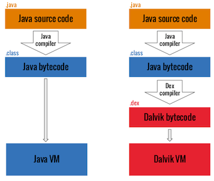

# Android プラットフォーム概要

この章ではアーキテクチャの観点から Android プラットフォームを紹介します。以下の五つの主要な領域について説明します。

1. Android セキュリティアーキテクチャ
2. Android アプリケーション構造
3. プロセス間通信 (IPC)
4. Android アプリケーションの公開
5. Android アプリケーションのアタックサーフェイス

Android プラットフォームの詳細については [Android 開発者ドキュメントウェブサイト](https://developer.android.com/index.html "Android Developer Guide") をご覧ください。

## Android セキュリティアーキテクチャ

Android は Google が開発した Linux ベースのオープンソースプラットフォームであり、モバイルオペレーティングシステム (OS) として機能します。現在、このプラットフォームはモバイルフォン、タブレット、ウェアラブル技術、テレビ、その他の「スマート」デバイスなど、さまざまな最新テクノロジの基盤となっています。典型的な Android ビルドにはさまざまなプリインストール (「ストック」) アプリが付属しており、 Google Play ストアや他のマーケットプレイスを通じてサードパーティアプリのインストールをサポートしています。

Android のソフトウェアスタックはいくつかの異なるレイヤで構成されています。各レイヤはインタフェースを定義し、特定のサービスを提供します。


最も低いレベルでは、 Android は Linux カーネルのバリエーションをベースにしています。カーネルの上では、 ハードウェア抽象化レイヤ (HAL) が組み込みハードウェアコンポーネントとやり取りするための標準インタフェースを定義します。いくつかの HAL 実装は Android システムが必要な時に呼び出す共有ライブラリモジュールにパッケージ化されています。これはアプリケーションがデバイスのハードウェアとやり取りするための基礎となります。たとえば、ストックフォンアプリケーションがデバイスのマイクとスピーカーを使用できるようにします。

Android アプリは通常 Java で記述され Dalvik バイトコードにコンパイルされます。これは従来の Java バイトコードとは若干異なります。 Dalvik バイトコードは最初に Java コードを .class ファイルにコンパイルしてから、 `dx` ツールで JVM バイトコードを Dalvik .dex フォーマットに変換することにより作成されます。



現在のバージョンの Android では Android ランタイム (ART) 上でこのバイトコードを実行します。 ART は Android のオリジナルランタイムである Dalvik 仮想マシンの後継です。 Dalvik と ART の主な違いはバイトコードの実行方法です。

Dalvik では、バイトコードは実行時にマシンコードに変換されます。これは *ジャストインタイム* (JIT) コンパイルと呼ばれるプロセスです。 JIT コンパイルはパフォーマンスに悪影響を及ぼします。アプリを実行するたびにコンパイルを実行する必要があります。パフォーマンスを改善するために、 ART は *事前 (ahead-of-time)* (AOT) コンパイルを導入しました。名前が示すように、アプリは初めて実行される前にプリコンパイルされます。このプリコンパイルされたマシンコードは以降のすべての実行に使用されます。 AOT は消費電力を削減しながらパフォーマンスを二倍に向上させます。

Android アプリはハードウェアリソースに直接アクセスできず、各アプリはそれ自身のサンドボックス内で動作します。これによりリソースとアプリを正確に制御できます。例えば、アプリがクラッシュしてもそのデバイス上で実行中の他のアプリには影響しません。同時に、 Android ランタイムはアプリに割り当てられるシステムリソースの最大数を制御し、一つのアプリが多すぎるリソースを独占することを防ぎます。

### Android ユーザーとグループ

Android オペレーティングシステムは Linux をベースにしていますが、他の Unix ライクなシステムと同じようにユーザーアカウントを実装してはいません。 Android では Linux カーネルのマルチユーザーサポートを使用してアプリをサンドボックス化しています。一部の例外を除いて、各アプリは別々の Linux ユーザーの下で実行しており、他のアプリやオペレーティングシステムの他の部分から実質的に分離されています。

ファイル [system/core/include/private/android_filesystem_config.h](http://androidxref.com/7.1.1_r6/xref/system/core/include/private/android_filesystem_config.h "android_filesystem_config.h") には、システムプロセスに割り当てられる定義済みユーザーおよびグループのリストがあります。他のアプリケーション用の UID (userID) は後者がインストールされたときに追加されます。詳細については、 Bin Chen の Android サンドボックスに関する [ブログ記事](https://pierrchen.blogspot.mk/2016/09/an-walk-through-of-android-uidgid-based.html "Bin Chen - AProgrammer Blog - Android Security: An Overview Of Application Sandbox") をご覧ください。

例えば、 Android 7.0 (API レベル 24) では以下のシステムユーザーが定義されています。

```c
    #define AID_ROOT             0  /* traditional unix root user */
    #define AID_SYSTEM        1000  /* system server */
    #...
    #define AID_SHELL         2000  /* adb and debug shell user */
    #...
    #define AID_APP          10000  /* first app user */
    ...
```

<br/>
<br/>

### Android デバイス暗号化

Android は Android 2.3.4 (API レベル 10) からデバイス暗号化をサポートしており、それ以降いくつかの大きな変更が加えられています。 Google は Android 6.0 (API レベル 23) 以降を実行するすべてのデバイスがストレージ暗号化をサポートすることを課しています。ただし一部のローエンドデバイスではパフォーマンスに大きな影響を与えるため免除されました。以下のセクションではデバイス暗号化とそのアルゴリズムについて説明します。

#### フルディスク暗号化

Android 5.0 (API レベル 21) 以降はフルディスク暗号化をサポートしています。この暗号化ではユーザーのデバイスパスワードで保護された単一の鍵を使用して userdata パーティションを暗号化および復号化します。この種の暗号化は現在では非推奨とされており、可能な限りファイルベース暗号化を使用すべきです。フルディスク暗号化には、ユーザーがパスワードを入力してロック解除しないと、通話を受けられないことや再起動後にアラームが作動しないことなどの欠点があります。

#### ファイルベース暗号化

Android 7.0 (API レベル 24) ではファイルベースの暗号化をサポートしています。ファイルベース暗号化はさまざまなファイルを異なる鍵で暗号化できるため、ファイルを個別に解読できます。このタイプの暗号化をサポートするデバイスは Direct Boot もサポートします。 Direct Boot により、ユーザーがデバイスをロック解除していなくても、デバイスはアラームやアクセシビリティサービスなどの機能にアクセスできます。

#### Adiantum

AES はほとんどの最新の Android デバイスでストレージ暗号化に使用されています。実際、 AES は非常に広く使用されているアルゴリズムとなっており、暗号化拡張機能を備えた ARMv8 や AES-NI 拡張機能を備えた x86 などの、最新のプロセッサ実装にはハードウェアアクセラレーションによる暗号化および復号化操作を提供する専用の命令セットがあります。
しかし、すべてのデバイスがストレージ暗号化にタイムリーに AES を使用できるわけではありません。特に Android Go を実行しているローエンドデバイスがそうです。これらのデバイスは通常、ハードウェアアクセラレーションされた AES を備えていない ARM Cortex-A7 などの、ローエンドプロセッサを使用しています。

Adiantum は Google の Paul Crowley と Eric Biggers により設計された暗号構造であり、少なくとも 50 MiB/s で AES を実行できないデバイスのセットに対してギャップを埋めるものです。 Adiantum は加算、ローテーション、 XOR のみに依存しています。これらの操作はすべてのプロセッサでネイティブにサポートされています。これにより、ローエンドプロセッサは AES 使用する場合に比べて 4 倍の速さで暗号化して 5 倍の速さで復号化できます。

Adiantum は他の暗号を組み合わせたものです。

- NH: ハッシュ関数。
- Poly1305: メッセージ認証コード (MAC) 。
- XChaCha12: ストリーム暗号。
- AES-256: AES の単一呼び出し。

Adiantum は新しい暗号ですが、 ChaCha12 と AES-256 がセキュアであると考えられている限り、セキュアです。設計者は新しい暗号プリミティブを作成したわけではなく、代わりに他のよく知られていて十分に研究されているプリミティブに頼り、新しい性能の高いアルゴリズムを作成しました。

Adiantum は Android 9 (API レベル 28) 以降のバージョンで利用できます。 Linux カーネル 5.0 以降でネイティブにサポートされていますが、カーネル 4.19, 4.14, 4.9 ではパッチが必要です。
Android は Adiantum を使用するための API をアプリケーション開発者に提供していません。ローエンドデバイスのパフォーマンスを犠牲にすることなくフルディスク暗号化を提供することを望む ROM 開発者やデバイスベンダーによりこの暗号は考慮および実装されます。現時点で Android アプリケーションで使用するためにこの暗号を実装した公開暗号ライブラリはありません。
AES 命令セットを持つデバイスでは AES のほうが高速に動作することに注意してください。この場合 Adiantum の使用はお勧めできません。

### Android セキュリティ堅牢化

Android には悪意のあるアプリケーションがサンドボックスから抜け出すことをより困難にするためのさまざまな機能が含まれています。アプリケーションはデバイス上でコードを実際に動かしているため、アプリケーション自体が信頼できない場合でも、これをセキュアに実行できることが重要です。以下のセクションではアプリケーションが脆弱性を悪用することを防ぐためにどのような緩和策が講じられているかを説明します。これらの緩和策が講じられていても、 OS が 100% セキュアであることは決してなく、定期的に新しい脆弱性が発見されていることに注意してください。

#### SELinux

Security-Enhanced Linux (SELinux) は 強制アクセス制御 (Mandatory Access Control, MAC) システムを使用して、どのプロセスがどのリソースにアクセスする必要があるかをさらにロックダウンします。各リソースにはどのユーザーがどのタイプのアクションを実行できるかを定義する `user:role:type:mls_level` の形式でラベルが付けられます。例えば、あるプロセスはファイルを読むことしかできず、別のプロセスはそのファイルを編集または削除できることがあります。このように、最小特権の原則に取り組むことにより、脆弱なプロセスは特権昇格やラテラルムーブメントにより悪用することがより困難になります。

詳細については [Android Security ウェブサイト](https://source.android.com/security/selinux "Security-Enhanced Linux in Android") を参照してください。

#### ASLR, KASLR, PIE, DEP

アドレス空間配置のランダム化 (Address Space Layout Randomization, ASLR) は Android 4.1 (API レベル 15) 以降 Android の一部となっており、バッファオーバーフロー攻撃に対する標準的な保護です。アプリケーションと OS の両方がランダムなメモリアドレスにロードされるようにします。特定のメモリ領域やライブラリの正しいアドレスを取得することは困難になります。 Android 8.0 (API レベル 26) で、この保護はカーネルにも実装されました (KASLR) 。 ASLR 保護はアプリケーションがメモリ内のランダムな場所にロードできる場合にのみ可能です。これはアプリケーションの位置独立実行可能  (Position Independent Executable, PIE) フラグにより示されます。 Android 5.0 (API レベル 21) 以降、 PIE 非対応のネイティブライブラリのサポートは終了しました。最後に、データ実行防止 (Data Execution Prevention, DEP) はスタックおよびヒープのコード実行を防止します。これもバッファオーバーフローの悪用を阻止するために使用されます。

詳細については [Android Developers ブログ](https://android-developers.googleblog.com/2016/07/protecting-android-with-more-linux.html "Protecting Android with more Linux kernel defenses") を参照してください。

#### SECCOMP

Android アプリケーションには C または C++ で記述されたネイティブコードを含めることができます。これらのコンパイル済みバイナリは Java Native Interface (JNI) バインディングを介して Android Runtime と通信することも、システムコールを介して OS と通信することもできます。一部のシステムコールは実装されていないか、通常のアプリケーションにより呼び出されることが想定されていません。これらのシステムコールはカーネルと直接通信するため、エクスプロイト開発者にとって最も重要なターゲットです。 Android 8 (API レベル 26) では、 Android はすべての Zygote ベースのプロセス (つまりユーザーアプリケーション) に対して Secure Computing (SECCOMP) フィルタのサポートが導入されています。このフィルタは利用可能な syscall を bionic を通じて公開されたものに制限します。

詳細については [Android Developers ブログ](https://android-developers.googleblog.com/2017/07/seccomp-filter-in-android-o.html "Seccomp filter in Android O") を参照してください。

## Android 上のアプリ

### オペレーティングシステムとの通信

Android アプリは Android Framework を介してシステムサービスとやり取りします。 Android Framework は高レベル Java API を提供する抽象化レイヤです。これらのサービスの大部分は通常の Java メソッドコールを介して呼び出され、バックグラウンドで実行されているシステムサービスへの IPC コールに変換されます。システムサービスの例は以下のとおりです。

- コネクティビティ (Wi-Fi, Bluetooth, NFC, など)
- ファイル
- カメラ
- 位置情報 (GPS)
- マイク

このフレームワークは暗号化などの一般的なセキュリティ機能も提供しています。

API 仕様は Android の新しいリリースごとに変更されます。重要なバグ修正とセキュリティパッチは通常、以前のバージョンにも適用されます。執筆時点でサポートされている最も古い Android バージョンは Android 8.1 (API レベル 27) で、現在の Android バージョンは Android 10 (API レベル 29) です。

注目すべき API バージョン:

- Android 4.2 (API レベル 16) 2012年11月 (SELinux の導入)
- Android 4.3 (API レベル 18) 2013年7月 (SELinux がデフォルトで有効になる)
- Android 4.4 (API レベル 19) 2013年10月 (いくつかの新しい API と ART の導入された)
- Android 5.0 (API レベル 21) 2014年11月 (ART がデフォルトで使用され、その他多くの機能が追加された)
- Android 6.0 (API レベル 23) 2015年10月 (多くの新機能と改善点、インストール時の是非ではなく実行時のきめ細かい権限設定付与を含む)
- Android 7.0 (API レベル 24-25) 2016年8月 (ART 上の新しい JIT コンパイラ)
- Android 8.0 (API レベル 26-27) 2017年8月 (多くのセキュリティ改善点)
- Android 9 (API レベル 28) 2018年8月 (マイクやカメラのバックグラウンド使用の制限、ロックダウンモードの導入、すべてのアプリに対するデフォルト HTTPS)
- Android 10 (API レベル 29) 2019年9月 (通知バブル、プロジェクト Mainline)

### 通常アプリケーションの Linux UID/GID

Android は Linux ユーザー管理を利用してアプリを分離しています。このアプローチは従来の Linux 環境でのユーザー管理の使用方法とは異なります。従来は複数のアプリが同じユーザーにより実行されることがよくあります。 Android は Android アプリごとに一意の UID を作成し、別のプロセスでアプリを実行します。したがって、各アプリは自身のリソースにのみアクセスできます。この保護は Linux カーネルにより実施されます。

一般的に、アプリには 10000 から 99999 の範囲の UID が割り当てられます。 Android アプリはその UID に基づくユーザー名も受け取ります。例えば、 UID 10188 のアプリはユーザー名 `u0_a188` を受け取ります。アプリが要求したパーミッションが許可された場合、対応するグループ ID がアプリのプロセスに追加されます。例えば、以下のアプリのユーザー ID は 10188 です。グループ ID 3003 (inet) に属しています。そのグループは android.permission.INTERNET パーミッションに関連付けられています。 `id` コマンドの出力は以下のようになります。

```bash
$ id
uid=10188(u0_a188) gid=10188(u0_a188) groups=10188(u0_a188),3003(inet),
9997(everybody),50188(all_a188) context=u:r:untrusted_app:s0:c512,c768
```

グループ ID とパーミッションの関係は以下のファイルで定義されています。

[frameworks/base/data/etc/platform.xml](http://androidxref.com/7.1.1_r6/xref/frameworks/base/data/etc/platform.xml "platform.xml")

```xml
<permission name="android.permission.INTERNET" >
    <group gid="inet" />
</permission>

<permission name="android.permission.READ_LOGS" >
    <group gid="log" />
</permission>

<permission name="android.permission.WRITE_MEDIA_STORAGE" >
    <group gid="media_rw" />
    <group gid="sdcard_rw" />
</permission>
```

### アプリサンドボックス

アプリは Android アプリケーションサンドボックス内で実行され、デバイス上の他のアプリからアプリデータとコードの実行を分離します。この分離によりセキュリティ層が追加されます。

新しいアプリをインストールすると、アプリパッケージから名付けられた新しいディレクトリが作成され、次のパス `/data/data/[package-name]` になります。このディレクトリはアプリのデータを保持します。 Linux ディレクトリパーミッションはディレクトリがアプリの一意の UID でのみ読み書きできるように設定されています。


これは `/data/data` フォルダのファイルシステムパーミッションを見ることで確認できます。例えば、 Google Chrome と Calendar にはそれぞれ一つのディレクトリが割り当てられており、異なるユーザーアカウントの下で実行されていることがわかります。

```bash
drwx------  4 u0_a97              u0_a97              4096 2017-01-18 14:27 com.android.calendar
drwx------  6 u0_a120             u0_a120             4096 2017-01-19 12:54 com.android.chrome
```

アプリに共通のサンドボックスを共有させたい開発者はサンドボックス化を回避できます。二つのアプリが同じ証明書で署名され、同じユーザー ID を明示的に共有している (_AndroidManifest.xml_ ファイルに _sharedUserId_ がある) 場合、それぞれが他方のデータディレクトリにアクセスできます。NFC アプリでこれを実現するには以下の例を参照してください。

```xml
<manifest xmlns:android="http://schemas.android.com/apk/res/android"
  package="com.android.nfc"
  android:sharedUserId="android.uid.nfc">
```

#### Zygote

`Zygote` プロセスは [Android の初期化](https://github.com/dogriffiths/HeadFirstAndroid/wiki/How-Android-Apps-are-Built-and-Run "How Android Apps are run") 時に起動します。 Zygote はアプリを起動するためのシステムサービスです。 Zygote プロセスはアプリが必要とするすべてのコアライブラリを含む "ベース" プロセスです。起動時に Zygote は `/dev/socket/zygote` ソケットを開き、ローカルクライアントからの接続を待ち受けます。接続を受信すると、新しいプロセスをフォークし、アプリ固有のコードをロードおよび実行します。

#### アプリライフサイクル

Android では、アプリプロセスの存続期間はオペレーティングシステムにより制御されます。アプリコンポーネントが起動されるとき、同じアプリがまだ他のコンポーネントを実行していない場合、新しい Linux プロセスが作成されます。後者がもはや必要ではない場合やより重要なアプリを実行するためにメモリの再利用が必要である場合に、 Android はこのプロセスを強制終了することがあります。プロセスを強制終了する判断は主にユーザーとプロセスの対話の状態に関連しています。一般に、プロセスは四つの状態のいずれかになります。

- フォアグラウンドプロセス (画面上部で実行中のアクティビティや実行中の BroadcastReceiver など)
- 表示プロセスはユーザーが認識しているプロセスであるため、強制終了するとユーザーエクスペリエンスが大きく損なわれます。一例として画面上ではユーザーに見えているがフォアグラウンドではないアクティビティを実行していることが挙げられます。

- サービスプロセスは `startService` メソッドで開始されるサービスをホストするプロセスです。これらのプロセスはユーザーには直接見えるものではありませんが、一般的にユーザーが気にすること (バックグラウンドでのネットワークデータのアップロードやダウンロードなど) であるため、フォアグラウンドプロセスと表示プロセスをすべて保持するメモリが不足しない限り、システムは常にこのようなプロセスを実行し続けます。
- キャッシュ済みプロセスは現在必要ではないプロセスであるため、メモリが必要な場合にシステムは自由にプロセスを強制終了できます。
アプリはいくつかのイベントに反応するコールバックメソッドを実装する必要があります。例えば、アプリプロセスが最初に作成されたときに `onCreate` ハンドラが呼び出されます。他のコールバックメソッドには `onLowMemory`, `onTrimMemory`, `onConfigurationChanged` があります。

#### App Bundle

Android アプリケーションは Android Package Kit (APK) または [Android App Bundle](https://developer.android.com/guide/app-bundle "Android App Bundle") (.aab) の二つの形式で出荷できます。Android App Bundle はアプリに必要なすべてのリソースを提供しますが、 APK の生成とその署名を Google Play に任せます。App Bundle はいくつかのモジュールにアプリのコードを含む署名付きバイナリです。ベースモジュールにはアプリケーションのコアが含まれています。ベースモジュールは [アプリバンドルに関する開発者ドキュメント](https://developer.android.com/guide/app-bundle "Documentation on App Bundle") で詳しく説明されているように、アプリの新しい拡張機能を含むさまざまなモジュールで拡張できます。
Android App Bundle がある場合は、 Google の [bundletool](https://developer.android.com/studio/command-line/bundletool "bundletool") コマンドラインツールを使用して、APK の既存ツールを使用して署名なしの APK をビルドするのがベストです。以下のコマンドを実行して AAB ファイルから APK を作成できます。

```bash
$ bundletool build-apks --bundle=/MyApp/my_app.aab --output=/MyApp/my_app.apks
```

テストデバイスにデプロイできるように署名付き APK を作成したい場合には、以下を使用します。

```bash
$ bundletool build-apks --bundle=/MyApp/my_app.aab --output=/MyApp/my_app.apks
--ks=/MyApp/keystore.jks
--ks-pass=file:/MyApp/keystore.pwd
--ks-key-alias=MyKeyAlias
--key-pass=file:/MyApp/key.pwd
```

追加モジュールがある場合とない場合の両方で APK をテストすることをお勧めします。これにより追加モジュールがベースモジュールに対してセキュリティ問題を導入もしくは修正するかどうかが明確になります。

#### Android Manifest

すべてのアプリにはコンテンツをバイナリ XML 形式で埋め込む Android Manifest ファイルがあります。このファイルの標準名は AndroidManifest.xml です。アプリの Android Package Kit (APK) ファイルのルートディレクトリに配置されています。

マニフェストファイルにはアプリ構造、そのコンポーネント (アクティビティ、サービス、コンテンツプロバイダ、インテントレシーバ) 、必要なパーミッションを記述します。また、アプリのアイコン、バージョン番号、テーマなど、アプリの一般的なメタデータも含んでいます。このファイルには互換性のある API (最小、ターゲット、最大 SDK バージョン) や [インストール可能なストレージの種類 (外部または内部)](https://developer.android.com/guide/topics/data/install-location.html "Define app install location") などの他の情報が含まれていることがあります。

マニフェストファイルの例を示します。パッケージ名 (慣例では逆順の URL を使用しますが、任意の文字列を使用できます) を含んでいます。また、アプリのバージョン、関連する SDK 、必要なパーミッション、公開されているコンテンツプロバイダ、インテントフィルタで使用されるブロードキャストレシーバ、アプリの説明とそのアクティビティもあります。

```xml
<manifest
    package="com.owasp.myapplication"
    android:versionCode="0.1" >

    <uses-sdk android:minSdkVersion="12"
        android:targetSdkVersion="22"
        android:maxSdkVersion="25" />

    <uses-permission android:name="android.permission.INTERNET" />

    <provider
        android:name="com.owasp.myapplication.MyProvider"
        android:exported="false" />

    <receiver android:name=".MyReceiver" >
        <intent-filter>
            <action android:name="com.owasp.myapplication.myaction" />
        </intent-filter>
    </receiver>

    <application
        android:icon="@drawable/ic_launcher"
        android:label="@string/app_name"
        android:theme="@style/Theme.Material.Light" >
        <activity
            android:name="com.owasp.myapplication.MainActivity" >
            <intent-filter>
                <action android:name="android.intent.action.MAIN" />
            </intent-filter>
        </activity>
    </application>
</manifest>
```

利用可能なマニフェストオプションの完全なリストは公式の [Android Manifest ファイルドキュメント](https://developer.android.com/guide/topics/manifest/manifest-intro.html "Android Developer Guide for Manifest") にあります。

### アプリコンポーネント

Android アプリは複数の上位コンポーネントで構成されています。主なコンポーネントは以下のとおりです。

- アクティビティ
- フラグメント
- インテント
- ブロードキャストレシーバ
- コンテンツプロバイダおよびサービス

これらの要素はすべて、API を介して利用可能な定義済みクラスの形式で、 Android オペレーティングシステムにより提供されています。

#### アクティビティ

アクティビティはアプリの表示部分を構成します。画面ごとにひとつのアクティビティがあるため、三つの異なる画面を持つアプリは三つの異なるアクティビティを実装します。アクティビティは Activity クラスを拡張することにより宣言されます。これらにはフラグメント、ビュー、レイアウトのすべてのユーザーインタフェース要素が含まれています。

各アクティビティは以下の構文で Android Manifest に宣言する必要があります。

```xml
<activity android:name="ActivityName">
</activity>
```

マニフェストに宣言されていないアクティビティは表示できず、それらを実行しようとすると例外が発生します。

アプリと同様に、アクティビティも独自のライフサイクルを持ち、システムの変化を監視してそれらを処理する必要があります。アクティビティには active, paused, stopped, inactive の状態があります。これらの状態は Android オペレーティングシステムにより管理されます。したがって、アクティビティは以下のイベントマネージャを実装します。

- onCreate
- onSaveInstanceState
- onStart
- onResume
- onRestoreInstanceState
- onPause
- onStop
- onRestart
- onDestroy

アプリは明示的にすべてのイベントマネージャを実装していないことがあり、その場合にはデフォルトアクションがとられます。一般的には、少なくとも `onCreate` マネージャはアプリ開発者によりオーバーライドされます。これはほとんどのユーザーインタフェースコンポーネントを宣言および初期化する方法です。リソース (ネットワーク接続やデータベースへの接続など) を明示的に解放しなければならない場合や、アプリのシャットダウン時に特定のアクションを実行しなければならない場合、 `onDestroy` がオーバーライドされることがあります。

#### フラグメント

フラグメントはアクティビティ内の動作やユーザーインタフェースの一部を表します。フラグメントは Honeycomb 3.0 (API レベル 11) バージョンで Android に導入されました。

フラグメントはインタフェースの一部をカプセル化して、再利用性とさまざまな画面サイズへの適応を容易にすることを目的としています。フラグメントは必要なコンポーネント (独自のレイアウト、ボタン、などがあります) をすべて含むという点で自律的なエンティティです。しかし、それらを役立たせるにはアクティビティと統合する必要があります。フラグメントはそれ自体では存在できません。それらには独自のライフサイクルがあり、それを実装するアクティビティのライフサイクルと結びついています。

フラグメントは独自のライフサイクルを持つため、 Fragment クラスにはイベントマネージャが含まれており、再定義および拡張できます。そのようなイベントマネージャには onAttach, onCreate, onStart, onDestroy, onDetach があります。他にもいくつか存在します。詳細については [Android Fragment 仕様](https://developer.android.com/guide/components/fragments "Fragment Class") を参照してください。

フラグメントは Android により提供される Fragment クラスを拡張することにより簡単に実装できます。

Java の例:

```java
public class MyFragment extends Fragment {
    ...
}
```

Kotlin の例:

```kotlin
class MyFragment : Fragment() {
    ...
}
```

フラグメントはアクティビティに依存するため、マニフェストファイルに宣言する必要はありません。

フラグメントを管理するために、アクティビティはフラグメントマネージャ (FragmentManager クラス) を使用できます。このクラスは関連するフラグメントの検索、追加、削除、置換を容易にします。

フラグメントマネージャは以下のようにして作成できます。

Java の例:

```java
FragmentManager fm = getFragmentManager();
```

Kotlin の例:

```kotlin
var fm = fragmentManager
```

フラグメントは必ずしもユーザーインタフェースを持つとは限りません。それらはアプリのユーザーインタフェースに関連するバックグラウンド操作を管理するための便利で効率的な方法です。アクティビティ破棄された際、システムがその状態を維持できるように、フラグメントが永続的であると宣言することができます。

#### プロセス間通信

すでに学んだように、すべての Android プロセスには独自のサンドボックス化されたアドレス空間があります。プロセス間通信機能によりアプリが信号とデータをセキュアに交換できます。デフォルトの Linux IPC 機能に依存する代わりに、 Android の IPC では OpenBinder のカスタム実装である Binder をベースとしています。 Android システムサービスの多くとすべての高レベル IPC サービスが Binder に依存しています。

*Binder* という用語は以下のようなさまざまなことを表しています。

- Binder ドライバ: カーネルレベルドライバ
- Binder プロトコル: binder ドライバとの通信に使用される低レベル ioctl ベースのプロトコル
- IBinder インタフェース: Binder オブジェクトが実装する定義済みの動作
- Binder オブジェクト: IBinder インタフェースの一般的な実装
- Binder サービス: Binder オブジェクトの実装、例えば、位置情報サービスやセンサーサービス
- Binder クライアント: Binder サービスを使用するオブジェクト

Binder フレームワークではクライアント・サーバー通信モデルが含まれています。 IPC を使用するには、アプリがプロキシオブジェクトの IPC メソッドを呼び出します。プロキシオブジェクトは呼び出しパラメータを透過的に *parcel* に *marshall* し、 Binder サーバーにトランザクションを送信します。これはキャラクタードライバ (/dev/binder) として実装されています。サーバーは着信要求を処理するためのスレッドプールを保持し、宛先オブジェクトにメッセージを配信します。クライアントアプリの視点から見ると、これらはすべて通常のメソッド呼び出しのように見えますが、すべての重い作業は Binder フレームワークにより行われています。


*Binder Overview - Image source: [Android Binder by Thorsten Schreiber](https://www.nds.rub.de/media/attachments/files/2011/10/main.pdf "Android Binder")*

他のアプリケーションがそれらにバインドできるようにするサービスは *バインドされたサービス* と呼ばれます。これらのサービスはクライアントに IBinder インタフェースを提供する必要があります。開発者は Android Interface Descriptor Language (AIDL) を使用して、リモートサービスのインタフェースを記述します。

サービスマネージャはシステムサービスの登録と検索を管理するシステムデーモンです。すべての登録済みサービスの名前と Binder のペアのリストを維持します。サービスは `android.os.ServiceManager` の `addService` メソッドで追加され、静的な `getService` メソッドで名前により取得されます。

Java の例:

```java
public static IBinder getService(String name) {
        try {
            IBinder service = sCache.get(name);
            if (service != null) {
                return service;
            } else {
                return getIServiceManager().getService(name);
            }
        } catch (RemoteException e) {
            Log.e(TAG, "error in getService", e);
        }
        return null;
    }
```

Kotlin の例:

```kotlin
companion object {
        private val sCache: Map<String, IBinder> = ArrayMap()
        fun getService(name: String): IBinder? {
            try {
                val service = sCache[name]
                return service ?: getIServiceManager().getService(name)
            } catch (e: RemoteException) {
                Log.e(FragmentActivity.TAG, "error in getService", e)
            }
            return null
        }
    }
```

`service list` コマンドでシステムサービスのリストをクエリできます。

```bash
$ adb shell service list
Found 99 services:
0 carrier_config: [com.android.internal.telephony.ICarrierConfigLoader]
1 phone: [com.android.internal.telephony.ITelephony]
2 isms: [com.android.internal.telephony.ISms]
3 iphonesubinfo: [com.android.internal.telephony.IPhoneSubInfo]
```

### インテント

*インテントメッセージング* は Binder の上に構築された非同期通信フレームワークです。このフレームワークではポイントツーポイントとパブリッシュ・サブスクライブの両方のメッセージングが可能です。 *インテント* は別のアプリコンポーネントからアクションをリクエストするために使用できるメッセージオブジェクトです。インテントはいくつかの方法でコンポーネント間通信を手助けしますが、三つの基本的なユースケースがあります。

- アクティビティの開始
  - アクティビティはアプリ内の単一の画面を表します。 `startActivity` にインテントを渡すことによりアクティビティの新しいインスタンスを開始できます。インテントはアクティビティを記述し、必要なデータを伝えます。
- サービスの開始
  - サービスはユーザーインタフェースなしでバックグラウンドd操作を実行するコンポーネントです。 Android 5.0 (API レベル 21) 以降では、 JobScheduler でサービスを開始できます。
- ブロードキャストの配信
  - ブロードキャストはどのアプリでも受信できるメッセージです。システムはシステムの起動や充電の初期化など、システムイベントについてのブロードキャストを配信します。 `sendBroadcast` または `sendOrderedBroadcast` にインテントを渡すことにより、他のアプリにブロードキャストを配信できます。

インテントには二つのタイプがあります。明示的インテントは開始されるコンポーネントに名前を付けます (完全修飾クラス名) 。以下に例を示します。

Java の例:

```java
Intent intent = new Intent(this, myActivity.myClass);
```

Kotlin の例:

```kotlin
var intent = Intent(this, myActivity.myClass)
```

暗黙的インテントは OS に送信され、特定のデータセット (以下の例では OWASP ウェブサイトの URL) に対して特定のアクションを実行します。どのアプリまたはクラスが対応するサービスを実行するかを決定するのはシステム次第です。以下に例を示します。

Java の例:

```java
Intent intent = new Intent(Intent.MY_ACTION, Uri.parse("https://www.owasp.org"));
```

Kotlin の例:

```kotlin
var intent = Intent(Intent.MY_ACTION, Uri.parse("https://www.owasp.org"))
```

*インテントフィルタ* はコンポーネントが受け取りたいインテントのタイプを指定する Android Manifest ファイル内の式です。例えば、アクティビティに対するインテントフィルタを宣言することにより、他のアプリが特定の種類のインテントで直接アクティビティを開始できるようになります。同様に、アクティビティのインテントフィルタを宣言しない場合には、明示的インテントでのみアクティビティを開始できます。

Android はインテントを使用して、アプリへのメッセージ (着信や SMS など) 、重要な電源情報 (バッテリ低下など) 、ネットワーク変更 (接続喪失など) をブロードキャストします。インテントには Extra データを追加できます (`putExtra`/`getExtras` を介して) 。

以下はオペレーティングシステムにより送信されるインテントの短いリストです。すべての定数は Intent クラスで定義されており、リスト全体は公式の Android ドキュメントにあります。

- ACTION_CAMERA_BUTTON
- ACTION_MEDIA_EJECT
- ACTION_NEW_OUTGOING_CALL
- ACTION_TIMEZONE_CHANGED

セキュリティとプライバシーを向上させるために、 Local Broadcast Manager を使用してアプリ内でインテントの送受信し、オペレーティングシステムの他の部分にインテントを送信しません。これは機密データやプライベートデータ (位置情報データなど) がアプリ境界線から外に出ないようにするために非常に役立ちます。

#### ブロードキャストレシーバ

ブロードキャストレシーバはアプリが他のアプリやシステム自体からの通知を受信できるようにするコンポーネントです。これにより、アプリはイベント (内部的なもの、他のアプリにより開始されたもの、オペレーティングシステムにより開始されたもの) に反応できます。これらは一般的に、ユーザーインタフェースの更新、サービスの開始、コンテンツの更新、ユーザー通知の作成に使用されます。

ブロードキャストレシーバをシステムに認識させる方法は二つあります。一つの方法は Android Manifest ファイルで宣言することです。マニフェストではブロードキャストレシーバとインテントフィルタの間の関連付けを指定して、レシーバが受け付けるアクションを示す必要があります。

マニフェストにインテントフィルタを持つブロードキャストレシーバ宣言の例です。

```xml
<receiver android:name=".MyReceiver" >
    <intent-filter>
        <action android:name="com.owasp.myapplication.MY_ACTION" />
    </intent-filter>
</receiver>
```

この例では、ブロードキャストレシーバに [`android:exported`](https://developer.android.com/guide/topics/manifest/receiver-element "receiver element") 属性が含まれていないことに注意します。少なくとも一つのフィルタが定義されているため、デフォルト値は "true" に設定されます。フィルタがない場合、 "false" に設定されます。

もう一つの方法はコード内で動的にレシーバを作成することです。レシーバは [`Context.registerReceiver`](https://developer.android.com/reference/android/content/Context.html#registerReceiver%28android.content.BroadcastReceiver,%2520android.content.IntentFilter%29 "Context.registerReceiver") メソッドで登録することができます。

ブロードキャストレシーバを動的に登録する例です。

Java の例:

```java
// Define a broadcast receiver
BroadcastReceiver myReceiver = new BroadcastReceiver() {
    @Override
    public void onReceive(Context context, Intent intent) {
        Log.d(TAG, "Intent received by myReceiver");
    }
};
// Define an intent filter with actions that the broadcast receiver listens for
IntentFilter intentFilter = new IntentFilter();
intentFilter.addAction("com.owasp.myapplication.MY_ACTION");
// To register the broadcast receiver
registerReceiver(myReceiver, intentFilter);
// To un-register the broadcast receiver
unregisterReceiver(myReceiver);
```

Kotlin の例:

```kotlin
// Define a broadcast receiver
val myReceiver: BroadcastReceiver = object : BroadcastReceiver() {
    override fun onReceive(context: Context, intent: Intent) {
        Log.d(FragmentActivity.TAG, "Intent received by myReceiver")
    }
}
// Define an intent filter with actions that the broadcast receiver listens for
val intentFilter = IntentFilter()
intentFilter.addAction("com.owasp.myapplication.MY_ACTION")
// To register the broadcast receiver
registerReceiver(myReceiver, intentFilter)
// To un-register the broadcast receiver
unregisterReceiver(myReceiver)
```

関連したインテントが発生すると、システムは登録されたレシーバでアプリを自動的に起動することに注意します。

[ブロードキャストの概要](https://developer.android.com/guide/components/broadcasts "Broadcasts Overview") によると、ブロードキャストがアプリを具体的に対象としていない場合には、 "暗黙的" とみなされます。暗黙的ブロードキャストを受信した後、 Android はフィルタに特定のアクションを登録したすべてのアプリをリストします。同じアクションに対して複数のアプリが登録されている場合、 Android はユーザーに利用可能なアプリのリストから選択するように求めます。

ブロードキャストレシーバの興味深い機能は優先度付けできることです。このようにして、インテントは優先度に従ってすべての認可されたレシーバに配信されます。優先度は `android:priority` 属性を介してマニフェストのインテントフィルタに割り当てることができますし、 [`IntentFilter.setPriority`](https://developer.android.com/reference/android/content/IntentFilter#setPriority%28int%29 "IntentFilter.setPriority") メソッドを介してプログラム的にもできます。ただし、同じ優先度のレシーバは [任意の順序で実行](https://developer.android.com/guide/components/broadcasts.html#sending-broadcasts "Sending Broadcasts") されることに注意します。

アプリがアプリ間でブロードキャストを送信することを想定していない場合には、 Local Broadcast Manager ([`LocalBroadcastManager`](https://developer.android.com/reference/androidx/localbroadcastmanager/content/LocalBroadcastManager.html "LocalBroadcastManager")) を使用します。これらは内部アプリからのみインテントを受信することを確保するために使用でき、他のアプリからのインテントは破棄されます。これはプロセス間通信が関与しないため、アプリのセキュリティと効率を向上させるために非常に役に立ちます。ただし、 `LocalBroadcastManager` クラスは [非推奨](https://developer.android.com/reference/androidx/localbroadcastmanager/content/LocalBroadcastManager.html "LocalBroadcastManager") であり、 Google は [`LiveData`](https://developer.android.com/reference/androidx/lifecycle/LiveData.html "LiveData") などの代替手段を推奨しています。

ブロードキャストレシーバに関するセキュリティ上の考慮事項については、 [セキュリティに関する考慮事項とお勧めの方法](https://developer.android.com/guide/components/broadcasts.html#security-and-best-practices "Security Considerations and Best Practices") を参照してください。

##### 暗黙的ブロードキャストレシーバの制限

[バックグラウンドの処理の最適化](https://developer.android.com/topic/performance/background-optimization "Background Optimizations") によると、 Android 7.0 (API レベル 24) 以降をターゲットとするアプリはブロードキャストレシーバを `Context.registerReceiver()` で登録しない限り `CONNECTIVITY_ACTION` ブロードキャストを受信しなくなりました。システムは `ACTION_NEW_PICTURE` および `ACTION_NEW_VIDEO` ブロードキャストも送信しません。

[バックグラウンドでの実行の制限](https://developer.android.com/about/versions/oreo/background.html#broadcasts "Background Execution Limits") によると、Android 8.0 (API レベル 26) 以降をターゲットとするアプリは [暗黙的なブロードキャストの例外](https://developer.android.com/guide/components/broadcast-exceptions "Implicit Broadcast Exceptions") にリストされているものを除き、マニフェストに暗黙的ブロードキャストのブロードキャストレシーバを登録できなくなりました。実行時に `Context.registerReceiver` を呼び出して作成されたブロードキャストレシーバはこの制限の影響を受けません。

[システムブロードキャストの変更](https://developer.android.com/guide/components/broadcasts#changes-system-broadcasts "Changes to System Broadcasts") によると、 Android 9 (API レベル 28) 以降、 `NETWORK_STATE_CHANGED_ACTION` ブロードキャストはユーザーの位置情報や個人を識別できるデータに関する情報を受信しません。

#### コンテンツプロバイダ

Android は SQLite を使用して、データを永続的に格納しています。 Linux の場合と同様に、データはファイルに格納されます。 SQLite は軽量で効率的なオープンソースのリレーショナルデータストレージテクノロジであり、処理能力をあまり必要としないため、モバイルでの使用に理想的です。特定のクラス (Cursor, ContentValues, SQLiteOpenHelper, ContentProvider, ContentResolver, など) を使用して API 全体を利用できます。
SQLite は別のプロセスとして実行されるのではなく、アプリの一部となります。
デフォルトでは、特定のアプリに属するデータベースはこのアプリからのみアクセスできます。しかし、コンテンツプロバイダはデータソース (データベースやフラットファイルを含む) を抽象化する優れたメカニズムを提供します。また、ネイティブアプリを含むアプリ間でデータを共有するための標準的で効率的なメカニズムも提供します。他のアプリからアクセスできるようにするには、コンテンツプロバイダは共有するアプリのマニフェストファイルで明示的に宣言する必要があります。コンテンツプロバイダが宣言されない限り、それらはエクスポートされず、それらを作成するアプリによってのみ呼び出すことができます。

コンテンツプロバイダは URI アドレッシングスキームを通じて実装されます。それらはすべて content:// モデルを使用します。ソースのタイプ (SQLite データベース、フラットファイル、など) に関係なく、アドレッシングスキームは常に同じであるため、ソースを抽象化し、開発者に一意のスキームを提供します。コンテンツプロバイダはすべての通常のデータベース操作 (作成、読取、更新、削除) を提供します。つまり、マニフェストファイルに適切な権限を持つアプリは他のアプリからデータを操作できます。

#### サービス

サービスはユーザーインタフェースを表示せずにバックグラウンドでタスク (データ処理、インテント起動、通知など) を実行する (Service クラスをベースとした) Android OS コンポーネントです。サービスはプロセスを長期的に実行することを目的としています。それらのシステム優先度はアクティブアプリのものより低くなりますが、非アクティブなアプリのものよりも高くなります。したがって、システムがリソースを必要とする場合にそれらが強制終了される可能性は低く、十分なリソースが利用可能になった際には自動的に再起動するように設定することも可能です。このため、サービスはバックグラウンドタスクを実行するのに最適な候補となります。アクティビティと同様に、サービスはメインアプリスレッドで実行されることに注意してください。特に指定しない限り、サービスは独自のスレッドを作成せず、別のプロセスで実行しません。

#### パーミッション

Android アプリはサンドボックスにインストールされ、初期状態ではユーザー情報やシステムコンポーネント (カメラやマイクなど) にアクセスできないため、 Android にはアプリが要求できる特定のタスクに対して定義済みパーミッションのセットをシステムに用意しています。
例えば、アプリで電話のカメラを使用したい場合には、 `android.permission.CAMERA` パーミッションを要求する必要があります。
Android 6.0 (API レベル 23) 以前は、アプリが要求するすべてのパーミッションはインストール時に権限付与されていました。 API レベル 23 以降、ユーザーはアプリの実行中にいくつかのパーミッションを承認する必要があります。

##### 保護レベル

Android のパーミッションはそれらが提供する保護レベルに基づいてランク付けされ、四つの異なるカテゴリに分かれています。

- *Normal*: より低いレベルの保護です。他のアプリ、ユーザー、システムに与えるリスクを最小限に抑えながら、アプリが隔離されたアプリケーションレベルの機能にアクセスできるようにします。アプリのインストール時に権限付与される、デフォルトの保護レベルです。
例: `android.permission.INTERNET`
- *Dangerous*: このパーミッションはアプリがユーザーのプライバシーやユーザーのデバイスの通常操作に影響を与える可能性のあるアクションを実行できます。このレベルのパーミッションはインストール時には権限付与されない可能性があります。アプリにこのパーミッションを付与するかどうかはユーザーが判断する必要があります。
例: `android.permission.RECORD_AUDIO`
- *Signature*: このパーミッションは要求元のアプリがそのパーミッションを宣言したアプリと同じ証明書で署名されている場合にのみ権限付与されます。署名が一致する場合、このパーミッションは自動的に権限付与されます。
例: `android.permission.ACCESS_MOCK_LOCATION`
- *SystemOrSignature*: このパーミッションはシステムイメージに埋め込まれたアプリ、もしくはそのパーミッションを宣言したアプリと同じ証明書を使用して署名されたアプリにのみ権限付与されます。
例: `android.permission.ACCESS_DOWNLOAD_MANAGER`

##### パーミッションの要求

アプリはマニフェストに `<uses-permission />` タグを含めることにより保護レベル Normal, Dangerous, Signature のパーミッションを要求できます。
以下の例は SMS メッセージを読むためのパーミッションを要求する AndroidManifes.xml サンプルを示しています。

```xml
<manifest xmlns:android="http://schemas.android.com/apk/res/android"
    package="com.permissions.sample" ...>

    <uses-permission android:name="android.permission.RECEIVE_SMS" />
    <application>...</application>
</manifest>
```

##### パーミッションの宣言

アプリは機能やコンテンツをシステムにインストールされている他のアプリに公開することができます。それ自身のコンポーネントへのアクセスを制限するには、 Android の [定義済みパーミッション](https://developer.android.com/reference/android/Manifest.permission.html "predefined permissions") を使用するか、独自に定義することができます。新しいパーミッションは `<permission>` 要素で宣言されます。
以下の例はパーミッションを宣言するアプリを示しています。

```xml
<manifest xmlns:android="http://schemas.android.com/apk/res/android"
    package="com.permissions.sample" ...>

    <permission
    android:name="com.permissions.sample.ACCESS_USER_INFO"
    android:protectionLevel="signature" />
    <application>...</application>
</manifest>
```

上のコードは `com.permissions.sample.ACCESS_USER_INFO` という名前のパーミッションを保護レベル `Signature` で定義しています。このパーミッションで保護されたコンポーネントには同じ開発者証明書で署名されたアプリのみがアクセスできます。

##### Android コンポーネントでのパーミッションの適用

Android コンポーネントはパーミッションメカニズムを使用してインタフェースを保護できます。 AndroidManifest.xml のそれぞれのコンポーネントタグに `android:permission` 属性を追加することで、アクティビティ、サービス、ブロードキャストレシーバにパーミッションを適用できます。

```xml
<receiver
    android:name="com.permissions.sample.AnalyticsReceiver"
    android:enabled="true"
    android:permission="com.permissions.sample.ACCESS_USER_INFO">
    ...
</receiver>
```

コンテンツプロバイダは少し異なります。コンテンツ URI を使用したコンテンツプロバイダの読み取り、書き込み、アクセスのための個別のパーミッションセットをサポートします。

- `android:writePermission`, `android:readPermission`: 開発者は読み取りまたは書き込みのパーミッションを個別に設定できます。
- `android:permission`: コンテンツプロバイダへの読み取りおよび書き込みをコントロールする一般的なパーミッションです。
- `android:grantUriPermissions`: コンテンツ URI を使用してコンテンツプロバイダがアクセスできる (アクセスが他のパーミッションの制限を一時的にバイパスする) 場合は `"true"` 、それ以外の場合は `"false"` 。

## 署名と公開のプロセス

アプリの開発が成功したら、次のステップはそれを公開して他の人と共有することです。しかし、アプリを単にストアに追加して共有することはできません。最初に署名する必要があります。暗号署名はアプリの開発者により置かれた検証可能なマークとして機能します。アプリの作成者を識別し、アプリが当初の配布以降改変されていないことを保証します。

### 署名のプロセス

開発時には、アプリは自動的に生成された証明書で署名されます。この証明書は本質的にセキュアではなく、デバッグ用です。ほとんどのストアは公開用にこの種の証明書を受け入れていません。そのため、よりセキュアな特性を持つ証明書を作成する必要があります。
アプリケーションが Android デバイスにインストールされる際、パッケージマネージャは当該 APK に含まれている証明書で署名されていることを確認します。証明書の公開鍵がデバイス上の他の APK を署名するために使用された鍵と一致する場合、新しい APK は既存の APK と UID を共有する可能性があります。これにより単一ベンダのアプリケーション間のやり取りが容易になります。あるいは、 Signature 保護レベルのセキュリティパーミッションを指定することもできます。これにより同じ鍵で署名されたアプリケーションにアクセスを制限します。

### APK 署名スキーム

Android は三つのアプリケーション署名スキームをサポートしています。 Android 9 (API レベル 28) 以降、 APK は APK 署名スキーム v3 (v3 スキーム) 、 APK 署名スキーム v2 (v2 スキーム) または JAR 署名 (v1 スキーム) で検証できます。 Android 7.0 (API レベル 24) 以降、 APK は APK 署名スキーム v2 (v2 スキーム) または JAR 署名 (v1 スキーム) で検証できます。後方互換のため、アプリを新旧両方の SDK バージョンで実行できるようにするために APK には複数の署名スキームで署名できます。 [古いプラットフォームは v2 署名を無視し v1 署名のみを検証します](https://source.android.com/security/apksigning/ "APK Signing") 。

#### JAR 署名 (v1 スキーム)

アプリ署名のオリジナルバージョンでは、署名済み APK は標準の署名済み JAR として実装しており、 `META-INF/MANIFEST.MF` にすべてのエントリを含む必要があります。すべてのファイルは共通の証明書で署名する必要があります。このスキームは ZIP メタデータなど APK の一部を保護しません。このスキームの欠点は APK verifier が署名を適用する前に信頼できないデータ構造を処理する必要があり、 verifier はデータ構造がカバーしないデータを破棄することです。また、 APK verifier はすべての圧縮ファイルを展開する必要があり、かなりの時間とメモリを要します。

#### APK 署名スキーム (v2 スキーム)

APK 署名スキームでは、完全な APK がハッシュおよび署名され、 APK 署名ブロックが作成されて APK に挿入されます。検証時には、 v2 スキームは APK ファイル全体の署名をチェックします。この形式の APK 検証はより高速で、改変に対するより包括的な保護を提供します。以下の [v2 スキームの APK 署名検証プロセス](https://source.android.com/security/apksigning/v2#verification "APK Signature verification process") をご覧ください。


### APK 署名スキーム (v3 スキーム)

v3 APK 署名ブロックフォーマットは v2 と同じです。 v3 はサポートされている SDK バージョンと proof-of-rotation 構造に関する情報を APK 署名ブロックに追加します。 Android 9 (API レベル 28) 以降では、 APK は APK 署名スキーム v3, v2 または v1 にしたがって検証できます。古いプラットフォームでは v3 署名を無視し、 v2 それから v1 署名を検証しようと試みます。

署名ブロックの signed-data 内の proof-of-rotation 属性は単一リンクリストで構成され、各ノードにはアプリの以前のバージョンを署名するために使用された署名証明書を含んでいます。後方互換を機能させるために、古い署名証明書は新しい証明書のセットに署名するため、新しい鍵ごとに古い鍵と同じくらい信頼できるはすであるという証跡を提供します。
proof-of-rotation 構造には、一つずつ署名するのではなく、古い署名証明書が新しい証明書のセットに署名する必要があるため、 APK に個別に署名することができなくなりました。以下の [APK 署名 v3 スキーム検証プロセス](https://source.android.com/security/apksigning/v3 "APK Signature v3 scheme verification process") をご覧ください。


#### 証明書の作成

Android はパブリック/プライベート証明書を使用して Android アプリ (.apk ファイル) に署名します。証明書は情報の集合体であり、セキュリティの観点から鍵が最も重要な情報です。パブリック証明書はユーザーの公開鍵を含み、プライベート証明書はユーザーの秘密鍵を含みます。パブリック証明書とプライベート証明書リンクされています。証明書は一意であり、再生成することはできません。証明書が失われた場合、それを復元することはできないため、その証明書で署名されていたアプリを更新することは不可能になることに注意してください。
アプリの作成者は、利用可能な KeyStore にある既存の秘密鍵と公開鍵のペアを再利用するか、新しいペアを生成することができます。
Android SDK では、新しい鍵ペアは `keytool` コマンドで生成されます。以下のコマンドは鍵長 2048 ビットおよび有効期限 7300 日 = 20 年の RSA 鍵ペアを作成します。生成された鍵はカレントディレクトリのファイル 'myKeyStore.jks' に保存されます。

```bash
$ keytool -genkey -alias myDomain -keyalg RSA -keysize 2048 -validity 7300 -keystore myKeyStore.jks -storepass myStrongPassword
```

秘密鍵を安全に保管し、ライフサイクル全体にわたって機密を維持することが非常に重要です。鍵にアクセスできる人は誰でも、あなたがコントロールしていないコンテンツを持つアプリの更新を公開できます (これによりセキュアでない機能を追加したり、署名ベースのパーミッションを使用して共有されたコンテンツにアクセスします) 。ユーザーがアプリとその開発者に寄せる信頼は完全にそのような証明書に基づいています。したがって、証明書の保護やセキュアマネジメントは評判や顧客維持に不可欠であり、秘密鍵は他の個人と決して共有してはいけません。鍵はパスワードで保護できるバイナリファイルに格納されています。そのようなファイルは _KeyStores_ と呼ばれます。 KeyStore のパスワードは強力で、鍵作成者にのみ知られている必要があります。このため、鍵は一般的に開発者がアクセスを制限された専用のビルドマシンに保存されます。
Android 証明書の有効期間は関連するアプリ (その更新情報を含む) のものより長くする必要があります。例えば、 Google Play では少なくとも 2033 年 10 月 22 日まで有効である証明書が必要です。

#### アプリケーションへの署名

署名プロセスの目的はアプリファイル (.apk) を開発者の公開鍵に関連付けることです。これを実現するために、開発者は APK ファイルのハッシュを計算し、自身の秘密鍵で暗号化します。作成者の公開鍵で暗号化されたハッシュを復号化し、 APK ファイルの実際のハッシュと一致することを確認することで、第三者はアプリの真正性 (アプリが本当に作成者であると主張するユーザーからのものであるなど) を検証できます。

多くの統合開発環境 (IDE) はアプリの署名プロセスを統合して、ユーザーにとってより使いやすくしています。一部の IDE では秘密鍵を平文で設定ファイルに格納することに注意します。他の人がこのようなファイルにアクセスできるかどうかという点を再度確認し、必要に応じてその情報を削除します。
アプリは Android SDK (API レベル 24 以降) で提供される 'apksigner' ツールを使用してコマンドラインから署名できます。そのツールは `[SDK-Path]/build-tools/[version]` にあります。 API 24.0.2 以前の場合には Java JDK の一部である 'jarsigner' を使用できます。プロセス全体についての詳細は Android 公式ドキュメントにありますが、その要点を説明するために例を以下に示します。

```bash
$ apksigner sign --out mySignedApp.apk --ks myKeyStore.jks myUnsignedApp.apk
```

この例では、未署名のアプリ ('myUnsignedApp.apk') は (カレントディレクトリにある) 開発者 KeyStore 'myKeyStore.jks' の秘密鍵で署名されます。アプリは 'mySignedApp.apk' という署名付きのアプリになり、ストアにリリースする準備が整います。

##### Zipalign

配布前に APK ファイルを調整するには `zipalign` ツールを常に使用する必要があります。このツールは APK 内の圧縮されていないすべてのデータ (画像、 RAW ファイルなど) を4バイト境界に調整し、アプリ実行時のメモリ管理を改善します。

> apksigner で APK ファイルに署名する前に zipalign を使用する必要があります。

### 公開プロセス

Android エコシステムはオープンであるため、どこから (自身のサイト、任意のストア、など) でもアプリを配布することができます。しかし、 Google Play は最も有名で信頼できる人気のあるストアで、 Google 自体が提供しています。Amazon Appstore は Kindle デバイス向けの信頼できるデフォルトストアです。ユーザーが信頼できないソースからサードパーティアプリをインストールしたい場合には、デバイスのセキュリティ設定で明示的に許可する必要があります。

アプリはさまざまなソースから Android デバイスにインストールできます。ソースにはローカルの USB 経由、 Goole の公式アプリストア (Google Play Store) 、または別のストアがあります。

他のベンダーでは実際に公開する前にアプリのレビューおよび承認をする可能性がありますが、 Google では既知のマルウェアシグネチャをスキャンするだけです。これにより、公開プロセスを開始してからアプリが公に利用できるまでの時間を最小限に抑えます。

アプリの公開は非常に簡単であり、主な操作は署名付き APK ファイル自体をダウンロード可能にすることです。 Google Play では、公開はアカウントの作成から始まり、専用のインタフェースを通じてアプリを配信します。詳細は [Android 公式ドキュメント](https://developer.android.com/distribute/googleplay/start.html "Review the checklists to plan your launch") でご覧いただけます。

## Android アプリケーションのアタックサーフェイス

Android アプリケーションのアタックサーフェイスはアプリケーションのすべてのコンポーネントで構成されます。これにはアプリのリリースやその機能をサポートするために必要なサポートマテリアルが含まれます。以下を満たさない場合には Android アプリケーションは脆弱である可能性があります。

- IPC 通信や URL スキームを使用したすべての入力を妥当性確認している。以下も参照。
  - [IPC による機密性の高い機能の開示のテスト](0x05h-Testing-Platform-Interaction.md#testing-for-sensitive-functionality-exposure-through-ipc-mstg-platform-4 "Testing for Sensitive Functionality Exposure Through IPC")
  - [カスタム URL スキームのテスト](0x05h-Testing-Platform-Interaction.md#testing-custom-url-schemes-mstg-platform-3 "Testing Custom URL Schemes")
- 入力フィールドでのユーザーによるすべての入力を妥当性確認している。
- WebView 内でロードされたコンテンツを妥当性確認している。以下も参照。
  - [WebView での JavaScript 実行のテスト](0x05h-Testing-Platform-Interaction.md#testing-javascript-execution-in-webviews-mstg-platform-5 "Testing JavaScript Execution in WebViews")
  - [WebView プロトコルハンドラのテスト](0x05h-Testing-Platform-Interaction.md#testing-webview-protocol-handlers-mstg-platform-6 "Testing WebView Protocol Handlers")
  - [Java オブジェクトが WebView を介して公開されているかのテスト](0x05h-Testing-Platform-Interaction.md#determining-whether-java-objects-are-exposed-through-webviews-mstg-platform-7 "Determining Whether Java Objects Are Exposed Through WebViews")
- バックエンドサーバーとセキュアに通信している、もしくはサーバーとモバイルアプリケーション間の中間者攻撃を受けやすい。以下も参照。
  - [ネットワーク通信のテスト](0x04f-Testing-Network-Communication.md#testing-network-communication "Testing Network Communication")
  - [Android のネットワーク API](0x05g-Testing-Network-Communication.md#android-network-apis "Android Network APIs")
- すべてのローカルデータをセキュアに保存している、もしくは信頼できないデータをストレージからロードしている。以下も参照。
  - [Android のデータストレージ](0x05d-Testing-Data-Storage.md#data-storage-on-android "Data Storage on Android")
- 危殆化された環境、再パッケージ化、またはその他のローカル攻撃から自身を保護している。以下も参照。
  - [Android のアンチリバース防御](0x05j-Testing-Resiliency-Against-Reverse-Engineering.md#android-anti-reversing-defenses "Android Anti-Reversing Defenses")
