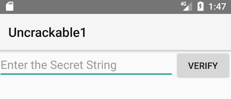
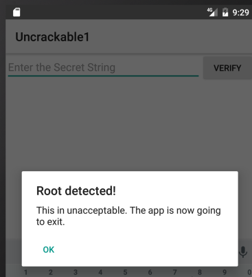

## 改竄とリバースエンジニアリング (Android)

そのオープン性により Android はリバースエンジニアにとって好都合な環境になっています。しかし、Java とネイティブコードの両方を扱うと、時には物事がより複雑になることがあります。以下の章では、Android のリバースのいくつかの特質と OS 固有のツールをプロセスとしてみていきます。

「その他の」モバイル OS と比較して、Android はリバースエンジニアにとって大きな利点を提供します。
Android はオープンソースであるため、Android Open Source Project (AOSP) のソースコードを勉強し、OS や標準ツールをあなたが望む任意の方法で変更することができます。一般に販売されているデバイスでも、開発者モードの有効化やアプリのサイドローディングなどの操作を多くの手間をかける必要なく簡単に実行できます。SDK にある強力なツールから、幅広く利用可能なリバースエンジニアリングツールに至るまで、あなたの人生を楽にしてくれる多くの常識があります。

しかし、Android 固有の課題もいくつかあります。例えば、Java バイトコードとネイティブコードの両方を処理する必要があるかもしれません。Java Native Interface (JNI) はリバースエンジニアを混乱させる目的のために使用されることがあります。開発者はデータや機能を「隠す」ためにネイティブレイヤを使用することや、実行が二つのレイヤを頻繁にジャンプするようにアプリを構築することがあります。これはリバースエンジニアにとって複雑なものになります (公平を期すると、パフォーマンスの向上やレガシーコードのサポートなど、JNI を使用する正当な理由があるかもしれません) 。

Java ベースの Android 環境と Android の基盤を形成する Linux OS および Kernel の両方についての実践的な知識が必要です。さらに、Java 仮想マシン内で実行されるネイティブコードとバイトコードの両方に対処するための適切なツールセットが必要です。

以下のセクションでは、さまざまなリバースエンジニアリング技法を実演するための例として OWASP Mobile Testing Guide Crackmes <sup>[1]</sup> を使用することに注意します。部分的および完全なスポイラーを期待します。読む前にあなた自身でクラックに挑戦してみることをお勧めします。

### 必要なもの

少なくとも、Android Studio <sup>[2]</sup> が必要です。Android SDK、プラットフォームツールとエミュレータ、さまざまな SDK バージョンとフレームワークコンポーネントを管理するマネージャアプリが付属しています。Android Studio を使用すると、SDK Manager アプリも利用できます。Android SDK ツールをインストールしたり、さまざまな API レベルの SDK を管理したり、エミュレーターや、エミュレータイメージを作成する AVD Manager アプリケーションも利用できます。以下がシステムにインストールされていることを確認します。

- 最新の SDK ツールと SDK プラットフォームツールパッケージ。これらのパッケージは Android Debugging Bridge (ADB) クライアントと、Android プラットフォームとインタフェースする他のツールが含まれています。一般に、これらのツールは後方互換性があるため、インストールされているバージョンがひとつだけ必要です。

- Android NDK。これは Native Development Kit で、さまざまなアーキテクチャのネイティブコードをクロスコンパイルするためのプレビルドツールチェーンが組み込まれています。

SDK および NDK に加えて、Java バイトコードをより人に優しいものにするためのものもあります。幸運なことに、Java デコンパイラは一般的に Android バイトコードをよく扱います。有名なフリーのデコンパイラには JD <sup>[3]</sup>, Jad <sup>[4]</sup>, Proycon <sup>[5]</sup>, CFR <sup>[6]</sup> があります。都合により、これらのデコンパイラのいくつかを <code>apkx</code> ラッパースクリプトにパックしました <sup>[7]</sup> 。このスクリプトはリリース APK から Java コードを抽出するプロセスを完全に自動化し、さまざまなバックエンドで簡単に試すことができます (以下のいくつかの例でも使用します) 。

それ以外は、本当に好みと予算の問題です。さまざまな長所と短所をもつ、数多くのフリーおよび商用の逆アセンブラ、デコンパイラ、フレームワークが存在します。以下でいくつかを紹介します。

#### Android SDK のセットアップ

ローカル Android SDK のインストールは Android Studio を通じて管理されます。Android Studio で空のプロジェクトを作成し、"Tools->Android->SDK Manager" を選択して SDK Manager GUI を開きます。"SDK Platforms" タブで複数の API レベルの SDK をインストールできます。最近の API レベルは以下のとおりです。

- API 21: Android 5.0
- API 22: Android 5.1
- API 23: Android 6.0
- API 24: Android 7.0
- API 25: Android 7.1
- API 26: Android O Developer Preview 


OS によって、インストールされた SDK は以下の場所にあります。

```
Windows:

C:\Users\<username>\AppData\Local\Android\sdk

MacOS:

/Users/<username>/Library/Android/sdk
```

注意: Linux では、独自の SDK の場所を選択する必要があります。一般的な場所は <code>/opt</code>, <code>/srv</code>, <code>/usr/local</code> です。

#### Android NDK のセットアップ

Android NDK にはネイティブコンパイラとツールチェーンのビルド済みのバージョンが含まれています。伝統的に、GCC と Clang コンパイラの両方がサポートされていましたが、GCC に対する積極的なサポートは NDK のリビジョン 14 で終了しました。使用する正しいバージョンはデバイスアーキテクチャとホスト OS の両方に依存します。ビルド済みのツールチェーンは NDK の <code>toolchains</code> ディレクトリにあります。アーキテクチャごとにひとつのサブディレクトリが含まれています。

| アーキテクチャ | ツールチェーン名 |
|------------ | --------------|
|ARM-based|arm-linux-androideabi-&lt;gcc-version&gt;|
|x86-based|x86-&lt;gcc-version&gt;|
|MIPS-based|mipsel-linux-android-&lt;gcc-version&gt;|
|ARM64-based|aarch64-linux-android-&lt;gcc-version&gt;|
|X86-64-based|x86_64-&lt;gcc-version&gt;|
|MIPS64-based|mips64el-linux-android-&lt;gcc-version&gt;|

正しいアーキテクチャを選ぶことに加えて、ターゲットとするネイティブ API レベルの正しい sysroot を指定する必要があります。sysroot はターゲットのシステムヘッダとライブラリを含むディレクトリです。利用可能なネイティブ API は Android API レベルにより異なります。それぞれの Android API レベルの可能な sysroot は <code>$NDK/platforms/</code> にあり、各 API レベルのディレクトリにはさまざまな CPU とアーキテクチャのサブディレクトリが含まれています。

ビルドシステムをセットアップするひとつの可能性は、コンパイラパスと必要なフラグを環境変数としてエクスポートすることです。しかし、物事を簡単にするために、NDK ではいわゆるスタンドアローンツールチェーンを作成できます。つまり、必要な設定を盛り込んだ「一時的な」ツールチェーンです。

スタンドアローンツールチェーンをセットアップするには、NDK の最新の安定版をダウンロードします <sup>[8]</sup> 。ZIP ファイルを展開し、NDK ルートディレクトリに移動して、以下のコマンドを実行します。


```bash
$ ./build/tools/make_standalone_toolchain.py --arch arm --api 24 --install-dir /tmp/android-7-toolchain
```

これにより、ディレクトリ <code>/tmp/android-7-toolchain</code> に Android 7.0 のスタンドアローンツールチェーンが作成されます。都合により、あなたのツールチェーンディレクトリを指す環境変数をエクスポートできます。これについては後の例で使用します。以下のコマンドを実行するか、<code>.bash_profile</code> または他の起動スクリプトに追加します。

```bash
$  export TOOLCHAIN=/tmp/android-7-toolchain
```

### フリーのリバースエンジニアリング環境の構築

少しの労力で、リーズナブルな GUI 搭載のリバースエンジニアリング環境をフリーで構築できます。

逆コンパイルされたソースをナビゲートするには、IntelliJ <sup>[9]</sup> の使用をお勧めします。比較的軽量な IDE はコードを閲覧するのに最適であり、逆コンパイルされたアプリの基本的なオンデバイスデバッグが可能です。しかし、あなたが重く、遅く、複雑なものを好むのであれば、Eclipse <sup>[10]</sup> があなたにとって正しい IDE です (注：このアドバイスは執筆者の個人的な偏見に基づいています) 。

Java コードの代わりに Smali を見てもかまわない場合、IntelliJ の smalidea プラグインを使用してデバイスをデバッグできます <sup>[11]</sup> 。Smalidea はバイトコードのシングルステップ実行、識別子の名前変更、名前なしレジスタの監視をサポートしているため、JD + IntelliJ の設定よりもはるかに強力です。

APKTool <sup>[12]</sup> は一般的なフリーツールです。APK アーカイブから直接リソースを抽出および逆アセンブルし、Java バイトコードを Smali 形式に逆アセンブルできます (Smali/Backsmali は DEX 形式に対するアセンブラ/逆アセンブラです。「アセンブラ/逆アセンブラ」のアイスランド語でもあります) 。APKTool を使用してパッケージを再アセンブルできます。パッチ化および Manifest への変更の適用に便利です。

プログラム解析や自動化された逆難読化などのより緻密なタスクは Radare2 <sup>[13]</sup> や Angr <sup>[14]</sup> などのオープンソースリバースエンジニアリングフレームワークで達成できます。このガイドではこれらのフリーツールやフレームワークの多くの使用例を紹介します。

#### 商用ツール

完全にフリーの設定で作業することは可能ですが、商用ツールへの投資を検討することもできます。これらのツールの主な利点は利便性です。素晴らしい GUI 、多くの自動化、エンドユーザーサポートが付いています。あなたがリバースエンジニアを日々の糧とするのであれば、これは多くの手間が省けます。

##### JEB

JEB <sup>[15]</sup> は商用の逆コンパイラです。Android アプリの静的および動的解析に必要な機能をすべてパックしたオールインワンパッケージであり、それなりに信頼でき、迅速なサポートが得られます。これには組込みのデバッガがあり、効率的なワークフローが可能です。特に ProGuard により難読化されたバイトコードを扱う場合には、逆コンパイルされたもの (および注釈つきソース) に直接ブレークポイントを設定することは非常に有益です。もちろん、このような便利なものは安くありません。バージョン 2.0 以降、JEB は従来のライセンスモデルからサブスクリプションベースのものに変更されています。そのため、使用には月額料金を支払う必要があります。

##### IDA Pro

IDA Pro <sup>[16]</sup> は ARM, MIPS, そしてもちろん Intel の ELF バイナリを理解し、Java バイトコードも処理できます。Java アプリケーションとネイティブプロセスの両方のデバッガも付属しています。有能な逆アセンブラと強力なスクリプティングと拡張機能を備えているため、IDA Pro はネイティブプログラムやライブラリの静的解析に最適です。しかし、Java コード用に提供されている静的解析機能は若干基本的なものです。Smali 逆アセンブリが得られるに過ぎません。パッケージやクラス構造をナビゲートすることはできません。一部のこと (クラスの名前変更など) はできません。より複雑な Java アプリでの作業は少し面倒になります。

### リバースエンジニアリング

リバースエンジニアリングはアプリがどのように動作するか調べるためにアプリを分解するプロセスです。コンパイルされたアプリを調査したり (静的解析) 、実行中にアプリを観察したり (動的解析) 、その両方を組み合わせたりすることで、これを行うことができます。

#### Java コードの静的解析

一部の厄介な、ツール回避のアンチデコンパイルトリックが適用されていない限り、Java バイトコードはそれほどの問題もなくソースコードに逆変換できます。UnCrackable App for Android Level 1 を以下の例で使用しますので、まだダウンロードしていない場合はダウンロードします。まず、デバイスかエミュレータにアプリをインストールします。実行して crackme についての内容を確認します。

```
$ wget https://github.com/OWASP/owasp-mstg/raw/master/Crackmes/Android/Level_01/UnCrackable-Level1.apk
$ adb install UnCrackable-Level1.apk
```

<!--  -->


なんらかの秘密のコードが見つかることを期待しています。

おそらく、アプリ内のどこかに格納された秘密の文字列を探しています。そのため、次の論理的なステップは内部を見て回ることです。まず、APK ファイルを展開して内容を確認します。

```
$ unzip UnCrackable-Level1.apk -d UnCrackable-Level1
Archive:  UnCrackable-Level1.apk
  inflating: UnCrackable-Level1/AndroidManifest.xml  
  inflating: UnCrackable-Level1/res/layout/activity_main.xml  
  inflating: UnCrackable-Level1/res/menu/menu_main.xml  
 extracting: UnCrackable-Level1/res/mipmap-hdpi-v4/ic_launcher.png  
 extracting: UnCrackable-Level1/res/mipmap-mdpi-v4/ic_launcher.png  
 extracting: UnCrackable-Level1/res/mipmap-xhdpi-v4/ic_launcher.png  
 extracting: UnCrackable-Level1/res/mipmap-xxhdpi-v4/ic_launcher.png  
 extracting: UnCrackable-Level1/res/mipmap-xxxhdpi-v4/ic_launcher.png  
 extracting: UnCrackable-Level1/resources.arsc  
  inflating: UnCrackable-Level1/classes.dex  
  inflating: UnCrackable-Level1/META-INF/MANIFEST.MF  
  inflating: UnCrackable-Level1/META-INF/CERT.SF  
  inflating: UnCrackable-Level1/META-INF/CERT.RSA  

```

基本的には、アプリに関連するすべての Java バイトコードとデータはアプリのルートディレクトリの <code>classes.dex</code> という名前のファイルに含まれています。このファイルは Dalvik Executable Format (DEX) に準拠しています。これは Java プログラムをパッケージ化する Android 固有の方法です。ほとんどの Java 逆コンパイラはプレーンクラスのファイルまたは JAR が入力として使用されるため、はじめに classes.dex ファイルを JAR に変換する必要があります。これは <code>dex2jar</code> または <code>enjarify</code> を使用して行うことができます。

JAR ファイルを作成したら、数多くあるフリーの逆コンパイラを使用して Java コードを作成できます。この例では、CFR を逆コンパイラとして選択して使用します。CFR は積極的に開発されており、新作のリリースは作成者のウェブサイトで定期的に公開されています <sup>[6]</sup> 。都合の良いことに、CFR は MIT ライセンスの下でリリースされています。つまり、ソースコードは現在入手できませんが、目的に応じて自由に使用できます。

CFR を実行する最も簡単な方法は <code>apkx</code> を介することです。これは <code>dex2jar</code> をパッケージ化し、抽出、変換、逆コンパイルの手順を自動化します。以下のようにインストールします。

```
$ git clone https://github.com/b-mueller/apkx
$ cd apkx
$ sudo ./install.sh
```

これは <code>apkx</code> を <code>/usr/local/bin</code> にコピーする必要があります。<code>UnCrackable-Level1.apk</code> で実行します。

```bash
$ apkx UnCrackable-Level1.apk
Extracting UnCrackable-Level1.apk to UnCrackable-Level1
Converting: classes.dex -> classes.jar (dex2jar)
dex2jar UnCrackable-Level1/classes.dex -> UnCrackable-Level1/classes.jar
Decompiling to UnCrackable-Level1/src (cfr)
```

逆コンパイルされたソースはディレクトリ <code>Uncrackable-Level1/src</code> にあります。ソースを閲覧するには、シンプルなテキストエディタ (できれば構文を強調表示するもの) でもよいのですが、Java IDE にコードをロードするとナビゲーションが簡単になります。IntelliJ にコードをインポートしてみましょう。ボーナスとしてデバイス上でのデバッグ機能を得られます。

IntelliJ を開き、"New Project" ダイアログの左のタブでプロジェクトタイプとして "Android" を選択します。アプリケーション名として "Uncrackable1"、会社名として "vantagepoint.sg" と入力します。これによりパッケージ名 "sg.vantagepoint.uncrackable1" となり、元のパッケージ名と一致します。一致するパッケージ名を使用することが重要です。後で実行中のアプリにデバッガをアタッチする場合に、IntelliJ はパッケージ名を使用して正しいプロセスを識別するためです。


次のダイアログでは、任意の API 番号を選択します。そのプロジェクトを実際にコンパイルしたいわけではないので、実際には問題ではありません。"next" をクリックし "Add no Activity" を選択してから "finish" をクリックします。

プロジェクトが作成されたら、左側の "1: Project" ビューを展開し、フォルダ <code>app/src/main/java</code> に移動します。IntelliJ により作成されたデフォルトパッケージ "sg.vantagepoint.uncrackable1" を右クリックして削除します。


ここで、ファイルブラウザで <code>Uncrackable-Level1/src</code> ディレクトリを開き、<code>sg</code> ディレクトリを IntelliJ プロジェクトビューの現時点で空の <code>Java</code> フォルダにドラッグします (フォルダを移動する代わりにコピーするには "alt" キーを押します) 。


アプリがビルドされた元の Android Studio プロジェクトに類似の構造にたどり着きます。


IntelliJ がコードのインデックスを作成すると、通常の Java プロジェクトと同様にブラウズできます。逆コンパイルされたパッケージ、クラス、メソッドの多くは奇妙な一文字の名前を持つことに注意します。これはビルド時に ProGuard で "minified" されたためです。これはバイトコードを読みにくくする難読化の基本的なものですが、このようなかなり単純なアプリでは頭を悩ませることはありません。しかし、複雑なアプリを解析する際には、かなり迷惑になることがあります。

難読化されたコードを解析する際のグッドプラクティスは、確認のためにクラス、メソッド、その他の識別子の名前に注釈をつけることです。パッケージ <code>sg.vantagepoint.a</code> の <code>MainActivity</code> クラスを開きます。メソッド <code>verify</code> は "verify" ボタンをタップすると呼び出されるものです。このメソッドはユーザー入力をブール値を戻す <code>a.a</code> という静的メソッドに渡します。<code>a.a</code> はユーザーにより入力されたテキストが有効であるかどうかを検証することを担っていると思われるため、コードをリファクタリングしてこれを反映します。


クラス名 (<code>a.a</code> の最初の <code>a</code>) を右クリックし、ドロップダウンメニューから Refactor->Rename を選択します (または Shift-F6 を押します) 。これまでにそのクラスについて判ったことを考慮して、クラス名をより意味のあるものに変更します。例えば、"Validator" とします (後でクラスについてより詳しく知ったとき、その名前をいつでも変更できます) 。ここで <code>a.a</code> は <code>Validator.a</code> になります。同じ手順に従って、静的メソッド <code>a</code> の名前を <code>check_input</code> に変更します。


おめでとう。あなたは静的解析の基礎を学びました。解析されたプログラムについて理論化、注釈付け、および段階的に理論を改訂することがすべてです。あなたが完全にそれを理解するか、少なくとも十分に達成したと思うまで行います。

次に、<code>check_input</code> メソッドで ctrl+クリック (Mac では command+クリック) します。メソッド定義に移動します。逆コンパイルされたメソッドは以下のようになります。

```java
    public static boolean check_input(String string) {
        byte[] arrby = Base64.decode((String)"5UJiFctbmgbDoLXmpL12mkno8HT4Lv8dlat8FxR2GOc=", (int)0);
        byte[] arrby2 = new byte[]{};
        try {
            arrby = sg.vantagepoint.a.a.a(Validator.b("8d127684cbc37c17616d806cf50473cc"), arrby);
            arrby2 = arrby;
        }sa
        catch (Exception exception) {
            Log.d((String)"CodeCheck", (String)("AES error:" + exception.getMessage()));
        }
        if (string.equals(new String(arrby2))) {
            return true;
        }
        return false;
    }
```

そして、パッケージ <code>sg.vantagepoint.a.a</code> の <code>a</code> という名前の関数に渡される base64 エンコードされた String があります (ここでもすべてが <code>a</code> と呼ばれます) 。また、16進数にエンコードされた暗号化鍵のようなものがあります (16 hex bytes = 128bit, 共通鍵の長さ) 。この特定の <code>a</code> は正確には何をするでしょうか。Ctrl を押しながらクリックして調べます。

```java
public class a {
    public static byte[] a(byte[] object, byte[] arrby) {
        object = new SecretKeySpec((byte[])object, "AES/ECB/PKCS7Padding");
        Cipher cipher = Cipher.getInstance("AES");
        cipher.init(2, (Key)object);
        return cipher.doFinal(arrby);
    }
}
```

ここで大体出来上がりです。それは単に標準の AES-ECB です。<code>check_input</code> の <code>arrby1</code> に格納されている base64 文字列は、128bit AES を使用して復号された暗号文であり、ユーザー入力と比較されているようです。ボーナスタスクとして、抽出された暗号文を復号し、秘密の値を取得してみましょう。

復号された文字列を取得する別の (そしてより速い) 方法は動的解析を少しミックスすることです。UnCrackable Level 1 を後ほど再考して、これを行う方法を示しますので、まだプロジェクトを削除しないでください。

#### ネイティブコードの静的解析

Dalvik と ART はどちらも Java Native Interface (JNI) をサポートしています。JNI は Java コードが C/C++ で書かれたネイティブコードとやりとりする方法を定義します。他の Linux ベースのオペレーティングシステムと同様に、ネイティブコードは ELF ダイナミックライブラリ ("*.so") にパッケージ化され、実行時に <code>System.load</code> メソッドを使用して Android アプリによりロードされます。

Android JNI 関数は Linux ELF ライブラリにコンパイルされたネイティブコードで構成されています。それは Linux でほぼ標準のものです。但し、glibc などの広く使われている C ライブラリに依存する代わりに、Bionic <sup>[17]</sup> という名前のカスタム libc に対して Android バイナリがビルドされます。Bionic はシステムプロパティやロギングなどの重要な Android 固有のサービスのサポートを追加します。完全な POSIX 互換ではありません。

OWASP MSTG リポジトリから HelloWorld-JNI.apk をダウンロードし、必要に応じて、エミュレーターまたは Android デバイスにインストールして実行します。

```bash
$ wget HelloWord-JNI.apk
$ adb install HelloWord-JNI.apk
```

このアプリにまったく華々しさはありません。テキスト "Hello from C++" のラベルが表示されることがすべてです。実のところ、これは C/C++ サポートありで新しいプロジェクトを作成したときに Android Studio が生成するデフォルトアプリですが、JNI の呼び出し方法の基本的な原則を示すには十分です。


<code>apkx</code> で APK を逆コンパイルします。これはソースコードを <code>HelloWorld/src</code> ディレクトリに抽出します。

```bash
$ wget https://github.com/OWASP/owasp-mstg/blob/master/OMTG-Files/03_Examples/01_Android/01_HelloWorld-JNI/HelloWord-JNI.apk
$ apkx HelloWord-JNI.apk
Extracting HelloWord-JNI.apk to HelloWord-JNI
Converting: classes.dex -> classes.jar (dex2jar)
dex2jar HelloWord-JNI/classes.dex -> HelloWord-JNI/classes.jar
```

MainActivity はファイル <code>MainActivity.java</code> にあります。"Hello World" テキストビューは <code>onCreate()</code> メソッドで設定されています。

```java
public class MainActivity
extends AppCompatActivity {
    static {
        System.loadLibrary("native-lib");
    }

    @Override
    protected void onCreate(Bundle bundle) {
        super.onCreate(bundle);
        this.setContentView(2130968603);
        ((TextView)this.findViewById(2131427422)).setText((CharSequence)this.stringFromJNI());
    }

    public native String stringFromJNI();
}

}
```

下部にある <code>public native String stringFromJNI</code> の宣言に注目します。<code>native</code> キーワードはこのメソッドの実装がネイティブ言語で提供されていることを Java コンパイラに通知します。対応する関数は実行時に解決します。もちろん、これは期待されるシグネチャを持つグローバルシンボルをエクスポートするネイティブライブラリがロードされる場合にのみ機能します。このシグネチャはパッケージ名、クラス名、メソッド名で構成されます。この例の場合には、これはプログラマが以下の C または C++ 関数を実装する必要があることを意味します。

```c
JNIEXPORT jstring JNICALL Java_sg_vantagepoint_helloworld_MainActivity_stringFromJNI(JNIEnv *env, jobject)
```

では、この関数のネイティブ実装はどこにあるのでしょうか。APK アーカイブの <code>lib</code> ディレクトリを調べると、さまざまなプロセッサアーキテクチャの名前が付けられた合計8つのサブディレクトリが見つかります。これらの各ディレクトリには問いのプロセッサアーキテクチャ向けにコンパイルされたバージョンのネイティブライブラリ <code>libnative-lib.so</code> が含まれています。<code>System.loadLibrary</code> が呼び出されると、ローダーはアプリが実行されているデバイスに基づいて正しいバージョンを選択します。


上記の命名規則に従い、ライブラリは <code>Java_sg_vantagepoint_helloworld_MainActivity_stringFromJNI</code> という名前のシンボルをエクスポートすることが期待できます。Linux システムでは、<code>readelf</code> (GNU binutils に含まれる) または <code>nm</code> を使用してシンボルの一覧を取得できます。Mac OS では、Macports や Homebrew 経由でインストールできる <code>greadelf</code> ツールで同じことができます。以下の例では <code>greadelf</code> を使用しています。

```
$ greadelf -W -s libnative-lib.so | grep Java
     3: 00004e49   112 FUNC    GLOBAL DEFAULT   11 Java_sg_vantagepoint_helloworld_MainActivity_stringFromJNI
```

これは <code>stringFromJNI</code> ネイティブメソッドが呼び出されたときに最終的に実行されるネイティブ関数です。

コードを逆アセンブルするには、ELF バイナリを理解する逆アセンブラ (つまり、存在するすべての逆アセンブラ) に <code>libnative-lib.so</code> をロードします。アプリが異なるアーキテクチャのバイナリを同梱している場合には、逆アセンブラがその対処方法を知っている限り、最もよく知られているアーキテクチャを理論的に選択できます。各バージョンは同じソースからコンパイルされ、まったく同じ機能を実装します。なお、後で実デバイスでライブラリをデバッグする予定である場合には、通常は ARM ビルドを選択することをお勧めします。

新旧両方の ARM プロセッサをサポートするために、Android アプリはさまざまな Application Binary Interface (ABI) バージョン用にコンパイルされた複数の ARM ビルドを同梱します。ABI はアプリケーションのマシンコードが実行時にシステムとやりとりする方法を定義します。以下の ABI がサポートされています。

- armeabi: ABI は少なくとも ARMv5TE 命令セットをサポートする ARM ベースの CPU 用です。
- armeabi-v7a: この ABI は armeabi を拡張して、いくつかの CPI 命令セット拡張を含みます。
- arm64-v8a: 新しい 64 ビット ARM アーキテクチャである AArch64 をサポートする ARMv8 ベースの CPU 用 ABI です。

ほとんどの逆アセンブラはこれらのアーキテクチャのいずれにも対処できます。以下では、IDA Pro で <code>armeabi-v7a</code> バージョンを表示しています。これは <code>lib/armeabi-v7a/libnative-lib.so</code> にあります。IDA Pro のライセンスを所有していない場合、Hex-Rays のウェブサイト <sup>[13]</sup> で入手可能なデモ版や評価版でも同じことができます。

IDA Pro でファイルを開きます。"Load new file" ダイアログで、ファイルタイプとして "ELF for ARM (Shared Object)" を (IDA はこれを自動的に検出します) 、プロセッサタイプとして "ARM Little-Endian" を選択します。


ファイルが開いたら、左側の "Functions" ウィンドウをクリックし、<code>Alt+t</code> を押して検索ダイアログを開きます。"java" を入力して Enter キーを押します。<code>Java_sg_vantagepoint_helloworld_MainActivity_stringFromJNI</code> 関数がハイライトされているはずです。それをダブルクリックすると、逆アセンブリウィンドウのそのアドレスにジャンプします。"Ida View-A" にその関数の逆アセンブリが表示されるはずです。


コードは多くはありませんが、解析してみましょう。最初に知る必要があるのは、すべての JNI に渡される第一引数が JNI インタフェースポインタであることです。インタフェースポインタはポインタへのポインタです。このポインタは関数テーブルを指します。さらに多くのポインタの配列です。それぞれ JNI インタフェース関数を指しています (頭が混乱しますか？) 。関数テーブルは Java VM により初期化され、ネイティブ関数が Java 環境とやりとりできるようにします。


これを念頭に置いて、アセンブリコードの各行を見てみましょう。

```
LDR  R2, [R0]
```

思い出してください。第一引数 (R0 にあります) は JNI 関数テーブルポインタへのポインタです。<code>LDR</code> 命令はこの関数テーブルポインタを R2 にロードします。

```
LDR  R1, =aHelloFromC
```

この命令は文字列 "Hello from C++" の PC 相対オフセットを R1 にロードします。この文字列はオフセット 0xe84 の関数ブロックの終わりの直後に配置されています。プログラムカウンタに相対するアドレッシングにより、コードはメモリ内の位置とは無関係に実行できます。

```
LDR.W  R2, [R2, #0x29C]
```

この命令はオフセット 0x29C から関数ポインタを R2 の JNI 関数ポインタテーブルにロードします。これは <code>NewStringUTF</code> 関数になります。Android NDK に含まれている jni.h に関数ポインタの一覧があります。関数プロトタイプは以下のようになります。

```
jstring     (*NewStringUTF)(JNIEnv*, const char*);
```

この関数は二つの引数を必要とします。JNIEnv ポインタ (すでに R0 にあります) と文字列ポインタです。次に、PC の現在値に R1 を加えられ、静的文字列 "Hello from C++" の絶対アドレスになります (PC + オフセット) 。

```
ADD  R1, PC
```

最後に、プログラムは R2 にロードされた NewStringUTF 関数ポインタへの分岐命令を実行します。

```
BX   R2
```

この関数が返るとき、R0 には新たに構築された UTF 文字列へのポインタが格納されています。これは最終的な戻り値なので、R0 は変更されず、関数は終了します。

#### デバッグとトレース

これまで、ターゲットアプリを実行することなく静的解析技法を使用してきました。実世界では、特に複雑なアプリやマルウェアをリバースする際には、純粋な静的解析では非常に難しいことがわかります。実行中にアプリを観察し操作することで、その動作をより簡単に解読できます。次に、これを行うのに役立つ動的解析手法を見ていきます。

Android アプリは二つの異なるタイプのデバッグをサポートします。Java Debug Wire Protocol (JDWP) を使用する Java ランタイムレベルのデバッグと、ネイティブレイヤー上の Linux/Unix スタイルの ptrace ベースのデバッグで、両方ともリバースエンジニアにとって有益なものです。

##### 開発者オプションの有効化

Android 4.2 以降、「開発者オプション」サブメニューはデフォルトでは設定アプリに表示されません。それを有効にするには、"About phone" ビューの "Build number" セクションを7回タップする必要があります。ビルド番号フィールドの位置はデバイスによって異なる場合があることに注意します。例えば、LG Phone の場合、"About phone > Software information" にあります。これを済ませると、「開発者オプション」は設定メニューの下部に表示されます。開発者オプションが有効になると、「USB デバッグ」スイッチでデバッグを有効にできます。

##### リリースアプリのデバッグ

Dalvik および ART は Java Debug Wire Protocol (JDWP) をサポートしています。これはデバッガとデバッグする Java 仮想マシン (VM) との間の通信に使用されるプロトコルです。JDWP は、JDB, JEB, IntelliJ, Eclipse などすべてのコマンドラインツールと Java IDE でサポートされている標準のデバッグプロトコルです。Android の JDWP の実装には Dalvik Debug Monitor Server (DDMS) によって実装された拡張機能をサポートするためのフックも含まれています。

JDWP デバッガを使用すると、Java コードのステップ実行、Java メソッドへのブレークポイント設定、ローカルおよびインスタンス変数の検査および変更が可能です。JDWP デバッガは、ネイティブライブラリの呼び出しをほとんどしない「通常」の Android アプリをデバッグする際に使用します。

以下のセクションでは、JDB のみを使用して UnCrackable App for Android Level 1 を解決する方法を示します。これはこの crackme を解決するための *効率的* な方法ではないことに注意します。後ほどガイドで紹介する Frida や他の方法を使用するともっと速くできます。しかし、Java デバッガの機能の紹介としては十分果たしています。

###### 再パッケージ化

すべてのデバッガ対応プロセスは JDWP プロトコルパケットを処理するための拡張スレッドを実行します。このスレッドはマニフェストファイルの <code>&lt;application&gt;</code> 要素に <code>android:debuggable="true"</code> が設定されているアプリでのみ開始されます。これは一般的にエンドユーザーに出荷される Android デバイスの設定です。

リバースエンジニアリングアプリを使用する際、ターゲットアプリのリリースビルドにのみアクセスできることがよくあります。リリースビルドはデバッグを目的としたものではありません。結局のところ、それは *デバッグビルド* が意図するものです。システムプロパティ <code>ro.debuggable</code> が "0" に設定されている場合、Android はリリースビルドの JDWP とネイティブデバッグの両方を禁止しています。これはバイパスが容易ですが、行のブレークポイントがないなど、まだいくつかの制限に遭遇するでしょう。それでも、不完全なデバッガでさえ非常に貴重なツールです。プログラムの実行時状態を検査できるため、何が起こっているのかを理解することが *とても* 容易になります。

リリースビルドリリースをデバッグ可能なビルドに「変換」するには、アプリのマニフェストファイルのフラグを変更する必要があります。この変更によりコード署名が壊れるため、変更された APK アーカイブにも再署名する必要があります。

これを行うには、まずコード署名証明書が必要です。以前に Android Studio でプロジェクトをビルドしていた場合、IDE はすでにデバッグキーストアと証明書を <code>$HOME/.android/debug.keystore</code> に作成しています。このキーストアのデフォルトパスワードは "android" で、鍵は "androiddebugkey" という名前です。

Java 標準のディストリビューションにはキーストアと証明書を管理するための <code>keytool</code> が含まれています。独自の署名証明書と鍵を作成し、以下のようにデバッグキーストアに追加できます。

```
$ keytool -genkey -v -keystore ~/.android/debug.keystore -alias signkey -keyalg RSA -keysize 2048 -validity 20000
```

証明書が利用可能になったので、以下の手順でアプリを再パッケージできます。Android Studio のビルドツールディレクトリは <code>[SDK-Path]/build-tools/[version]</code> にあります。<code>zipalign</code> と <code>apksigner</code> ツールがこのディレクトリにあります。UnCrackable-Level1.apk を以下のように再パッケージします。

1. apktool を使用してアプリをアンパックし、AndroidManifest.xml をデコードします。

```bash
$ apktool d --no-src UnCrackable-Level1.apk
```

2. テキストエディタを使用してマニフェストに android:debuggable = "true" を追加します。

```xml
<application android:allowBackup="true" android:debuggable="true" android:icon="@drawable/ic_launcher" android:label="@string/app_name" android:name="com.xxx.xxx.xxx" android:theme="@style/AppTheme">
```

3. APK を再パッケージして署名します。

```bash
$ cd UnCrackable-Level1
$ apktool b
$ zipalign -v 4 dist/UnCrackable-Level1.apk ../UnCrackable-Repackaged.apk
$ cd ..
$ apksigner sign --ks  ~/.android/debug.keystore --ks-key-alias signkey UnCrackable-Repackaged.apk
```

注意：<code>apksigner</code> で JRE の互換性の問題が発生した場合は、代わりに <code>jarsigner</code> を使用できます。この場合、署名 *後* に <code>zipalign</code> を呼び出すことに注意します。

```bash
$ jarsigner -verbose -keystore ~/.android/debug.keystore UnCrackable-Repackaged.apk signkey
$ zipalign -v 4 dist/UnCrackable-Level1.apk ../UnCrackable-Repackaged.apk
```

4. アプリを再インストールします。

```bash
$ adb install UnCrackable-Repackaged.apk
```

##### 「デバッガを待機」機能

UnCrackable アプリは愚かではありません。デバッグ可能モードで実行されていることに気付き、シャットダウンに反応します。すぐにモーダルダイアログが表示され、OK ボタンをタップすると crackme が終了します。

幸いなことに、Android の開発者オプションには便利な「デバッガを待機」機能があり、JDWP デバッガが接続されるまで、起動している選択されたアプリを自動的に中断できます。この機能を使用すると、検出メカニズムが実行される前にデバッガを接続し、そのメカニズムをトレース、デバッグ、非アクティブ化を行うことができます。これは本当にアンフェアな利点ですが、一方で、リバースエンジニアはフェアにプレーする必要はありません。


開発者設定で、デバッグするアプリケーションとして <code>Uncrackable1</code> を選択し、「デバッガを待機」スイッチをアクティブにします。


注意：<code>default.prop</code> で <code>ro.debuggable</code> を 1 に設定しても、マニフェストで <code>android:debuggable</code> フラグが <code>true</code> に設定されるまで、アプリは「デバッグアプリを選択」リストに現れません。

##### Android Debug Bridge

Android SDK に付属の <code>adb</code> コマンドラインツールはローカル開発環境と接続されている Android デバイスとの橋渡しをします。通常、エミュレータや USB 経由で接続されたデバイスでアプリをデバッグします。<code>adb devices</code> コマンドを使用して、現在接続されているデバイスを一覧表示します。

```bash
$ adb devices
List of devices attached
090c285c0b97f748  device
```

<code>adb jdwp</code> コマンドは接続されたデバイス上で実行されているすべてのデバッグ可能なプロセス (つまり、JDWP トランスポートをホストしているプロセス) のプロセス ID を一覧表示します。<code>adb forward</code> コマンドを使用すると、ホストマシン上にリスニングソケットを開き、選択したプロセスの JDWP トランスポートにこのソケットの TCP 接続を転送できます。

```bash
$ adb jdwp
12167
$ adb forward tcp:7777 jdwp:12167
```

これで JDB をアタッチする準備ができました。デバッガをアタッチすると、アプリが再開しますが、これは我々が望むものではありません。むしろ、最初にいくつかの調査を行えるように、中断しておきたい。プロセスが再開しないように、<code>suspend</code> コマンドを jdb にパイプします。

```bash
$ { echo "suspend"; cat; } | jdb -attach localhost:7777

Initializing jdb ...
> All threads suspended.
>
```

中断したプロセスにアタッチされ、jdb コマンドを実行する準備ができました。<code>?</code> を入力すると、コマンドの完全なリストが表示されます。残念ながら、Android VM は利用可能なすべての JDWP 機能をサポートしてはいません。例えば、クラスのコードを再定義する <code>redefine</code> コマンドは、潜在的に非常に有用な機能ですが、サポートされていません。もうひとつの重要な制約は、行ブレークポイントが機能しないことです。これはリリースのバイトコードには行情報が含まれていないためです。しかし、メソッドブレークポイントは機能します。有用なコマンドには以下のものがあります。

- classes: ロードされたすべてのクラスを一覧表示します
- class / method / fields <class id>: クラスに関する情報を出力し、そのメソッドおよびフィールドを一覧表示します
- locals: 現在のスタックフレームのローカル変数を表示します
- print / dump <expr>: オブジェクトに関する情報を出力します
- stop in <method>: メソッドブレークポイントを設定します
- clear <method>: メソッドブレークポイントを削除します
- set <lvalue> = <expr>:  フィールド、変数、配列要素に新しい値を代入します

逆コンパイルされた UnCrackable App Level 1 のコードをもう一度見て、可能な解決策について考えてみます。良いアプローチは秘密の文字列が変数に平文で格納された状態でアプリを一時停止し、それを取得することです。残念ながら、まずルート／改竄検出を処理しない限り、それは得られません。

コードをレビューすることで、メソッド <code>sg.vantagepoint.uncrackable1.MainActivity.a</code> が "This in unacceptable..." メッセージボックスを表示する責任があることを取得します。このメソッドは "OK" ボタンを <code>OnClickListener</code> インタフェースを実装するクラスにフックします。"OK" ボタンの <code>onClick</code> イベントハンドラは実際にアプリを終了させるものです。ユーザーがダイアログを単にキャンセルすることを防ぐために、<code>setCancelable</code> メソッドが呼び出されます。

```java
  private void a(final String title) {
        final AlertDialog create = new AlertDialog$Builder((Context)this).create();
        create.setTitle((CharSequence)title);
        create.setMessage((CharSequence)"This in unacceptable. The app is now going to exit.");
        create.setButton(-3, (CharSequence)"OK", (DialogInterface$OnClickListener)new b(this));
        create.setCancelable(false);
        create.show();
    }
```

少しのランタイム改竄でこれを回避できます。アプリがまだ停止した状態で、<code>android.app.Dialog.setCancelable</code> にメソッドブレークポイントを設定してアプリを再開します。

```
> stop in android.app.Dialog.setCancelable
Set breakpoint android.app.Dialog.setCancelable
> resume
All threads resumed.
>
Breakpoint hit: "thread=main", android.app.Dialog.setCancelable(), line=1,110 bci=0
main[1]
```

アプリは <code>setCancelable</code> メソッドの最初の命令で一時停止されます。<code>locals</code> コマンドを使用して <code>setCancelable</code> に渡される引数を出力できます (引数は "local variables" に誤って表示されることに注意します) 。

```
main[1] locals
Method arguments:
Local variables:
flag = true
```

この場合、<code>setCancelable(true)</code> が呼び出されるため、これは私たちが探している呼び出しには当てはまりません。<code>resume</code> コマンドを使用してプロセスを再開します。

```
main[1] resume
Breakpoint hit: "thread=main", android.app.Dialog.setCancelable(), line=1,110 bci=0
main[1] locals
flag = false
```

引数 <code>false</code> での <code>setCancelable</code> の呼び出しにヒットしました。<code>set</code> コマンドで変数に <code>true</code> を設定し、再開します。

```
main[1] set flag = true
 flag = true = true
main[1] resume
```

このプロセスを繰り返します。アラートボックスが最終的に表示されるまで、ブレークポイントにヒットするたびに <code>flag</code> に <code>true</code> を設定します (ブレークポイントは 5 ～ 6 回ヒットします) 。アラートボックスがキャンセルできるようになりました。ボックスの隣の任意の場所をタップすると、アプリを終了することなく閉じます。

ここでは改竄防止は秘密の文字列を抽出する準備の妨げにはなりません。「静的解析」セクションでは、文字列は AES を使用して解読され、次にメッセージボックスに入力された文字列と比較されることがわかりました。<code>java.lang.String</code> クラスのメソッド <code>equals</code> は入力文字列と秘密の文字列を比較するために使用されます。<code>java.lang.String.equals</code> にメソッドブレークポイントを設定し、エディットフィールドにテキストを入力して、"verify" ボタンをタップします。ブレークポイントがヒットしたら、<code>locals</code> コマンドを使用してメソッド引数を読むことができます。

```
> stop in java.lang.String.equals
Set breakpoint java.lang.String.equals
>    
Breakpoint hit: "thread=main", java.lang.String.equals(), line=639 bci=2

main[1] locals
Method arguments:
Local variables:
other = "radiusGravity"
main[1] cont

Breakpoint hit: "thread=main", java.lang.String.equals(), line=639 bci=2

main[1] locals
Method arguments:
Local variables:
other = "I want to believe"
main[1] cont     
```

これが探していた平文の文字列です。

###### IDEを使用したデバッグ

とてもきれいなやり方は逆コンパイルされたソースで IDE のプロジェクトを設定することです。ソースコードに直接メソッドブレークポイントを設定できます。ほとんどの場合、アプリをシングルステップ実行し、GUI を介して変数の状態を調べることができます。これは完全ではありません。結局のところ、オリジナルのソースコードではないため、行ブレークポイントは設定できませんし、時には何かが正常に動作しないこともあります。また、コードをリバースすることは決して容易ではありませんが、普通の使い古された Java コードを効率的にナビゲートおよびデバッグできることは非常に便利な方法ですので、通常これを実行する価値があります。同様の方法が NetSPI blog <sup>[18]</sup> に掲載されています。

逆コンパイルされたソースコードからアプリをデバッグするには、上記の "Statically Analyzing Java Code" の部分で説明されているように、まず Android プロジェクトを作成し、逆コンパイルされた Java ソースをソースフォルダにコピーする必要があります。デバッグアプリ (このチュートリアルでは Uncrackable1 ) を設定し、「開発者オプション」から「デバッガを待機」スイッチをオンにしたことを確認します。

ランチャーから Uncrackable アプリアイコンをタップすると、「デバッガを待機」モードで一時停止します。


ここで、ブレークポイントの設定と、ツールバーの "Attach Debugger" ボタンを使用して、Uncrackable1 アプリプロセスにアタッチできます。


逆コンパイルされたソースからアプリをデバッグするときは、メソッドブレークポイントだけが動作することに注意します。メソッドブレークポイントがヒットすると、メソッドの実行中にシングルステップで実行できます。


リストから Uncrackable1 アプリケーションを選択すると、デバッガはアプリプロセスにアタッチし、<code>onCreate()</code> メソッドに設定されたブレークポイントにヒットします。Uncrackable1 アプリは <code>onCreate()</code> メソッド内でアンチデバッグおよび改竄防止コントロールをトリガーします。そのため、改竄防止およびアンチデバッグのチェックが行われる直前の <code>onCreate()</code> メソッドにブレークポイントを設定することをお勧めします。

次に、デバッガビューで "Force Step Into" ボタンをクリックして、<code>onCreate()</code> メソッドをシングルステップ実行します。"Force Step Into" オプションは、通常ではデバッガにより無視される、Android フレームワーク関数とコア Java クラスをデバッグできます。


"Force Step Into" を実行すると、デバッガはクラス <code>sg.vantagepoint.a.c</code> の <code>a()</code> メソッドである次のメソッドの先頭で停止します。


このメソッドは well known ディレクトリ内の "su" バイナリを検索します。私たちはルート化されたデバイスやエミュレータでアプリを実行しているため、変数や関数の戻り値を操作してこのチェックを無効にする必要があります。


<code>a()</code> メソッドにステップインすることにより、"Variables" ウィンドウ内にディレクトリ名を見ることができます。また、デバッガビューで "Step Over" することによりメソッドを通過します。


"Force Step Into" 機能を使用して、y を呼び出す <code>System.getenv</code> メソッドにステップインします。

コロンで区切られたディレクトリ名を取得した後、デバッガカーソルは <code>a()</code> メソッドの先頭に戻ります。次の実行可能行ではありません。これはオリジナルのソースコードの代わりに逆コンパイルされたコードで作業しているためです。したがって、解析者は逆コンパイルされたアプリケーションをデバッグする際にコードフローに従うことが重要です。さもなくば、次に実行される行を特定することが困難になる可能性があります。

もしあなたがコアの Java や Android クラスをデバッグしたいと思わない場合は、デバッガビューの "Step Out" をクリックすることにより関数をステップアウトできます。逆コンパイルされたソースに到達したら "Force Step Into" し、コアな Java や Android クラスで "Step Out" することは良いアプローチかもしれません。これはコアクラス関数の戻り値に注目することでデバッグを高速化するのに役立ちます。


ディレクトリ名を取得した後、<code>a()</code> メソッドはこれらのディレクトリ内で </code>su</code> バイナリの存在を検索します。このコントロールを無効にするには、デバイス上で <code>su</code> バイナリを検出するサイクルで、ディレクトリ名 (parent) またはファイル名 (child) を変更します。F2 を押すか、右クリックして "Set Value" で変数の内容を変更します。


バイナリ名またはディレクトリ名を変更すると、<code>File.exists</code> は <code>false</code> を返します。


これは Uncrackable App Level 1 の最初のルート検出コントロールを無効にします。残りの改竄防止およびアンチデバッグコントロールは同様の方法で無効にし、最終的に秘密の文字列検証機能に到達します。




秘密のコードはクラス <code>sg.vantagepoint.uncrackable1.a</code> のメソッド <code>a()</code> により検証されます。メソッド <code>a()</code> にブレークポイントを設定し、ブレークポイントにヒットしたら "Force Step Into" します。次に、<code>String.equals</code> の呼び出しに到達するまでシングルステップ実行します。これはユーザーが提供した入力と秘密の文字列を比較する箇所です。


<code>String.equals</code> メソッド呼び出しに到達した時点で、"Variables" ビューに秘密の文字列が表示されます。


##### ネイティブコードのデバッグ

Android のネイティブコードは ELF 共有ライブラリにパックされ、他のネイティブ Linux プログラムと同様に動作します。したがって、標準ツールを使用してデバッグできます。GDB や IDE のビルトインネイティブデバッガ、IDA Pro や JEB などがあります。デバイスのプロセッサアーキテクチャをサポートしているものに限定されます (ほとんどのデバイスは ARM チップセットをベースとしているため、通常は問題ありません) 。

デバッグを行うために JNI デモアプリ HelloWorld-JNI.apk をセットアップします。「ネイティブコードの静的解析」でダウンロードした APK と同じです。<code>adb install</code> を使用して、デバイスまたはエミュレータにインストールします。

```bash
$ adb install HelloWorld-JNI.apk
```

この章の最初の手順に従っている場合には、すでに Android NDK があるはずです。さまざまなアーキテクチャ用にプレビルドされたバージョンの gdbserver が含まれています。<code>gdbserver binary</code> をデバイスにコピーします。

```bash
$ adb push $NDK/prebuilt/android-arm/gdbserver/gdbserver /data/local/tmp
```

<code>gdbserver --attach&lt;comm&gt; &lt;pid&gt;</code> コマンドは gdbserver を実行中のプロセスにアタッチし、<code>comm</code> で指定された IP アドレスとポートにバインドします。この場合、<code>HOST:PORT</code> 記述子です。デバイスの HelloWorld-JNI を起動し、デバイスに接続して HelloWorld プロセスの PID を決定します。次に、root ユーザーに切り替えて、<code>gdbserver</code> を以下のようにアタッチします。

```bash
$ adb shell
$ ps | grep helloworld
u0_a164   12690 201   1533400 51692 ffffffff 00000000 S sg.vantagepoint.helloworldjni
$ su
# /data/local/tmp/gdbserver --attach localhost:1234 12690
Attached; pid = 12690
Listening on port 1234
```

プロセスは現在一時停止しており、<code>gdbserver</code> はクライアントをデバッグするためにポート <code>1234</code> で listen しています。デバイスが USB 経由で接続されている場合は、<code>adb forward</code> コマンドを使用して、このポートをホストのローカルポートに転送できます。

```bash
$ adb forward tcp:1234 tcp:1234
```

NDK ツールチェーンに含まれているプレビルドバージョンの <code>gdb</code> を使用します (まだであれば、上述の手順に従ってインストールします) 。

```
$ $TOOLCHAIN/bin/gdb libnative-lib.so
GNU gdb (GDB) 7.11
(...)
Reading symbols from libnative-lib.so...(no debugging symbols found)...done.
(gdb) target remote :1234
Remote debugging using :1234
0xb6e0f124 in ?? ()
```

プロセスへのアタッチに成功しました。唯一の問題は、JNI 関数 <code>StringFromJNI()</code> をデバッグするにはこの時点では遅すぎることです。この関数は起動時に一度しか実行されないためです。この問題を解決するには「デバッガの待機」オプションを有効にします。「開発者オプション」->「デバッグアプリの選択」に行き、HelloWorldJNI を選択してから、「デバッガの待機」スイッチを有効にします。その後、アプリを終了および再起動します。自動的に一時停止します。

目的はアプリを再開する前にネイティブ関数 <code>Java_sg_vantagepoint_helloworldjni_MainActivity_stringFromJNI()</code> の最初にブレークポイントを設定することです。残念ながら、実行でのこの早い時点ではこれはできません。<code>libnative-lib.so</code> はまだプロセスメモリにマップされていないためです。これは実行時に動的にロードされます。これを実現するために、まず JDB を使用して、プロセスを必要な状態に穏やかに制御します。

まず、JDB をアタッチすることにより Java VM の実行を再開します。しかし、プロセスをすぐに再開したいわけではないため、以下のように <code>suspend</code> コマンドを JDB にパイプします。

```bash
$ adb jdwp
14342
$ adb forward tcp:7777 jdwp:14342
$ { echo "suspend"; cat; } | jdb -attach localhost:7777
```

次に、Java ランタイムが <code>libnative-lib.so</code> をロードする時点でプロセスを一時停止します。JDB で <code>java.lang.System.loadLibrary()</code> メソッドにブレークポイントを設定し、プロセスを再開します。ブレークポイントにヒットした後、<code>step up</code> コマンドを実行します。これにより <code>loadLibrary()</code> が返るまでプロセスが再開します。この時点で、<code>libnative-lib.so</code> がロードされています。

> stop in java.lang.System.loadLibrary
> resume
All threads resumed.
Breakpoint hit: "thread=main", java.lang.System.loadLibrary(), line=988 bci=0
> step up
main[1] step up
>
Step completed: "thread=main", sg.vantagepoint.helloworldjni.MainActivity.<clinit>(), line=12 bci=5

main[1]
```

<code>gdbserver</code> を実行して一時停止しているアプリにアタッチします。これにより Java VM と Linuxx カーネルの両方によりアプリが "double-suspended" するという効果があります。


```bash
$ adb forward tcp:1234 tcp:1234
$ $TOOLCHAIN/arm-linux-androideabi-gdb libnative-lib.so
GNU gdb (GDB) 7.7
Copyright (C) 2014 Free Software Foundation, Inc.
(...)
(gdb) target remote :1234
Remote debugging using :1234
0xb6de83b8 in ?? ()
```

JDB で <code>resume</code> コマンドを実行して Java ランタイムの実行を再開します (JDB を使用していますが、この時点でデタッチすることもできます) 。GDB でプロセスを探索することができます。<code>info sharedlibrary</code> コマンドはロードされたライブラリを表示します。それには <code>libnative-lib.so</code> が含まれています。<code>info functions</code> コマンドはすべての既知の関数のリストを取得します。JNI 関数 <code>java_sg_vantagepoint_helloworldjni_MainActivity_stringFromJNI()</code> は非デバッグシンボルとしてリストされている必要があります。関数のアドレスにブレークポイントを設定し、プロセスを再開します。

```bash
(gdb) info sharedlibrary
(...)
0xa3522e3c  0xa3523c90  Yes (*)     libnative-lib.so
(gdb) info functions
All defined functions:

Non-debugging symbols:
0x00000e78  Java_sg_vantagepoint_helloworldjni_MainActivity_stringFromJNI
(...)
0xa3522e78  Java_sg_vantagepoint_helloworldjni_MainActivity_stringFromJNI
(...)
(gdb) b *0xa3522e78
Breakpoint 1 at 0xa3522e78
(gdb) cont
```

JNI 関数の最初の命令が実行されたときにブレークポイントがヒットします。<code>disassemble</code> コマンドを使用して、関数の逆アセンブリを表示できます。

```
Breakpoint 1, 0xa3522e78 in Java_sg_vantagepoint_helloworldjni_MainActivity_stringFromJNI() from libnative-lib.so
(gdb) disass $pc
Dump of assembler code for function Java_sg_vantagepoint_helloworldjni_MainActivity_stringFromJNI:
=> 0xa3522e78 <+0>: ldr r2, [r0, #0]
   0xa3522e7a <+2>: ldr r1, [pc, #8]  ; (0xa3522e84 <Java_sg_vantagepoint_helloworldjni_MainActivity_stringFromJNI+12>)
   0xa3522e7c <+4>: ldr.w r2, [r2, #668]  ; 0x29c
   0xa3522e80 <+8>: add r1, pc
   0xa3522e82 <+10>:  bx  r2
   0xa3522e84 <+12>:  lsrs  r4, r7, #28
   0xa3522e86 <+14>:  movs  r0, r0
End of assembler dump.
```

ここから、プログラムをシングルステップ実行して、レジスタやメモリの内容を表示したり、それらを改竄して、JNI 関数の内部動作を調べます (このケースでは、単に文字列を返します) 。<code>help</code> コマンドを使用して、デバッグ、実行、およびデータの検査に関する詳細情報を取得します。

##### 実行トレース

Besides being useful for debugging, the JDB command line tool also offers basic execution tracing functionality. To trace an app right from the start we can pause the app using the Android "Wait for Debugger" feature or a <code>kill –STOP</code> command and attach JDB to set a deferred method breakpoint on an initialization method of our choice. Once the breakpoint hits, we activate method tracing with the <code>trace go methods</code> command and resume execution. JDB will dump all method entries and exits from that point on.

```bash
$ adb forward tcp:7777 jdwp:7288
$ { echo "suspend"; cat; } | jdb -attach localhost:7777
Set uncaught java.lang.Throwable
Set deferred uncaught java.lang.Throwable
Initializing jdb ...
> All threads suspended.
> stop in com.acme.bob.mobile.android.core.BobMobileApplication.<clinit>()          
Deferring breakpoint com.acme.bob.mobile.android.core.BobMobileApplication.<clinit>().
It will be set after the class is loaded.
> resume
All threads resumed.M
Set deferred breakpoint com.acme.bob.mobile.android.core.BobMobileApplication.<clinit>()

Breakpoint hit: "thread=main", com.acme.bob.mobile.android.core.BobMobileApplication.<clinit>(), line=44 bci=0
main[1] trace go methods
main[1] resume
Method entered: All threads resumed.
```

The Dalvik Debug Monitor Server (DDMS) a GUI tool included with Android Studio. At first glance it might not look like much, but make no mistake: Its Java method tracer is one of the most awesome tools you can have in your arsenal, and is indispensable for analyzing obfuscated bytecode.

Using DDMS is a bit confusing however: It can be launched in several ways, and different trace viewers will be launched depending on how the trace was obtained. There’s a standalone tool called "Traceview" as well as a built-in viewer in Android Studio, both of which offer different ways of navigating the trace. You’ll usually want to use the viewer built into Android studio which gives you a nice, zoom-able hierarchical timeline of all method calls. The standalone tool however is also useful, as it has a profile panel that shows the time spent in each method, as well as the parents and children of each method.

To record an execution trace in Android studio, open the "Android" tab at the bottom of the GUI. Select the target process in the list and the click the little “stop watch” button on the left. This starts the recording. Once you are done, click the same button to stop the recording. The integrated trace view will open showing the recorded trace. You can scroll and zoom the timeline view using the mouse or trackpad.

Alternatively, execution traces can also be recorded in the standalone Android Device Monitor. The Device Monitor can be started from within Android Studo (Tools -> Android -> Android Device Monitor) or from the shell with the <code>ddms</code> command.

To start recording tracing information, select the target process in the "Devices" tab and click the “Start Method Profiling” button. Click the stop button to stop recording, after which the Traceview tool will open showing the recorded trace. An interesting feature of the standalone tool is the "profile" panel on the bottom, which shows an overview of the time spent in each method, as well as each method’s parents and children. Clicking any of the methods in the profile panel highlights the selected method in the timeline panel.

As an aside, DDMS also offers convenient heap dump button that will dump the Java heap of a process to a <code>.hprof</code> file. More information on Traceview can be found in the Android Studio user guide.

###### システムコールのトレース

Moving down a level in the OS hierarchy, we arrive at privileged functions that require the powers of the Linux kernel. These functions are available to normal processes via the system call interface. Instrumenting and intercepting calls into the kernel is an effective method to get a rough idea of what a user process is doing, and is often the most efficient way to deactivate low-level tampering defenses.

Strace is a standard Linux utility that is used to monitor interaction between processes and the kernel. The utility is not included with Android by default, but can be easily built from source using the Android NDK. This gives us a very convenient way of monitoring system calls of a process. Strace however depends on the <code>ptrace()</code> system call to attach to the target process, so it only works up to the point that anti-debugging measures kick in.

As a side note, if the Android "stop application at startup: feature is unavailable we can use a shell script to make sure that strace attached immediately once the process is launched (not an elegant solution but it works):

```bash
$ while true; do pid=$(pgrep 'target_process' | head -1); if [[ -n "$pid" ]]; then strace -s 2000 - e “!read” -ff -p "$pid"; break; fi; done
```

###### Ftrace

Ftrace is a tracing utility built directly into the Linux kernel. On a rooted device, ftrace can be used to trace kernel system calls in a more transparent way than is possible with strace, which relies on the ptrace system call to attach to the target process.

Conveniently, ftrace functionality is found in the stock Android kernel on both Lollipop and Marshmallow. It can be enabled with the following command:

```bash
$ echo 1 > /proc/sys/kernel/ftrace_enabled
```

The <code>/sys/kernel/debug/tracing</code> directory holds all control and output files and related to ftrace. The following files are found in this directory:

- available_tracers: This file lists the available tracers compiled into the kernel.
- current_tracer: This file is used to set or display the current tracer.
- tracing_on: Echo 1 into this file to allow/start update of the ring buffer. Echoing 0 will prevent further writes into the ring buffer.

###### KProbes

The KProbes interface provides us with an even more powerful way to instrument the kernel: It allows us to insert probes into (almost) arbitrary code addresses within kernel memory. Kprobes work by inserting a breakpoint instruction at the specified address. Once the breakpoint is hit, control passes to the Kprobes system, which then executes the handler function(s) defined by the user as well as the original instruction. Besides being great for function tracing, KProbes can be used to implement rootkit-like functionality such as file hiding.

Jprobes and Kretprobes are additional probe types based on Kprobes that allow hooking of function entries and exits.

Unfortunately, the stock Android kernel comes without loadable module support, which is a problem given that Kprobes are usually deployed as kernel modules. Another issue is that the Android kernel is compiled with strict memory protection which prevents patching some parts of Kernel memory. Using Elfmaster’s system call hooking method <sup>[16]</code> results in a Kernel panic on default Lolllipop and Marshmallow due to sys_call_table being non-writable. We can however use Kprobes on a sandbox by compiling our own, more lenient Kernel (more on this later).

##### エミュレーションベースの解析

Even in its standard form that ships with the Android SDK, the Android emulator – a.k.a. “emulator” - is a somewhat capable reverse engineering tool. It is based on QEMU, a generic and open source machine emulator. QEMU emulates a guest CPU by translating the guest instructions on-the-fly into instructions the host processor can understand. Each basic block of guest instructions is disassembled and translated into an intermediate representation called Tiny Code Generator (TCG). The TCG block is compiled into a block of host instructions, stored into a code cache, and executed. After execution of the basic block has completed, QEMU repeats the process for the next block of guest instructions (or loads the already translated block from the cache). The whole process is called dynamic binary translation.

Because the Android emulator is a fork of QEMU, it comes with the full QEMU feature set, including its monitoring, debugging and tracing facilities. QEMU-specific parameters can be passed to the emulator with the -qemu command line flag. We can use QEMU’s built-in tracing facilities to log executed instructions and virtual register values. Simply starting qemu with the "-d" command line flag will cause it to dump the blocks of guest code, micro operations or host instructions being executed. The –d in_asm option logs all basic blocks of guest code as they enter QEMU’s translation function. The following command logs all translated blocks to a file:

```bash
$ emulator -show-kernel -avd Nexus_4_API_19 -snapshot default-boot -no-snapshot-save -qemu -d in_asm,cpu 2>/tmp/qemu.log
```

Unfortunately, it is not possible to generate a complete guest instruction trace with QEMU, because code blocks are written to the log only at the time they are translated – not when they’re taken from the cache. For example, if a block is repeatedly executed in a loop, only the first iteration will be printed to the log. There’s no way to disable TB caching in QEMU (save for hacking the source code). Even so, the functionality is sufficient for basic tasks, such as reconstructing the disassembly of a natively executed cryptographic algorithm.

Dynamic analysis frameworks, such as PANDA and DroidScope, build on QEMU to provide more complete tracing functionality. PANDA/PANDROID is your best if you’re going for a CPU-trace based analysis, as it allows you to easily record and replay a full trace, and is relatively easy to set up if you follow the build instructions for Ubuntu.

###### DroidScope

DroidScope - an extension to the DECAF dynamic analysis framework <sup>[20]</sup> - is a malware analysis engine based on QEMU. It adds instrumentation on several levels, making it possible to fully reconstruct the semantics on the hardware, Linux and Java level.

DroidScope exports instrumentation APIs that mirror the different context levels (hardware, OS and Java) of a real Android device. Analysis tools can use these APIs to query or set information and register callbacks for various events. For example, a plugin can register callbacks for native instruction start and end, memory reads and writes, register reads and writes, system calls or Java method calls.

All of this makes it possible to build tracers that are practically transparent to the target application (as long as we can hide the fact it is running in an emulator). One limitation is that DroidScope is compatible with the Dalvik VM only.

###### PANDA

PANDA <sup>[21]</sup> is another QEMU-based dynamic analysis platform. Similar to DroidScope, PANDA can be extended by registering callbacks that are triggered upon certain QEMU events. The twist PANDA adds is its record/replay feature. This allows for an iterative workflow: The reverse engineer records an execution trace of some the target app (or some part of it) and then replays it over and over again, refining his analysis plugins with each iteration.

PANDA comes with some pre-made plugins, such as a stringsearch tool and a syscall tracer. Most importantly, it also supports Android guests and some of the DroidScope code has even been ported over. Building and running PANDA for Android (“PANDROID”) is relatively straightforward. To test it, clone Moiyx’s git repository and build PANDA as follows:

~~~
$ cd qemu
$ ./configure --target-list=arm-softmmu --enable-android $ makee
~~~

As of this writing, Android versions up to 4.4.1 run fine in PANDROID, but anything newer than that won’t boot. Also, the Java level introspection code only works on the specific Dalvik runtime of Android 2.3. Anyways, older versions of Android seem to run much faster in the emulator, so if you plan on using PANDA sticking with Gingerbread is probably best. For more information, check out the extensive documentation in the PANDA git repo.

##### VxStripper

Another very useful tool built on QEMU is VxStripper by Sébastien Josse <sup>[22]</sup>. VXStripper is specifically designed for de-obfuscating binaries. By instrumenting QEMU's dynamic binary translation mechanisms, it dynamically extracts an intermediate representation of a binary. It then applies simplifications to the extracted intermediate representation, and recompiles the simplified binary using LLVM. This is a very powerful way of normalizing obfuscated programs. See Sébastien's paper <sup>[23]</sup> for more information.

### 改竄と実行時計装

First, we'll look at some simple ways of modifying and instrumenting mobile apps. *Tampering* means making patches or runtime changes to the app to affect its behavior - usually in a way that's to our advantage. For example, it could be desirable to deactivate SSL pinning or deactivate binary protections that hinder the testing process. *Runtime Instrumentation* encompasses adding hooks and runtime patches to observe the app's behavior. In mobile app-sec however, the term is used rather loosely to refer to all kinds runtime manipulation, including overriding methods to change behavior.

#### パッチ適用と再パッケージ化

Making small changes to the app Manifest or bytecode is often the quickest way to fix small annoyances that prevent you from testing or reverse engineering an app. On Android, two issues in particular pop up regularly:

1. You can't attach a debugger to the app because the android:debuggable flag is not set to true in the Manifest;
2. You cannot intercept HTTPS traffic with a proxy because the app empoys SSL pinning.

In most cases, both issues can be fixed by making minor changes and re-packaging and re-signing the app (the exception are apps that run additional integrity checks beyond default Android code signing - in theses cases, you also have to patch out those additional checks as well).

##### 事例: SSL ピンニングの無効化

Certificate pinning is an issue for security testers who want to intercepts HTTPS communiction for legitimate reasons. To help with this problem, the bytecode can be patched to deactivate SSL pinning. To demonstrate how Certificate Pinning can be bypassed, we will walk through the necessary steps to bypass Certificate Pinning implemented in an example application.

The first step is to disassemble the APK with <code>apktool</code>:

```bash
$ apktool d target_apk.apk
```

You then need to locate the certificate pinning checks in the Smali source code. Searching the smali code for keywords such as “X509TrustManager” should point you in the right direction.

In our example, a search for "X509TrustManager" returns one class that implements a custom Trustmanager. The derived class implements methods named <code>checkClientTrusted</code>, <code>checkServerTrusted</code> and <code>getAcceptedIssuers</code>.

Insert the <code>return-void</code> opcode was added to the first line of each of these methods to bypass execution. This causes each method to return immediately. return value. With this modification, no certificate checks are performed, and the application will accept all certificates.

```smali
.method public checkServerTrusted([LJava/security/cert/X509Certificate;Ljava/lang/String;)V
  .locals 3
  .param p1, "chain"  # [Ljava/security/cert/X509Certificate;
  .param p2, "authType"   # Ljava/lang/String;

  .prologue     
  return-void      # <-- OUR INSERTED OPCODE!
  .line 102
  iget-object v1, p0, Lasdf/t$a;->a:Ljava/util/ArrayList;

  invoke-virtual {v1}, Ljava/util/ArrayList;->iterator()Ljava/util/Iterator;

  move-result-object v1

  :goto_0
  invoke-interface {v1}, Ljava/util/Iterator;->hasNext()Z
```

#### Xposed で Java メソッドのフック

Xposed is a "framework for modules that can change the behavior of the system and apps without touching any APKs" <sup>[24]</code>. Technically, it is an extended version of Zygote that exports APIs for running Java code when a new process is started. By running Java code in the context of the newly instantiated app, it is possible to resolve, hook and override Java methods belonging to the app. Xposed uses [reflection](https://docs.oracle.com/javase/tutorial/reflect/) to examine and modify the running app. Changes are applied in memory and persist only during the runtime of the process - no patches to the application files are made.

To use Xposed, you first need to install the Xposed framework on a rooted device. Modifications are then deployed in the form of separate apps ("modules") that can be toggled on and off in the Xposed GUI.

##### 事例: XPosedでのルート検出のバイパス

Let's assume you're testing an app that is stubbornly quitting on your rooted device. You decompile the app and find the following highly suspect method:

```java
package com.example.a.b

public static boolean c() {
  int v3 = 0;
  boolean v0 = false;

  String[] v1 = new String[]{"/sbin/", "/system/bin/", "/system/xbin/", "/data/local/xbin/",
    "/data/local/bin/", "/system/sd/xbin/", "/system/bin/failsafe/", "/data/local/"};

    int v2 = v1.length;

    for(int v3 = 0; v3 < v2; v3++) {
      if(new File(String.valueOf(v1[v3]) + "su").exists()) {
         v0 = true;
         return v0;
      }
    }

    return v0;
}
```

This method iterates through a list of directories, and returns "true" (device rooted) if the <code>su</code> binary is found in any of them. Checks like this are easy to deactivate - all you have to do is to replace the code with something that returns "false". Methok hooking using an Xposed module is one way to do this. 

This method  <code>XposedHelpers.findAndHookMethodfindAndHookMethod</code> allows you to override existing class methods. From the decompiled code, we know that the method performing the check is called <code>c()</code> and located in the class <code>com.example.a.b</code>. An Xposed module that overrides the function to always return "false" looks as follows.

```java
package com.awesome.pentestcompany;

import static de.robv.android.xposed.XposedHelpers.findAndHookMethod;
import de.robv.android.xposed.IXposedHookLoadPackage;
import de.robv.android.xposed.XposedBridge;
import de.robv.android.xposed.XC_MethodHook;
import de.robv.android.xposed.callbacks.XC_LoadPackage.LoadPackageParam;

public class DisableRootCheck implements IXposedHookLoadPackage {

    public void handleLoadPackage(final LoadPackageParam lpparam) throws Throwable {
        if (!lpparam.packageName.equals("com.example.targetapp"))
            return;

        findAndHookMethod("com.example.a.b", lpparam.classLoader, "c", new XC_MethodHook() {
            @Override

            protected void beforeHookedMethod(MethodHookParam param) throws Throwable {
                XposedBridge.log("Caught root check!");
                param.setResult(false);
            }

        });
    }
}
```

Modules for Xposed are developed and deployed with Android Studio just like regular Android apps. For more details on writing compiling and installing Xposed modules, refer to the tutorial provided by its author, rovo89 <sup>[24]</sup>.

#### FRIDA で動的計装

Frida "lets you inject snippets of JavaScript or your own library into native apps on Windows, macOS, Linux, iOS, Android, and QNX" <sup>[26]</sup>. While it was originally based on Google’s V8 Javascript runtime, since version 9 Frida now uses Duktape internally.

Code injection can be achieved in different ways. For example, Xposed makes some permanent modifications to the Android app loader that provide hooks to run your own code every time a new process is started. In contrast, Frida achieves code injection by writing code directly into process memory. The process is outlined in a bit more detail below.

When you "attach" Frida to a running app, it uses ptrace to hijack a thread in a running process. This thread is used to allocate a chunk of memory and populate it with a mini-bootstrapper. The bootstrapper starts a fresh thread, connects to the Frida debugging server running on the device, and loads a dynamically generated library file containing the Frida agent and instrumentation code. The original, hijacked thread is restored to its original state and resumed, and execution of the process continues as usual.

Frida injects a complete JavaScript runtime into the process, along with a powerful API that provides a wealth of useful functionality, including calling and hooking of native functions and injecting structured data into memory. It also supports interaction with the Android Java runtime, such as interacting with objects inside the VM.


*FRIDA Architecture, source: http://www.frida.re/docs/hacking/*

Here are some more APIs FRIDA offers on Android:

- Instantiate Java objects and call static and non-static class methods;
- Replace Java method implementations;
- Enumerate live instances of specific classes by scanning the Java heap (Dalvik only);
- Scan process memory for occurrences of a string;
- Intercept native function calls to run your own code at function entry and exit.

Some features unfortunately don’t work yet on current Android devices platforms. Most notably, the FRIDA Stalker - a code tracing engine based on dynamic recompilation - does not support ARM at the time of this writing (version 7.2.0). Also, support for ART has been included only recently, so the Dalvik runtime is still better supported.

##### Frida のインストール

To install Frida locally, simply use Pypi:

~~~
$ sudo pip install frida
~~~

Your Android device doesn't need to be rooted to get Frida running, but it's the easiest setup and we assume a rooted device here unless noted otherwise. Download the frida-server binary from the [Frida releases page](https://github.com/frida/frida/releases). Make sure that the server version (at least the major version number) matches the version of your local Frida installation. Usually, Pypi will install the latest version of Frida, but if you are not sure, you can check with the Frida command line tool:

~~~
$ frida --version
9.1.10
$ wget https://github.com/frida/frida/releases/download/9.1.10/frida-server-9.1.10-android-arm.xz
~~~

Copy frida-server to the device and run it:

~~~
$ adb push frida-server /data/local/tmp/
$ adb shell "chmod 755 /data/local/tmp/frida-server"
$ adb shell "su -c /data/local/tmp/frida-server &"
~~~

With frida-server running, you should now be able to get a list of running processes with the following command:

~~~
$ frida-ps -U
  PID  Name
-----  --------------------------------------------------------------
  276  adbd
  956  android.process.media
  198  bridgemgrd
 1191  com.android.nfc
 1236  com.android.phone
 5353  com.android.settings
  936  com.android.systemui
(...)
~~~

The `-U` option lets Frida search for USB devices or emulators.

To trace specific (low level) library calls, you can use the `frida-trace` command line tool:

~~~
frida-trace -i "open" -U com.android.chrome
~~~

This generates a little javascript in `__handlers__/libc.so/open.js` that Frida injects into the process and that traces all calls to the `open` function in `libc.so`. You can modify the generated script according to your needs, making use of Fridas [Javascript API](https://www.frida.re/docs/javascript-api/).

To work with Frida interactively, you can use `frida CLI` which hooks into a process and gives you a command line interface to Frida's API.

~~~
frida -U com.android.chrome
~~~

You can also use frida CLI to load scripts via the `-l` option, e.g to load `myscript.js`:

~~~
frida -U -l myscript.js com.android.chrome
~~~

Frida also provides a Java API which is especially helpful for dealing with Android apps. It lets you work with Java classes and objects directly. This is a script to overwrite the "onResume" function of an Activity class:

~~~
Java.perform(function () {
    var Activity = Java.use("android.app.Activity");
    Activity.onResume.implementation = function () {
        console.log("[*] onResume() got called!");
        this.onResume();
    };
});
~~~

The script above calls Java.perform to make sure that our code gets executed in the context of the Java VM. It instantiates a wrapper for the `android.app.Activity` class via `Java.use` and overwrites the `onResume` function. The new `onResume` function outputs a notice to the console and calls the original `onResume` method by invoking `this.onResume` every time an activity is resumed in the the app.

Frida also lets you search for instantiated objects on the heap and work with them. The following script searches for instances of `android.view.View` objects and calls their `toString` method. The result is printed to the console:

~~~
setImmediate(function() {
    console.log("[*] Starting script");
    Java.perform(function () {
        Java.choose("android.view.View", {
             "onMatch":function(instance){
                  console.log("[*] Instance found: " + instance.toString());
             },
             "onComplete":function() {
                  console.log("[*] Finished heap search")
             }
        });
    });
});
~~~

The output would look like this:

~~~
[*] Starting script
[*] Instance found: android.view.View{7ccea78 G.ED..... ......ID 0,0-0,0 #7f0c01fc app:id/action_bar_black_background}
[*] Instance found: android.view.View{2809551 V.ED..... ........ 0,1731-0,1731 #7f0c01ff app:id/menu_anchor_stub}
[*] Instance found: android.view.View{be471b6 G.ED..... ......I. 0,0-0,0 #7f0c01f5 app:id/location_bar_verbose_status_separator}
[*] Instance found: android.view.View{3ae0eb7 V.ED..... ........ 0,0-1080,63 #102002f android:id/statusBarBackground}
[*] Finished heap search
~~~

Notice that you can also make use of Java's reflection capabilities. To list the public methods of the `android.view.View` class you could create a wrapper for this class in Frida and call `getMethods()` from its `class` property:

~~~
Java.perform(function () {
    var view = Java.use("android.view.View");
    var methods = view.class.getMethods();
    for(var i = 0; i < methods.length; i++) {
        console.log(methods[i].toString());
    }
});
~~~

Besides loading scripts via `frida CLI`, Frida also provides Python, C, NodeJS, Swift and various other bindings.

##### Solving the OWASP Uncrackable Crackme Level1 with Frida

Frida gives you the possibility to solve the OWASP UnCrackable Crackme Level 1 easily. We have already seen that we can hook method calls with Frida above.

When you start the App on an emulator or a rooted device, you find that the app presents a dialog box and exits as soon as you press "Ok" because it detected root:



Let us see how we can prevent this.
The decompiled main method (using CFR decompiler) looks like this:

```
package sg.vantagepoint.uncrackable1;

import android.app.Activity;
import android.app.AlertDialog;
import android.content.Context;
import android.content.DialogInterface;
import android.os.Bundle;
import android.text.Editable;
import android.view.View;
import android.widget.EditText;
import sg.vantagepoint.uncrackable1.a;
import sg.vantagepoint.uncrackable1.b;
import sg.vantagepoint.uncrackable1.c;

public class MainActivity
extends Activity {
    private void a(String string) {
        AlertDialog alertDialog = new AlertDialog.Builder((Context)this).create();
        alertDialog.setTitle((CharSequence)string);
        alertDialog.setMessage((CharSequence)"This in unacceptable. The app is now going to exit.");
        alertDialog.setButton(-3, (CharSequence)"OK", (DialogInterface.OnClickListener)new b(this));
        alertDialog.show();
    }

    protected void onCreate(Bundle bundle) {
        if (sg.vantagepoint.a.c.a() || sg.vantagepoint.a.c.b() || sg.vantagepoint.a.c.c()) {
            this.a("Root detected!"); //This is the message we are looking for
        }
        if (sg.vantagepoint.a.b.a((Context)this.getApplicationContext())) {
            this.a("App is debuggable!");
        }
        super.onCreate(bundle);
        this.setContentView(2130903040);
    }

    public void verify(View object) {
        object = ((EditText)this.findViewById(2131230720)).getText().toString();
        AlertDialog alertDialog = new AlertDialog.Builder((Context)this).create();
        if (a.a((String)object)) {
            alertDialog.setTitle((CharSequence)"Success!");
            alertDialog.setMessage((CharSequence)"This is the correct secret.");
        } else {
            alertDialog.setTitle((CharSequence)"Nope...");
            alertDialog.setMessage((CharSequence)"That's not it. Try again.");
        }
        alertDialog.setButton(-3, (CharSequence)"OK", (DialogInterface.OnClickListener)new c(this));
        alertDialog.show();
    }
}
```

Notice the `Root detected` message in the `onCreate` method and the various methods called in the the `if`-statement before which perform the actual root checks. Also note the `This is unacceptable...` message from the first method of the class, `private void a`. Obviously, this is where the dialog box gets displayed. There is a `alertDialog.onClickListener` callback set in the `setButton` method call which is responsible for closing the application via `System.exit(0)` after successful root detection. Using Frida, we can prevent the app from exiting by hooking the callback.

The onClickListener implementation for the dialog button doesn't to much:

```
package sg.vantagepoint.uncrackable1;

class b implements android.content.DialogInterface$OnClickListener {
    final sg.vantagepoint.uncrackable1.MainActivity a;

    b(sg.vantagepoint.uncrackable1.MainActivity a0)
    {
        this.a = a0;
        super();
    }

    public void onClick(android.content.DialogInterface a0, int i)
    {
        System.exit(0);
    }
}
```

It just exits the app. Now we intercept it using Frida to prevent the app from exiting after root detection:

```
setImmediate(function() { //prevent timeout
    console.log("[*] Starting script");

    Java.perform(function() {

      bClass = Java.use("sg.vantagepoint.uncrackable1.b");
      bClass.onClick.implementation = function(v) {
         console.log("[*] onClick called");
      }
      console.log("[*] onClick handler modified")

    })
})
```

We wrap our code in a setImmediate function to prevent timeouts (you may or may not need this), then call Java.perform to make use of Frida’s methods for dealing with Java. Afterwards we retreive a wrapper for the class that implements the `OnClickListener` interface and overwrite its `onClick` method. Unlike the original, our new version of `onClick` just writes some console output and *does not exit the app*. If we inject our version of this method via Frida, the app should not exit anymore when we click the `OK` button of the dialog.

Save the above script as `uncrackable1.js` and load it:

```
frida -U -l uncrackable1.js sg.vantagepoint.uncrackable1
```

After you see the `onClickHandler modified` message, you can safely press the OK button in the app. The app does not exit anymore.

We can now try to input a "secret string". But where do we get it?

Looking at the class `sg.vantagepoint.uncrackable1.a` you can see the encrypted string to which our input gets compared:

```
package sg.vantagepoint.uncrackable1;

import android.util.Base64;
import android.util.Log;

public class a {
    public static boolean a(String string) {
        byte[] arrby = Base64.decode((String)"5UJiFctbmgbDoLXmpL12mkno8HT4Lv8dlat8FxR2GOc=", (int)0);
        byte[] arrby2 = new byte[]{};
        try {
            arrby2 = arrby = sg.vantagepoint.a.a.a((byte[])a.b((String)"8d127684cbc37c17616d806cf50473cc"), (byte[])arrby);
        }
        catch (Exception var2_2) {
            Log.d((String)"CodeCheck", (String)("AES error:" + var2_2.getMessage()));
        }
        if (!string.equals(new String(arrby2))) return false;
        return true;
    }

    public static byte[] b(String string) {
        int n = string.length();
        byte[] arrby = new byte[n / 2];
        int n2 = 0;
        while (n2 < n) {
            arrby[n2 / 2] = (byte)((Character.digit(string.charAt(n2), 16) << 4) + Character.digit(string.charAt(n2 + 1), 16));
            n2 += 2;
        }
        return arrby;
    }
}
```

Notice the string.equals comparison at the end of the a method and the creation of the string `arrby2` in the `try` block above. `arrby2` is the return value of the function `sg.vantagepoint.a.a.a`. The `string.equals` comparison compares our input to `arrby2`. So what we are after is the return value of `sg.vantagepoint.a.a.a.`

Instead of reversing the decryption routines to reconstruct the secret key, we can simply ignore all the decryption logic in the app and hook the `sg.vantagepoint.a.a.a` function to catch its return value.
Here is the complete script that prevents the exiting on root and intercepts the decryption of the secret string:

```
setImmediate(function() {
    console.log("[*] Starting script");

    Java.perform(function() {

        bClass = Java.use("sg.vantagepoint.uncrackable1.b");
        bClass.onClick.implementation = function(v) {
         console.log("[*] onClick called.");
        }
        console.log("[*] onClick handler modified")


        aaClass = Java.use("sg.vantagepoint.a.a");
        aaClass.a.implementation = function(arg1, arg2) {
            retval = this.a(arg1, arg2);
            password = ''
            for(i = 0; i < retval.length; i++) {
               password += String.fromCharCode(retval[i]);
            }

            console.log("[*] Decrypted: " + password);
            return retval;
        }
        console.log("[*] sg.vantagepoint.a.a.a modified");


    });

});
```

After running the script in Frida and seeing the `[*] sg.vantagepoint.a.a.a modified` message in the console, enter a random value for "secret string" and press verify. You should get an output similar to this:

```
michael@sixtyseven:~/Development/frida$ frida -U -l uncrackable1.js sg.vantagepoint.uncrackable1
     ____
    / _  |   Frida 9.1.16 - A world-class dynamic instrumentation framework
   | (_| |
    > _  |   Commands:
   /_/ |_|       help      -> Displays the help system
   . . . .       object?   -> Display information about 'object'
   . . . .       exit/quit -> Exit
   . . . .
   . . . .   More info at http://www.frida.re/docs/home/

[*] Starting script
[USB::Android Emulator 5554::sg.vantagepoint.uncrackable1]-> [*] onClick handler modified
[*] sg.vantagepoint.a.a.a modified
[*] onClick called.
[*] Decrypted: I want to believe
```
The hooked function outputted our decrypted string. Without having to dive too deep into the application code and its decryption routines, we were able to extract the secret string successfully.

We've now covered the basics of static/dynamic analysis on Android. Of course, the only way to *really* learn it is hands-on experience: Start by building your own projects in Android Studio and observing how your code gets translated to bytecode and native code, and have a shot at our cracking challenges.

In the remaining sections, we'll introduce a few advanced subjects including kernel modules and dynamic execution.

### バイナリ解析フレームワーク

Binary analysis frameworks provide you powerful ways of automating tasks that would be almost impossible to complete manually. In the section, we'll have a look at the Angr framework, a python framework for analyzing binaries that is useful for both static and dynamic symbolic ("concolic") analysis. Angr operates on the VEX intermediate language, and comes with a loader for ELF/ARM binaries, so it is perfect for dealing with native Android binaries.

Our target program is a simple license key validation program. Granted, you won't usually find a license key validator like this in the wild, but it should be useful enough to demonstrate the basics of static/symbolic analysis of native code. You can use the same techniques on Android apps that ship with obfuscated native libraries (in fact, obfuscated code is often put into native libraries, precisely to make de-obfuscation more difficult).

#### Angr のインストール

Angr is written in Python 2 and available from PyPI. It is easy to install on \*nix operating systems and Mac OS using pip:

```
$ pip install angr
```

It is recommended to create a dedicated virtual environment with Virtualenv as some of its dependencies contain forked versions Z3 and PyVEX that overwrite the original versions (you may skip this step if you don't use these libraries for anything else - on the other hand, using Virtualenv is generally a good idea).

Quite comprehensive documentation for angr is available on Gitbooks, including an installation guide, tutorials and usage examples [5]. A complete API reference is also available [6].

#### 逆アセンブラバックエンドの使用

<a name="symbolicexec"></a>
#### シンボリック実行

Symbolic execution allows you to determine the conditions necessary to reach a specific target. It does this by translating the program’s semantics into a logical formula, whereby some variables are represented as symbols with specific constraints. By resolving the constraints, you can find out the conditions necessary so that some branch of the program gets executed.

Amongst other things, this is useful in cases where we need to find the right inputs for reaching a certain block of code. In the following example, we'll use Angr to solve a simple Android crackme in an automated fashion. The crackme takes the form of a native ELF binary that can be downloaded here:

https://github.com/angr/angr-doc/tree/master/examples/android_arm_license_validation

Running the executable on any Android device should give you the following output.

```bash
$ adb push validate /data/local/tmp
[100%] /data/local/tmp/validate
$ adb shell chmod 755 /data/local/tmp/validate
$ adb shell /data/local/tmp/validate
Usage: ./validate <serial>
$ adb shell /data/local/tmp/validate 12345
Incorrect serial (wrong format).
```

So far, so good, but we really know nothing about how a valid license key might look like. Where do we start? Let's fire up IDA Pro to get a first good look at what is happening.


The main function is located at address 0x1874 in the disassembly (note that this is a PIE-enabled binary, and IDA Pro chooses 0x0 as the image base address). Function names have been stripped, but luckily we can see some references to debugging strings: It appears that the input string is base32-decoded (call to sub_1340). At the beginning of main, there's also a length check at loc_1898 that verifies that the length of the input string is exactly 16. So we're looking for a 16 character base32-encoded string! The decoded input is then passed to the function sub_1760, which verifies the validity of the license key.

The 16-character base32 input string decodes to 10 bytes, so we know that the validation function expects a 10 byte binary string. Next, we have a look at the core validation function at 0x1760:

```assembly_x68
.text:00001760 ; =============== S U B R O U T I N E =======================================
.text:00001760
.text:00001760 ; Attributes: bp-based frame
.text:00001760
.text:00001760 sub_1760                                ; CODE XREF: sub_1874+B0
.text:00001760
.text:00001760 var_20          = -0x20
.text:00001760 var_1C          = -0x1C
.text:00001760 var_1B          = -0x1B
.text:00001760 var_1A          = -0x1A
.text:00001760 var_19          = -0x19
.text:00001760 var_18          = -0x18
.text:00001760 var_14          = -0x14
.text:00001760 var_10          = -0x10
.text:00001760 var_C           = -0xC
.text:00001760
.text:00001760                 STMFD   SP!, {R4,R11,LR}
.text:00001764                 ADD     R11, SP, #8
.text:00001768                 SUB     SP, SP, #0x1C
.text:0000176C                 STR     R0, [R11,#var_20]
.text:00001770                 LDR     R3, [R11,#var_20]
.text:00001774                 STR     R3, [R11,#var_10]
.text:00001778                 MOV     R3, #0
.text:0000177C                 STR     R3, [R11,#var_14]
.text:00001780                 B       loc_17D0
.text:00001784 ; ---------------------------------------------------------------------------
.text:00001784
.text:00001784 loc_1784                                ; CODE XREF: sub_1760+78
.text:00001784                 LDR     R3, [R11,#var_10]
.text:00001788                 LDRB    R2, [R3]
.text:0000178C                 LDR     R3, [R11,#var_10]
.text:00001790                 ADD     R3, R3, #1
.text:00001794                 LDRB    R3, [R3]
.text:00001798                 EOR     R3, R2, R3
.text:0000179C                 AND     R2, R3, #0xFF
.text:000017A0                 MOV     R3, #0xFFFFFFF0
.text:000017A4                 LDR     R1, [R11,#var_14]
.text:000017A8                 SUB     R0, R11, #-var_C
.text:000017AC                 ADD     R1, R0, R1
.text:000017B0                 ADD     R3, R1, R3
.text:000017B4                 STRB    R2, [R3]
.text:000017B8                 LDR     R3, [R11,#var_10]
.text:000017BC                 ADD     R3, R3, #2
.text:000017C0                 STR     R3, [R11,#var_10]
.text:000017C4                 LDR     R3, [R11,#var_14]
.text:000017C8                 ADD     R3, R3, #1
.text:000017CC                 STR     R3, [R11,#var_14]
.text:000017D0
.text:000017D0 loc_17D0                                ; CODE XREF: sub_1760+20
.text:000017D0                 LDR     R3, [R11,#var_14]
.text:000017D4                 CMP     R3, #4
.text:000017D8                 BLE     loc_1784
.text:000017DC                 LDRB    R4, [R11,#var_1C]
.text:000017E0                 BL      sub_16F0
.text:000017E4                 MOV     R3, R0
.text:000017E8                 CMP     R4, R3
.text:000017EC                 BNE     loc_1854
.text:000017F0                 LDRB    R4, [R11,#var_1B]
.text:000017F4                 BL      sub_170C
.text:000017F8                 MOV     R3, R0
.text:000017FC                 CMP     R4, R3
.text:00001800                 BNE     loc_1854
.text:00001804                 LDRB    R4, [R11,#var_1A]
.text:00001808                 BL      sub_16F0
.text:0000180C                 MOV     R3, R0
.text:00001810                 CMP     R4, R3
.text:00001814                 BNE     loc_1854
.text:00001818                 LDRB    R4, [R11,#var_19]
.text:0000181C                 BL      sub_1728
.text:00001820                 MOV     R3, R0
.text:00001824                 CMP     R4, R3
.text:00001828                 BNE     loc_1854
.text:0000182C                 LDRB    R4, [R11,#var_18]
.text:00001830                 BL      sub_1744
.text:00001834                 MOV     R3, R0
.text:00001838                 CMP     R4, R3
.text:0000183C                 BNE     loc_1854
.text:00001840                 LDR     R3, =(aProductActivat - 0x184C)
.text:00001844                 ADD     R3, PC, R3      ; "Product activation passed. Congratulati"...
.text:00001848                 MOV     R0, R3          ; char *
.text:0000184C                 BL      puts
.text:00001850                 B       loc_1864
.text:00001854 ; ---------------------------------------------------------------------------
.text:00001854
.text:00001854 loc_1854                                ; CODE XREF: sub_1760+8C
.text:00001854                                         ; sub_1760+A0 ...
.text:00001854                 LDR     R3, =(aIncorrectSer_0 - 0x1860)
.text:00001858                 ADD     R3, PC, R3      ; "Incorrect serial."
.text:0000185C                 MOV     R0, R3          ; char *
.text:00001860                 BL      puts
.text:00001864
.text:00001864 loc_1864                                ; CODE XREF: sub_1760+F0
.text:00001864                 SUB     SP, R11, #8
.text:00001868                 LDMFD   SP!, {R4,R11,PC}
.text:00001868 ; End of function sub_1760
```

We can see a loop with some XOR-magic happening at loc_1784, which supposedly decodes the input string. Starting from loc_17DC, we see a series of comparisons of the decoded values with values obtained from further sub-function calls. Even though this doesn't look like highly sophisticated stuff, we'd still need to do some more analysis to completely reverse this check and generate a license key that passes it. But now comes the twist: By using dynamic symbolic execution, we can construct a valid key automatically! The symbolic execution engine can map a path between the first instruction of the license check (0x1760) and the code printing the "Product activation passed" message (0x1840) and determine the constraints on each byte of the input string. The solver engine then finds an input that satisfies those constraints: The valid license key.

We need to provide several inputs to the symbolic execution engine:

- The address to start execution from. We initialize the state with the first instruction of the serial validation function. This makes the task significantly easier (and in this case, almost instant) to solve, as we avoid symbolically executing the Base32 implementation.

- The address of the code block we want execution to reach. In this case, we want to find a path to the code responsible for printing the "Product activation passed" message. This block starts at 0x1840.

- Addresses we don't want to reach. In this case, we're not interesting in any path that arrives at the block of code printing the "Incorrect serial" message, at 0x1854.

Note that Angr loader will load the PIE executable with a base address of 0x400000, so we have to add this to the addresses above. The solution looks as follows.

```python
#!/usr/bin/python

# This is how we defeat the Android license check using Angr!
# The binary is available for download on GitHub:
# https://github.com/b-mueller/obfuscation-metrics/tree/master/crackmes/android/01_license_check_1
# Written by Bernhard -- bernhard [dot] mueller [at] owasp [dot] org

import angr
import claripy
import base64

load_options = {}

# Android NDK library path:
load_options['custom_ld_path'] = ['/Users/berndt/Tools/android-ndk-r10e/platforms/android-21/arch-arm/usr/lib']

b = angr.Project("./validate", load_options = load_options)

# The key validation function starts at 0x401760, so that's where we create the initial state.
# This speeds things up a lot because we're bypassing the Base32-encoder.

state = b.factory.blank_state(addr=0x401760)

initial_path = b.factory.path(state)
path_group = b.factory.path_group(state)

# 0x401840 = Product activation passed
# 0x401854 = Incorrect serial

path_group.explore(find=0x401840, avoid=0x401854)
found = path_group.found[0]

# Get the solution string from *(R11 - 0x24).

addr = found.state.memory.load(found.state.regs.r11 - 0x24, endness='Iend_LE')
concrete_addr = found.state.se.any_int(addr)
solution = found.state.se.any_str(found.state.memory.load(concrete_addr,10))

print base64.b32encode(solution)
```

Note the last part of the program where the final input string is obtained - it appears if we were simply reading the solution from memory. We are however reading from symbolic memory - neither the string nor the pointer to it actually exist! What's really happening is that the solver is computing possible concrete values that could be found at that program state, would we observer the actual program run to that point.

Running this script should return the following:

```
(angr) $ python solve.py
WARNING | 2017-01-09 17:17:03,664 | cle.loader | The main binary is a position-independent executable. It is being loaded with a base address of 0x400000.
JQAE6ACMABNAAIIA
```

### リバースエンジニアリング向けに Android のカスタマイズ

Working on real device has advantages especially for interactive, debugger-supported static / dynamic analysis. For one, it is simply faster to work on a real device. Also, being run on a real device gives the target app less reason to be suspicious and misbehave. By instrumenting the live environment at strategic points, we can obtain useful tracing functionality and manipulate the environment to help us bypass any anti-tampering defenses the app might implement.

#### RAMDisk のカスタマイズ

The initramfs is a small CPIO archive stored inside the boot image. It contains a few files that are required at boot time before the actual root file system is mounted. On Android, the initramfs stays mounted indefinitely, and it contains an important configuration file named default.prop that defines some basic system properties. By making some changes to this file, we can make the Android environment a bit more reverse-engineering-friendly. For our purposes, the most important settings in default.prop are <code>ro.debuggable</code> and <code>ro.secure</code>.

```bash
$ cat /default.prop                                         
#
# ADDITIONAL_DEFAULT_PROPERTIES
#
ro.secure=1
ro.allow.mock.location=0
ro.debuggable=1
ro.zygote=zygote32
persist.radio.snapshot_enabled=1
persist.radio.snapshot_timer=2
persist.radio.use_cc_names=true
persist.sys.usb.config=mtp
rild.libpath=/system/lib/libril-qc-qmi-1.so
camera.disable_zsl_mode=1
ro.adb.secure=1
dalvik.vm.dex2oat-Xms=64m
dalvik.vm.dex2oat-Xmx=512m
dalvik.vm.image-dex2oat-Xms=64m
dalvik.vm.image-dex2oat-Xmx=64m
ro.dalvik.vm.native.bridge=0
```

Setting ro.debuggable to 1 causes all apps running on the system to be debuggable (i.e., the debugger thread runs in every process), independent of the android:debuggable attribute in the app’s Manifest. Setting ro.secure to 0 causes adbd to be run as root.
To modify initrd on any Android device, back up the original boot image using TWRP, or simply dump it with a command like:

```bash
$ adb shell cat /dev/mtd/mtd0 >/mnt/sdcard/boot.img
$ adb pull /mnt/sdcard/boot.img /tmp/boot.img
```

Use the abootimg tool as described in Krzysztof Adamski’s how-to to extract the contents of the boot image:

```bash
$ mkdir boot
$ cd boot
$ ../abootimg -x /tmp/boot.img
$ mkdir initrd
$ cd initrd
$ cat ../initrd.img | gunzip | cpio -vid
```

Take note of the boot parameters written to bootimg.cfg – you will need to these parameters later when booting your new kernel and ramdisk.

```bash
$ ~/Desktop/abootimg/boot$ cat bootimg.cfg
bootsize = 0x1600000
pagesize = 0x800
kerneladdr = 0x8000
ramdiskaddr = 0x2900000
secondaddr = 0xf00000
tagsaddr = 0x2700000
name =
cmdline = console=ttyHSL0,115200,n8 androidboot.hardware=hammerhead user_debug=31 maxcpus=2 msm_watchdog_v2.enable=1
```

Modify default.prop and package your new ramdisk:

```bash
$ cd initrd
$ find . | cpio --create --format='newc' | gzip > ../myinitd.img
```

#### Android カーネルのカスタマイズ

The Android kernel is a powerful ally to the reverse engineer. While regular Android apps are hopelessly restricted and sandboxed, you - the reverser - can customize and alter the behavior of the operating system and kernel any way you wish. This gives you a really unfair advantage, because most integrity checks and anti-tampering features ultimately rely on services performed by the kernel. Deploying a kernel that abuses this trust, and unabashedly lies about itself and the environment, goes a long way in defeating most reversing defenses that malware authors (or normal developers) can throw at you.

Android apps have several ways of interacting with the OS environment. The standard way is through the APIs of the Android Application Framework. On the lowest level however, many important functions, such as allocating memory and accessing files, are translated into perfectly old-school Linux system calls. In ARM Linux, system calls are invoked via the SVC instruction which triggers a software interrupt. This interrupt calls the vector_swi() kernel function, which then uses the system call number as an offset into a table of function pointers (a.k.a. sys_call_table on Android).

The most straightforward way of intercepting system calls is injecting your own code into kernel memory, then overwriting the original function in the system call table to redirect execution. Unfortunately, current stock Android kernels enforce memory restrictions that prevent this from working. Specifically, stock Lollipop and Marshmallow kernel are built with the CONFIG_STRICT_MEMORY_RWX option enabled. This prevents writing to kernel memory regions marked as read-only, which means that any attempts to patch kernel code or the system call table result in a segmentation fault and reboot. A way to get around this is to build your own kernel: You can then deactivate this protection, and make many other useful customizations to make reverse engineering easier. If you're reversing Android apps on a regular basis, building your own reverse engineering sandbox is a no-brainer.

For hacking purposes, I recommend using an AOSP-supported device. Google’s Nexus smartphones and tablets are the most logical candidates – kernels and system components built from the AOSP run on them without issues. Alternatively, Sony’s Xperia series is also known for its openness. To build the AOSP kernel you need a toolchain (set of programs to cross-compile the sources) as well as the appropriate version of the kernel sources. Follow Google's instructions to identify the correct git repo and branch for a given device and Android version.

https://source.android.com/source/building-kernels.html#id-version

For example, to get kernel sources for Lollipop that are compatible with the Nexus 5, you need to clone the "msm" repo and check out one the "android-msm-hammerhead" branch (hammerhead is the codenam” of the Nexus 5, and yes, finding the right branch is a confusing process). Once the sources are downloaded, create the default kernel config with the command make hammerhead_defconfig (or whatever_defconfig, depending on your target device).

```bash
$ git clone https://android.googlesource.com/kernel/msm.git
$ cd msm
$ git checkout origin/android-msm-hammerhead-3.4-lollipop-mr1
$ export ARCH=arm
$ export SUBARCH=arm
$ make hammerhead_defconfig
$ vim .config
```

I recommend using the following settings to enable the most important tracing facilities, add loadable module support, and open up kernel memory for patching.

```
CONFIG_MODULES=Y
CONFIG_STRICT_MEMORY_RWX=N
CONFIG_DEVMEM=Y
CONFIG_DEVKMEM=Y
CONFIG_KALLSYMS=Y
CONFIG_KALLSYMS_ALL=Y
CONFIG_HAVE_KPROBES=Y
CONFIG_HAVE_KRETPROBES=Y
CONFIG_HAVE_FUNCTION_TRACER=Y
CONFIG_HAVE_FUNCTION_GRAPH_TRACER=Y
CONFIG_TRACING=Y
CONFIG_FTRACE=Y
CONFIG KDB=Y
```

Once you are finished editing save the .config file and build the kernel.

```bash
$ export ARCH=arm
$ export SUBARCH=arm
$ export CROSS_COMPILE=/path_to_your_ndk/arm-eabi-4.8/bin/arm-eabi-
$ make
```

Once you are finished editing save the .config file. Optionally, you can now create a standalone toolchain for cross-compiling the kernel and later tasks. To create a toolchain for Android Nougat, run make-standalone-toolchain.sh from the Android NDK package as follows:

```bash
$ cd android-ndk-rXXX
$ build/tools/make-standalone-toolchain.sh --arch=arm --platform=android-24 --install-dir=/tmp/my-android-toolchain
```

Set the CROSS_COMPILE environment variable to point to your NDK directory and run "make" to build
the kernel.

```bash
$ export CROSS_COMPILE=/tmp/my-android-toolchain/bin/arm-eabi-
$ make
```

#### カスタム環境のブート

Before booting into the new Kernel, make a copy of the original boot image from your device. Look up the location of the boot partition as follows:

```bash
root@hammerhead:/dev # ls -al /dev/block/platform/msm_sdcc.1/by-name/         
lrwxrwxrwx root     root              1970-08-30 22:31 DDR -> /dev/block/mmcblk0p24
lrwxrwxrwx root     root              1970-08-30 22:31 aboot -> /dev/block/mmcblk0p6
lrwxrwxrwx root     root              1970-08-30 22:31 abootb -> /dev/block/mmcblk0p11
lrwxrwxrwx root     root              1970-08-30 22:31 boot -> /dev/block/mmcblk0p19
(...)
lrwxrwxrwx root     root              1970-08-30 22:31 userdata -> /dev/block/mmcblk0p28
```

Then, dump the whole thing into a file:

```bash
$ adb shell "su -c dd if=/dev/block/mmcblk0p19 of=/data/local/tmp/boot.img"
$ adb pull /data/local/tmp/boot.img
```

Next, extract the ramdisk as well as some information about the structure of the boot image. There are various tools that can do this - I used Gilles Grandou's abootimg tool. Install the tool and run the following command on your boot image:

```bash
$ abootimg -x boot.img
```

This should create the files bootimg.cfg, initrd.img and zImage (your original kernel) in the local directory.

You can now use fastboot to test the new kernel. The "fastboot boot" command allows you to run the kernel without actually flashing it (once you’re sure everything works, you can make the changes permanent with fastboot flash - but you don't have to). Restart the device in fastboot mode with the following command:

```bash
$ adb reboot bootloader
```

Then, use the "fastboot boot" command to boot Android with the new kernel. In addition to the newly built kernel and the original ramdisk, specify the kernel offset, ramdisk offset, tags offset and commandline (use the values listed in your previously extracted bootimg.cfg).

```bash
$ fastboot boot zImage-dtb initrd.img --base 0 --kernel-offset 0x8000 --ramdisk-offset 0x2900000 --tags-offset 0x2700000 -c "console=ttyHSL0,115200,n8 androidboot.hardware=hammerhead user_debug=31 maxcpus=2 msm_watchdog_v2.enable=1"
```

The system should now boot normally. To quickly verify that the correct kernel is running, navigate to Settings->About phone and check the “kernel version” field.


#### カーネルモジュールを使用したシステムコールフック

System call hooking allows us to attack any anti-reversing defenses that depend on functionality provided by the kernel. With our custom kernel in place, we can now use a LKM to load additional code into the kernel. We also have access to the /dev/kmem interface, which we can use to patch kernel memory on-the-fly. This is a classical Linux rootkit technique and has been described for Android by Dong-Hoon You [1].


The first piece of information we need is the address of sys_call_table. Fortunately, it is exported as a symbol in the Android kernel (iOS reversers are not so lucky). We can look up the address in the /proc/kallsyms file:

```bash
$ adb shell "su -c echo 0 > /proc/sys/kernel/kptr_restrict"
$ adb shell cat /proc/kallsyms | grep sys_call_table
c000f984 T sys_call_table
```

This is the only memory address we need for writing our kernel module - everything else can be calculated using offsets taken from the Kernel headers (hopefully you didn't delete them yet?).

##### 事例: ファイル隠蔽

In this howto, we're going to use a Kernel module to hide a file. Let's create a file on the device so we can hide it later:

```bash
$ adb shell "su -c echo ABCD > /data/local/tmp/nowyouseeme"             
$ adb shell cat /data/local/tmp/nowyouseeme
ABCD
```bash

Finally it's time to write the kernel module. For file hiding purposes, we'll need to hook one of the system calls used to open (or check for the existence of) files. Actually, there many of those - open, openat, access, accessat, facessat, stat, fstat, and more. For now, we'll only hook the openat system call - this is the syscall used by the "/bin/cat" program when accessing a file, so it should be servicable enough for a demonstration.

You can find the function prototypes for all system calls in the kernel header file arch/arm/include/asm/unistd.h. Create a file called kernel_hook.c with the following code:

```c
#include <linux/kernel.h>
#include <linux/module.h>
#include <linux/moduleparam.h>
#include <linux/unistd.h>
#include <linux/slab.h>
#include <asm/uaccess.h>

asmlinkage int (*real_openat)(int, const char __user*, int);

void **sys_call_table;

int new_openat(int dirfd, const char \__user* pathname, int flags)
{
  char *kbuf;
  size_t len;

  kbuf=(char*)kmalloc(256,GFP_KERNEL);
  len = strncpy_from_user(kbuf,pathname,255);

  if (strcmp(kbuf, "/data/local/tmp/nowyouseeme") == 0) {
    printk("Hiding file!\n");
    return -ENOENT;
  }

  kfree(kbuf);

  return real_openat(dirfd, pathname, flags);
}

int init_module() {

  sys_call_table = (void*)0xc000f984;
  real_openat = (void*)(sys_call_table[__NR_openat]);

return 0;

}
```

To build the kernel module, you need the kernel sources and a working toolchain - since you already built a complete kernel before, you are all set. Create a Makefile with the following content:

```make
KERNEL=[YOUR KERNEL PATH]
TOOLCHAIN=[YOUR TOOLCHAIN PATH]

obj-m := kernel_hook.o

all:
        make ARCH=arm CROSS_COMPILE=$(TOOLCHAIN)/bin/arm-eabi- -C $(KERNEL) M=$(shell pwd) CFLAGS_MODULE=-fno-pic modules

clean:
        make -C $(KERNEL) M=$(shell pwd) clean
```

Run "make" to compile the code – this should create the file kernel_hook.ko. Copy the kernel_hook.ko file to the device and load it with the insmod command. Verify with the lsmod command that the module has been loaded successfully.

```bash
$ make
(...)
$ adb push kernel_hook.ko /data/local/tmp/
[100%] /data/local/tmp/kernel_hook.ko
$ adb shell su -c insmod /data/local/tmp/kernel_hook.ko
$ adb shell lsmod
kernel_hook 1160 0 [permanent], Live 0xbf000000 (PO)
```

Now, we’ll access /dev/kmem to overwrite the original function pointer in sys_call_table with the address of our newly injected function (this could have been done directly in the kernel module as well, but using /dev/kmem gives us an easy way to toggle our hooks on and off). I have adapted the code from Dong-Hoon You’s Phrack article <code>[19]</code> for this purpose - however, I used the file interface instead of mmap(), as I found the latter to cause kernel panics for some reason. Create a file called kmem_util.c with the following code:

```c
#include <stdio.h>
#include <stdlib.h>
#include <fcntl.h>
#include <asm/unistd.h>
#include <sys/mman.h>

#define MAP_SIZE 4096UL
#define MAP_MASK (MAP_SIZE - 1)

int kmem;
void read_kmem2(unsigned char *buf, off_t off, int sz)
{
  off_t offset; ssize_t bread;
  offset = lseek(kmem, off, SEEK_SET);
  bread = read(kmem, buf, sz);
  return;
}

void write_kmem2(unsigned char *buf, off_t off, int sz) {
  off_t offset; ssize_t written;
  offset = lseek(kmem, off, SEEK_SET);
  if (written = write(kmem, buf, sz) == -1) { perror("Write error");
    exit(0);
  }
  return;
}

int main(int argc, char *argv[]) {

  off_t sys_call_table;
  unsigned int addr_ptr, sys_call_number;

  if (argc < 3) {
    return 0;
  }

  kmem=open("/dev/kmem",O_RDWR);

  if(kmem<0){
    perror("Error opening kmem"); return 0;
  }

  sscanf(argv[1], "%x", &sys_call_table); sscanf(argv[2], "%d", &sys_call_number);
  sscanf(argv[3], "%x", &addr_ptr); char buf[256];
  memset (buf, 0, 256); read_kmem2(buf,sys_call_table+(sys_call_number*4),4);
  printf("Original value: %02x%02x%02x%02x\n", buf[3], buf[2], buf[1], buf[0]);       
  write_kmem2((void*)&addr_ptr,sys_call_table+(sys_call_number*4),4);
  read_kmem2(buf,sys_call_table+(sys_call_number*4),4);
  printf("New value: %02x%02x%02x%02x\n", buf[3], buf[2], buf[1], buf[0]);
  close(kmem);

  return 0;
}
```

Build kmem_util.c using the prebuilt toolchain and copy it to the device. Note that from Android Lollipop, all executables must be compiled with PIE support:

```bash
$ /tmp/my-android-toolchain/bin/arm-linux-androideabi-gcc -pie -fpie -o kmem_util kmem_util.c
$ adb push kmem_util /data/local/tmp/
$ adb shell chmod 755 /data/local/tmp/kmem_util
```

Before we start messing with kernel memory we still need to know the correct offset into the system call table. The openat system call is defined in unistd.h which is found in the kernel sources:

```bash
$ grep -r "__NR_openat" arch/arm/include/asm/unistd.h
\#define __NR_openat            (__NR_SYSCALL_BASE+322)
```

The final piece of the puzzle is the address of our replacement-openat. Again, we can get this address from /proc/kallsyms.

```bash
$ adb shell cat /proc/kallsyms | grep new_openat
bf000000 t new_openat    [kernel_hook]
```

Now we have everything we need to overwrite the sys_call_table entry. The syntax for kmem_util is:

```bash
./kmem_util <syscall_table_base_address> <offset> <func_addr>
```

The following command patches the openat system call table to point to our new function.

```bash
$ adb shell su -c /data/local/tmp/kmem_util c000f984 322 bf000000
Original value: c017a390
New value: bf000000
```


Assuming that everything worked, /bin/cat should now be unable to "see" the file.

```bash
$ adb shell su -c cat /data/local/tmp/nowyouseeme
tmp-mksh: cat: /data/local/tmp/nowyouseeme: No such file or directory
```

Voilá! The file "nowyouseeme" is now somewhat hidden from the view of all usermode processes (note that there's a lot more you need to do to properly hide a file, including hooking stat(), access(), and other system calls, as well as hiding the file in directory listings).

File hiding is of course only the tip of the iceberg: You can accomplish a whole lot of things, including bypassing many root detection measures, integrity checks, and anti-debugging tricks. You can find some additional examples in the "case studies" section in the Bernhard Mueller's Hacking Soft Tokens Paper <sup>[27]</sup>.

### 参考情報

- [1] UnCrackable Mobile Apps - https://github.com/OWASP/owasp-mstg/blob/master/Crackmes/
- [2] Android Studio - https://developer.android.com/studio/index.html
- [3] JD - http://jd.benow.ca/
- [4] JAD - http://www.javadecompilers.com/jad
- [5] Proycon - http://proycon.com/en/
- [6] CFR - http://www.benf.org/other/cfr/
- [7] apkx - APK Decompilation for the Lazy - https://github.com/b-mueller/apkx
- [8] NDK Downloads - https://developer.android.com/ndk/downloads/index.html#stable-downloads
- [9] IntelliJ IDEA - https://www.jetbrains.com/idea/
- [10] Eclipse - https://eclipse.org/ide/
- [11] Smalidea - https://github.com/JesusFreke/smali/wiki/smalidea
- [12] APKTool - https://ibotpeaches.github.io/Apktool/
- [13] Radare2 - https://www.radare.org
- [14] Angr - http://angr.io/
- [15] JEB Decompiler - https://www.pnfsoftware.com
- [16] IDA Pro - https://www.hex-rays.com/products/ida/
- [17] Bionic libc - https://github.com/android/platform_bionic
- [18] NetSPI Blog - Attacking Android Applications with Debuggers - https://blog.netspi.com/attacking-android-applications-with-debuggers/
- [19] Phrack Magazine - Android Platform based Linux kernel rootkit
- [20] DECAF - https://github.com/sycurelab/DECAF
- [21] PANDA - https://github.com/moyix/panda/blob/master/docs/
- [22] VxStripper - http://vxstripper.pagesperso-orange.fr
- [23] Dynamic Malware Recompliation - http://ieeexplore.ieee.org/document/6759227/
- [24] Xposed - http://repo.xposed.info/module/de.robv.android.xposed.installer
- [25] Xposed Development Tutorial - https://github.com/rovo89/XposedBridge/wiki/Development-tutorial
- [26] Frida - https://www.frida.re
- [27] Hacking Soft Tokens on - https://packetstormsecurity.com/files/138504/HITB_Hacking_Soft_Tokens_v1.2.pdf
