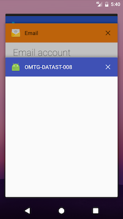

## データストレージのテスト (Android)

ユーザー資格情報やプライバシー情報などの機密データを保護することはモバイルセキュリティの重要な焦点です。この章では、Android がローカルデータストレージ用に提供する API と、それらの API を使用するためのベストプラクティスについて学びます。

「機密データ」はそれぞれ特定のアプリのコンテキストで識別する必要があることに注意します。データの分類については「テストプロセスと技法」の章で詳しく説明しています。

### 機密データのテスト (ローカルストレージ)

#### 概要

通念として、永続的なローカルストレージには可能な限り機密データを保存しないことを推奨しています。しかし、ほとんどの実際のシナリオでは、少なくともいくつかのタイプのユーザー関連データを格納する必要があります。例えば、アプリを起動するごとに非常に複雑なパスワードを入力するようにユーザーに依頼することは、ユーザビリティの観点からよい考えとはいえません。その結果、ほとんどのアプリではある種のセッショントークンをローカルにキャッシュする必要があります。個人識別情報などの他の種類の機密データも、特定のシナリオで必要とされる場合には保存されることもあります。

機密データがアプリにより適切に保護されていない場合に永続的にそれを格納すると脆弱性が発生します。デバイスのローカルや外部 SD カードなどのさまざまな場所にアプリは機密データを格納する可能性があります。この種の問題を悪用しようとする場合には、さまざまな場所に処理および格納された多くの情報がある可能性を考慮します。重要なのは、どのような種類の情報がそのモバイルアプリケーションにより処理されユーザーにより入力されるか、また、何が攻撃者にとって興味深く価値のあるものであるか (パスワード、クレジットカード情報、PII など) を最初から特定することです。

機密情報を開示することによる結果はさまざまです。例えば暗号鍵の開示は攻撃者により使用され情報を解読されます。より一般的に言えば、攻撃者はこの情報を特定して、他の攻撃の基礎として使用できます。例えば、ソーシャルエンジニアリング (PII が開示されている場合) 、セッションハイジャック (セッション情報やトークンが開示されている場合) があります。また、支払オプションを持つアプリから情報を収集して、それを攻撃および悪用することもあります。

データの格納 <sup>[1]</sup> は多くのモバイルアプリケーションで不可欠です。例えば、ユーザー設定やユーザーが入力したデータを記録するために、ローカルやオフラインで保存する必要があります。データはさまざまな方法で永続的に格納されます。以下のリストは Android プラットフォームで利用可能なこれらのメカニズムを示しています。

* Shared Preferences
* 内部ストレージ
* 外部ストレージ
* SQLite データベース

以下のコードスニペットは機密情報を開示するバッドプラクティスを示していますが、Android のさまざまなストレージメカニズムも詳細に示しています。

##### Shared Preferences

SharedPreferences <sup>[2]</sup> は XML 構造を使用してキー/値のペアをファイルシステムに永続的に格納する一般的なアプローチです。アクティビティ内では、以下のコードを使用してユーザー名やパスワードなどの機密情報を格納できます。

```java
SharedPreferences sharedPref = getSharedPreferences("key", MODE_WORLD_READABLE);
SharedPreferences.Editor editor = sharedPref.edit();
editor.putString("username", "administrator");
editor.putString("password", "supersecret");
editor.commit();
```

アクティビティが呼ばれると、ファイル key.xml が提供されたデータで作成されます。このコードはいくつかのベストプラクティスに違反しています。

* ユーザー名とパスワードが平文で `/data/data/<PackageName>/shared_prefs/key.xml` に格納されています

```xml
<?xml version='1.0' encoding='utf-8' standalone='yes' ?>
<map>
  <string name="username">administrator</string>
  <string name="password">supersecret</string>
</map>
```

* `MODE_WORLD_READABLE` はすべてのアプリケーションが `key.xml` のコンテンツにアクセスおよび読むことを許可します

```bash
root@hermes:/data/data/sg.vp.owasp_mobile.myfirstapp/shared_prefs # ls -la
-rw-rw-r-- u0_a118 u0_a118    170 2016-04-23 16:51 key.xml
```

> `MODE_WORLD_READABLE` および `MODE_WORLD_WRITEABLE` は API 17 で廃止されたことに注意してください。これは新しいデバイスには影響しませんが、Android 4.2 (`JELLY_BEAN_MR1`) より前の OS で動作する場合、android:targetSdkVersion が 17 より前の設定でコンパイルされたアプリケーションは依然として影響を受ける可能性があります。


##### SQLite データベース (暗号化なし)

SQLite は `.db` ファイルにデータを格納する SQL データベースです。Android SDK には SQLite データベースのサポートが組み込まれています。データベースを管理する主なパッケージは `android.database.sqlite` です。
アクティビティ内では、以下のコードを使用してユーザー名やパスワードなどの機密情報を格納できます。

```java
SQLiteDatabase notSoSecure = openOrCreateDatabase("privateNotSoSecure",MODE_PRIVATE,null);
notSoSecure.execSQL("CREATE TABLE IF NOT EXISTS Accounts(Username VARCHAR,Password VARCHAR);");
notSoSecure.execSQL("INSERT INTO Accounts VALUES('admin','AdminPass');");
notSoSecure.close();
```

アクティビティが呼び出されると、データベースファイル `privateNotSoSecure` が提供されたデータで作成され、`/data/data/<PackageName>/databases/privateNotSoSecure` に平文で格納されます。

databases ディレクトリには SQLite データベースのほかにいくつかのファイルがある可能性があります。

* ジャーナルファイル: これらは SQLite のアトミックコミットとロールバック機能を実装するために使用される一時ファイルです <sup>[3]</sup> 。
* ロックファイル: ロックファイルは SQLite の同時並行性を向上させ、writer starvation 問題を低減するために設計されたロックとジャーナルのメカニズムの一部です <sup>[4]</sup> 。

暗号化なしの SQLite データベースを機密情報の格納に使用すべきではありません。

##### SQLite データベース (暗号化あり)

ライブラリ SQLCipher <sup>[5]</sup> を使用すると、パスワードを提供することで SQLite データベースが暗号化できます。

```java
SQLiteDatabase secureDB = SQLiteDatabase.openOrCreateDatabase(database, "password123", null);
secureDB.execSQL("CREATE TABLE IF NOT EXISTS Accounts(Username VARCHAR,Password VARCHAR);");
secureDB.execSQL("INSERT INTO Accounts VALUES('admin','AdminPassEnc');");
secureDB.close();

```

暗号化ありの SQLite データベースを使用する場合、パスワードがソースにハードコードされているかどうか、shared preferences に格納されているか、コードやファイルシステムのどこかに隠されているかどうかを確認します。
キーを取得するセキュアなアプローチは、ローカルに格納するのではなく、次のいずれかになります。

* アプリを開く際、毎回ユーザーに PIN やパスワードを問い合わせ、データベースを復号します (弱いパスワードや PIN はブルートフォース攻撃を受けやすくなります)
* サーバーにキーを格納し、Web サービス経由でアクセス可能にします (アプリはデバイスがオンラインの場合のみ使用できます)

##### 内部ストレージ

ファイルはデバイスの内部ストレージ <sup>[6]</sup> に直接保存できます。デフォルトでは、内部ストレージに保存されたファイルはアプリケーション専用であり、他のアプリケーションはアクセスできません。ユーザーがアプリケーションをアンインストールすると、これらのファイルは削除されます。
アクティビティ内で、以下のコードを使用して、変数 test の機密情報を内部ストレージに永続的に格納できます。

```java
FileOutputStream fos = null;
try {
   fos = openFileOutput(FILENAME, Context.MODE_PRIVATE);
   fos.write(test.getBytes());
   fos.close();
} catch (FileNotFoundException e) {
   e.printStackTrace();
} catch (IOException e) {
   e.printStackTrace();
}
```

ファイルモードをチェックする必要があります。`MODE_PRIVATE` を使用して、そのアプリ自身のみがファイルにアクセスできることを確認します。`MODE_WORLD_READABLE` (非推奨) や  `MODE_WORLD_WRITEABLE` (非推奨) などの他のモードはとても緩く、セキュリティリスクを引き起こす可能性があります。

クラス `FileInputStream` を検索して、どのファイルがアプリ内で読み込まれているかもチェックすべきです。内部ストレージメカニズムの一部にはキャッシュストレージもあります。一時的にデータをキャッシュするために、`getCacheDir()` などの関数を使用する可能性があります。

##### 外部ストレージ

すべての Android 互換デバイスは共有外部ストレージ <sup>[7]</sup> をサポートしており、ファイルを保存するために使用できます。これはリムーバブルストレージメディア (SD カードなど) や内部 (非リムーバブル) ストレージがあります。
外部ストレージに保存されたファイルは world-readable であり、ユーザーが変更できます。USB マスストレージを有効にすると、コンピュータ上にファイルを転送できます。
アクティビティ内では、以下のコードを使用して、ファイル `password.txt` の機密情報を外部ストレージに永続的に格納できます。

```java
File file = new File (Environment.getExternalFilesDir(), "password.txt");
String password = "SecretPassword";
FileOutputStream fos;
    fos = new FileOutputStream(file);
    fos.write(password.getBytes());
    fos.close();
```

アクティビティが呼び出されると、提供されたデータでファイルが作成され、データは平文で外部ストレージに格納されます。

アプリケーションフォルダ (`data/data/<packagename>/`) の外に格納されたファイルは、ユーザーがアプリケーションをアンインストールしたときに削除されないことも知っておく価値があります。

##### KeyChain

KeyChain クラス <sup>[10]</sup> は *システムワイドの* 秘密鍵とそれに関連する証明書 (チェーン) を格納および取得するために使用されます。ユーザーは、初めて KeyChain に何かがインポートされた際に、ロック画面の PIN やパスワードが設定されていない場合、資格情報ストレージを保護するためにそれらを設定するように求められます。キーチェーンはシステムワイドであることに注意します。つまり、すべてのアプリケーションが KeyChain に格納されているマテリアルにアクセスできます。

##### KeyStore (AndroidKeyStore)

Android KeyStore <sup>[8]</sup> は (多かれ少なかれ) セキュアな資格情報ストレージの手段を提供します。Android 4.3 以降では、アプリの秘密鍵を格納及び使用するためにパブリック API を提供しています。アプリは秘密鍵・公開鍵のペアを作成して、公開鍵を使用してアプリケーションの秘密を暗号化し、秘密鍵を使用してそれを復号できます。

Android KeyStore に格納された鍵は保護され、ユーザーがアクセスするためには認証が必要とすることが可能です。ユーザーのロック画面の資格情報 (パターン、PIN、パスワード、指紋) が認証に使用されます。

格納された鍵は次の二つのモードのいずれかで動作するように設定できます。

1. ユーザー認証は一定期間の鍵の使用を許可します。このモードのすべての鍵は、ユーザーがデバイスのロックを解除するとすぐに、使用を許可されます。許可が有効である期間は各鍵ごとにカスタマイズできます。このオプションはセキュアロック画面が有効である場合にのみ使用できます。ユーザーがセキュアロック画面を無効にすると、格納されている鍵は完全に無効になります。

2. ユーザー認証はひとつの鍵に関連付けられた特定の暗号化操作を許可します。このモードでは、そのような鍵を含む操作はユーザーにより個別に許可される必要があります。現在、そのような許可の唯一の手段は指紋認証です。

Android KeyStore により提供されるセキュリティのレベルはその実装に依存し、デバイス間で異なります。最新のデバイスのほとんどはハードウェア支援のキーストア実装を提供します。その場合、鍵は Trusted Execution Environment または Secure Element で生成および使用され、オペレーティングシステムは直接アクセスできません。これは暗号鍵自体がルート化デバイスからでも容易には取得できないことを意味します。鍵の `KeyInfo` の一部である `isInsideSecureHardware()` に基づいて、鍵がセキュアなハードウェア内にあるかどうかを確認できます。秘密鍵は通常セキュアなハードウェア内に正しく格納されていますが、共通鍵、hmac 鍵は KeyInfo に従ってセキュアに格納されないデバイスがかなりあります。

ソフトウェアのみの実装では、鍵はユーザーごとの暗号マスターキー <sup>[16]</sup> で暗号化されます。その場合、攻撃者はルート化デバイスのフォルダ <code>/data/misc/keystore/</code> のすべての鍵にアクセスできます。マスターキーはユーザー自身のロック画面 PIN やパスワードを使用して生成されるため、Android KeyStore はデバイスがロックされているときには利用できません <sup>[9]</sup> 。

##### 古い Java-KeyStore
古い Android バージョンには KeyStore はありませんが、JCA (Java Cryptography Architecture) の KeyStore インタフェースを備えています。このインタフェースを実装するさまざまな KeyStore を使用して、キーストア実装に格納される鍵の機密性と完全性の保護を提供できます。その実装はすべてファイルシステムに格納されたファイルであるという事実に依存するため、パスワードによりその内容を保護しています。このため、BounceyCastle KeyStore (BKS) の使用をお勧めします。
`KeyStore.getInstance("BKS", "BC");` を使用してそれを作成できます。"BKS" はキーストア名 (BounceycastleKeyStore) であり、"BC" はプロバイダ (BounceyCastle) です。代わりに SpongeyCastle をラッパーとして使用し、キーストアを初期化することもできます: `KeyStore.getInstance("BKS", "SC");` 。

すべての KeyStore がキーストアファイルに格納された鍵の適切な保護を提供するわけではないことに気をつけます。


#### 静的解析

##### ローカルストレージ

既に示したように、Android 内に情報を格納するにはいくつかの方法があります。従って、いくつかのチェックをソースコードに適用して、Android アプリ内で使用されるストレージメカニズムを特定し、機密データが非セキュアにしょりされていないかどうかを確認します。

* 外部ストレージの読み書きのためのパーミッションについて `AndroidManifest.xml` をチェックする。`uses-permission android:name="android.permission.WRITE_EXTERNAL_STORAGE"` など。
* データの格納に使用される関数および API 呼び出しについてソースコードをチェックする。
  * 任意の IDE やテキストエディタで Java ファイルを開くか、コマンドラインで grep を使用して検索する。
    * ファイルパーミッション
      * `MODE_WORLD_READABLE` や `MODE_WORLD_WRITABLE` 。IPC ファイルはアプリのプライベートデータディレクトリに格納されていても、任意のアプリがそのファイルを読み書きする必要がなければ、`MODE_WORLD_READABLE` や `MODE_WORLD_WRITABLE` のパーミッションで作成するべきではありません。
    * クラスおよび関数
      * `SharedPreferences` クラス (キーバリューペアのストレージ)
      * `FileOutPutStream` クラス (内部または外部ストレージの使用)
      * `getExternal*` 関数 (外部ストレージの使用)
      * `getWritableDatabase` 関数 (書き込み用の SQLiteDatabase を戻す)
      * `getReadableDatabase` 関数 (読み取り用の SQLiteDatabase を戻す)
      * `getCacheDir` および `getExternalCacheDirs` 関数 (キャッシュファイルの使用)

暗号化操作は SDK により提供される実証済み機能に依存すべきです。以下では、ソースコードでチェックする必要があるさまざまな「バッドプラクティス」について説明します。

* 単純なビット操作が使用されているかどうかを確認します。XOR やビットフリップなどでローカルに格納される資格情報や秘密鍵などの機密情報を「暗号化」します。これはデータを容易に復元できるため避けるべきです。
* Android KeyStore <sup>[8]</sup> などの Android オンボード機能を利用せずに鍵を生成または使用されているかどうかを確認します。
* 鍵が開示されているかどうかを確認します。

###### よくある間違い: ハードコードされた暗号鍵

ハードコードされた暗号鍵や誰にでも読み取り可能な暗号鍵を使用すると、暗号化されたデータを復元される可能性が大幅に高まります。攻撃者がそれを取得すると、機密データを復号する作業は簡単になり、機密性を保護するという当初の考えは失敗します。

対称暗号を使用する場合、鍵はデバイス内に格納する必要があり、攻撃者がそれを特定するのは時間と労力だけの問題です。

次のシナリオを考えます。あるアプリケーションは暗号化されたデータベースを読み書きしますが、復号化はハードコードされた鍵に基づいて行われます。

```Java
this.db = localUserSecretStore.getWritableDatabase("SuperPassword123");
```

鍵はすべてのアプリインストールで同じであるため、取得することは簡単です。機密データを暗号化する利点は無くなり、このような方法で暗号化を使用することで得られるものは実際にはありません。同様に、ハードコードされた API 鍵や秘密鍵およびその他の価値のある部品を探します。エンコードや暗号化された鍵はさらなる試みであり、王冠の宝石を手に入れることは困難ですが不可能ではありません。

このコードを考えて見ましょう。

```Java
//A more complicated effort to store the XOR'ed halves of a key (instead of the key itself)
private static final String[] myCompositeKey = new String[]{
  "oNQavjbaNNSgEqoCkT9Em4imeQQ=","3o8eFOX4ri/F8fgHgiy/BS47"
};
```

このケースでの元の鍵を解読するためのアルゴリズムは以下のようになります <sup>[1]</sup> 。

```Java
public void useXorStringHiding(String myHiddenMessage) {
  byte[] xorParts0 = Base64.decode(myCompositeKey[0],0);
  byte[] xorParts1 = Base64.decode(myCompositeKey[1],0);

  byte[] xorKey = new byte[xorParts0.length];
  for(int i = 0; i < xorParts1.length; i++){
    xorKey[i] = (byte) (xorParts0[i] ^ xorParts1[i]);
  }
  HidingUtil.doHiding(myHiddenMessage.getBytes(), xorKey, false);
}
```

秘密が通常隠されている一般的な場所を確認します。
* resources (通常は res/values/strings.xml にあります)

例:
```xml
<resources>
    <string name="app_name">SuperApp</string>
    <string name="hello_world">Hello world!</string>
    <string name="action_settings">Settings</string>
    <string name="secret_key">My_S3cr3t_K3Y</string>
  </resources>
```

* build configs, local.properties や gradle.properties などにあります

例:
```
buildTypes {
  debug {
    minifyEnabled true
    buildConfigField "String", "hiddenPassword", "\"${hiddenPassword}\""
  }
}
```

* shared preferences, 通常は /data/data/package_name/shared_prefs にあります

##### KeyChain および Android KeyStore

ソースコードを調べる際は、Android により提供されるネイティブメカニズムが識別された機密情報に適用されているかどうかを解析する必要があります。機密情報は平文で格納してはいけません。暗号化する必要があります。機密情報をデバイス自体に格納する必要がある場合には、いくつかの API 呼び出しを利用できます。**KeyChain <sup>[10]</sup>** や **Android Keystore <sup>[8]</sup>** を使用して Android デバイス上のデータを保護します。従って、以下のコントロールを使用する必要があります。

* クラス `KeyPairGenerator` を探して、アプリ内で鍵ペアが作成されているかどうかを確認します。
* アプリケーションが Android KeyStore や Cipher メカニズムを使用して、暗号化された情報をデバイス上にセキュアに格納していることを確認します。パターン `import java.security.KeyStore`, `import javax.crypto.Cipher`, `import java.security.SecureRandom` および対応する使用法を探します。
* `store(OutputStream stream, char[] password)` 関数を使用して、指定されたパスワードでディスクに KeyStore を格納できます。提供されるパスワードはハードコードされておらず、ユーザー入力により定義され、ユーザーだけが知っているものであることを確認します。パターン `.store(` を探します。

#### 動的解析

アプリをインストールして、それが意図したとおりに使用します。すべての機能を少なくとも一回は実行します。データが生成されるのは、ユーザーが入力したとき、エンドポイントにより送信されたとき、またはインストール時にアプリ内にすでに同梱されています。それから以下の項目を確認します。

* `/data/data/<package_name>/` にインストールされたモバイルアプリケーションに同梱されているファイルを確認し、製品リリースにはないはずの開発、バックアップ、または単に古いファイルを特定します。
* SQLite データベースが利用可能であるかどうか、およびそれらに機密情報 (ユーザー名、パスワード、鍵など) が含まれているかどうかを確認します。SQLite データベースは `/data/data/<package_name>/databases` に格納されます。
* 機密情報について、アプリの shared_prefs ディレクトリに XML ファイルとして格納されている Shared Preferences を確認します。`/data/data/<package_nam>/shared_prefs` にあります。
* `/data/data/<package_name>` にあるファイルのファイルシステム権限を確認します。アプリをインストールした際に作成されるユーザーおよびグループ (u0_a82 など) のみがユーザー権限の読み取り、書き込み、実行 (rwx) を持つ必要があります。他の人はファイルへの権限を持たないはずですが、ディレクトリに対して実行可能フラグを持つ可能性があります。

#### 改善方法

データを保存する際の約束事は次のように非常に簡単に要約できます。パブリックデータは誰でも利用可能とすべきですが、機密およびプライベートのデータは保護する必要がありますし、そもそもデバイスに格納しないほうがさらに良いです。

機密情報 (資格情報、鍵、PII など) はデバイス上でローカルに必要である場合、セキュアにデータを格納するために使用されるベストプラクティスは Android により提供されます。そうでなければ、車輪を再発明するか、デバイスに暗号化されていないデータをが残ります。

以下は、証明書、鍵、機密データのセキュアストレージに一般的に使用されるベストプラクティスのリストです。

* 自己実装された暗号化または復号化機能は避ける必要があります。代わりに Cipher <sup>[11]</sup>, SecureRandom <sup>[12]</sup>, KeyGenerator <sup>[13]</sup> などの Android 実装を使用します。
* ユーザー名とパスワードはデバイスに格納すべきではありません。代わりに、ユーザーが入力したユーザー名とパスワードを使用して初期認証を行い、短期間でサービス固有の認証トークン (セッショントークン) を使用します。可能であれば、AccountManager <sup>[14]</sup> クラスを使用してクラウドベースサービスを呼び出し、デバイスにパスワードを格納しません。
* ファイルに対して `MODE_WORLD_WRITEABLE` または `MODE_WORLD_READABLE` の使用は通常避けるべきです。他のアプリケーションとデータを共有する必要がある場合には、コンテンツプロバイダを検討すべきです。コンテンツプロバイダは他のアプリに読み取りおよび書き込みパーミッションを提供し、ケースバイケースベースで動的にパーミッションを割り当てることができます。
* データを保護できない Shared Preferences またはその他のメカニズムの使用は機密情報を格納するには避けるべきです。SharedPreferences はセキュアではなく、デフォルトで暗号化されません。Secure-preferences <sup>[15]</sup> は Shared Preferences 内に格納される値を暗号化するために使用できますが、セキュアにデータを格納するための最初の選択肢は Android Keystore です。
* 機密データ用に外部ストレージを使用してはいけません。デフォルトでは、内部ストレージに保存されるファイルはあなたのアプリケーションのプライベートであり、他のアプリケーションはそれらにアクセスできません (そのユーザーもアクセスできません) 。ユーザーがアプリケーションをアンインストールすると、これらのファイルも削除されます。
* 機密データを更に保護するために、アプリケーションが直接アクセスできない鍵を使用してローカルファイルを暗号化することを選択できます。例えば、鍵を KeyStore に配置し、デバイスに格納されていないユーザーパスワードで保護できます。これはユーザーがパスワードを入力することを監視するルートの侵害からデータを保護するものではありませんが、ファイルシステムの暗号化なしに紛失したデバイスの保護を提供できます。
* 機密情報を使用し終えた変数に null を設定します。
* 機密データに immutable オブジェクトを使用することで、変更できなくなります。
* セキュリティの多層対策として、コードの難読化もアプリに適用し、攻撃者のリバースエンジニアリングを困難にします。


#### 参考情報

##### OWASP Mobile Top 10 2016
* M1 - 不適切なプラットフォームの利用 - https://www.owasp.org/index.php/Mobile_Top_10_2016-M1-Improper_Platform_Usage
* M2 - 安全でないデータストレージ - https://www.owasp.org/index.php/Mobile_Top_10_2016-M2-Insecure_Data_Storage

##### OWASP MASVS

* V2.1: "ユーザー資格情報や暗号化鍵などの機密データを格納するために、システムの資格情報保存機能が適切に使用されている。"

##### CWE
* CWE-311 - Missing Encryption of Sensitive Data
* CWE-312 - Cleartext Storage of Sensitive Information
* CWE-522 - Insufficiently Protected Credentials
* CWE-922 - Insecure Storage of Sensitive Information

##### その他

[1] Security Tips for Storing Data - http://developer.android.com/training/articles/security-tips.html#StoringData
[2] SharedPreferences - http://developer.android.com/reference/android/content/SharedPreferences.html
[3] SQLite Journal files - https://www.sqlite.org/tempfiles.html
[4] SQLite Lock Files - https://www.sqlite.org/lockingv3.html
[5] SQLCipher - https://www.zetetic.net/sqlcipher/sqlcipher-for-android/
[6] Using Internal Storage -  http://developer.android.com/guide/topics/data/data-storage.html#filesInternal
[7] Using External Storage - https://developer.android.com/guide/topics/data/data-storage.html#filesExternal
[8] Android KeyStore System -  http://developer.android.com/training/articles/keystore.html
[9] Use Android Keystore - http://www.androidauthority.com/use-android-keystore-store-passwords-sensitive-information-623779/
[10] Android KeyChain -  http://developer.android.com/reference/android/security/KeyChain.html
[11] Cipher - https://developer.android.com/reference/javax/crypto/Cipher.html
[12] SecureRandom - https://developer.android.com/reference/java/security/SecureRandom.html
[13]KeyGenerator - https://developer.android.com/reference/javax/crypto/KeyGenerator.html
[14] AccountManager -  https://developer.android.com/reference/android/accounts/AccountManager.html
[15] Secure Preferences - https://github.com/scottyab/secure-preferences
[16] Nikolay Elenvok - Credential storage enhancements in Android 4.3 - https://nelenkov.blogspot.sg/2013/08/credential-storage-enhancements-android-43.html


##### ツール

* Enjarify - https://github.com/google/enjarify
* JADX - https://github.com/skylot/jadx
* Dex2jar - https://github.com/pxb1988/dex2jar
* Lint - http://developer.android.com/tools/help/lint.html
* Sqlite3 - http://www.sqlite.org/cli.html


### 機密データのテスト (ログ)

#### 概要

モバイルデバイス上にログファイルを作成する正当な理由は数多くあります。例えば、クラッシュやエラーを追跡したり、単に使用統計を記録したりするなどです。ログファイルはオフライン時にはローカルに格納され、再びオンラインになるとエンドポイントに送信されます。しかし、ユーザー名やセッション ID などの機密情報をログ出力すると、攻撃者や悪意のあるアプリケーションにデータを公開され、データの機密性を失う可能性があります。
ログファイルはさまざまな方法で作成できます。以下のリストは Android で利用可能なメカニズムを示しています。

* Log クラス <sup>[1]</sup>
* Logger クラス
* System.out/System.err.print

#### 静的解析

ソースコードにいくつかのチェックを適用して、Android アプリ内で使用されているログ出力メカニズムを特定する必要があります。これは機密データが非セキュアに処理されているかどうかを特定します。
ソースコードはAndroid アプリ内で使用されているログ出力メカニズムをチェックする必要があります。以下のものを検索します。

1. 関数及びクラス
  * `android.util.Log`
  * `Log.d` | `Log.e` | `Log.i` | `Log.v` | `Log.w` | `Log.wtf`
  * `Logger`
  * `System.out.print` | `System.err.print`

2. 非標準のログメカニズムを特定するためのキーワードとシステム出力
  * logfile
  * logging
  * logs

#### 動的解析

モバイルアプリを広範囲に使用し、すべての機能が少なくとも一度は起動されるようにします。その後、アプリケーションのデータディレクトリを特定し、ログファイルを探します (`/data/data/package_name`) 。アプリケーションログを確認してログデータが生成されているかどうかをチェックします。一部のモバイルアプリケーションはデータディレクトリに独自のログを作成および格納します。

多くのアプリケーション開発者は適切なログ出力クラスの代わりに `System.out.println()` や `printStackTrace()` をいまだに使用しています。したがって、テストアプローチではアプリケーションの起動、実行、終了時にアプリケーションにより生成されるすべての出力をカバーする必要もあります。`System.out.println()` や `printStackTrace()` を使用して直接出力されるデータを確認するために、ツール `LogCat` <sup>[2]</sup> を使用してアプリの出力をチェックできます。LogCat を実行するには二つの異なるアプローチが利用可能です。
  * LogCat はすでに _Dalvik Debug Monitor Server_ (DDMS) の一部であり、Android Studio に組み込まれています。アプリがデバッグモードで実行されている場合、ログ出力は Android Monitor の LogCat タブに表示されます。LogCat にパターンを定義して、アプリのログ出力をフィルタできます。


  * adb を使用して LogCat を実行して、ログ出力を永続的に格納できます。

```bash
$ adb logcat > logcat.log
```

#### 改善方法

一元的なログ出力クラスとメカニズムが使用され、プロダクションリリースからログ出力ステートメントが削除されていることを確認します。ログは他のアプリケーションにより傍受や読み取りが可能です。Android Studio に既に含まれている `ProGuard` などのツールを使用して、プロダクションリリースを準備する際にコード内のログ出力部分を取り除くことができます。例えば、クラス `android.util.Log` で実行されたログ出力呼び出しを削除するには、ProGuard の _proguard-project.txt_ 設定ファイルに以下のオプションを追加するだけです。

```java
-assumenosideeffects class android.util.Log
{
public static boolean isLoggable(java.lang.String, int);
public static int v(...);
public static int i(...);
public static int w(...);
public static int d(...);
public static int e(...);
public static int wtf(...);
}
```

#### 参考情報

##### OWASP Mobile Top 10 2016
* M1 - 不適切なプラットフォームの利用 - https://www.owasp.org/index.php/Mobile_Top_10_2016-M1-Improper_Platform_Usage
* M2 - 安全でないデータストレージ - https://www.owasp.org/index.php/Mobile_Top_10_2016-M2-Insecure_Data_Storage

##### OWASP MASVS
* V2.2: "機密データがアプリケーションログに書き込まれていない。"

##### CWE
* CWE-117: Improper Output Neutralization for Logs
* CWE-532: Information Exposure Through Log Files
* CWE-534: Information Exposure Through Debug Log Files

##### その他
* [1] Overview of Class Log - http://developer.android.com/reference/android/util/Log.html
* [2] Debugging Logs with LogCat - http://developer.android.com/tools/debugging/debugging-log.html

##### ツール
* ProGuard - http://proguard.sourceforge.net/
* LogCat - http://developer.android.com/tools/help/logcat.html


### 機密データが第三者に送信されているかどうかのテスト

#### 概要

アプリに組み込むことでさまざまな機能を実装できるさまざまなサードパーティサービスが利用できます。これらの機能はトラッカーサービスやアプリ内のユーザー行動の監視、販売バナー広告、より良いユーザーエクスペリエンスの作成などさまざまです。これらのサービスとのやり取りは、機能の独自実装や車輪の再発明といった複雑さと必要性を抽象化します。

欠点は、サードパーティライブラリを介してどのようなコードが実行されているかを開発者が詳細に把握せず、したがって可視性をあきらめることです。そのため、必要以上の情報がサービスに送信されていないこと、および機密情報が開示されていないことを確認する必要があります。

サードパーティサービスは主に二つの方法で実装されます。
* スタンドアローンのライブラリを使用する。Android プロジェクトの Jar など。APK に組み込まれる。
* フル SDK を使用する。

#### 静的解析

一部のサードパーティライブラリは IDE 内のウィザードを使用してアプリに自動的に統合できます。IDE ウィザードを使用してライブラリをインストールする場合には、`AndroidManifest.xml` に設定されたパーミッションを確認する必要があります。特に、SMS (`READ_SMS`), 連絡先 (`READ_CONTACTS`), 位置情報 (`ACCESS_FINE_LOCATION`) にアクセスするためのパーミッションは、ライブラリが真に最小限で機能するために本当に必要であるかどうか、説明を求めるべきです。「アプリパーミッションのテスト」も参照します。開発者と話す際には、IDE を使用してライブラリをインストールする前と後でプロジェクトソースコードの相違点を確認し、コードベースにどのような変更が加えられたかを確認する必要があります。

ライブラリまたは SDK を手動で追加する場合にも同じことが適用されます。サードパーティライブラリや SDK により提供される API 呼び出しや関数についてソースコードをチェックする必要があります。適用されるコード変更をレビューし、ライブラリや SDK の利用可能なセキュリティベストプラクティスが適用および使用されているかどうかをチェックする必要があります。

プロジェクトにロードされたライブラリをレビューし、開発者と共にそれらが必要であるかと確認します。また、古くなり既知の脆弱性を含むかどうかも確認します。

#### 動的解析

外部サービスに対するすべてのリクエストについて、機密情報が埋め込まれているかどうかを解析する必要があります。動的解析は中間者 (MITM) 攻撃を開始することにより実行できます。_Burp Proxy_ <sup>[1]</sup> や _OWASP ZAP_ を使用し、クライアントとサーバーとの間で交換されるトラフィックを傍受します。傍受プロキシにトラフィックをルーティングできるようになると、アプリからサーバーへおよびその反対のトラフィックを盗聴することができます。アプリを使用する場合には、メイン機能がホストされているサーバーに直接接続されていないすべてのリクエストについて、機密情報がサードパーティに送信されているかどうかを確認する必要があります。これには例えば、トラッカーや広告サービスでの PII (個人識別情報) があります。

#### 改善方法

サードパーティサービスに送信されるすべてのデータは匿名化されるべきです。そのため PII データは利用できません。また、ユーザーアカウントやセッションにマップできるアプリケーションの ID などの他のすべてのデータをサードパーティに送信すべきではありません。
`AndroidManifest.xml` には正しく動作するために必要なパーミッションだけを含む必要があります。

#### 参考情報

##### OWASP Mobile Top 10 2016
* M1 - 不適切なプラットフォームの利用 - https://www.owasp.org/index.php/Mobile_Top_10_2016-M1-Improper_Platform_Usage
* M2 - 安全でないデータストレージ - https://www.owasp.org/index.php/Mobile_Top_10_2016-M2-Insecure_Data_Storage

##### OWASP MASVS
- V2.3: "機密データはアーキテクチャに必要な部分でない限りサードパーティと共有されていない。"

##### CWE
- CWE-359 - Exposure of Private Information ('Privacy Violation')

##### その他
[1] Configure Burp with Android - https://support.portswigger.net/customer/portal/articles/1841101-configuring-an-android-device-to-work-with-burp
[2] Bulletproof Android, Godfrey Nolan - Chapter 7, Third-Party Library Integration

##### ツール
* Burp Suite Professional - https://portswigger.net/burp/
* OWASP ZAP - https://www.owasp.org/index.php/OWASP_Zed_Attack_Proxy_Project


### テキスト入力フィールドでキーボードキャッシュが無効かどうかのテスト

#### 概要

入力フィールドにデータを入力すると、ソフトウェアキーボードはユーザーがキー入力したいデータを自動的に提示します。この機能はメッセージングアプリで非常に役に立ち、テキストメッセージを非常に効率的に書くことができます。クレジットカードデータなどの機密情報を要求する入力フィールドでは、その入力フィールドが選択された際にキーボードキャッシュが既存の機密情報を開示する可能性があります。したがって、機密情報を要求する入力フィールドではこの機能を無効にする必要があります。

#### 静的解析

アクティビティのレイアウト定義では、XML 属性を持つ TextView を定義できます。XML 属性 `android:inputType` に定数 `textNoSuggestions` を設定すると、その入力フィールドを選択した際にキーボードキャッシュは表示されません。キーボードだけが表示され、ユーザーは手動ですべてを入力する必要があり、何も提示されません。

```xml
   <EditText
        android:id="@+id/KeyBoardCache"
        android:inputType="textNoSuggestions"/>
```


#### 動的解析

アプリを起動し、機密データを要求する入力フィールドをクリックします。文字列が提示される場合、この入力フィールドでキーボードキャッシュは無効ではありません。

#### 改善方法

機密情報を要求するすべての入力フィールドでは、以下の XML 属性を実装し、キーボードの提示を無効にする必要があります <sup>[1]</sup> 。

```xml
android:inputType="textNoSuggestions"
```

#### 参考情報

##### OWASP Mobile Top 10 2016
* M1 - 不適切なプラットフォームの利用 - https://www.owasp.org/index.php/Mobile_Top_10_2016-M1-Improper_Platform_Usage
* M2 - 安全でないデータストレージ - https://www.owasp.org/index.php/Mobile_Top_10_2016-M2-Insecure_Data_Storage

##### OWASP MASVS
- V2.4: "機密データを処理するテキスト入力では、キーボードキャッシュが無効にされている。"

##### CWE
- CWE-524 - Information Exposure Through Caching

##### その他
[1] No suggestions for text - https://developer.android.com/reference/android/text/InputType.html#TYPE_TEXT_FLAG_NO_SUGGESTIONS


### Testing for Sensitive Data in the Clipboard

#### Overview

When keying in data into input fields, the clipboard<sup>[1]</sup> can be used to copy data in. The clipboard is accessible systemwide and therefore shared between the apps. This feature can be misused by malicious apps in order to get sensitive data.


#### Static Analysis

Input fields that are asking for sensitive information need to be identified and afterwards be investigated if any countermeasures are in place to mitigate the clipboard of showing up. See the remediation section for code snippets that could be applied.

#### Dynamic Analysis

Start the app and click into the input fields that ask for sensitive data. When it is possible to get the menu to copy/paste data the functionality is not disabled for this input field.

To extract the data stored in the clipboard, the Drozer module `post.capture.clipboard` can be used:

```
dz> run post.capture.clipboard
[*] Clipboard value: ClipData.Item { T:Secretmessage }
```

#### Remediation

A general best practice is overwriting different functions in the input field to disable the clipboard specifically for it.

```Java
EditText  etxt = (EditText) findViewById(R.id.editText1);
etxt.setCustomSelectionActionModeCallback(new Callback() {

            public boolean onPrepareActionMode(ActionMode mode, Menu menu) {
                return false;
            }
0
            public void onDestroyActionMode(ActionMode mode) {                  
            }

            public boolean onCreateActionMode(ActionMode mode, Menu menu) {
                return false;
            }

            public boolean onActionItemClicked(ActionMode mode, MenuItem item) {
                return false;
            }
        });
```

Also `longclickable` should be deactivated for the input field.

```xml
android:longClickable="false"
```

#### References

##### OWASP Mobile Top 10 2016
* M1 - Improper Platform Usage
* M2 - Insecure Data Storage

##### OWASP MASVS
- V2.5: "The clipboard is deactivated on text fields that may contain sensitive data."

##### CWE
* CWE-200 - Information Exposure

##### Info
[1] Copy and Paste in Android - https://developer.android.com/guide/topics/text/copy-paste.html

##### Tools
* Drozer - https://labs.mwrinfosecurity.com/tools/drozer/


### Testing Whether Sensitive Data Is Exposed via IPC Mechanisms

#### Overview

During development of a mobile application, traditional techniques for IPC might be applied like usage of shared files or network sockets. As mobile application platforms implement their own system functionality for IPC, these mechanisms should be applied as they are much more mature than traditional techniques. Using IPC mechanisms with no security in mind may cause the application to leak or expose sensitive data.

The following is a list of Android IPC Mechanisms that may expose sensitive data:
* Binders<sup>[1]</sup>
* Services<sup>[2]</sup>
  * Bound Services<sup>[9]</sup>
  * AIDL<sup>[10]</sup>
* Intents<sup>[3]</sup>
* Content Providers<sup>[4]</sup>

#### Static Analysis

The first step is to look into the `AndroidManifest.xml` in order to detect and identify IPC mechanisms exposed by the app. You will want to identify elements such as:

* `<intent-filter>`<sup>[5]</sup>
* `<service>`<sup>[6]</sup>
* `<provider>`<sup>[7]</sup>
* `<receiver>`<sup>[8]</sup>

Except for the `<intent-filter>` element, check if the previous elements contain the following attributes:
* `android:exported`
* `android:permission`

Once you identify a list of IPC mechanisms, review the source code in order to detect if they leak any sensitive data when used. For example, _ContentProviders_ can be used to access database information, while services can be probed to see if they return data. Also BroadcastReceiver and Broadcast intents can leak sensitive information if probed or sniffed.

**Vulnerable ContentProvider**

An example of a vulnerable _ContentProvider_:
(and SQL injection **-- TODO [Refer to any input validation test in the project] --**

```xml
<provider android:name=".CredentialProvider"
          android:authorities="com.owaspomtg.vulnapp.provider.CredentialProvider"
          android:exported="true">
</provider>
```

As can be seen in the `AndroidManifest.xml` above, the application exports the content provider. In the `CredentialProvider.java` file the `query` function need to be inspected to detect if any sensitive information is leaked:

```java
public Cursor query(Uri uri, String[] projection, String selection,
			String[] selectionArgs, String sortOrder) {
		 SQLiteQueryBuilder queryBuilder = new SQLiteQueryBuilder();
		 // the TABLE_NAME to query on
		 queryBuilder.setTables(TABLE_NAME);
	      switch (uriMatcher.match(uri)) {
	      // maps all database column names
	      case CREDENTIALS:
	    	  queryBuilder.setProjectionMap(CredMap);
	         break;
	      case CREDENTIALS_ID:
	    	  queryBuilder.appendWhere( ID + "=" + uri.getLastPathSegment());
	         break;
	      default:
	         throw new IllegalArgumentException("Unknown URI " + uri);
	      }
	      if (sortOrder == null || sortOrder == ""){
	         sortOrder = USERNAME;
	      }
	     Cursor cursor = queryBuilder.query(database, projection, selection,
	    		  selectionArgs, null, null, sortOrder);
	      cursor.setNotificationUri(getContext().getContentResolver(), uri);
	      return cursor;
	}
```

The query statement would return all credentials when accessing `content://com.owaspomtg.vulnapp.provider.CredentialProvider/CREDENTIALS`.


* Vulnerable Broadcast
Search in the source code for strings like `sendBroadcast`, `sendOrderedBroadcast`, `sendStickyBroadcast` and verify that the application doesn't send any sensitive data.

An example of a vulnerable broadcast is the following:

```java
private void vulnerableBroadcastFunction() {
    // ...
    Intent VulnIntent = new Intent();
    VulnIntent.setAction("com.owasp.omtg.receiveInfo");
    VulnIntent.putExtra("ApplicationSession", "SESSIONID=A4EBFB8366004B3369044EE985617DF9");
    VulnIntent.putExtra("Username", "litnsarf_omtg");
    VulnIntent.putExtra("Group", "admin");
  }
  this.sendBroadcast(VulnIntent);
```

#### Dynamic Analysis

##### Testing Content Providers

To begin dynamic analysis of an application's content providers, you should first enumerate the attack surface. This can be achieved using the Drozer module `app.provider.info`:

```
dz> run app.provider.info -a com.mwr.example.sieve
  Package: com.mwr.example.sieve
  Authority: com.mwr.example.sieve.DBContentProvider
  Read Permission: null
  Write Permission: null
  Content Provider: com.mwr.example.sieve.DBContentProvider
  Multiprocess Allowed: True
  Grant Uri Permissions: False
  Path Permissions:
  Path: /Keys
  Type: PATTERN_LITERAL
  Read Permission: com.mwr.example.sieve.READ_KEYS
  Write Permission: com.mwr.example.sieve.WRITE_KEYS
  Authority: com.mwr.example.sieve.FileBackupProvider
  Read Permission: null
  Write Permission: null
  Content Provider: com.mwr.example.sieve.FileBackupProvider
  Multiprocess Allowed: True
  Grant Uri Permissions: False
```

In the example, two content providers are exported, each not requiring any permission to interact with them, except for the `/Keys` path in the `DBContentProvider`. Using this information you can reconstruct part of the content URIs to access the `DBContentProvider`, because it is known that they must begin with `content://`. However, the full content provider URI is not currently known.

To identify content provider URIs within the application, Drozer's `scanner.provider.finduris` module should be used. This utilizes various techniques to guess paths and determine a list of accessible content URIs:

```
dz> run scanner.provider.finduris -a com.mwr.example.sieve
Scanning com.mwr.example.sieve...
Unable to Query content://com.mwr.
example.sieve.DBContentProvider/
...
Unable to Query content://com.mwr.example.sieve.DBContentProvider/Keys
Accessible content URIs:
content://com.mwr.example.sieve.DBContentProvider/Keys/
content://com.mwr.example.sieve.DBContentProvider/Passwords
content://com.mwr.example.sieve.DBContentProvider/Passwords/
```

Now that you have a list of accessible content providers, the next step is to attempt to extract data from each provider, which can be achieved using the `app.provider.query` module:

```
dz> run app.provider.query content://com.mwr.example.sieve.DBContentProvider/Passwords/ --vertical
_id: 1
service: Email
username: incognitoguy50
password: PSFjqXIMVa5NJFudgDuuLVgJYFD+8w== (Base64
-
encoded)
email: incognitoguy50@gmail.com
```

In addition to querying data, Drozer can be used to update, insert and delete records from a vulnerable content provider:

* Insert record

```
dz> run app.provider.insert content://com.vulnerable.im/messages
                --string date 1331763850325
                --string type 0
                --integer _id 7
```

* Update record

```
dz> run app.provider.update content://settings/secure
                --selection "name=?"
                --selection-args assisted_gps_enabled
                --integer value 0
```

* Delete record

```
dz> run app.provider.delete content://settings/secure
                --selection "name=?"
                --selection-args my_setting
```

##### SQL Injection in Content Providers

The Android platform promotes the use of SQLite databases for storing user data. Since these databases use SQL, they can be vulnerable to SQL injection. The Drozer module `app.provider.query` can be used to test for SQL injection by manipulating the projection and selection fields that are passed to the content provider:

```
dz> run app.provider.query content://com.mwr.example.sieve.DBContentProvider/Passwords/ --projection "'"
unrecognized token: "' FROM Passwords" (code 1): , while compiling: SELECT ' FROM Passwords

dz> run app.provider.query content://com.mwr.example.sieve.DBContentProvider/Passwords/ --selection "'"
unrecognized token: "')" (code 1): , while compiling: SELECT * FROM Passwords WHERE (')
```

If vulnerable to SQL Injection, the application will return a verbose error message. SQL Injection in Android can be exploited to modify or query data from the vulnerable content provider. In the following example, the Drozer module `app.provider.query` is used to list all tables in the database:

```
dz> run app.provider.query content://com.mwr.example.sieve.DBContentProvider/Passwords/ --projection "*
FROM SQLITE_MASTER WHERE type='table';--"
| type  | name             | tbl_name         | rootpage | sql              |
| table | android_metadata | android_metadata | 3        | CREATE TABLE ... |
| table | Passwords        | Passwords        | 4        | CREATE TABLE ... |
| table | Key              | Key              | 5        | CREATE TABLE ... |
```

SQL Injection can also be exploited to retrieve data from otherwise protected tables:

```
dz> run app.provider.query content://com.mwr.example.sieve.DBContentProvider/Passwords/ --projection "* FROM Key;--"
| Password | pin |
| thisismypassword | 9876 |
```

These steps can be automated by using the `scanner.provider.injection` module, which automatically finds vulnerable content providers within an app:

```
dz> run scanner.provider.injection -a com.mwr.example.sieve
Scanning com.mwr.example.sieve...
Injection in Projection:
  content://com.mwr.example.sieve.DBContentProvider/Keys/
  content://com.mwr.example.sieve.DBContentProvider/Passwords
  content://com.mwr.example.sieve.DBContentProvider/Passwords/
Injection in Selection:
  content://com.mwr.example.sieve.DBContentProvider/Keys/
  content://com.mwr.example.sieve.DBContentProvider/Passwords
  content://com.mwr.example.sieve.DBContentProvider/Passwords/
```

##### File System Based Content Providers

A content provider can provide access to the underlying file system. This allows apps to share files, where the Android sandbox would otherwise prevent it. The Drozer modules `app.provider.read` and `app.provider.download` can be used to read or download files from exported file based content providers. These content providers can be susceptible to directory traversal vulnerabilities, making it possible to read otherwise protected files within the target application's sandbox.

```
dz> run app.provider.download content://com.vulnerable.app.FileProvider/../../../../../../../../data/data/com.vulnerable.app/database.db /home/user/database.db
Written 24488 bytes
```

To automate the process of finding content providers susceptible to directory traversal, the `scanner.provider.traversal` module should be used:

```
dz> run scanner.provider.traversal -a com.mwr.example.sieve
Scanning com.mwr.example.sieve...
Vulnerable Providers:
  content://com.mwr.example.sieve.FileBackupProvider/
  content://com.mwr.example.sieve.FileBackupProvider
```

Note that `adb` can also be used to query content providers on a device:

```bash
$ adb shell content query --uri content://com.owaspomtg.vulnapp.provider.CredentialProvider/credentials
Row: 0 id=1, username=admin, password=StrongPwd
Row: 1 id=2, username=test, password=test
...
```

##### Vulnerable Broadcasts

To sniff intents install and run the application on a device (actual device or emulated device) and use tools like Drozer or Intent Sniffer to capture intents and broadcast messages.

#### Remediation

For an _activity_, _broadcast_ and _service_ the permission of the caller can be checked either by code or in the manifest.

If not strictly required, be sure that your IPC does not have the `android:exported="true"` value in the `AndroidManifest.xml` file, as otherwise this allows all other apps on Android to communicate and invoke it.

If the _intent_ is only broadcast/received in the same application, `LocalBroadcastManager` can be used so that, by design, other apps cannot receive the broadcast message. This reduces the risk of leaking sensitive information. `LocalBroadcastManager.sendBroadcast().
BroadcastReceivers` should make use of the `android:permission` attribute, as otherwise any other application can invoke them. `Context.sendBroadcast(intent, receiverPermission);` can be used to specify permissions a receiver needs to be able to read the broadcast<sup>[11]</sup>.
You can also set an explicit application package name that limits the components this Intent will resolve to. If left to the default value of null, all components in all applications will considered. If non-null, the Intent can only match the components in the given application package.

If your IPC is intended to be accessible to other applications, you can apply a security policy by using the `<permission>` element and set a proper `android:protectionLevel`. When using `android:permission` in a service declaration, other applications will need to declare a corresponding `<uses-permission>` element in their own manifest to be able to start, stop, or bind to the service.

#### References

##### OWASP Mobile Top 10 2016
* M1 - Improper Platform Usage
* M2 - Insecure Data Storage

##### OWASP MASVS
- V2.6: "No sensitive data is exposed via IPC mechanisms."

##### CWE
- CWE-634 - Weaknesses that Affect System Processes

##### Info
[1] IPCBinder - https://developer.android.com/reference/android/os/Binder.html
[2] IPCServices - https://developer.android.com/guide/components/services.html
[3] IPCIntent - https://developer.android.com/reference/android/content/Intent.html
[4] IPCContentProviders - https://developer.android.com/reference/android/content/ContentProvider.html
[5] IntentFilterElement - https://developer.android.com/guide/topics/manifest/intent-filter-element.html
[6] ServiceElement - https://developer.android.com/guide/topics/manifest/service-element.html
[7] ProviderElement - https://developer.android.com/guide/topics/manifest/provider-element.html
[8] ReceiverElement - https://developer.android.com/guide/topics/manifest/receiver-element.html
[9] BoundServices - https://developer.android.com/guide/components/bound-services.html
[10] AIDL - https://developer.android.com/guide/components/aidl.html
[11] SendBroadcast - https://developer.android.com/reference/android/content/Context.html#sendBroadcast(android.content.Intent)

##### Tools
* Drozer - https://labs.mwrinfosecurity.com/tools/drozer/
* IntentSniffer - https://www.nccgroup.trust/us/about-us/resources/intent-sniffer/


### Testing for Sensitive Data Disclosure Through the User Interface

#### Overview

In many apps users need to key in different kind of data to for example register an account or execute payment. Sensitive data could be exposed if the app is not masking it properly and showing data in clear text.

Masking of sensitive data within an activity of an app should be enforced to prevent disclosure and mitigate for example shoulder surfing.

#### Static Analysis

To verify if the application is masking sensitive information that is keyed in by the user, check for the following attribute in the definition of EditText:

```
android:inputType="textPassword"
```

#### Dynamic Analysis

To analyze if the application leaks any sensitive information to the user interface, run the application and identify parts of the app that either shows information or asks for information to be keyed in.

If the information is masked, e.g. by replacing characters in the text field through asterisks the app is not leaking data to the user interface.

#### Remediation

In order to prevent leaking of passwords or pins, sensitive information should be masked in the user interface. The attribute `android:inputType="textPassword"` should therefore be used for EditText fields.

#### References

##### OWASP Mobile Top 10 2016
* M4 - Unintended Data Leakage

##### OWASP MASVS
- V2.7: "No sensitive data, such as passwords and pins, is exposed through the user interface."

##### CWE
- CWE-200 - Information Exposure


### Testing for Sensitive Data in Backups

#### Overview

Like other modern mobile operating systems Android offers auto-backup features. The backups usually include copies of the data and settings of all apps installed on the the device. An obvious concern is whether sensitive user data stored by the app might unintentionally leak to those data backups.

Given its diverse ecosystem, Android has a lot of backup options to account for.

- Stock Android has built-in USB backup facilities. A full data backup, or a backup of a particular app's data directory, can be obtained using the <code>abd backup</code> command when USB debugging is enabled.

- Google also provides a "Back Up My Data" feature that backs up all app data to Google's servers.

- Multiple Backup APIs are available to app developers:

  - Key/ Value Backup (Backup API or Android Backup Service) uploads selected data to the Android Backup Service.

  - Auto Backup for Apps: With Android 6.0 (>= API level 23), Google added the "Auto Backup for Apps feature". This feature automatically syncs up to 25MB of app data to the user's Google Drive account.

- OEMs may add additional options. For example, HTC devices have a "HTC Backup" option that, when activated, performs daily backups to the cloud.

-- [TODO - recommended approach] --

#### Static Analysis

##### Local

In order to backup all your application data Android provides an attribute called `allowBackup`<sup>[1]</sup>. This attribute is set within the `AndroidManifest.xml` file. If the value of this attribute is set to **true**, then the device allows users to backup the application using Android Debug Bridge (ADB) - `$ adb backup`.

> Note: If the device was encrypted, then the backup files will be encrypted as well.

Check the `AndroidManifest.xml` file for the following flag:

```xml
android:allowBackup="true"
```

If the value is set to **true**, investigate whether the app saves any kind of sensitive data, check the test case "Testing for Sensitive Data in Local Storage".

##### Cloud
Regardless of using either key/ value or auto backup, it needs to be identified:
* what files are sent to the cloud (e.g. SharedPreferences),
* if the files contain sensitive information,
* if sensitive information is protected through encryption before sending it to the cloud.

**Auto Backup**
Auto Backup is configured through the boolean attribute `android:allowBackup` within the application's manifest file. If not explicitly set, applications targeting Android 6.0 (API Level 23) or higher enable Auto Backup by default<sup>[10]</sup>. The attribute `android:fullBackupOnly` can also be used to activate auto backup when implementing a backup agent, but this is only available from Android 6.0 onwards. Other Android versions will be using key/ value backup instead.

```xml
android:fullBackupOnly
```

Auto backup includes almost all of the app files and stores them in the Google Drive account of the user, limited to 25MB per app. Only the most recent backup is stored, the previous backup is deleted.

**Key/ Value Backup**
To enable key/ value backup the backup agent needs to be defined in the manifest file. Look in `AndroidManifest.xml` for the following attribute:

```xml
android:backupAgent
```

To implement the key/ value backup, either one of the following classes needs to be extended:
* BackupAgent
* BackupAgentHelper

Look for these classes within the source code to check for implementations of key/ value backup.


#### Dynamic Analysis

After executing all available functions when using the app, attempt to make a backup using `adb`. If successful, inspect the backup archive for sensitive data. Open a terminal and run the following command:

```bash
$ adb backup -apk -nosystem packageNameOfTheDesiredAPK
```

Approve the backup from your device by selecting the _Back up my data_ option. After the backup process is finished, you will have a _.ab_ file in your current working directory.
Run the following command to convert the .ab file into a .tar file.

```bash
$ dd if=mybackup.ab bs=24 skip=1|openssl zlib -d > mybackup.tar
```

Alternatively, use the _Android Backup Extractor_ for this task. For the tool to work, you also have to download the Oracle JCE Unlimited Strength Jurisdiction Policy Files for JRE7<sup>[6]</sup> or JRE8<sup>[7]</sup>, and place them in the JRE lib/security folder. Run the following command to convert the tar file:

```bash
java -jar android-backup-extractor-20160710-bin/abe.jar unpack backup.ab
```

Extract the tar file into your current working directory to perform your analysis for sensitive data.

```bash
$ tar xvf mybackup.tar
```

#### Remediation

To prevent backing up the app data, set the `android:allowBackup` attribute to **false** in `AndroidManifest.xml`. If this attribute is not available the allowBackup setting is enabled by default. Therefore it need to be explicitly set in order to deactivate it.

Sensitive information should not be sent in clear text to the cloud. It should either be:
* avoided to store the information in the first place or
* encrypt the information at rest, before sending it to the cloud.

Files can also be excluded from Auto Backup<sup>[2]</sup>, in case they should not be shared with Google Cloud.


#### References

##### OWASP Mobile Top 10 2016
* M1 - Improper Platform Usage
* M2 - Insecure Data Storage

##### OWASP MASVS
- V2.8: "No sensitive data is included in backups generated by the mobile operating system."

##### CWE
* CWE-530 - Exposure of Backup File to an Unauthorized Control Sphere

##### Info
[1] Documentation for the application tag - https://developer.android.com/guide/topics/manifest/application-element.html#allowbackup
[2] IncludingFiles - https://developer.android.com/guide/topics/data/autobackup.html#IncludingFiles
[3] Backing up App Data to the cloud - https://developer.android.com/guide/topics/data/backup.html
[4] KeyValueBackup - https://developer.android.com/guide/topics/data/keyvaluebackup.html
[5] BackupAgentHelper - https://developer.android.com/reference/android/app/backup/BackupAgentHelper.html
[6] BackupAgent - https://developer.android.com/reference/android/app/backup/BackupAgent.html
[7] Oracle JCE Unlimited Strength Jurisdiction Policy Files JRE7 - http://www.oracle.com/technetwork/java/javase/downloads/jce-7-download-432124.html
[8] Oracle JCE Unlimited Strength Jurisdiction Policy Files JRE8 - http://www.oracle.com/technetwork/java/javase/downloads/jce8-download-2133166.html
[9] AutoBackup - https://developer.android.com/guide/topics/data/autobackup.html
[10] Enabling AutoBackup - https://developer.android.com/guide/topics/data/autobackup.html#EnablingAutoBackup


##### Tools
* Android Backup Extractor - https://sourceforge.net/projects/adbextractor/


### Testing for Sensitive Information in Auto-Generated Screenshots

#### Overview

Manufacturers want to provide device users an aesthetically pleasing effect when an application is entered or exited, hence they introduced the concept of saving a screenshot when the application goes into the background. This feature could potentially pose a security risk for an application. Sensitive data could be exposed if a user deliberately takes a screenshot of the application while sensitive data is displayed, or in the case of a malicious application running on the device, that is able to continuously capture the screen. This information is written to local storage, from which it may be recovered either by a rogue application on a rooted device, or by someone who steals the device.

For example, capturing a screenshot of a banking application running on the device may reveal information about the user account, his credit, transactions and so on.

#### Static Analysis

In Android, when the app goes into background a screenshot of the current activity is taken and is used to give a pleasing effect when the app is next entered. However, this would leak sensitive information that is present within the app.

To verify if the application may expose sensitive information via task switcher, detect if the `FLAG_SECURE`<sup>[1]</sup> option is set. You should be able to find something similar to the following code snippet.

```Java
LayoutParams.FLAG_SECURE
```

If not, the application is vulnerable to screen capturing.

#### Dynamic Analysis

During black-box testing, open any screen within the app that contains sensitive information and click on the home button so that the app goes into background. Now press the task-switcher button, to see the snapshot. As shown below, if `FLAG_SECURE` is set (image on the right), the snapshot is empty, while if the `FLAG_SECURE` is not set (image on the left), information within the activity are shown:

| `FLAG_SECURE` not set  | `FLAG_SECURE` set  |
|---|---|
|    |   |


#### Remediation

To prevent users or malicious applications from accessing information from backgrounded applications use the `FLAG_SECURE` as shown below:

```Java
getWindow().setFlags(WindowManager.LayoutParams.FLAG_SECURE,
                WindowManager.LayoutParams.FLAG_SECURE);

setContentView(R.layout.activity_main);
```

Moreover, the following suggestions can also be implemented to enhance your application security posture:
* Quit the app entirely when backgrounded. This will destroy any retained GUI screens.
* Nullify the data on a GUI screen before leaving the screen or logging out.

#### References

##### OWASP Mobile Top 10 2016
* M1 - Improper Platform Usage
* M2 - Insecure Data Storage

##### OWASP MASVS
- V2.9: "The app removes sensitive data from views when backgrounded."

##### CWE
* CWE-200 - Information Exposure

##### Info
[1] FLAG_SECURE - https://developer.android.com/reference/android/view/Display.html#FLAG_SECURE


### Testing for Sensitive Data in Memory

#### Overview

Analyzing the memory can help to identify the root cause of different problems, like for example why an application is crashing, but can also be used to identify sensitive data. This section describes how to check for sensitive data and disclosure of data in general within the process memory.

To be able to investigate the memory of an application a memory dump needs to be created first or the memory needs to be viewed with real-time updates. This is also already the problem, as the application only stores certain information in memory if certain functions are triggered within the application. Memory investigation can of course be executed randomly in every stage of the application, but it is much more beneficial to understand first what the mobile application is doing and what kind of functionalities it offers and also make a deep dive into the (decompiled) source code before making any memory analysis.
Once sensitive functions are identified, like decryption of data, the investigation of a memory dump might be beneficial in order to identify sensitive data like a key or the decrypted information itself.

#### Static Analysis

First, you need to identify which sensitive information is stored in memory. Then there are a few checks that must be executed:

- Verify that no sensitive information is stored in an immutable structure. Immutable structures are not really overwritten in the heap, even after nullification or changing them. Instead, by changing the immutable structure, a copy is created on the heap. `BigInteger` and `String` are two of the most used examples when storing secrets in memory. 
- Verify that, when mutable structures are used, such as `byte[]` and `char[]` that all copies of the structure are cleared. 


**NOTICE**: Destroying a key (e.g. `SecretKey secretKey = new SecretKeySpec("key".getBytes(), "AES"); secret.destroy();`) does *not* work, nor nullifying the backing byte-array from `secretKey.getEncoded()` as the SecretKeySpec based key returns a copy of the backing byte-array.
Therefore the developer should, in case of not using the `AndroidKeyStore` make sure that the key is wrapped and properly protected (see remediation for more details).
Understand that an RSA keypair is based on `BigInteger` as well and therefore reside in memory after first use outside of the `AndroidKeyStore`.
Lastly, some of the ciphers do not properly clean up their byte-arrays, for instance: the AES `Cipher` in `BounceyCastle` does not always clean up its latest working key.

#### Dynamic Analysis

To analyse the memory of an app in Android Studio, the app must be **debuggable**.
See the instructions in XXX (-- TODO [Link to repackage and sign] --) on how to repackage and sign an Android app to enable debugging for an app, if not already done. Also adb integration need to be activated in Android Studio in “_Tools/Android/Enable ADB Integration_” in order to take a memory dump.

For rudimentary analysis Android Studio built-in tools can be used. Android Studio includes tools in the “_Android Monitor_” tab to investigate the memory. Select the device and app you want to analyse in the "_Android Monitor_" tab and click on "_Dump Java Heap_" and a _.hprof_ file will be created.


In the new tab that shows the _.hprof_ file, the Package Tree View should be selected. Afterwards the package name of the app can be used to navigate to the instances of classes that were saved in the memory dump.


For deeper analysis of the memory dump Eclipse Memory Analyser (MAT) should be used. The _.hprof_ file will be stored in the directory "captures", relative to the project path open within Android Studio.

Before the _.hprof_ file can be opened in MAT it needs to be converted. The tool _hprof-conf_ can be found in the Android SDK in the directory platform-tools.

```bash
./hprof-conv file.hprof file-converted.hprof
```

By using MAT, more functions are available like usage of the Object Query Language (OQL). OQL is an SQL-like language that can be used to make queries in the memory dump. Analysis should be done on the dominator tree as only this contains the variables/memory of static classes.

To quickly discover potential sensitive data in the _.hprof_ file, it is also useful to run the `string` command against it. When doing a memory analysis, check for sensitive information like:
* Password and/or Username
* Decrypted information
* User or session related information
* Session ID
* Interaction with OS, e.g. reading file content

#### Remediation

In Java, no immutable structures should be used to carry secrets (E.g. `String`, `BigInteger`). Nullifying them will not be effective: the Garbage collector might collect them, but they might remain in the JVMs heap for a longer period of time. 
Rather use byte-arrays (`byte[]`) or char-arrays (`char[]`) which are cleaned after the operations are done:


```java

byte[] secret = null;
try{
	//get or generate the secret, do work with it, make sure you make no local copies
} finally {
	if (null != secret && secret.length > 0) {
		for (int i = 0; i < secret; i++) {
			array[i] = (byte) 0;
		}
	}
}
```

Keys should be handled by the `AndroidKeyStore` or the `SecretKey` class needs to be adjusted. For a better implementation of the `SecretKey` one can use the `ErasableSecretKey` class below. This class consists of two parts: 
- A wrapperclass, called `ErasableSecretKey` which takes care of building up the internal key, adding a clean method and a static convinience method. You can call the `getKey()` on a `ErasableSecretKey` to get the actual key.
- An internal `InternalKey` class which implements `javax.crypto.SecretKey, Destroyable`, so you can actually destroy it and it will behave as a SecretKey from JCE. The destroyable implementation first sets nullbytes to the internal key and then it will put null as a reference to the byte[] representing the actual key. As you can see the `InternalKey` does not provide a copy of its internal byte[] representation, instead it gives the actual version. This will make sure that you will no longer have copies of the key in many parts of your application memory.


```java
public class ErasableSecretKey implements Serializable {

    public static final int KEY_LENGTH = 256;

    private java.security.Key secKey;

	// Do not try to instantiate it: use the static methods.
	// The static construction methods only use mutable structures or create a new key directly.
    protected ErasableSecretKey(final java.security.Key key) {
        this.secKey = key;
    }
	
	//Create a new `ErasableSecretKey` from a byte-array.
	//Don't forget to clean the byte-array when you are done with the key.
    public static ErasableSecretKey fromByte(byte[] key) {
        return new ErasableSecretKey(new SecretKey.InternalKey(key, "AES"));
    }
	//Create a new key. Do not forget to implement your own 'Helper.getRandomKeyBytes()'.
    public static ErasableSecretKey newKey() {
        return fromByte(Helper.getRandomKeyBytes());
    }

	//clean the internal key, but only do so if it is not destroyed yet.
    public void clean() {
        try {
            if (this.getKey() instanceof Destroyable) {
                ((Destroyable) this.getKey()).destroy();
            }

        } catch (DestroyFailedException e) {
            //choose what you want to do now: so you could not destroy it, would you run on? Or rather inform the caller of the clean method informing him of the failure?
        }
    }
	//convinience method that takes away the null-check so you can always just call ErasableSecretKey.clearKey(thekeytobecleared)
    public static void clearKey(ErasableSecretKey key) {
        if (key != null) {
            key.clean();
        }
    }

	//internal key klass which represents the actual key.
    private static class InternalKey implements javax.crypto.SecretKey, Destroyable {
        private byte[] key;
        private final String algorithm;

        public InternalKey(final byte[] key, final String algorithm) {
            this.key = key;
            this.algorithm = algorithm;
        }

        public String getAlgorithm() {
            return this.algorithm;
        }

        public String getFormat() {
            return "RAW";
        }

		//Do not return a copy of the byte-array but the byte-array itself. Be careful: clearing this byte-array, will clear the key.
        public byte[] getEncoded() {
            if(null == this.key){
               throw new NullPointerException();
            }
            return this.key;
        }

		//destroy the key.
        public void destroy() throws DestroyFailedException {
            if (this.key != null) {
                Arrays.fill(this.key, (byte) 0);
            }

            this.key = null;
        }

        public boolean isDestroyed() {
            return this.key == null;
        }
    }


    public final java.security.Key getKey() {
        return this.secKey;
    }

}

```

#### References

##### OWASP Mobile Top 10 2016
* M1 - Improper Platform Usage
* M2 - Insecure Data Storage

##### OWASP MASVS
* V2.10: "The app does not hold sensitive data in memory longer than necessary, and memory is cleared explicitly after use."

##### CWE
* CWE-316 - Cleartext Storage of Sensitive Information in Memory

##### Info
* Securely stores sensitive data in RAM - https://www.nowsecure.com/resources/secure-mobile-development/coding-practices/securely-store-sensitive-data-in-ram/

##### Tools
* Memory Monitor - http://developer.android.com/tools/debugging/debugging-memory.html#ViewHeap
* Eclipse’s MAT (Memory Analyzer Tool) standalone - https://eclipse.org/mat/downloads.php
* Memory Analyzer which is part of Eclipse - https://www.eclipse.org/downloads/
* Fridump - https://github.com/Nightbringer21/fridump
* LiME - https://github.com/504ensicsLabs/LiME


### Testing the Device-Access-Security Policy

#### Overview

Apps that are processing or querying sensitive information should ensure that they are running in a trusted and secure environment. In order to be able to achieve this, the app can enforce the following local checks on the device:

* PIN or password set to unlock the device
* Usage of a minimum Android OS version
* Detection of activated USB Debugging
* Detection of encrypted device
* Detection of rooted device (see also "Testing Root Detection")

#### Static Analysis

In order to be able to test the device-access-security policy that is enforced by the app, a written copy of the policy needs to be provided. The policy should define what checks are available and how they are enforced. For example one check could require that the app only runs on Android Marshmallow (Android 6.0) or higher and the app is closing itself if the app is running on an Android version < 6.0.

The functions within the code that implement the policy need to be identified and checked if they can be bypassed.

#### Dynamic Analysis

The dynamic analysis depends on the checks that are enforced by app and their expected behavior and need to be checked if they can be bypassed.

#### Remediation

Different checks on the Android device can be implemented by querying different system preferences from _Settings.Secure_<sup>[1]</sup>. The _Device Administration API_<sup>[2]</sup> offers different mechanisms to create security aware applications, that are able to enforce password policies or encryption of the device.


#### References

##### OWASP Mobile Top 10 2016
* M1 - Improper Platform Usage

##### OWASP MASVS
* V2.11: "The app enforces a minimum device-access-security policy, such as requiring the user to set a device passcode."

##### Info
* [1] Settings.Secure - https://developer.android.com/reference/android/provider/Settings.Secure.html
* [2] Device Administration API - https://developer.android.com/guide/topics/admin/device-admin.html


### Verifying User Education Controls

#### Overview

Educating users is a crucial part in the usage of mobile apps. Even though many security controls are already in place, they might be circumvented or misused through the users.

The following list shows potential warnings or advises for a user when opening the app the first time and using it:
* Showing a list of what kind of data is stored locally and remotely. This can also be a link to an external resource as the information might be quite extensive.
* If a new user account is created within the app it should show the user if the password provided is considered secure and applies to the  password policy.
* If the user is installing the app on a rooted device a warning should be shown that this is dangerous and deactivates security controls at OS level and is more likely to be prone to malware. See also "Testing Root Detection" for more details.
* If a user installed the app on an outdated Android version a warning should be shown. See also "Testing the Device-Access-Security Policy" for more details.

#### Static Analysis

A list of implemented education controls should be provided. The controls should be verified in the code if they are implemented properly and according to best practices.

#### Dynamic Analysis

After installing the app and also while using it, it should be checked if any warnings are shown to the user, that have an educational purpose and are aligned with the defined education controls.

#### Remediation

Warnings should be implemented that address the key points listed in the overview section.

#### References

##### OWASP Mobile Top 10 2016
* M1 - Improper Platform Usage

##### OWASP MASVS
- V2.12: "The app educates the user about the types of personally identifiable information processed, as well as security best practices the user should follow in using the app."
