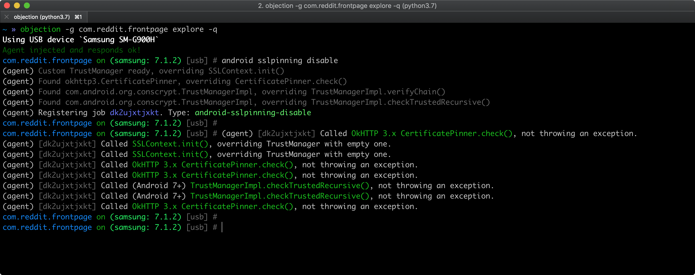

# Android のネットワーク通信

ほとんどすべての Android アプリは一つ以上のリモートサービスのクライアントとして動作します。このネットワーク通信は一般的に公衆 Wi-Fi などの信頼できないネットワーク上で行われるため、従来のネットワークベースの攻撃が潜在的な問題になります。

最近のモバイルアプリの多くはさまざまな HTTP ベースのウェブサービスを使用しています。これらのプロトコルは十分に文書化されており、サポートされているからです。

## 概要

### Android Network Security Configuration

Android 7.0 (API レベル 24) 以降、Android アプリはいわゆる [Network Security Configuration](https://developer.android.com/training/articles/security-config) 機能を使用して、ネットワークセキュリティ設定をカスタマイズできます。これは以下の主要な機能を提供します。

- **クリアテキストトラフィック**: クリアテキストトラフィックの偶発的な使用からアプリを保護します (またはそれを有効にします) 。
- **カスタムトラストアンカー**: アプリのセキュア接続のために信頼する認証局 (Certificate Authority, CA) をカスタマイズできます。たとえば、特定の自己署名証明書を信頼したり、アプリが信頼するパブリック CA のセットを制限します。
- **証明書ピンニング**: アプリのセキュア接続を特定の証明書に制限します。
- **デバッグのみのオーバーライド**: インストールベースへの追加リスクなしに、アプリのセキュア接続を安全にデバッグします。

アプリがカスタム Network Security Configuration を定義している場合、AndroidManifest.xml ファイルの `android:networkSecurityConfig` を探すことでその場所を取得できます。

```xml
<application android:networkSecurityConfig="@xml/network_security_config"
```

この場合、ファイルは `@xml` (/res/xml と同じ) にあり、名前は "network_security_config" (異なることがあります) です。 "res/xml/network_security_config.xml" として見つけることができるはずです。コンフィグレーションが存在する場合、 [システムログ](0x05b-Basic-Security_Testing.md#monitoring-system-logs) に以下のイベントが表示されるはずです。

```bash
D/NetworkSecurityConfig: Using Network Security Config from resource network_security_config
```

Network Security Configuration は [XML ベース](https://developer.android.com/training/articles/security-config#FileFormat) で、アプリ全体とドメイン固有の設定を構成するために使用できます。

- `base-config` はアプリが確立しようとするすべての接続に適用されます。
- `domain-config` は特定のドメインに対して `base-config` をオーバーライドします (複数の `domain` エントリを含めることができます) 。

たとえば、以下のコンフィグレーションでは `base-config` を使用して、すべてのドメインに対してクリアテキストトラフィックを禁止しています。しかし `domain-config` を使用してそのルールをオーバーライドし、`localhost` に対するクリアテキストトラフィックを明示的に許可しています。

```xml
<?xml version="1.0" encoding="utf-8"?>
<network-security-config>
    <base-config cleartextTrafficPermitted="false" />
    <domain-config cleartextTrafficPermitted="true">
        <domain>localhost</domain>
    </domain-config>
</network-security-config>
```

さらに学ぶために:

- ["A Security Analyst’s Guide to Network Security Configuration in Android P"](https://www.nowsecure.com/blog/2018/08/15/a-security-analysts-guide-to-network-security-configuration-in-android-p/)
- [Android Developers - Network Security Configuration](https://developer.android.com/training/articles/security-config)
- [Android Codelab - Network Security Configuration](https://developer.android.com/codelabs/android-network-security-config)

#### デフォルトコンフィグレーション

Android 9 (API レベル 28) 以上を対象とするアプリのデフォルトコンフィグレーションは以下のとおりです。

```xml
<base-config cleartextTrafficPermitted="false">
    <trust-anchors>
        <certificates src="system" />
    </trust-anchors>
</base-config>
```

Android 7.0 (API レベル 24) から Android 8.1 (API レベル 27) を対象とするアプリのデフォルトコンフィグレーションは以下のとおりです。

```xml
<base-config cleartextTrafficPermitted="true">
    <trust-anchors>
        <certificates src="system" />
    </trust-anchors>
</base-config>
```

Android 6.0 (API レベル 23) 以下を対象とするアプリのデフォルトコンフィグレーションは以下のとおりです。

```xml
<base-config cleartextTrafficPermitted="true">
    <trust-anchors>
        <certificates src="system" />
        <certificates src="user" />
    </trust-anchors>
</base-config>
```

## ネットワーク上のデータ暗号化のテスト (MSTG-NETWORK-1)

### 静的解析

#### セキュアプロトコルでのネットワークリクエストのテスト

まず、ソースコード内のすべてのネットワークリクエストを特定し、プレーンな HTTP URL が使用されていないことを確認する必要があります。機密情報は [`HttpsURLConnection`](https://developer.android.com/reference/javax/net/ssl/HttpsURLConnection.html "HttpsURLConnection") または [`SSLSocket`](https://developer.android.com/reference/javax/net/ssl/SSLSocket.html "SSLSocket") (TLS を使用したソケットレベル通信用) を使用して、セキュアチャネル上で送信されていることを確認します。

#### ネットワーク API 使用箇所のテスト

次に、セキュアな接続を行うはずである低レベル API (`SSLSocket` など) を使用している場合でも、セキュアな実装が必要であることに注意してください。たとえば、`SSLSocket` はホスト名を検証 **しません** 。ホスト名を検証するには `getDefaultHostnameVerifier` を使用します。Android 開発者ドキュメントに [コード例](https://developer.android.com/training/articles/security-ssl.html#WarningsSslSocket "Warnings About Using SSLSocket Directly") があります。

#### クリアテキストトラフィックのテスト

次に、アプリがクリアテキスト HTTP トラフィックを許可していないことを確認する必要があります。Android 9 (API レベル 28) 以降、クリアテキスト HTTP トラフィックはデフォルトでブロックされます ([デフォルトの Network Security Configuration](#default-configurations) のおかげで) が、アプリケーションがクリアテキストを送信できる方法はまだいくつかあります。

- AndroidManifest.xml ファイルの `<application>` タグの [`android:usesCleartextTraffic`](https://developer.android.com/guide/topics/manifest/application-element#usesCleartextTraffic "Android documentation - usesCleartextTraffic flag") 属性を設定します。なお Network Security Configuration を設定している場合、このフラグは無視されることに注意してください。
- Network Security Configuration を設定して、 `<domain-config>` 要素の `cleartextTrafficPermitted` 属性を設定することでクリアテキストトラフィックを有効にします。
- 低レベル API ([`Socket`](https://developer.android.com/reference/java/net/Socket "Socket class") など) を使用して、カスタム HTTP 接続をセットアップします。
- クロスプラットフォームフレームワーク (Flutter, Xamarin など) を使用します。これらは一般的に HTTP ライブラリ用の独自の実装を持っているためです。

上記のすべてのケースは全体として慎重に分析する必要しなければなりません。たとえば、アプリが Android Manifest や Network Security Configuration でクリアテキストトラフィックを許可していなくても、実際にはまだ HTTP トラフィックを送信している可能性があります。低レベル API (Network Security Configuration が無視される) を使用している場合やクロスプラットフォームフレームワークが適切に設定されていない場合がそれにあたります。

詳細については記事 ["Security with HTTPS and SSL"](https://developer.android.com/training/articles/security-ssl.html) を参照してください。

### 動的解析

テスト対象アプリの送受信ネットワークトラフィックを傍受し、このトラフィックが暗号化されていることを確認します。以下のいずれかの方法でネットワークトラフィックを傍受できます。

- [OWASP ZAP](0x08a-Testing-Tools.md#owasp-zap) や [Burp Suite](0x08a-Testing-Tools.md#burp-suite) などの傍受プロキシですべての HTTP(S) と Websocket トラフィックをキャプチャし、すべてのリクエストが HTTP ではなく HTTPS を介して行われていることを確認します。
- Burp や OWASP ZAP などの傍受プロキシは HTTP(S) トラフィックのみを表示します。しかし、[Burp-non-HTTP-Extension](https://github.com/summitt/Burp-Non-HTTP-Extension "Burp-non-HTTP-Extension") などの Burp プラグインや [mitm-relay](https://github.com/jrmdev/mitm_relay "mitm-relay") というツールを使用して、XMPP やその他のプロトコルによる通信をデコードおよび可視化できます。

> アプリケーションによっては証明書ピンニングのため Burp や OWASP ZAP などのプロキシで動作しないことがあります。このようなシナリオでは、["カスタム証明書ストアおよび証明書ピンニングのテスト"](#testing-custom-certificate-stores-and-certificate-pinning-mstg-network-4) をチェックしてください。

詳細については以下を参照してください。

- "モバイルアプリのネットワーク通信" の章の ["ネットワーク層でのトラフィックの傍受"](0x04f-Testing-Network-Communication.md#intercepting-traffic-on-the-network-layer)
- "セキュリティテスト入門 (Android)" の章の ["ネットワークテスト環境のセットアップ"](0x05b-Basic-Security_Testing.md#setting-up-a-network-testing-environment)

## TLS 設定のテスト (MSTG-NETWORK-2)

詳しくは "モバイルアプリのネットワーク通信" の章の ["TLS 設定の検証"](0x04f-Testing-Network-Communication.md#verifying-the-tls-settings-mstg-network-2) セクションを参照してください。

## エンドポイント同一性検証のテスト (MSTG-NETWORK-3)

ネットワーク上で機密情報を転送するために TLS を使用することはセキュリティにとって不可欠です。しかし、モバイルアプリケーションとバックエンド API との間の通信を暗号化することは簡単ではありません。開発者は開発プロセスを容易にするために、よりシンプルではあるもののセキュアではない (任意の証明書を受け入れるなどの) ソリューションを選ぶことが多く、時にはこれらの脆弱なソリューションが [製品バージョンとなり](https://saschafahl.de/static/paper/androidssl2012.pdf "Hunting Down Broken SSL in Android Apps") 、潜在的にユーザーを [中間者攻撃](https://cwe.mitre.org/data/definitions/295.html "CWE-295: Improper Certificate Validation") に晒す可能性があります。

二つの主要な問題に対処する必要があります。

- 証明書が信頼できるソース、つまり信頼できる CA (Certificate Authority, 認証局) に由来することを検証します。
- エンドポイントサーバーが正しい証明書を提示するかどうかを判別します。

ホスト名と証明書自体が正しく検証されていることを確認します。事例と一般的な落とし穴が [Android の公式ドキュメント](https://developer.android.com/training/articles/security-ssl.html "Android Documentation - SSL") にあります。`TrustManager` および `HostnameVerifier` の使用例のコードを探します。下記のセクションには、あなたが探しているようなセキュアではない事例があります。

> Android 8.0 (API level 26) 以降、SSLv3 はサポートされなくなり、HttpsURLConnection はセキュアではない TLS/SSL プロトコルへのフォールバックを実行しないことに注意します。

### 静的解析

#### ターゲット SDK バージョンの検証

Android 7.0 (API レベル 24) 以降をターゲットとするアプリケーションでは **ユーザーが提供する CA を一切信頼しないデフォルトの Network Security Configuration** を使用し、悪意のある CA をインストールするようにユーザーを誘導して行われる MITM 攻撃の可能性を減らします。

[apktool を使用してアプリをデコード](0x05b-Basic-Security_Testing.md#exploring-the-app-package) して、apktool.yml の `targetSdkVersion` が `24` 以上であることを検証します。

```txt
grep targetSdkVersion UnCrackable-Level3/apktool.yml
  targetSdkVersion: '28'
```

ただし、`targetSdkVersion >=24` であっても、開発者は **アプリがユーザー提供の CA を信頼するように強制する** カスタムトラストアンカーを定義したカスタム Network Security Configuration を使用して、デフォルトの保護を無効にできます。 ["カスタムトラストアンカーの解析"](#analyzing-custom-trust-anchors) を参照してください。

#### カスタムトラストアンカーの解析

[Network Security Configuration](#android-network-security-configuration) ファイルを探して、 (避けるべき) `<certificates src="user">` を定義しているカスタム `<trust-anchors>` を検査します。

[エントリの優先順位](https://developer.android.com/training/articles/security-config#ConfigInheritance) を注意深く解析する必要があります。

- `<domain-config>` エントリや親の `<domain-config>` に値を設定していない場合、設定は `<base-config>` をもとにして行われます。
- このエントリが定義されていない場合、[デフォルト設定](#default-configurations) が使用されます。

Android 9 (API レベル 28) をターゲットとしたアプリの Network Security Configuration の例を見てみましょう。

```xml
<?xml version="1.0" encoding="utf-8"?>
<network-security-config>
    <domain-config>
        <domain includeSubdomains="false">owasp.org</domain>
        <trust-anchors>
            <certificates src="system" />
            <certificates src="user" />
        </trust-anchors>
    </domain-config>
</network-security-config>
```

以下のようなものが観察できます。

- `<base-config>` がありません。つまり Android 9 (API レベル 28) 以降では [デフォルト設定](#default-configurations) を他のすべての接続に使用します (原則的に `system` CA のみを信頼します) 。
- しかし、`<domain-config>` がデフォルト設定を上書きし、指定された `<domain>` (owasp.org) に対して `system` と `user` の両方の CA をアプリが信頼するようにしています。
- `includeSubdomains="false"` のため、サブドメインには影響しません。

すべてをまとめると上記の Network Security Configuration は次のように _翻訳_ できます。「このアプリはサブドメインを除く owasp.org ドメインに対してシステム CA とユーザー CA を信頼します。他のドメインではこのアプリはシステム CA のみを信頼します。」

#### サーバー証明書の検証

`TrustManager` は Android で信頼できる接続を確立するために必要な条件を検証する手段です。この点について以下の条件を確認する必要があります。

- 証明書は信頼できる CA により署名されていますか
- 証明書は有効期限切れではありませんか
- 証明書は自己署名されていませんか

以下のコードスニペットは開発中に使用されることがあり、`checkClientTrusted`, `checkServerTrusted`, `getAcceptedIssuers` 関数を上書きして、任意の証明書を受け入れます。そのような実装は避けるべきであり、必要であれば、セキュリティ上の欠陥が組み込まれることを避けるために、それらを製品ビルドから明確に分離する必要があります。

```java
TrustManager[] trustAllCerts = new TrustManager[] {
    new X509TrustManager() {
        @Override
        public X509Certificate[] getAcceptedIssuers() {
            return new java.security.cert.X509Certificate[] {};
        }

        @Override
        public void checkClientTrusted(X509Certificate[] chain, String authType)
            throws CertificateException {
        }

        @Override
        public void checkServerTrusted(X509Certificate[] chain, String authType)
            throws CertificateException {
        }
    }
 };

// SSLContext context
context.init(null, trustAllCerts, new SecureRandom());
```

#### WebView サーバー証明書検証

場合によってアプリケーションは WebView を使用して、アプリケーションに関連付けられたウェブサイトを表示します。これはアプリケーションのやり取りに内部 WebView を使用する Apache Cordova などの HTML/JavaScript ベースのフレームワークに当てはまります。WebView を使用すると、モバイルブラウザがサーバー証明書の検証を実行します。WebView がリモートウェブサイトに接続しようとしたときに発生する TLS エラーを無視するのはバッドプラクティスです。

以下のコードは TLS の問題を無視しています。WebView を提供する WebViewClient のカスタム実装と同様です。

```java
WebView myWebView = (WebView) findViewById(R.id.webview);
myWebView.setWebViewClient(new WebViewClient(){
    @Override
    public void onReceivedSslError(WebView view, SslErrorHandler handler, SslError error) {
        //Ignore TLS certificate errors and instruct the WebViewClient to load the website
        handler.proceed();
    }
});
```

#### Apache Cordova 証明書検証

アプリケーションマニフェストで `android:debuggable` フラグが有効になっている場合、Apache Cordova フレームワークの内部 WebView 使用の実装は `onReceivedSslError` メソッドの [TLS エラー](https://github.com/apache/cordova-android/blob/master/framework/src/org/apache/cordova/engine/SystemWebViewClient.java "TLS errors ignoring by Apache Cordova in WebView") を無視します。したがって、アプリがデバッグ可能ではないことを確認します。テストケース「アプリがデバッグ可能かどうかのテスト」を参照してください。

#### ホスト名検証

クライアントサイドの TLS 実装におけるもう一つのセキュリティ上の欠陥はホスト名検証の欠如です。開発環境では通常有効なドメイン名ではなく内部アドレスを使用するため、開発者はホスト名検証を無効化 (またはアプリケーションに任意のホスト名を許可するよう強制) したり、アプリケーションを実稼働環境に移行する際に変更することを忘れたりします。以下のコードはホスト名検証を無効化します。

```java
final static HostnameVerifier NO_VERIFY = new HostnameVerifier() {
    public boolean verify(String hostname, SSLSession session) {
        return true;
    }
};
```

組み込みの `HostnameVerifier` を使うことで、任意のホスト名を受け入れることが可能です。

```java
HostnameVerifier NO_VERIFY = org.apache.http.conn.ssl.SSLSocketFactory
                             .ALLOW_ALL_HOSTNAME_VERIFIER;
```

信頼できる接続を設定する前にアプリケーションがホスト名を検証していることを確認します。

### 動的解析

Android 7.0 (API レベル 24) 以降をターゲットとするアプリをテストする場合、事実上 Network Security Configuration が適用されているはずであり、HTTPS トラフィックを復号してみることはまずできないはずです。しかし、API レベル 24 未満のアプリをターゲットとしている場合、アプリはインストールされているユーザー証明書を自動的に受け入れます。

不適切な証明書検証をテストするには Burp などの傍受プロキシを使用して MITM 攻撃を行います。以下のオプションを試してください。

- **自己署名証明書:**
  1. Burp で、**Proxy** タブに移動し、**Options** タブを選択します。
  2. **Proxy Listeners** セクションに移動し、listener をハイライトして、**Edit** をクリックします。
  3. **Certificate** タブに移動し、**Use a self-signed certificate** をチェックして、**Ok** をクリックします。
  4. アプリケーションを実行します。HTTPS トラフィックを見ることができる場合、アプリケーションは自己署名証明書を受け入れています。
- **信頼できない CA の証明書の受け入れ:**
  1. Burp で、**Proxy** タブに移動し、**Options** タブを選択します。
  2. **Proxy Listeners** セクションに移動し、listener をハイライトして、**Edit** をクリックします。
  3. **Certificate** タブに移動し、**Generate a CA-signed certificate with a specific hostname** をチェックして、バックエンドサーバーのホスト名を入力します。
  4. アプリケーションを実行します。HTTPS トラフィックを見ることができる場合、アプリケーションは信頼できない CA の証明書を受け入れています。
- **不正なホスト名の受け入れ:**
  1. Burp で、**Proxy** タブに移動し、**Options** タブを選択します。
  2. **Proxy Listeners** セクションに移動し、listener をハイライトして、**Edit** をクリックします。
  3. **Certificate** タブに移動し、**Generate a CA-signed certificate with a specific hostname** をチェックして、不正なホスト名、例えば example.org を入力します。
  4. アプリケーションを実行します。HTTPS トラフィックを見ることができる場合、アプリケーションはすべてのホスト名を受け入れています。

それでも HTTPS トラフィックを復号してみることができない場合には、アプリケーションが [証明書ピンニング](#testing-custom-certificate-stores-and-certificate-pinning-mstg-network-4) を実装している可能性があります。

## カスタム証明書ストアおよび証明書ピンニングのテスト (MSTG-NETWORK-4)

### 概要

このテストではアイデンティティピンニング (証明書または公開鍵ピンニング) を適切に実装しているかどうかを検証します。

詳細については "モバイルアプリのネットワーク通信" の章の ["同一性ピンニング (Identity Pinning)"](0x04f-Testing-Network-Communication.md#identity-pinning) のセクションを参照してください。

### 静的解析

#### Network Security Configuration での証明書ピンニング

[Network Security Configuration](#android-network-security-configuration) は特定のドメインに [宣言型証明書](https://developer.android.com/training/articles/security-config.html#CertificatePinning "Certificate Pinning using Network Security Configuration") をピン留めするためにも使用できます。対応する X.509 証明書の公開鍵 (`SubjectPublicKeyInfo`) のダイジェスト (ハッシュ) のセットを Network Security Configuration の `<pin-set>` で提供することによって行えます。

リモートエンドポイントへの接続を確立しようとする際、システムは以下を行います。

- 受信した証明書を取得して検証する。
- 公開鍵を抽出する。
- 抽出した公開鍵からダイジェストを計算する。
- ダイジェストをローカルピンのセットと比較する。

ピン留めされたダイジェストのうち少なくとも一つと一致すれば、証明書チェーンが有効であるとみなし、接続を続行します。

```xml
<?xml version="1.0" encoding="utf-8"?>
<network-security-config>
    <domain-config>
        Use certificate pinning for OWASP website access including sub domains
        <domain includeSubdomains="true">owasp.org</domain>
        <pin-set expiration="2018/8/10">
            <!-- Hash of the public key (SubjectPublicKeyInfo of the X.509 certificate) of
            the Intermediate CA of the OWASP website server certificate -->
            <pin digest="SHA-256">YLh1dUR9y6Kja30RrAn7JKnbQG/uEtLMkBgFF2Fuihg=</pin>
            <!-- Hash of the public key (SubjectPublicKeyInfo of the X.509 certificate) of
            the Root CA of the OWASP website server certificate -->
            <pin digest="SHA-256">Vjs8r4z+80wjNcr1YKepWQboSIRi63WsWXhIMN+eWys=</pin>
        </pin-set>
    </domain-config>
</network-security-config>
```

`<pin-set>` 要素に `expiration` の日付がないか調べます。有効期限が切れると、影響を受けるドメインでは証明書ピンニングが無効になります。

> **テストのヒント**: 証明書ピンニングバリデーションチェックが失敗した場合、以下のイベントが [システムログ](0x05b-Basic-Security_Testing.md#monitoring-system-logs) にログ記録されるはずです。

```bash
I/X509Util: Failed to validate the certificate chain, error: Pin verification failed
```

#### TrustManager

証明書ピンニングの実装には主に三つのステップがあります。

- 目的のホストの証明書を取得します。
- 証明書が .bks フォーマットであることを確認します。
- 証明書をデフォルトの Apache Httpclient のインスタンスにピン留めします。

証明書ピンニングの正しい実装を解析するには、HTTP クライアントがキーストアをロードする必要があります。

```java
InputStream in = resources.openRawResource(certificateRawResource);
keyStore = KeyStore.getInstance("BKS");
keyStore.load(resourceStream, password);
```

キーストアがロードされると、キーストアの CA を信頼する TrustManager を使用できます。

```java
String tmfAlgorithm = TrustManagerFactory.getDefaultAlgorithm();
TrustManagerFactory tmf = TrustManagerFactory.getInstance(tmfAlgorithm);
tmf.init(keyStore);
// Create an SSLContext that uses the TrustManager
// SSLContext context = SSLContext.getInstance("TLS");
sslContext.init(null, tmf.getTrustManagers(), null);
```

アプリの実装は証明書の公開鍵のみに対してピンニング、証明書全体に対して、証明書チェーン全体に対してとさまざまです。

#### ネットワークライブラリと WebView

サードパーティーネットワークライブラリを使用するアプリケーションはライブラリの証明書ピンニング機能を利用できます。例えば、[okhttp](https://github.com/square/okhttp/wiki/HTTPS "okhttp library") では `CertificatePinner` を使用して以下のようにセットアップできます。

```java
OkHttpClient client = new OkHttpClient.Builder()
        .certificatePinner(new CertificatePinner.Builder()
            .add("example.com", "sha256/UwQAapahrjCOjYI3oLUx5AQxPBR02Jz6/E2pt0IeLXA=")
            .build())
        .build();
```

WebView コンポーネントを使用するアプリケーションは WebViewClient のイベントハンドラを利用して、ターゲットリソースがロードされる前に各リクエストの何かしらの「証明書ピンニング」を行います。以下のコードは検証例を示しています。

```java
WebView myWebView = (WebView) findViewById(R.id.webview);
myWebView.setWebViewClient(new WebViewClient(){
    private String expectedIssuerDN = "CN=Let's Encrypt Authority X3,O=Let's Encrypt,C=US;";

    @Override
    public void onLoadResource(WebView view, String url)  {
        //From Android API documentation about "WebView.getCertificate()":
        //Gets the SSL certificate for the main top-level page
        //or null if there is no certificate (the site is not secure).
        //
        //Available information on SslCertificate class are "Issuer DN", "Subject DN" and validity date helpers
        SslCertificate serverCert = view.getCertificate();
        if(serverCert != null){
            //apply either certificate or public key pinning comparison here
                //Throw exception to cancel resource loading...
            }
        }
    }
});
```

あるいは、設定されたピンで OkHttpClient を使用し、それを `WebViewClient` の `shouldInterceptRequest` をオーバーライドするプロキシとして機能させるのがよいでしょう。

#### Xamarin アプリケーション

Xamarin で開発されたアプリケーションは一般的に ServicePointManager を使用してピンニングを実装します。

通常、証明書をチェックする関数を作成し、ServerCertificateValidationCallback メソッドにブール値を返します。

```cs
[Activity(Label = "XamarinPinning", MainLauncher = true)]
    public class MainActivity : Activity
    {
        // SupportedPublicKey - 公開鍵の16進数値
        // GetPublicKeyString() メソッドを使用して、ピン留めしたい証明書の公開鍵を決定します。最初に ValidateServerCertificate 関数のデバッグコードのコメントを外して、ピン留めする値を決定します。
        private const string SupportedPublicKey = "3082010A02820101009CD30CF05AE52E47B7725D3783B..."; // Shortened for readability

        private static bool ValidateServerCertificate(
                object sender,
                X509Certificate certificate,
                X509Chain chain,
                SslPolicyErrors sslPolicyErrors
            )
        {
            //Log.Debug("Xamarin Pinning",chain.ChainElements[X].Certificate.GetPublicKeyString());
            //return true;
            return SupportedPublicKey == chain.ChainElements[1].Certificate.GetPublicKeyString();
        }

        protected override void OnCreate(Bundle savedInstanceState)
        {
            System.Net.ServicePointManager.ServerCertificateValidationCallback += ValidateServerCertificate;
            base.OnCreate(savedInstanceState);
            SetContentView(Resource.Layout.Main);
            TesteAsync("https://security.claudio.pt");

        }
```

この例では証明書チェーンの中間 CA をピンニングしています。HTTP レスポンスの出力はシステムログにあります。

前述の例のサンプル Xamarin アプリは [MSTG リポジトリ](https://github.com/OWASP/owasp-mstg/raw/master/Samples/Android/02_CertificatePinning/certificatePinningXamarin.apk "Xamarin app with certificate pinning") から入手できます。

APK ファイルを展開した後、dotPeak, ILSpy, dnSpy などの .NET 逆コンパイラを使用して、'Assemblies' フォルダ内に格納されているアプリ dll を逆コンパイルし、ServicePointManager の使用状況を確認します。

#### Cordova アプリケーション

Cordova ベースのハイブリッドアプリケーションはネイティブに証明書ピンニングをサポートしていないため、プラグインを使用してこれを達成します。もっとも一般的なものは PhoneGap SSL Certificate Checker です。`check` メソッドを使用してフィンガープリントを確認し、コールバックが次のステップを決定します。

```javascript
  // Endpoint to verify against certiticate pinning.
  var server = "https://www.owasp.org";
  // SHA256 Fingerprint (Can be obtained via "openssl s_client -connect hostname:443 | openssl x509 -noout -fingerprint -sha256"
  var fingerprint = "D8 EF 3C DF 7E F6 44 BA 04 EC D5 97 14 BB 00 4A 7A F5 26 63 53 87 4E 76 67 77 F0 F4 CC ED 67 B9";

  window.plugins.sslCertificateChecker.check(
          successCallback,
          errorCallback,
          server,
          fingerprint);

   function successCallback(message) {
     alert(message);
     // Message is always: CONNECTION_SECURE.
     // Now do something with the trusted server.
   }

   function errorCallback(message) {
     alert(message);
     if (message === "CONNECTION_NOT_SECURE") {
       // There is likely a man in the middle attack going on, be careful!
     } else if (message.indexOf("CONNECTION_FAILED") >- 1) {
       // There was no connection (yet). Internet may be down. Try again (a few times) after a little timeout.
     }
   }
```

APK ファイルを展開した後、Cordova/Phonegap ファイルは /assets/www フォルダに置かれます。'plugins' フォルダに使用するプラグインがあります。アプリケーションの JavaScript コードでこのメソッドを検索して、その使用状況を確認する必要があります。

### 動的解析

["エンドポイント同一性検証のテスト > 動的解析"](#testing-endpoint-identify-verification-mstg-network-3) の指示に従います。これを行ってもトラフィックがプロキシされない場合、証明書ピンニングが実際に実装され、すべてのセキュリティ対策が実施されていることを意味している可能性があります。すべてのドメインで同じことが起きているでしょうか？

簡単なスモークテストとしては、["証明書ピンニングのバイパス"](0x05b-Basic-Security_Testing.md#bypassing-certificate-pinning) で説明しているように [objection](0x08a-Testing-Tools.md#objection) を使用して証明書ピンニングをバイパスしてみることができます。 objection によってフックされているピンニング関連の API は objection の出力に表示されるはずです。



ただし、以下に注意してください。

- API は完全ではないかもしれません。
- 何もフックされていないとしても、必ずしもアプリがピンニングを実装していないとは限りません。

いずれの場合にも、アプリやそのコンポーネントの一部が [objection の対応](https://github.com/sensepost/objection/blob/master/agent/src/android/pinning.ts) の方法でカスタムピンニングを実装している可能性があります。具体的なピンニングの指標やより詳細なテストについては静的解析のセクションをご確認ください。

## セキュリティプロバイダのテスト (MSTG-NETWORK-6)

### 概要

Android はセキュリティプロバイダに依存して SSL/TLS ベースの接続を提供しています。この種のセキュリティプロバイダの問題 (一例では [OpenSSL](https://www.openssl.org/news/vulnerabilities.html "OpenSSL Vulnerabilities")) は、デバイスに付随するもので、多くの場合バグや脆弱性があります。
既知の脆弱性を回避するために、開発者はアプリケーションが適切なセキュリティプロバイダをインストールすることを確認する必要があります。
2016年7月11日以降、Google は脆弱なバージョンの OpenSSL を使用する [Play ストアのアプリケーション提出を拒否しています](https://support.google.com/faqs/answer/6376725?hl=en "How to address OpenSSL vulnerabilities in your apps") (新規アプリケーションおよび更新の両方) 。

### 静的解析

Android SDK をベースとするアプリケーションは GooglePlayServices に依存する必要があります。例えば、gradle ビルドファイルには、dependencies ブロックに `compile 'com.google.android.gms:play-services-gcm:x.x.x'` があります。`ProviderInstaller` クラスは `installIfNeeded` または `installIfNeededAsync` のどちらかで呼び出されていることを確認する必要があります。`ProviderInstaller` はできるだけ早期にアプリケーションのコンポーネントにより呼び出される必要があります。これらのメソッドによりスローされる例外は正しく捕捉および処理されるべきです。
アプリケーションがそのセキュリティプロバイダにパッチを適用することができない場合、そのセキュアではない状態の API を通知するかユーザー操作を制限します (すべての HTTPS トラフィックがこの状況ではより危険であるとみなすべきであるため) 。

SSL エクスプロイトを防ぐためにセキュリティプロバイダをアップデートする方法を示す二つの [Android 開発者ドキュメントの例](https://developer.android.com/training/articles/security-gms-provider.html "Updating Your Security Provider to Protect Against SSL Exploits") があります。どちらの場合でも、開発者は例外を適切に処理する必要があり、アプリケーションがパッチを適用されていないセキュリティプロバイダで動作している場合にはバックエンドに報告することが賢明かもしれません。

同期的なパッチ適用:

```java
//this is a sync adapter that runs in the background, so you can run the synchronous patching.
public class SyncAdapter extends AbstractThreadedSyncAdapter {

  ...

  // This is called each time a sync is attempted; this is okay, since the
  // overhead is negligible if the security provider is up-to-date.
  @Override
  public void onPerformSync(Account account, Bundle extras, String authority,
      ContentProviderClient provider, SyncResult syncResult) {
    try {
      ProviderInstaller.installIfNeeded(getContext());
    } catch (GooglePlayServicesRepairableException e) {

      // Indicates that Google Play services is out of date, disabled, etc.

      // Prompt the user to install/update/enable Google Play services.
      GooglePlayServicesUtil.showErrorNotification(
          e.getConnectionStatusCode(), getContext());

      // Notify the SyncManager that a soft error occurred.
      syncResult.stats.numIOExceptions++;
      return;

    } catch (GooglePlayServicesNotAvailableException e) {
      // Indicates a non-recoverable error; the ProviderInstaller is not able
      // to install an up-to-date Provider.

      // Notify the SyncManager that a hard error occurred.
      //in this case: make sure that you inform your API of it.
      syncResult.stats.numAuthExceptions++;
      return;
    }

    // If this is reached, you know that the provider was already up-to-date,
    // or was successfully updated.
  }
}
```

非同期的なパッチ適用:

```java
//This is the mainactivity/first activity of the application that's there long enough to make the async installing of the securityprovider work.
public class MainActivity extends Activity
    implements ProviderInstaller.ProviderInstallListener {

  private static final int ERROR_DIALOG_REQUEST_CODE = 1;

  private boolean mRetryProviderInstall;

  //Update the security provider when the activity is created.
  @Override
  protected void onCreate(Bundle savedInstanceState) {
    super.onCreate(savedInstanceState);
    ProviderInstaller.installIfNeededAsync(this, this);
  }

  /**
   * This method is only called if the provider is successfully updated
   * (or is already up-to-date).
   */
  @Override
  protected void onProviderInstalled() {
    // Provider is up-to-date, app can make secure network calls.
  }

  /**
   * This method is called if updating fails; the error code indicates
   * whether the error is recoverable.
   */
  @Override
  protected void onProviderInstallFailed(int errorCode, Intent recoveryIntent) {
    if (GooglePlayServicesUtil.isUserRecoverableError(errorCode)) {
      // Recoverable error. Show a dialog prompting the user to
      // install/update/enable Google Play services.
      GooglePlayServicesUtil.showErrorDialogFragment(
          errorCode,
          this,
          ERROR_DIALOG_REQUEST_CODE,
          new DialogInterface.OnCancelListener() {
            @Override
            public void onCancel(DialogInterface dialog) {
              // The user chose not to take the recovery action
              onProviderInstallerNotAvailable();
            }
          });
    } else {
      // Google Play services is not available.
      onProviderInstallerNotAvailable();
    }
  }

  @Override
  protected void onActivityResult(int requestCode, int resultCode,
      Intent data) {
    super.onActivityResult(requestCode, resultCode, data);
    if (requestCode == ERROR_DIALOG_REQUEST_CODE) {
      // Adding a fragment via GooglePlayServicesUtil.showErrorDialogFragment
      // before the instance state is restored throws an error. So instead,
      // set a flag here, which will cause the fragment to delay until
      // onPostResume.
      mRetryProviderInstall = true;
    }
  }

  /**
   * On resume, check to see if we flagged that we need to reinstall the
   * provider.
   */
  @Override
  protected void onPostResume() {
    super.onPostResult();
    if (mRetryProviderInstall) {
      // We can now safely retry installation.
      ProviderInstall.installIfNeededAsync(this, this);
    }
    mRetryProviderInstall = false;
  }

  private void onProviderInstallerNotAvailable() {
    // This is reached if the provider cannot be updated for some reason.
    // App should consider all HTTP communication to be vulnerable, and take
    // appropriate action (e.g. inform backend, block certain high-risk actions, etc.).
  }
}

```

NDK ベースのアプリケーションは SSL/TLS 機能を提供する最新の正しくパッチ適用されたライブラリにのみバインドすることを確認します。

### 動的解析

ソースコードがある場合:

- デバッグモードでアプリケーションを実行し、アプリが最初にエンドポイントに接続するブレークポイントを作成します。
- 強調表示されたコードを右クリックし、`Evaluate Expression` を選択します。
- `Security.getProviders()` と入力し Enter キーを押します。
- プロバイダをチェックし `GmsCore_OpenSSL` を探してみます。これは新たにトップにリストアップされたプロバイダです。

ソースコードがない場合:

- Xposed を使用して `java.security` パッケージにフックし、`java.security.Security` の `getProviders` メソッド (引数なし) にフックします。戻り値は `Provider` の配列になります。
- 最初のプロバイダが `GmsCore_OpenSSL` であるかどうかを判断します。

## 参考情報

### OWASP MASVS

- MSTG-NETWORK-1: "データはネットワーク上でTLSを使用して暗号化されている。セキュアチャネルがアプリ全体を通して一貫して使用されている。"
- MSTG-NETWORK-2: "TLS 設定は現在のベストプラクティスと一致している。モバイルオペレーティングシステムが推奨される標準規格をサポートしていない場合には可能な限り近い状態である。"
- MSTG-NETWORK-3: "セキュアチャネルが確立されたときに、アプリはリモートエンドポイントのX.509証明書を検証している。信頼されたCAにより署名された証明書のみが受け入れられている。"
- MSTG-NETWORK-4: "アプリは自身の証明書ストアを使用するか、エンドポイント証明書もしくは公開鍵をピンニングしている。信頼されたCAにより署名された場合でも、別の証明書や鍵を提供するエンドポイントとの接続を確立していない。"
- MSTG-NETWORK-6: "アプリは最新の接続ライブラリとセキュリティライブラリにのみ依存している。"

### Android 開発者ドキュメント

- Network Security Configuration - <https://developer.android.com/training/articles/security-config>
- Network Security Configuration (cached alternative) - <https://webcache.googleusercontent.com/search?q=cache:hOONLxvMTwYJ:https://developer.android.com/training/articles/security-config+&cd=10&hl=nl&ct=clnk&gl=nl>

### Xamarin 証明書ピンニング

- Certificate and Public Key Pinning with Xamarin - <https://thomasbandt.com/certificate-and-public-key-pinning-with-xamarin>
- ServicePointManager - <https://msdn.microsoft.com/en-us/library/system.net.servicepointmanager(v=vs.110).aspx>

### Cordova 証明書ピンニング

- PhoneGap SSL Certificate Checker plugin - <https://github.com/EddyVerbruggen/SSLCertificateChecker-PhoneGap-Plugin>
