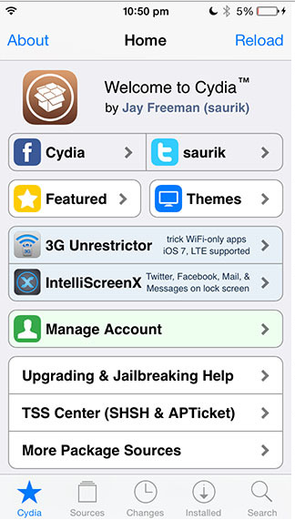
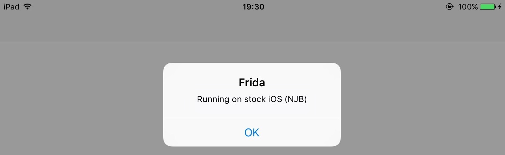

## セキュリティテスト入門 (iOS)

### Swift および Objective-C の紹介

このチュートリアルのほとんどは主に Objective-C で書かれたアプリケーションやブリッジされた Swift タイプのアプリケーションに関連しています。これらの言語は基本的に異なることに注意してください。Cycript で頻繁に使用されるメソッドスウィズルなどの機能は Swift メソッドでは機能しません。このテストガイドの執筆時には、Frida は Swift メソッドの計装をサポートしていません。

### テスト環境のセットアップ

**iOS テストラボの要件**

最小構成

- 管理者権限を持つラップトップ、Kali Linux を搭載した VirtualBox
- クライアントからクライアントへのトラフィックが許可された WiFi ネットワーク (USB を介した多重化も可能)
- Hopper 逆アセンブラ
- 少なくとも一つの脱獄済み iOS デバイス (必要な iOS バージョンのもの)
- Burp Suite ツール

推奨構成
- Xcode と開発者プロファイルありの MacBook
- 前述と同様の WiFi ネットワーク
- Hopper 逆アセンブラもしくは Hex Rays の IDA Pro
- 少なくとも二つの iOS デバイス、一つは脱獄済み、二つ目は脱獄なし
- Burp Suite ツール

### iOS の脱獄

iOS の世界では、脱獄は Apple のコード署名メカニズムを無効にして、Apple が署名していないアプリを実行できるにすることを意味します。iOS デバイスで何かしらの動的セキュリティテストを行う予定がある場合、最も有用なテストツールはアプリストア以外でのみ利用可能であるため、脱獄済みデバイスで作業がはるかに楽になります。

エクスプロイトチェーンと脱獄の間には重要な違いがあります。前者はコード署名や MAC などの iOS システム保護を無効にしますが、Cydia ストアはインストールしません。脱獄はエクスプロイトチェーンを活用し、システム保護を無効にして、Cydia をインストールする完全なツールです。

脱獄用語で、紐付きと紐なし脱獄手法についてお話しします。「紐付き」シナリオでは、脱獄は再起動前後で持続しないため、再起動するたびにデバイスをコンピュータに接続 (紐付き) して再適用する必要があります。「紐なし」脱獄は一度しか適用する必要がなく、エンドユーザーにとって最も人気のある選択となっています。

脱獄手法は iOS のバージョンによって異なります。最良の選択はあなたの iOS バージョンに対して一般的な脱獄が利用可能であるかどうかを確認することです <sup>[25]</sup> 。脱獄グループや著者に似たドメイン名で隠した、インターネットでしばしば配布されている偽ツールやスパイウェアに注意します。

**重要** iOS の脱獄に関する注意：Android とは異なり、あなたは下記の例外を除いて iOS バージョンをダウングレード **できません** 。当然ながら、iOS バージョンに大きなバンプがあり (9 から 10 など)、新しい OS に公開された脱獄が存在しないとき、これは問題を引き起こします。一つの可能な解決策は少なくとも二つの iOS デバイスを持つことです。一つは脱獄済みでテストに必要なすべてのツールを持ち、二つ目はすべての主要な iOS リリースごとに更新され、公開された脱獄がリリースされるまで待ちます。一旦公開された脱獄がリリースされると、Apple はパッチをリリースするのがかなり速いので、数日中に最新の iOS バージョンにアップグレードして脱獄する必要があります (アップグレードが必要な場合) 。
iOS のアップグレードプロセスはオンラインで実行され、チャレンジレスポンスプロセスに基づいています。チャレンジに対するレスポンスが Apple により署名されている場合にのみ、デバイスは OS インストールを実行します。これは研究者が「署名ウィンドウ」と呼ぶものです。iTunes 経由でダウンロードした OTA ファームウェアパッケージを保存していつでもデバイスにロードすることはできないという事実を説明しています。iOS のマイナーアップグレードでは、Apple により同時に二つのバージョンが署名されている可能性があります。これはiOS バージョンをダウングレードできる可能性のある唯一のケースです。このサイト <sup>[30]</sup> から現在の署名ウィンドウを確認し、OTA ファームウェアをダウンロードできます。脱獄の詳細については iPhone Wiki <sup>[26]</sup> を参照ください。

### テスト環境の準備



iOS デバイスを脱獄させて Cydia が (スクリーンショットと同様に) インストールされたら、以下の手順に従います。

1. Cydia から aptitude と openssh をインストールする
2. iDevice へ SSH する
  * 二つのユーザー `root` と `mobile` がある
  * デフォルトパスワードは `alpine` である
3. Cydia に次のリポジトリを追加する `https://build.frida.re`
4. Cydia から Frida をインストールする
5. aptitude で以下のパッケージをインストールする

```
inetutils 
syslogd 
less 
com.autopear.installipa 
class-dump 
com.ericasadun.utilities 
odcctools
cycript 
sqlite3 
adv-cmds 
bigbosshackertools
```

あなたのワークステーションには SSH クライアント、Hopper 逆アセンブラ、Burp、Frida がインストールされている必要があります。pip で Frida をインストールできます。

```
$ sudo pip install frida
```

#### USB 経由の SSH 接続

通常の動作と同様に、iTunes は <code>usbmux</code> を経由して iPhone と通信します。<code>usbmux</code> は一つの USB パイプで複数の「接続」を多重化するシステムです。このシステムは TCP のようなシステムを提供します。ホストマシン上の複数のプロセスがモバイルデバイス上の特定の番号付きポートへの接続を開きます。

*usbmux* は */System/Library/PrivateFrameworks/MobileDevice.framework/Resources/usbmuxd* により処理されます。USB を経由して iPhone 接続を監視するソケットデーモンです <sup>[18]</sup> 。これを使用して、モバイルデバイスのローカルホストソケットをホストマシンの TCP ポートに接続することができます。これによりネットワーク設定とは関係なくデバイスに SSH を使用できます。標準モードで動作している iPhone を検出すると、iPhone に接続して、*/var/run/usbmuxd* <sup>[27]</sup> 経由で受信したリクエストの中継を開始します。

MacOS

```
$ brew install libimobiledevice
$ iproxy 2222 22
$ ssh -p 2222 root@localhost
iPhone:~ root# 
```

Python クライアント

```bash
$ ./tcprelay.py -t 22:2222
$ ssh -p 2222 root@localhost
iPhone:~ root# 
```
iphonedevwiki <sup>[24]</sup> も参照ください。

### 一般的な iOS アプリケーションテストのワークフロー

iOS アプリケーションテストの一般的なワークフローは以下のとおりです。

1. IPA ファイルを入手する
2. 脱獄検出をバイパスする (存在する場合)
3. 証明書ピンニングをバイパスする (存在する場合)
4. HTTP(S) トラフィックを検査する - 通常の Web アプリテスト
5. ランタイム操作によりアプリケーションロジックを不正使用する
6. ローカルデータストレージ (キャッシュ、バイナリクッキー、plist、データベース) を確認する
7. クライアント固有のバグ SQLi や XSS などを確認する
8. その他の確認：NSLog を使用した ASL へのログ出力、アプリケーションのコンパイルオプション、アプリケーションのスクリーンショット、アプリのバックグラウンド化有無

### 静的解析

#### ソースコードあり

-- TODO [Add content on security Static Analysis of an iOS app with source code] --

#### ソースコードなし

##### フォルダ構造

システムアプリケーションは `/Applications` にあります。
残りについてはすべて、`installipa` を使用して適切なフォルダにナビゲートできます [14]

```
iOS8-jailbreak:~ root# installipa -l
me.scan.qrcodereader
iOS8-jailbreak:~ root# installipa -i me.scan.qrcodereader
Bundle: /private/var/mobile/Containers/Bundle/Application/09D08A0A-0BC5-423C-8CC3-FF9499E0B19C
Application: /private/var/mobile/Containers/Bundle/Application/09D08A0A-0BC5-423C-8CC3-FF9499E0B19C/QR Reader.app
Data: /private/var/mobile/Containers/Data/Application/297EEF1B-9CC5-463C-97F7-FB062C864E56
```

ご覧のとおり、Bundle, Application, Data の三つの主要なディレクトリがあります。Application ディレクトリは Bundle ディレクトリのサブディレクトリです。
静的インストーラファイルは Application にありますが、すべてのユーザーデータは Data ディレクトリにあります。
URI のランダムな文字列はアプリケーションの GUID であり、インストールするごとに異なります。

##### インストールされたアプリから IPA ファイルを取り戻す

###### 脱獄デバイスから

Saurik の IPA インストーラを使用して、デバイスにインストールされたアプリから IPA を復元することができます。これを行うには、Cydia 経由で IPA installer console [1] をインストールします。次に、デバイスに ssh 接続して、ターゲットアプリのバンドル ID を調べます。

~~~
iPhone:~ root# ipainstaller -l
com.apple.Pages
com.example.targetapp
com.google.ios.youtube
com.spotify.client
~~~

以下のコマンドを使用して、IPA ファイルを生成します。

~~~
iPhone:~ root# ipainstaller -b com.example.targetapp -o /tmp/example.ipa
~~~

###### 非脱獄デバイスから

アプリが iTunes で利用可能な場合は、以下の簡単な手順で MacOS の ipa を復元できます。

- iTunes でアプリをダウンロードする
- iTunes の Apps Library にアクセスする
- アプリを右クリックし、finder で表示を選択する

-- TODO [Further develop section on Static Analysis of an iOS app from non-jailbroken devices without source code] --

#### 復号された実行可能ファイルのダンプ

コード署名の上に、App Store 経由で配布されるアプリも Apple の FairPlay DRM システムを使用して保護されています。このシステムでは非対称暗号を使用して App Store から取得した任意のアプリ (フリーのアプリを含みます) が、実行が承認された特定のデバイスでのみ実行されることを保証します。復号鍵はデバイス固有のもので、プロセッサに焼き付けられています。今のところ、FairPlayで復号化されたアプリから復号化されたコードを取得する唯一の方法は、アプリの実行中にメモリからダンプすることです。脱獄済みデバイスでは、これは標準の Cydia リポジトリに含まれている Clutch ツールで行うことができます [2] 。インタラクティブモードでクラッチを使用して、インストールされているアプリのリストを取得し、復号して IPA ファイルにパックします。

~~~
# Clutch -i 
~~~

**注意：** AppStore で配布されているアプリケーションのみが FairPlay DRM で保護されています。Xcode から直接コンパイルおよびエクスポートしたアプリケーションを取得した場合、復号化する必要はありません。もっとも簡単な方法は、アプリケーションを Hopper にロードして、それが正しく逆アセンブルされるか確認することです。otool で確認することもできます。

~~~
# otool -l yourbinary | grep -A 4 LC_ENCRYPTION_INFO
~~~

出力に cryptoff, cryptsize, cryptid フィールドが含まれている場合、バイナリは暗号化されています。このコマンドの出力が空の場合、バイナリは暗号化されていないことを意味します。IPA ファイルではなく、バイナリに対して otool を使用することを **忘れないで** ください。

#### class-dump と Hopper 逆アセンブラで基本情報の取得

class-dump ツールはアプリケーション内のメソッドに関する情報を取得できます。以下の例では Damn Vulnerable iOS アプリケーション [12] を使用しています。私たちのバイナリはいわゆるファットバイナリであり、32ビットと64ビットのプラットフォームで実行できます。

```
$ unzip DamnVulnerableiOSApp.ipa

$ cd Payload/DamnVulnerableIOSApp.app

$ otool -hv DamnVulnerableIOSApp 

DamnVulnerableIOSApp (architecture armv7):
Mach header
      magic cputype cpusubtype  caps    filetype ncmds sizeofcmds      flags
   MH_MAGIC     ARM         V7  0x00     EXECUTE    38       4292   NOUNDEFS DYLDLINK TWOLEVEL WEAK_DEFINES BINDS_TO_WEAK PIE

DamnVulnerableIOSApp (architecture arm64):
Mach header
      magic cputype cpusubtype  caps    filetype ncmds sizeofcmds      flags
MH_MAGIC_64   ARM64        ALL  0x00     EXECUTE    38       4856   NOUNDEFS DYLDLINK TWOLEVEL WEAK_DEFINES BINDS_TO_WEAK PIE

```

32ビットである `armv7` と `arm64` のアーキテクチャに注意します。この設計によりすべてのデバイスに同じアプリケーションを配備できます。
class-dump でアプリケーションを解析するには、ひとつのアーキテクチャのみを含む、いわゆるシンバイナリを作成する必要があります。

```
iOS8-jailbreak:~ root# lipo -thin armv7 DamnVulnerableIOSApp -output DVIA32
```

それから class-dump の実行に進みます。

```
iOS8-jailbreak:~ root# class-dump DVIA32 

@interface FlurryUtil : ./DVIA/DVIA/DamnVulnerableIOSApp/DamnVulnerableIOSApp/YapDatabase/Extensions/Views/Internal/
{
}
+ (BOOL)appIsCracked;
+ (BOOL)deviceIsJailbroken;
```

プラス記号は BOOL 型を返すクラスメソッドを意味することに注意します。
マイナス記号は、これがインスタンスメソッドであることを意味します。両者の実際的な違いを理解するには、以降のセクションを参照ください。

あるいは、Hopper 逆アセンブラ [13] でアプリケーションを簡単に逆コンパイルすることもできます。これらのすべての手順は自動的に実行され、逆アセンブルされたバイナリやクラス情報が表示されます。

静的解析を実行する際の主な焦点は以下のとおりです。
* 脱獄検出と証明書ピンニングを担当する機能の特定と理解
  * 脱獄検出には、`jailbreak`, `jailbroken`, `cracked` などの単語を含むメソッドやクラスを探します。脱獄検出を実行する関数の名前は解析を鈍化させるために「難読化」されることがあります。最善の策は以降のセクションで説明されている脱獄検出メカニズムを探すことです (動的解析 - 脱獄検出を参照ください) 。
  * 証明書ピンニングには、`pinning`, `X509` などのキーワードや `NSURLSession`, `CFStream`, `AFNetworking` などのネイティブメソッドコールを探します。
* アプリケーションロジックとそれを回避する可能性のある方法の理解
* ハードコードされた資格情報、証明書
* 難読化に使用され、結果として機密情報が明らかになる可能性がある任意のメソッド

### 動的解析

-- TODO [Dynamic analysis - copying data files, logs, from device, etc.] --

#### コンソールログの監視

多くのアプリは有益な (そして潜在的に機密の) メッセージをコンソールログに記録します。それ以外にも、ログにはクラッシュレポートや潜在的に有益な情報が含まれています。コンソールログは Xcode の "Devices" ウィンドウで以下のように収集できます。

1. Xcode を起動する
2. デバイスをホストコンピュータに接続する
3. デバイスを Window メニューから選択する
4. Devices ウィンドウの左側のセクションで、接続している iOS デバイスをクリックする
5. 問題を再現する
6. Devices の右側のセクションの左下隅にあるボックストグルの三角形をクリックする
コンソールログの内容を開示するウィンドウ

コンソール出力をテキストファイルに保存するには、右下の下向き矢印がついた円をクリックします。


#### Dynamic Analysis On Jailbroken Devices

Life is easy with a jailbroken device: Not only do you gain easy access to the app's sandbox, you can also use more powerful dynamic analysis techniques due to the lack of code singing. On iOS, most dynamic analysis tools are built on top of Cydia Substrate, a framework for developing runtime patches that we will cover in more detail in the "Tampering and Reverse Engineering" chapter. For basic API monitoring purposes however, you can get away without knowing Substrate in detail - you can simply use existing tools built for this purpose.

##### Copying App Data Files

Files belonging to an app are stored app's data directory. To identify the correct path, ssh into the device and retrieve the package information using IPA Installer Console:

```bash
iPhone:~ root# ipainstaller -l 
sg.vp.UnCrackable-2
sg.vp.UnCrackable1

iPhone:~ root# ipainstaller -i sg.vp.UnCrackable1
Identifier: sg.vp.UnCrackable1
Version: 1
Short Version: 1.0
Name: UnCrackable1
Display Name: UnCrackable Level 1
Bundle: /private/var/mobile/Containers/Bundle/Application/A8BD91A9-3C81-4674-A790-AF8CDCA8A2F1
Application: /private/var/mobile/Containers/Bundle/Application/A8BD91A9-3C81-4674-A790-AF8CDCA8A2F1/UnCrackable Level 1.app
Data: /private/var/mobile/Containers/Data/Application/A8AE15EE-DC8B-4F1C-91A5-1FED35258D87
```

You can now simply archive the data directory and pull it from the device using scp.

```bash
iPhone:~ root# tar czvf /tmp/data.tgz /private/var/mobile/Containers/Data/Application/A8AE15EE-DC8B-4F1C-91A5-1FED35258D87
iPhone:~ root# exit
$ scp -P 2222 root@localhost:/tmp/data.tgz .
```

##### Dumping KeyChain Data

Keychain-Dumper [23] lets you dump the contents of the KeyChain on a jailbroken device. The easiest way of running the tool is to download the binary from its GitHub repo:

``` bash
$ git clone https://github.com/ptoomey3/Keychain-Dumper
$ scp -P 2222 Keychain-Dumper/keychain_dumper root@localhost:/tmp/
$ ssh -p 2222 root@localhost
iPhone:~ root# chmod +x /tmp/keychain_dumper
iPhone:~ root# /tmp/keychain_dumper 

(...)

Generic Password
----------------
Service: myApp
Account: key3
Entitlement Group: RUD9L355Y.sg.vantagepoint.example
Label: (null)
Generic Field: (null)
Keychain Data: SmJSWxEs

Generic Password
----------------
Service: myApp
Account: key7
Entitlement Group: RUD9L355Y.sg.vantagepoint.example
Label: (null)
Generic Field: (null)
Keychain Data: WOg1DfuH
```

Note however that this binary is signed with a self-signed certificate with a "wildcard" entitlement, granting access to *all* items in the Keychain - if you are paranoid, or have highly sensitive private data on your test device, you might want to build the tool from source and manually sign the appropriate entitlements into your build - instructions for doing this are available in the Github repository.

##### Security Profiling with Introspy

Intospy <sup>[31]</sup> is an open-source security profiler for iOS released by iSecPartners. Built on top of substrate, it can be used to log security-sensitive API calls on a jailbroken device.  The recorded API calls sent to the console and written to a database file, which can then be converted into an HTML report using Introspy-Analyzer <code>[32]</code>.

-- TODO [Write an IntroSpy howto] --

#### 非脱獄デバイス上での動的解析

If you don't have access to a jailbroken device, you can patch and repackage the target app to load a dynamic library at startup. This way, you can instrument the app and can do pretty much everything you need for a dynamical analysis (of course, you can't break out of the sandbox that way, but you usually don't need to). This technique however works only on if the app binary isn't FairPlay-encrypted (i.e. obtained from the app store).

Thanks to Apple's confusing provisioning and code signing system, re-signing an app is more challenging than one would expect. iOS will refuse to run an app unless you get the provisioning profile and code signature header absolutely right. This requires you to learn about a whole lot of concepts - different types of certificates, BundleIDs, application IDs, team identifiers, and how they are tied together using Apple's build tools. Suffice it to say, getting the OS to run a particular binary that hasn't been built using the default way (XCode) can be an daunting process.

The toolset we're going to use consists of optool, Apple's build tools and some shell commands. Our method is inspired by the resign script from Vincent Tan's Swizzler project [4]. An alternative way of repackaging using different tools was described by NCC group [5].

To reproduce the steps listed below, download "UnCrackable iOS App Level 1" from the OWASP Mobile Testing Guide repo [6]. Our goal is to make the UnCrackable app load FridaGadget.dylib during startup so we can instrument it using Frida. 

##### 開発用プロビジョニングプロファイルと証明書の取得

The *provisioning profile* is a plist file signed by Apple that whitelists your code signing certificate on one or multiple devices. In other words, this is Apple explicitly allowing your app to run in certain contexts, such as debugging on selected devices (development profile). The provisioning profile also includes the *entitlements* granted to your app. The *certificate* contains the private key you'll use to do the actual signing.

Depending on whether you're registered as an iOS developer, you can use one of the following two ways to obtain a certificate and provisioning profile.

**With an iOS developer account:**

If you have developed and deployed apps iOS using Xcode before, you'll already have your own code signing certificate installed. Use the *security* tool to list your existing signing identities:

~~~
$ security find-identity -p codesigning -v
  1) 61FA3547E0AF42A11E233F6A2B255E6B6AF262CE "iPhone Distribution: Vantage Point Security Pte. Ltd."
  2) 8004380F331DCA22CC1B47FB1A805890AE41C938 "iPhone Developer: Bernhard Müller (RV852WND79)"
~~~

Log into the Apple Developer portal to issue a new App ID, then issue and download the profile [8]. The App ID can be anything - you can use the same App ID for re-signing multiple apps. Make sure you create a *development* profile and not a *distribution* profile, as you'll want to be able to debug the app.

In the examples below I'm using my own signing identity which is associated with my company's development team. I created the app-id "sg.vp.repackaged", as well as a provisioning profile aptly named "AwesomeRepackaging" for this purpose, and ended up with the file AwesomeRepackaging.mobileprovision - exchange this with your own filename in the shell commands below.

**With a regular iTunes account:**

Mercifully, Apple will issue a free development provisioning profile even if you're not a paying developer. You can obtain the profile with Xcode using your regular Apple account - simply build an empty iOS project and extract embedded.mobileprovision from the app container. The NCC blog explains this process in great detail [5].

Once you have obtained the provisioning profile, you can check its contents with the *security* tool. Besides the allowed certificates and devices, you'll find the entitlements granted to the app in the profile. You'll need those later for code signing, so extract them to a separate plist file as shown below. It is also worth having a look at the contents of the file to check if everything looks as expected.

~~~
$ security cms -D -i AwesomeRepackaging.mobileprovision > profile.plist
$ /usr/libexec/PlistBuddy -x -c 'Print :Entitlements' profile.plist > entitlements.plist
$ cat entitlements.plist
<?xml version="1.0" encoding="UTF-8"?>
<!DOCTYPE plist PUBLIC "-//Apple//DTD PLIST 1.0//EN" "http://www.apple.com/DTDs/PropertyList-1.0.dtd">
<plist version="1.0">
<dict>
	<key>application-identifier</key>
	<string>LRUD9L355Y.sg.vantagepoint.repackage</string>
	<key>com.apple.developer.team-identifier</key>
	<string>LRUD9L355Y</string>
	<key>get-task-allow</key>
	<true/>
	<key>keychain-access-groups</key>
	<array>
		<string>LRUD9L355Y.*</string>
	</array>
</dict>
</plist>
~~~

Note the application identitifier, which is a combination of the Team ID (LRUD9L355Y) and Bundle ID (sg.vantagepoint.repackage). This provisioning profile is only valid for the one app with this particular app id. The "get-task-allow" key is also important - when set to "true", other processes, such as the debugging server, are allowed to attach to the app (consequently, this would be set to "false" in a distribution profile).

##### その他の準備

To make our app load an additional library at startup we need some way of inserting an additional load command into the Mach-O header of the main executable. Optool [3] can be used to automate this process:

~~~
$ git clone https://github.com/alexzielenski/optool.git
$ cd optool/
$ git submodule update --init --recursive
~~~

We'll also use ios-deploy [10], a tools that enables deploying and debugging of iOS apps without using Xcode:

~~~
git clone https://github.com/alexzielenski/optool.git
cd optool/
git submodule update --init --recursive
~~~

To follow the examples below, you also need FridaGadget.dylib:

~~~
$ curl -O https://build.frida.re/frida/ios/lib/FridaGadget.dylib
~~~

Besides the tools listed above, we'll be using standard tools that come with OS X and Xcode (make sure you have the Xcode command line developer tools installed).

##### パッチ適用、再パッケージ化、再署名

Time to get serious! As you already now, IPA files are actually ZIP archives, so use any zip tool to unpack the archive. Then, copy FridaGadget.dylib into the app directory, and add a load command to the "UnCrackable Level 1" binary using optool.

~~~
$ unzip UnCrackable_Level1.ipa
$ cp FridaGadget.dylib Payload/UnCrackable\ Level\ 1.app/
$ optool install -c load -p "@executable_path/FridaGadget.dylib" -t Payload/UnCrackable\ Level\ 1.app/UnCrackable\ Level\ 1
Found FAT Header
Found thin header...
Found thin header...
Inserting a LC_LOAD_DYLIB command for architecture: arm
Successfully inserted a LC_LOAD_DYLIB command for arm
Inserting a LC_LOAD_DYLIB command for architecture: arm64
Successfully inserted a LC_LOAD_DYLIB command for arm64
Writing executable to Payload/UnCrackable Level 1.app/UnCrackable Level 1...
~~~

Such blatant tampering of course invalidates the code signature of the main executable, so this won't run on a non-jailbroken device. You'll need to replace the provisioning profile and sign both the main executable and FridaGadget.dylib with the certificate listed in the profile.

First, let's add our own provisioning profile to the package:

~~~
$ cp AwesomeRepackaging.mobileprovision Payload/UnCrackable\ Level\ 1.app/embedded.mobileprovision
~~~

Next, we need to make sure that the BundleID in Info.plist matches the one specified in the profile. The reason for this is that the "codesign" tool will read the Bundle ID from Info.plist during signing - a wrong value will lead to an invalid signature.

~~~
$ /usr/libexec/PlistBuddy -c "Set :CFBundleIdentifier sg.vantagepoint.repackage" Payload/UnCrackable\ Level\ 1.app/Info.plist
~~~

Finally, we use the codesign tool to re-sign both binaries:

~~~
$ rm -rf Payload/F/_CodeSignature
$ /usr/bin/codesign --force --sign 8004380F331DCA22CC1B47FB1A805890AE41C938  Payload/UnCrackable\ Level\ 1.app/FridaGadget.dylib
Payload/UnCrackable Level 1.app/FridaGadget.dylib: replacing existing signature
$ /usr/bin/codesign --force --sign 8004380F331DCA22CC1B47FB1A805890AE41C938 --entitlements entitlements.plist Payload/UnCrackable\ Level\ 1.app/UnCrackable\ Level\ 1
Payload/UnCrackable Level 1.app/UnCrackable Level 1: replacing existing signature
~~~

##### アプリのインストールと実行

Now you should be all set for running the modified app. Deploy and run the app on the device as follows.

~~~
$ ios-deploy --debug --bundle Payload/UnCrackable\ Level\ 1.app/
~~~

If everything went well, the app should launch on the device in debugging mode with lldb attached. Frida should now be able to attach to the app as well. You can verify this with the frida-ps command:
 
~~~
$ frida-ps -U
PID  Name
---  ------
499  Gadget
~~~



##### トラブルシューティング

If something goes wrong (which it usually does), mismatches between the provisioning profile and code signing header are the most likely suspect. In that case it is helpful to read the official documentation and gaining an understanding of how the whole system works [7][8]. I also found Apple's entitlement troubleshooting page [9] to be a useful resource.

### Setting up Burp

Setting up burp to proxy your traffic through is pretty straightforward. It is assumed that you have both: iDevice and workstation connected to the same WiFi network where client to client traffic is permitted. If client-to-client traffic is not permitted, it should be possible to use usbmuxd [18] in order to connect to burp through USB. 

The first step is to configure proxy of your burp to listen on all interfaces (alternatively only on the WiFi interface). Then we can configure our iDevice to use our proxy in advanced wifi settings. Portswigger provides good tutorial on setting an iOS Device and Burp [22].

### Bypassing Certificate Pinning

Certificate Pinning is a practice used to tighten security of TLS connection. When an application is connecting to the server using TLS, it checks if the server's certificate is signed with trusted CA's private key. The verification is based on checking the signature with public key that is within device's key store. This in turn contains public keys of all trusted root CAs.

Certificate pinning means that our application will have server's certificate or hash of the certificate hardcoded into the source code. 
This protects against two main attack scenarios:

* Compromised CA issuing certificate for our domain to a third-party
* Phishing attacks that would add a third-party root CA to device's trust store

The simplest method is to use `SSL Kill Switch` (can be installed via Cydia store), which will hook on all high-level API calls and bypass certificate pinning. There are some cases, though, where certificate pinning is more tricky to bypass. Things to look for when you try to bypass certificate pinning are:

- following API calls: `NSURLSession`, `CFStream`, `AFNetworking`
- during static analysis, try to look for methods/strings containing words like 'pinning', 'X509', 'Certificate', etc.
- sometimes, more low-level verification can be done using e.g. openssl. There are tutorials [20] on how to bypass this. 
- some dual-stack applications written using Apache Cordova or Adobe Phonegap heavily use callbacks. You can look for the callback function called upon success and call it manually with Cycript
- sometimes the certificate resides as a file within application bundle. It might be sufficient to replace it with burp's certificate, but beware of certificate's SHA sum that might be hardcoded in the binary. In that case you must replace it too!

#### Recommendations

Certificate pinning is a good security practice and should be used for all applications handling sensitive information. 
EFF's Observatory<sup>[28]</sup> provides list of root and intermediate CAs that are by default trusted on major operating systems. Please also refer to a map of the 650-odd organizations that function as Certificate Authorities trusted (directly or indirectly) by Mozilla or Microsoft<sup>[29]</sup>. Use certificate pinning if you don't trust at least one of these CAs.

If you want to get more details on white-box testing and usual code patters, refer to iOS Application Security by David Thiel [21]. It contains description and code snippets of most-common techniques used to perform certificate pinning.

To get more information on testing transport security, please refer to section 'Testing Network Communication' 

### 参考情報

* [1] IPA Installer Console - http://cydia.saurik.com/package/com.autopear.installipa
* [2] Clutch - https://github.com/KJCracks/Clutch
* [3] Optool - https://github.com/alexzielenski/optool
* [4] Swizzler 2 - https://github.com/vtky/Swizzler2/wiki
* [5] iOS instrumentation without jailbreak - https://www.nccgroup.trust/au/about-us/newsroom-and-events/blogs/2016/october/ios-instrumentation-without-jailbreak/
* [6] Uncrackable Level 1 - https://github.com/OWASP/owasp-mstg/tree/master/OMTG-Files/02_Crackmes/02_iOS/UnCrackable_Level1
* [7] Maintaining Certificates - https://developer.apple.com/library/content/documentation/IDEs/Conceptual/AppDistributionGuide/MaintainingCertificates/MaintainingCertificates.html
* [8] Maintaining Provisioning Profiles - https://developer.apple.com/library/content/documentation/IDEs/Conceptual/AppDistributionGuide/MaintainingProfiles/MaintainingProfiles.html
* [9] Entitlements Troubleshooting - https://developer.apple.com/library/content/technotes/tn2415/_index.html
* [10] iOS-deploy - https://github.com/phonegap/ios-deploy
* [11] MacOS and iOS Internals, Volume III: Security & Insecurity - Johnathan Levin
* [12] Damn Vulnerable iOS Application - http://damnvulnerableiosapp.com/
* [13] Hopper Disassembler - https://www.hopperapp.com/
* [14] Introduction to iOS Application Security Testing - Slawomir Kosowski
* [15] The Mobile Application Hacker's Handbook -  Dominic Chell, Tyrone Erasmus, Shaun Colley
* [16] Cydia Substrate  - http://www.cydiasubstrate.com
* [17] Frida - http://frida.re
* [18] usbmuxd - https://github.com/libimobiledevice/usbmuxd
* [19] Jailbreak Detection Methods - https://www.trustwave.com/Resources/SpiderLabs-Blog/Jailbreak-Detection-Methods/
* [20] Bypassing OpenSSL Certificate Pinning -https://www.nccgroup.trust/us/about-us/newsroom-and-events/blog/2015/january/bypassing-openssl-certificate-pinning-in-ios-apps/ 
* [21] iOS Application Security - David Thiel
* [22] Configuring an iOS Device to Work With Burp - https://support.portswigger.net/customer/portal/articles/1841108-configuring-an-ios-device-to-work-with-burp
* [23] KeyChain-Dumper - https://github.com/ptoomey3/Keychain-Dumper/
* [24] iphonedevwiki - SSH over USB - http://iphonedevwiki.net/index.php/SSH_Over_USB
* [25] Can I Jailbreak? by IPSW Downloads - https://canijailbreak.com/
* [26] The iPhone Wiki - https://www.theiphonewiki.com/
* [27] The iPhone Wiki - https://www.theiphonewiki.com/wiki/Usbmux 
* [28] EFF's Observatory - https://www.eff.org/pl/observatory
* [29] Map of the 650-odd organizations that function as Certificate Authorities trusted (directly or indirectly) by Mozilla or Microsoft - https://www.eff.org/files/colour_map_of_CAs.pdf
* [30] IPSW Downloads - https://ipsw.me
* [31] IntroSpy - http://isecpartners.github.io/Introspy-iOS/
* [32] IntroSpy Analyzer - https://github.com/iSECPartners/Introspy-Analyzer
