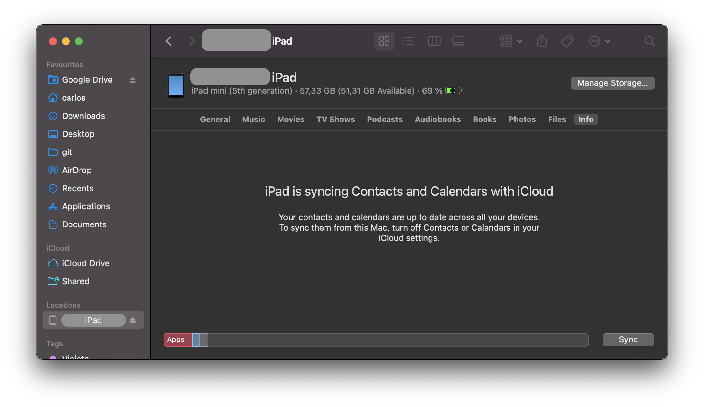
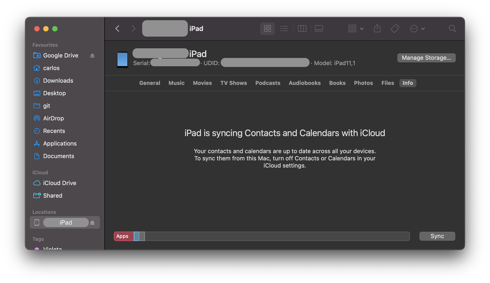

# iOS セキュリティテスト

この章では、セキュリティテスト環境のセットアップについて詳しく説明し、iOS アプリのセキュリティをテストするための実践的なプロセスとテクニックをいくつか紹介します。これらは MASTG テストケースの構成要素です。

## iOS テストのセットアップ

テストには Linux や Windows のホストコンピュータを使用できますが、これらのプラットフォームでは多くのタスクが困難か不可能であることが分かるでしょう。さらに、Xcode 開発環境と iOS SDK は macOS でのみ使用できます。つまり、ソースコード解析とデバッグには必ず macOS で作業する必要があることを意味します (ブラックボックステストも容易になります)。

### ホストデバイス

以下は最も基本的な iOS アプリのテストセットアップです。

- 理想的には管理権限を持つ macOS ホストコンピュータ。
- [Xcode](../tools/ios/MASTG-TOOL-0070.md) と [Xcode Command Line Tools](../tools/ios/MASTG-TOOL-0071.md) がインストールされていること。
- クライアント間のトラフィックを許可する Wi-Fi ネットワーク。
- 少なくとも一台の脱獄済み iOS デバイス (目的の iOS バージョンのもの)。
- [Burp Suite](../tools/network/MASTG-TOOL-0077.md) またはその他の傍受プロキシツール。

### iOS デバイスの UDID を取得する

UDID は iOS デバイスを特定するための 40 桁の一意の文字と数字の列です。macOS Catalina 以降では Finder アプリで iOS デバイスの UDID がわかります。iTunes は Catalina で利用できなくなりました。Finder を開き、サイドバーで接続されている iOS デバイスを選択します。



モデル、ストレージ容量、バッテリー情報を含むテキストをクリックすると、代わりにシリアル番号、UDID、モデルを表示します。



UDID を右コピーするとコピーできます。

また、デバイスが USB で接続されていると、macOS のさまざまなコマンドラインツールを介して UDID を取得することも可能です。

- [I/O Registry Explorer](https://developer.apple.com/library/archive/documentation/DeviceDrivers/Conceptual/IOKitFundamentals/TheRegistry/TheRegistry.html "I/O Registry Explorer") ツール `ioreg` を使用する:

    ```sh
    $ ioreg -p IOUSB -l | grep "USB Serial"
    |         "USB Serial Number" = "9e8ada44246cee813e2f8c1407520bf2f84849ec"
    ```

- [libimobiledevice スイート](../tools/ios/TASTG-TOOL-0126.md) を使用する:

    ```sh
    $ idevice_id -l
    316f01bd160932d2bf2f95f1f142bc29b1c62dbc
    ```

- system_profiler を使用する:

    ```sh
    $ system_profiler SPUSBDataType | sed -n -e '/iPad/,/Serial/p;/iPhone/,/Serial/p;/iPod/,/Serial/p' | grep "Serial Number:"
    2019-09-08 10:18:03.920 system_profiler[13251:1050356] SPUSBDevice: IOCreatePlugInInterfaceForService failed 0xe00002be
                Serial Number: 64655621de6ef5e56a874d63f1e1bdd14f7103b1
    ```

- instruments を使用する:

    ```sh
    instruments -s devices
    ```

### 実デバイス (脱獄済み) でのテスト

テストを実行するには脱獄済み iPhone または iPad が必要です。これらのデバイスは root アクセスとツールのインストールが可能になり、セキュリティテストプロセスがより簡単になります。脱獄済みデバイスにアクセスできない場合、この章で後述する次善策を適用できますが、より困難な状況になることを覚悟してください。

### iOS シミュレータでのテスト

実際の Android デバイスのハードウェアを完全にエミュレートする Android エミュレータとは異なり、iOS SDK シミュレータは iOS デバイスのより高いレベルの _シミュレーション_ を提供します。最も重要なのは、エミュレータバイナリが ARM コードではなく x86 コードにコンパイルされることです。実際のデバイス用にコンパイルされたアプリは実行しないため、シミュレータはブラックボックス解析やリバースエンジニアリングには役に立ちません。

### エミュレータでのテスト

[Corellium](../tools/generic/MASTG-TOOL-0108.md) は一般に入手可能な唯一の iOS エミュレータです。これは企業向けの SaaS ソリューションで、ユーザーごとのライセンスモデルとなっており、コミュニティライセンスを提供していません。

### 特権アクセスの取得

iOS の脱獄は Android のルート化とよく比較されますが、そのプロセスは実際にはまったく異なります。その違いを説明するために、まず Android の「ルート化」と「フラッシュ」の概念をおさらいしましょう。

- **ルート化**: これは一般的に `su` バイナリをシステムにインストールするか、システム全体をルート化済みのカスタム ROM に置き換えることを含みます。ブートローダーにアクセスできる限り、ルートアクセスを獲得するためにエクスプロイトは必要ありません。
- **カスタム ROM のフラッシュ**: ブートローダーをアンロックした後、デバイス上で動作している OS を置き換えることができます。ブートローダーをアンロックするにはエクスプロイトを必要とすることがあります。

iOS ブートローダーは Apple が署名したイメージの起動とフラッシュのみを許可しているため、iOS デバイスではカスタム ROM のフラッシュは不可能です。このため、公式の iOS イメージであっても Apple の署名がなければインストールできず、以前の iOS バージョンがまだ署名されていれば iOS をダウングレードできます。

脱獄の目的は iOS の保護 (特に Apple のコード署名メカニズム) を無効にして、任意の未署名コード (カスタムコードや、 [Cydia](../tools/ios/MASTG-TOOL-0047.md) や [Sileo](../tools/ios/MASTG-TOOL-0064.md) などの代替アプリストアからダウンロードしたものなど) をデバイス上で実行できるようにすることです。「脱獄」という言葉は無効化プロセスを自動化するオールインワンツールへの口語的な言及です。

特定の iOS バージョン向けに脱獄を開発することは容易ではありません。セキュリティテスト担当者としては一般に入手可能な脱獄ツールを使用したいと思うでしょう。やはり、さまざまなバージョンの iOS を脱獄するために使用されるテクニックを研究することをお勧めします。多くの興味深いエクスプロイトに遭遇し、OS の内部について多くのことを学ぶことでしょう。たとえば、iOS 9.x 向けの Pangu9 は [少なくとも五つの脆弱性を悪用しており](https://www.theiphonewiki.com/wiki/Jailbreak_Exploits "Jailbreak Exploits") 、use-after-free カーネルバグ (CVE-2015-6794) や写真アプリの任意のファイルシステムアクセスの脆弱性 (CVE-2015-7037) を含んでいます。

一部のアプリは実行している iOS デバイスが脱獄されているかどうかを検出することを試みます。これは脱獄が iOS のデフォルトのセキュリティメカニズムをいくつかを無効にするためです。しかし、これらの検出を回避する方法はいくつかあり、["iOS のアンチリバース防御"](0x06j-Testing-Resiliency-Against-Reverse-Engineering.md) の章で紹介しています。

#### 脱獄の利点

エンドユーザーは iOS システムの外観を調整したり、新しい機能を追加したり、非公式アプリストアからサードパーティアプリをインストールするために、デバイスを脱獄することがよくあります。しかし、セキュリティテスト担当者にとって、iOS デバイスを脱獄することにはさらに多くの利点があります。以下のものがありますが、それに限定されません。

- ファイルシステムへのルートアクセス。
- Apple によって署名されていないアプリケーション (多くのセキュリティツールを含む) を実行可能。
- 制限なしでのデバッグと動的解析。
- Objective-C や Swift ランタイムへのアクセス。

#### 脱獄の種類

_紐付き (tethered)_, _半紐付き (semi-tethered)_, _半紐なし (semi-untethered)_, _紐なし (untethered)_ 脱獄があります。

- 紐付き脱獄は再起動すると永続しないので、脱獄を再適用するには、再起動するごとにデバイスをコンピュータに接続 (tethered) する必要があります。コンピュータが接続されていないと、デバイスはまったく再起動しないかもしれません。

- 半紐付き脱獄は再起動時にデバイスがコンピュータに接続されていないと再適用できません。デバイスは単独で非脱獄モードで起動することもできます。

- 半紐なし脱獄はデバイス単独で起動できますが、コード署名を無効にするためのカーネルパッチ (またはユーザーランド改変) は自動的には適用されません。ユーザーはアプリを起動するかウェブサイトを訪問してデバイスを再脱獄しなければいけません (コンピュータへの接続を必要としないため、紐なし (untetherd) という用語が付けられています)。

- 紐なし脱獄はエンドユーザーにとって最も人気のある選択肢です。一度適用するだけで済み、その後は永続的に脱獄されるためです。

#### 注意事項と考慮事項

Apple が OS を強化し続けるにつれて、iOS の脱獄を開発することはますます複雑になっています。Apple が脆弱性を認識するたびに、パッチが適用され、システムアップデートがすべてのユーザーにプッシュされます。iOS の特定のバージョンにダウングレードすることはできず、Apple は最新の iOS バージョンへのアップデートのみを許可しているため、脱獄が利用可能な iOS のバージョンを実行しているデバイスを所有することは困難です。A12 までのすべての CPU の BootROM に影響を与える [checkm8 exploit](https://www.theiphonewiki.com/wiki/Checkm8_Exploit "Checkm8 exploit") のように、一部の脆弱性はソフトウェアではパッチできません。

セキュリティテストに使用する脱獄済みデバイスがある場合は、最新の iOS バージョンにアップグレードした後に再脱獄できることが 100% 確実でない限り、そのままにしておいてください。一台 (または複数台) の (iOS のメジャーリリースごとにアップデートされている) 予備デバイスを入手し、脱獄が公開されるまで待つことを検討してください。通常、Apple は脱獄が公開されるとすぐにパッチをリリースするため、影響を受ける iOS バージョンにダウングレードして脱獄を適用するには (Apple によってまだ署名されている場合) 数日しかありません。

iOS アップグレードはチャレンジレスポンスプロセス (結果としていわゆる SHSH blobs が生成されます) に基づいています。チャレンジに対するレスポンスが Apple によって署名されている場合のみ、デバイスは OS のインストールを許可します。これは研究者が「署名ウィンドウ」と呼ぶもので、ダウンロードした OTA ファームウェアパッケージを単純に保存して、いつでも好きなときにデバイスにロードすることができない理由です。iOS のマイナーアップグレード時に、二つのバージョン (最新バージョンと以前の iOS バージョン) が両方とも Apple によって署名されていることがあります。これは iOS デバイスをダウングレードできる唯一の状況です。現在の署名ウィンドウを確認して [IPSW Downloads ウェブサイト](https://ipsw.me "IPSW Downloads") から OTA ファームウェアをダウンロードできます。

デバイスや iOS バージョンによっては、署名ウィンドウがアクティブだったときにそのデバイスの SHSH blobs を収集していた場合、古いバージョンにダウングレードできます。この詳細については [cfw iOS Guide - Saving Blobs](https://ios.cfw.guide/saving-blobs/) を参照してください。

#### どの脱獄ツールを使用するか

iOS バージョンが異なれば、必要な脱獄テクニックも異なります。[お使いの iOS バージョンで利用可能な脱獄が公開されているかどうかを確認してください](https://appledb.dev/ "Apple DB") 。偽ツールやスパイウェアに注意してください。脱獄グループや製作者の名前に似たドメイン名の背後に隠れていることがよくあります。

iOS の脱獄シーンは急速に進化しているため、最新のインストラクションを提供することは困難です。しかし、現在信頼できる情報源をいくつか紹介できます。

- [AppleDB](https://appledb.dev/ "AppleDB")
- [The iPhone Wiki](https://www.theiphonewiki.com/ "The iPhone Wiki")
- [Redmond Pie](https://www.redmondpie.com/ "Redmone Pie")
- [Reddit Jailbreak](https://www.reddit.com/r/jailbreak/ "Reddit Jailbreak")

> デバイスに行ういかなる改変も、ご自身の責任で行ってください。脱獄は一般的に安全ですが、物事はうまくいかないことがあり、デバイスが文鎮化してしまうかもしれません。いかなる損害に対しても、あなた自身以外の第三者が責任を負うことはありません。
