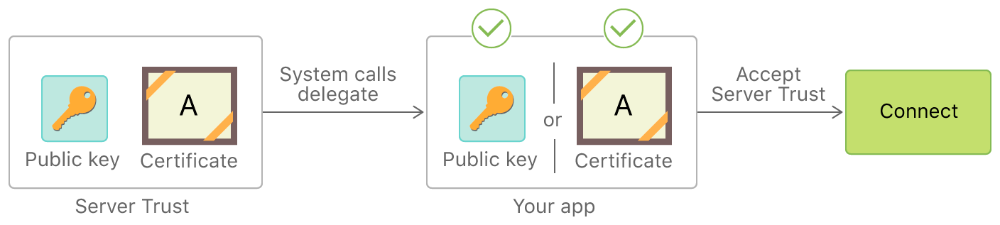

# iOS のネットワーク通信

ほぼすべての iOS アプリは一つ以上のリモートサービスのクライアントとして動作します。このネットワーク通信は一般的に公衆 Wi-Fi などの信頼できないネットワーク上で行われるため、従来のネットワークベースの攻撃が潜在的な問題になります。

最近のモバイルアプリの多くはさまざまな HTTP ベースのウェブサービスを使用しています。これらのプロトコルは十分に文書化されており、サポートされているからです。

## 概要

### iOS App Transport Security

iOS 9 以降、Apple は [App Transport Security (ATS)](https://developer.apple.com/documentation/bundleresources/information_property_list/nsapptransportsecurity) を導入しました。これは [URL Loading System](https://developer.apple.com/documentation/foundation/url_loading_system) を使用して行われる接続 (通常 `URLSession` 経由) に対して常に HTTPS を使うようにオペレーティングシステムが強制する一連のセキュリティチェックです。アプリは [Apple のベストプラクティス](https://developer.apple.com/news/?id=jxky8h89) に従って、適切に接続を保護すべきです。

> [Apple WWDC 2015 の ATS 紹介ビデオをご覧ください](https://developer.apple.com/videos/play/wwdc2015/711/?time=321) 。

ATS はデフォルトのサーバー信頼性評価を行い、最低限のセキュリティ要件を要求します。

**デフォルトのサーバー信頼性評価:**

アプリがリモートサーバーに接続する際、サーバーは X.509 デジタル証明書を使用してそのアイデンティティを提供します。ATS のデフォルトのサーバー信頼性評価には以下に示す証明書の妥当性確認も含まれています。

- 有効期限が切れていないこと。
- サーバーの DNS 名と一致する名前を持っていること。
- 有効な (改竄されていない) デジタル署名を持ち、[オペレーティングシステムの Trust Store](https://support.apple.com/en-us/HT209143) に含まれる信頼できる認証局 (Certificate Authority, CA) にさかのぼることができるか、ユーザーもしくはシステム管理者がクライアントにインストールしたものであること。

**接続に必要な最低限のセキュリティ要件:**

さらに ATS は以下に示す一連の [最低限のセキュリティ要件](https://developer.apple.com/documentation/security/preventing_insecure_network_connections#3138464) を満たさない接続をブロックします。

- TLS バージョン 1.2 以上。
- AES-128 または AES-256 でのデータ暗号化。
- 証明書は RSA 鍵 (2048 ビット以上)、ECC 鍵 (256 ビット以上) で署名されていなければならない。
- 証明書のフィンガープリントは SHA-256 以上を使用しなければならない。
- リンクは Elliptic Curve Diffie-Hellman Ephemeral (ECDHE) 鍵交換による Perfect Forward Secrecy (PFS) をサポートしなければならない。

**証明書の有効性チェック:**

[Apple によると](https://support.apple.com/en-gb/guide/security/sec100a75d12/web#sec8b087b1f7) 、「TLS 証明書の信頼ステータスの評価は RFC 5280 で規定されているように確立された業界標準に従って行われ、RFC 6962 (Certificate Transparency) などの新しい標準も取り入れられています。iOS 11 以降では、Apple デバイスは定期的に失効した証明書と制約のある証明書の最新リストで更新されます。このリストは Apple が信頼するビルトインの各ルート認証局およびその下位の CA 発行者が発行する証明書失効リスト (CRL) から集約されています。このリストには Apple の裁量で他の制約が含まれていることもあります。この情報はネットワーク API 関数を使用してセキュア接続を行う際に参照されます。CA から失効した証明書が多すぎて個別にリストアップできない場合、信頼性評価では代わりにオンライン証明書ステータス応答 (Online Certificate Status Response, OCSP) が必要となり、応答が得られない場合には信頼性評価は失敗します。」

#### ATS が適用されないのはどのような場合か？

- **低レベル API を使用する場合:** ATS は [URLSession](https://developer.apple.com/reference/foundation/urlsession) に含まれる [URL Loading System](https://developer.apple.com/documentation/foundation/url_loading_system) とその上にレイヤー化された API にのみ適用されます。低レベル API (BSD ソケットなど) を使用するアプリには適用されません。その低レベル API 上に TLS を実装しているものも同様です (アーカイブされた Apple Developer ドキュメントの ["Using ATS in Apple Frameworks"](https://developer.apple.com/library/archive/documentation/General/Reference/InfoPlistKeyReference/Articles/CocoaKeys.html#//apple_ref/doc/uid/TP40009251-SW55) セクションを参照してください) 。

- **IP アドレス、非修飾ドメイン名、ローカルホストに接続する場合:** ATS はパブリックホスト名に対して行われた接続にのみ適用されます (アーカイブされた Apple Developer ドキュメントの ["Availability of ATS for Remote and Local Connections"](https://developer.apple.com/library/archive/documentation/General/Reference/InfoPlistKeyReference/Articles/CocoaKeys.html#//apple_ref/doc/uid/TP40009251-SW54) セクションを参照してください) 。システムは以下に示す接続に対して ATS 保護を提供しません。

  - インターネットプロトコル (Internet Protocol, IP) アドレス
  - 非修飾ホスト名
  - .local トップレベルドメイン (Top-Level Domain, TLD) を使用するローカルホスト

- **ATS 例外を含む場合:** アプリが ATS 互換 API を使用する際、[ATS 例外](#ats-exceptions) を使用して特定のシナリオで ATS を無効にできます。

さらに学ぶために:

- ["ATS and iOS enterprise apps with private networks"](https://developer.apple.com/forums/thread/79662)
- ["ATS and local IP addresses"](https://developer.apple.com/forums/thread/66417)
- ["ATS impact on apps use 3rd party libraries"](https://developer.apple.com/forums/thread/69197)
- ["ATS and SSL pinning / own CA"](https://developer.apple.com/forums/thread/53314)

#### ATS 例外

ATS の制限は `Info.plist` ファイルの `NSAppTransportSecurity` キーに例外を設定することで無効にできます。これらの例外には以下を適用できます。

- セキュアではない接続 (HTTP) の許可
- 最小 TLS バージョンの引き下げ
- Perfect Forward Secrecy (PFS) の無効化
- ローカルドメインへの接続の許可

ATS 例外はグローバルまたはドメイン単位で適用できます。アプリケーションは ATS をグローバルに無効化できますが、個々のドメインをオプトインできます。Apple Developer ドキュメントの以下のリストでは [`NSAppTransportSecurity`](https://developer.apple.com/library/content/documentation/General/Reference/InfoPlistKeyReference/Articles/CocoaKeys.html#//apple_ref/doc/plist/info/NSAppTransportSecurity "API Reference NSAppTransportSecurity") Dictionary の構造を示しています。

```objectivec
NSAppTransportSecurity : Dictionary {
    NSAllowsArbitraryLoads : Boolean
    NSAllowsArbitraryLoadsForMedia : Boolean
    NSAllowsArbitraryLoadsInWebContent : Boolean
    NSAllowsLocalNetworking : Boolean
    NSExceptionDomains : Dictionary {
        <domain-name-string> : Dictionary {
            NSIncludesSubdomains : Boolean
            NSExceptionAllowsInsecureHTTPLoads : Boolean
            NSExceptionMinimumTLSVersion : String
            NSExceptionRequiresForwardSecrecy : Boolean   // Default value is YES
            NSRequiresCertificateTransparency : Boolean
        }
    }
}
```

出典: [Apple Developer Documentation](https://developer.apple.com/library/content/documentation/General/Reference/InfoPlistKeyReference/Articles/CocoaKeys.html "Information Property List Key Reference: Cocoa Keys").

以下の表はグローバル ATS 例外をまとめたものです。これらの例外の詳細については、[公式の Apple Developer ドキュメントの Table 2](https://developer.apple.com/library/content/documentation/General/Reference/InfoPlistKeyReference/Articles/CocoaKeys.html#//apple_ref/doc/uid/TP40009251-SW34 "App Transport Security dictionary primary keys") を参照してください。

| キー | 説明 |
| --------------| ------------|
| `NSAllowsArbitraryLoads` | `NSExceptionDomains` の下に指定された個々のドメインを除いてグローバルに ATS 制限を無効化する |
| `NSAllowsArbitraryLoadsInWebContent` | WebView から作成されたすべての接続に対して ATS 制限を無効化する |
| `NSAllowsLocalNetworking` | 非修飾ドメイン名と .local ドメインへの接続を許可する |
| `NSAllowsArbitraryLoadsForMedia` | AV Foundation フレームワークからロードされたメディアのすべての ATS 制限を無効化する |

以下の表はドメインごとの ATS 例外をまとめたものです。これらの例外の詳細については、[公式の Apple Developer ドキュメントの Table 3](https://developer.apple.com/library/content/documentation/General/Reference/InfoPlistKeyReference/Articles/CocoaKeys.html#//apple_ref/doc/uid/TP40009251-SW44 "App Transport Security dictionary primary keys") を参照してください。

| キー | 説明 |
| --------------| ------------|
| `NSIncludesSubdomains` | ATS 例外を名前付きドメインのサブドメインに適用すべきかどうかを示す |
| `NSExceptionAllowsInsecureHTTPLoads` | 名前付きドメインへの HTTP 接続を許可するが、TLS 要件には影響しない |
| `NSExceptionMinimumTLSVersion` | TLS バージョン 1.2 未満のサーバーへの接続を許可する |
| `NSExceptionRequiresForwardSecrecy` | Perfect Forward Secrecy (PFS) を無効化する |

**例外の正当性:**

2017年1月1日から Apple App Store レビューでは以下の ATS 例外の一つが定義されている場合に [正当な理由を要求](https://developer.apple.com/documentation/security/preventing_insecure_network_connections#3138036) します。

- `NSAllowsArbitraryLoads`
- `NSAllowsArbitraryLoadsForMedia`
- `NSAllowsArbitraryLoadsInWebContent`
- `NSExceptionAllowsInsecureHTTPLoads`
- `NSExceptionMinimumTLSVersion`

これはアプリが意図した目的の一部であるかどうかを判断して、慎重に修正しなければなりません。Apple はアプリのセキュリティを低下させる例外について警告し、ATS の障害に直面した場合には **必要な場合にのみ例外を設定し、サーバーの修正を優先する** ようにアドバイスしています。

**例:**

以下の例では、ATS はグローバルに有効 (グローバルな `NSAllowsArbitraryLoads` は定義されていない) ですが、 `example.com` ドメイン (とそのサブドメイン) に対して例外が **明示的に設定** されています。このドメインをアプリケーション開発者が所有し、適切な正当性があることを考慮すると、他のすべてのドメインに対して ATS のすべての利点を維持しているため、この例外は許容されるでしょう。しかし、上記のようにサーバーを修正することが常に望ましいと思われます。

```xml
<key>NSAppTransportSecurity</key>
<dict>
    <key>NSExceptionDomains</key>
    <dict>
        <key>example.com</key>
        <dict>
            <key>NSIncludesSubdomains</key>
            <true/>
            <key>NSExceptionMinimumTLSVersion</key>
            <string>TLSv1.2</string>
            <key>NSExceptionAllowsInsecureHTTPLoads</key>
            <true/>
            <key>NSExceptionRequiresForwardSecrecy</key>
            <true/>
        </dict>
    </dict>
</dict>
```

ATS 例外の詳細については [Apple Developer ドキュメント](https://developer.apple.com/documentation/security/preventing_insecure_network_connections#3138482) の記事 "Preventing Insecure Network Connections" のセクション "Configure Exceptions Only When Needed; Prefer Server Fixes" および [ATS に関するブログ投稿](https://www.nowsecure.com/blog/2017/08/31/security-analysts-guide-nsapptransportsecurity-nsallowsarbitraryloads-app-transport-security-ats-exceptions/ "A guide to ATS") を参照してください。

### iOS ネットワーク API

iOS 12.0 以降、[Network](https://developer.apple.com/documentation/network) フレームワークと [`URLSession`](https://developer.apple.com/documentation/foundation/urlsession) クラスはネットワークおよび URL リクエストを非同期および同期でロードするメソッドを提供します。古いバージョンの iOS では [Sockets API](https://developer.apple.com/library/archive/documentation/NetworkingInternet/Conceptual/NetworkingTopics/Articles/UsingSocketsandSocketStreams.html) を利用できます。

#### Network フレームワーク

`Network` フレームワークは 2018 年の [Apple Worldwide Developers Conference (WWDC)](https://developer.apple.com/videos/play/wwdc2018/715 "Introducing Network.framework: A modern alternative to Sockets") で紹介された、 Sockets API に代わるものです。この低レベルネットワークフレームワークは動的ネットワーク、セキュリティ、パフォーマンスのサポートが組み込まれたデータ送受信のためのクラスを提供します。

`Network` フレームワークでは引数 `using: .tls` が使用されている場合、デフォルトで TLS 1.3 が有効になっています。これは従来の [Secure Transport](https://developer.apple.com/documentation/security/secure_transport "API Reference Secure Transport") フレームワークよりも優先されるオプションです。

#### URLSession

`URLSession` は `Network` フレームワーク上に構築されており、同じトランスポートサービスを利用します。また、エンドポイントが HTTPS の場合、このクラスはデフォルトで TLS 1.3 を使用します。

**HTTP および HTTPS の接続には `Network` フレームワークを直接利用するのではなく `URLSession` を使用すべきです。** `URLSession` クラスは両方の URL スキームをネイティブにサポートし、そのような接続のために最適化されています。定型コードをあまり必要としないため、エラーの可能性を減らし、デフォルトでセキュアな接続を確保できます。 `Network` フレームワークは低レベルや高度なネットワーク要件がある場合にのみ使用すべきです。

Apple の公式ドキュメントには `Network` フレームワークを使用して [netcat を実装する](https://developer.apple.com/documentation/network/implementing_netcat_with_network_framework "Implementing netcat with Network Framework") 例や、`URLSession` で [ウェブサイトのデータをメモリに取り込む](https://developer.apple.com/documentation/foundation/url_loading_system/fetching_website_data_into_memory "Fetching Website Data into Memory") 例が掲載されています。

## ネットワーク上のデータ暗号化のテスト (MSTG-NETWORK-1)

提示されたすべてのケースは全体として注意深く解析しなければなりません。たとえば、アプリが Info.plist でクリアテキストトラフィックを許可していないとしても、実際にはまだ HTTP トラフィックを送信している可能性があります。これは低レベルの API を使用している (ATS が無視される) 場合や、不適切に設定されたクロスプラットフォームフレームワークを使用している場合に当てはまります。

> 重要: これらのテストはアプリのメインコードだけでなく、アプリ内に組み込まれたアプリの拡張機能、フレームワーク、Watch アプリにも適用すべきです。

詳細については Apple Developer ドキュメントの記事 ["Preventing Insecure Network Connections"](https://developer.apple.com/documentation/security/preventing_insecure_network_connections) および ["Fine-tune your App Transport Security settings"](https://developer.apple.com/news/?id=jxky8h89) を参照してください。

### 静的解析

#### セキュアプロトコルでのネットワークリクエストのテスト

まず、ソースコードのすべてのネットワークリクエストを特定し、プレーンな HTTP URL が使用されていないことを確認します。[`URLSession`](https://developer.apple.com/documentation/foundation/urlsession) (標準の [iOS の URL Loading System](https://developer.apple.com/documentation/foundation/url_loading_system) を使用する) または [`Network`](https://developer.apple.com/documentation/network) (TLS を使用して TCP および UDP にアクセスするソケットレベル通信) を使用して、機密情報がセキュアチャネルで送信されることを確認します。

#### 低レベルネットワーク API の使用状況のチェック

アプリが使用するネットワーク API を特定し、低レベルネットワーク API を使用しているかどうかを確認します。

> **Apple の推奨事項: アプリでは高レベルフレームワークを優先すること**: 「ATS はアプリが Network フレームワークや CFNetwork などの低レベルネットワークインタフェースに対して行う呼び出しには適用されません。これらの場合、接続のセキュリティを確保するのはあなたの責任です。この方法でセキュア接続を構築できますが、ミスを犯しやすく、コストもかかります。代わりに Loading System を使用するのが通常はもっとも安全です ([出典](https://developer.apple.com/documentation/security/preventing_insecure_network_connections) を参照) 。」

アプリが [`Network`](https://developer.apple.com/documentation/network) や [`CFNetwork`](https://developer.apple.com/documentation/cfnetwork) などの低レベル API を使用している場合、それらがセキュアに使用されているかどうかを注意深く調査すべきです。クロスプラットフォームフレームワーク (Flutter, Xamarin など) やサードパーティフレームワーク (Alamofire など) を使用するアプリでは、それらがベストプラクティスに沿ってセキュアに設定され使用されているかどうかを解析すべきです。

アプリについて以下を確認します。

- サーバー信頼性評価の実行時にチャレンジタイプとホスト名と資格情報を検証している。
- TLS エラーを無視していない。
- セキュアでない TLS 設定を使用していない (["TLS 設定のテスト (MSTG-NETWORK-2)"](#testing-the-tls-settings-mstg-network-2) を参照)

これらのチェックは方向性を示すものであり、アプリごとに異なるフレームワークを使用している可能性があるため、特定の API を挙げることはできません。コードを調査する際の参考情報としてください。

#### クリアテキストトラフィックのテスト

アプリがクリアテキスト HTTP トラフィックを許可していないことを確認します。iOS 9.0 以降、クリアテキスト HTTP トラフィックはデフォルトで (App Transport Security (ATS) により) ブロックされますが、アプリケーションがそれを送信できる方法はいくつかあります。

- アプリの `Info.plist` にある `NSAppTransportSecurity` で `NSAllowsArbitraryLoads` 属性を `true` (または `YES`) にセットしてクリアテキストトラフィックを有効にするよう ATS を設定する。
- [`Info.plist` の取得](0x06b-Basic-Security-Testing.md#the-infoplist-file)
- どのドメインでも `NSAllowsArbitraryLoads` がグローバルに `true` にセットされていないことをチェックする。

- アプリケーションがサードパーティのウェブサイトを WebView で開く際、iOS 10 以降では `NSAllowsArbitraryLoadsInWebContent` を使用して WebView にロードされるコンテンツの ATS 制限を無効にできる。

> **Apple の警告:** ATS を無効にすると、セキュアではない HTTP 接続が許可されます。HTTPS 接続も許可され、依然としてデフォルトのサーバー信頼性評価の対象となります。しかし、最低限の Transport Layer Security (TLS) プロトコルを要求するなどの拡張セキュリティチェックは無効になります。ATS を使用しない場合、 ["Performing Manual Server Trust Authentication"](https://developer.apple.com/documentation/foundation/url_loading_system/handling_an_authentication_challenge/performing_manual_server_trust_authentication) で説明されているように、デフォルトのサーバー信頼性要件を自由に緩めることもできます。

以下のスニペットは ATS 制限をグローバルに無効化するアプリの **脆弱な例** を示しています。

```xml
<key>NSAppTransportSecurity</key>
<dict>
    <key>NSAllowsArbitraryLoads</key>
    <true/>
</dict>
```

ATS はアプリケーションのコンテキストを考慮して検討すべきです。アプリケーションはその意図する目的を達するために ATS 例外を定義する _必要がある_ かもしれません。たとえば、 [Firefox iOS アプリケーションはグローバルに ATS を無効にしています](https://github.com/mozilla-mobile/firefox-ios/blob/v97.0/Client/Info.plist#L82) 。この例外は受け入れられます。そうしないと、すべての ATS 要件を満たしていない HTTP ウェブサイトに接続できなくなるためです。場合によっては、アプリはグローバルに ATS を無効にするかもしれませんが、例えば、メタデータをセキュアにロードしたり、セキュアログインを可能にするため、特定のドメインでは有効にすることがあります。

ATS にはこれを [正当化する文字列](https://developer.apple.com/documentation/security/preventing_insecure_network_connections#3138036) が含まれているべきです (例: 「このアプリはセキュアな接続をサポートしてない別のエンティティで管理されているサーバーに接続しなければなりません」) 。

### 動的解析

テスト対象のアプリの送受信ネットワークトラフィックを傍受して、このトラフィックが暗号化されていることを確認します。以下のいずれかの方法でネットワークトラフィックを傍受できます。

- [OWASP ZAP](0x08a-Testing-Tools.md#owasp-zap) や [Burp Suite](0x08a-Testing-Tools.md#burp-suite) などの傍受プロキシですべての HTTP(S) と Websocket トラフィックをキャプチャして、すべてのリクエストが HTTP ではなく HTTPS 経由で行われることを確認します。
- Burp や OWASP ZAP などの傍受プロキシは HTTP(S) トラフィックのみを表示します。ただし、[Burp-non-HTTP-Extension](https://github.com/summitt/Burp-Non-HTTP-Extension "Burp-non-HTTP-Extension") などの Burp プラグインや [mitm-relay](https://github.com/jrmdev/mitm_relay "mitm-relay") というツールを使用して XMPP や他のプトロコルを介した通信をデコードして可視化できます。

> 一部のアプリケーションでは証明書ピンニングが原因で Burp や OWASP ZAP などのプロキシで動作しないことがあります。そのようなシナリオでは ["カスタム証明書ストアおよび証明書ピンニングのテスト"](#testing-custom-certificate-stores-and-certificate-pinning-mstg-network-4) を確認してください。

詳細については以下を参照してください。

- ["ネットワーク通信のテスト"](0x04f-Testing-Network-Communication.md#intercepting-traffic-on-the-network-layer) の章の "ネットワーク層でのトラフィックの傍受"
- [iOS のセキュリティテスト入門](0x06b-Basic-Security-Testing.md#setting-up-a-network-testing-environment) の章の "ネットワークテスト環境のセットアップ"

## TLS 設定のテスト (MSTG-NETWORK-2)

アプリの意図した目的の一部である可能性があることを捨て去るために [対応する正当性を検査する](https://developer.apple.com/documentation/security/preventing_insecure_network_connections#3138036) ことを忘れないでください。

特定のエンドポイントとの通信する際に、どの ATS 設定を使用できるかを検証できます。macOS ではコマンドラインユーティリティ `nscurl` を使用できます。指定されたエンドポイントに対してさまざまな設定の並びを実行して検証します。デフォルトの ATS セキュア接続テストに合格していれば、ATS はデフォルトのセキュア設定で使用できます。nscurl の出力に不合格がある場合には、クライアント側の ATS 設定を弱めるのではなく、サーバー側の TLS 設定を変更してサーバー側をよりセキュアにしてください。詳細については [Apple Developer ドキュメント](https://developer.apple.com/documentation/security/preventing_insecure_network_connections/identifying_the_source_of_blocked_connections) の記事 "Identifying the Source of Blocked Connections" を参照してください。

詳細については [ネットワーク通信のテスト](0x04f-Testing-Network-Communication.md#verifying-the-tls-settings-mstg-network-2) の章の "TLS 設定の検証" セクションを参照してください。

## エンドポイント同一性検証のテスト (MSTG-NETWORK-3)

### 概要

ATS は Transport Layer Security (TLS) プロトコルで規定されたデフォルトのサーバー信頼性評価を補完する拡張セキュリティチェックを課します。アプリのセキュリティが低下するため、アプリが ATS 制限を緩めているかどうかをテストすべきです。アプリは ATS 例外を追加する前に、サーバーセキュリティを向上させる別の方法を優先させるべきです。

[Apple Developer ドキュメント](https://developer.apple.com/documentation/security/preventing_insecure_network_connections) ではアプリは `URLSession` を使用してサーバー信頼性評価を自動的に処理できると説明しています。しかし、アプリはそのプロセスをカスタマイズすることもできます。たとえば、以下のことができます。

- 証明書の有効期限をバイパスまたはカスタマイズする。
- 信頼性を緩める/広げる: システムによって拒否されるようなサーバー資格情報を受け入れる。たとえば、アプリに埋め込まれた自己署名証明書を使用して開発サーバーにセキュア接続を行う。
- 信頼性を強める: システムによって受け入れられるサーバー資格証明を拒否します (["カスタム証明書ストアおよび証明書ピンニングのテスト"](#testing-custom-certificate-stores-and-certificate-pinning-mstg-network-4) を参照) 。
- その他



参考情報:

- [Preventing Insecure Network Connections](https://developer.apple.com/documentation/security/preventing_insecure_network_connections)
- [Performing Manual Server Trust Authentication](https://developer.apple.com/documentation/foundation/url_loading_system/handling_an_authentication_challenge/performing_manual_server_trust_authentication)
- [Certificate, Key, and Trust Services](https://developer.apple.com/documentation/security/certificate_key_and_trust_services)

### 静的解析

このセクションでは静的解析チェックをいくつか紹介します。しかし、動的解析でそれらをサポートすることを強くお勧めします。ソースコードがない場合やリバースエンジニアリングが困難なアプリの場合、堅実な動的解析戦略が必ず役立ちます。その場合、アプリが低レベル API や高レベル API を使用しているかどうかはわかりませんが、依然としてさまざまな信頼性評価シナリオをテストできます (例: 「アプリは自己署名証明書を受け入れるか？」) 。

#### OS バージョンのチェック

アプリが iOS 9.0 より古い SDK とリンクしている場合、アプリが動作する OS のバージョンに関係なく、ATS は無効となります。

### 動的解析

私たちのテストアプローチは SSL ハンドシェイクネゴシエーションのセキュリティを少しずつ緩めて、どのセキュリティメカニズムが有効であるかを確認することです。

1. Burp をプロキシとして設定した後、トラストストア (**Settings** -> **General** -> **Profiles**) に証明書が追加されていないこと、および SSL キルスイッチなどのツールが無効であることを確認します。アプリケーションを起動して、Burp にトラフィックが表示されるかどうかを確認します。問題がある場合は 'Alerts' タブに報告されます。トラフィックが見える場合、証明書検証がまったく実行されていないことを意味します。そうではなく、トラフィックを見ることができず、SSL ハンドシェイクの失敗に関する情報がある場合には、次の項目に従います。
2. 次に、[Burp のユーザードキュメント](https://support.portswigger.net/customer/portal/articles/1841109-installing-burp-s-ca-certificate-in-an-ios-device "Installing Burp\'s CA Certificate in an iOS Device") で説明されているように、Burp 証明書をインストールします。ハンドシェイクが成功して Burp でトラフィックを見ることができる場合、デバイスのトラストストアに対して証明書が検証されているが、ピンニングが実行されていないことを意味します。

前のステップの手順を実行してもトラフィックがプロキシされない場合は、証明書ピンニングが実際に実装され、すべてのセキュリティ対策が実施されていることを意味している可能性があります。しかし、アプリケーションをテストするには依然としてピンニングをバイパスする必要があります。この詳細については ["証明書ピンニングのバイパス"](0x06b-Basic-Security-Testing.md#bypassing-certificate-pinning) セクションを参照してください。

## カスタム証明書ストアおよび証明書ピンニングのテスト (MSTG-NETWORK-4)

### 概要

このテストではアイデンティティピンニング (証明書または公開鍵ピンニング) を適切に実装しているかどうかを検証します。

詳細については "モバイルアプリのネットワーク通信" の章の ["同一性ピンニング (Identity Pinning)"](0x04f-Testing-Network-Communication.md#identity-pinning) のセクションを参照してください。

### 静的解析

サーバー証明書がピン留めされていることを検証します。ピンニングはサーバーが提示する証明書ツリーに関してさまざまなレベルで実装できます。

1. アプリケーションバンドルにサーバーの証明書を含め、接続のたびに検証を行います。これにはサーバー上の証明書を更新するごとに更新メカニズムを必要とします。
2. 証明書発行者をたとえば一つのエンティティに限定し、中間 CA の公開鍵をアプリケーションにバンドルします。こうすることで攻撃対象領域を限定し、有効な証明書を持てます。
3. 独自の PKI を所有し管理します。アプリケーションには中間 CA の公開鍵を含めます。これにより期限切れなどでサーバー上の証明書を変更するたびにアプリケーションを更新する必要がなくなります。独自の CA を使用すると証明書は自己署名となることに注意してください。

Apple が推奨する最新のアプローチは `Info.plist` ファイルの  App Transport Security Settings の下にピン留めされた CA 公開鍵を指定することです。Apple の記事 [Identity Pinning: How to configure server certificates for your app](https://developer.apple.com/news/?id=g9ejcf8y "Identity Pinning: How to configure server certificates for your app") に例があります。

もう一つのアプローチは `NSURLConnectionDelegate` の [`connection:willSendRequestForAuthenticationChallenge:`](https://developer.apple.com/documentation/foundation/nsurlconnectiondelegate/1414078-connection?language=objc "connection:willSendRequestForAuthenticationChallenge:") メソッドを使用して、サーバーから提供された証明書が有効であり、アプリに格納されている証明書と一致するかをチェックすることです。詳細については [HTTPS Server Trust Evaluation](https://developer.apple.com/library/archive/technotes/tn2232/_index.html#//apple_ref/doc/uid/DTS40012884-CH1-SECNSURLCONNECTION "HTTPS Server Trust Evaluation") テクニカルノートを参照してください。

以下のサードパーティライブラリにはピンニング機能が含まれています。

- [TrustKit](https://github.com/datatheorem/TrustKit "TrustKit"): ここでは Info.plist に公開鍵ハッシュを設定するか、辞書にハッシュを提供することでピン留めできます。詳細については README を参照してください。
- [AlamoFire](https://github.com/Alamofire/Alamofire "AlamoFire"): ここではドメインごとに `ServerTrustPolicy` を定義し、それに対して `PinnedCertificatesTrustEvaluator` を定義できます。詳細についてはその [ドキュメント](https://github.com/Alamofire/Alamofire/blob/master/Documentation/AdvancedUsage.md#security) を参照してください。
- [AFNetworking](https://github.com/AFNetworking/AFNetworking "AfNetworking"): ここでは `AFSecurityPolicy` をセットして、ピンニングを設定できます。

### 動的解析

#### サーバー証明書ピンニング

["エンドポイント同一性検証のテスト > 動的解析 > サーバー証明書バリデーション"](#server-certificate-validation) の指示に従います。これを行ってもトラフィックがプロキシされない場合、証明書ピンニングが実際に実装され、すべてのセキュリティ対策が実施されていることを意味している可能性があります。すべてのドメインで同じことが起こるでしょうか？

簡単なスモークテストとしては、["証明書ピンニングのバイパス"](0x06b-Basic-Security-Testing.md#bypassing-certificate-pinning) で説明しているように [objection](0x08a-Testing-Tools.md#objection) を使用して証明書ピンニングをバイパスしてみることができます。 objection によってフックされているピンニング関連の API が objection の出力に表示されるはずです。


ただし、以下に注意してください。

- API は完全ではないかもしれません。
- 何もフックされていないとしても、必ずしもアプリがピンニングを実装していないとは限りません。

いずれの場合にも、アプリやそのコンポーネントの一部が [objection の対応](https://github.com/sensepost/objection/blob/master/agent/src/ios/pinning.ts) の方法でカスタムピンニングを実装している可能性があります。具体的なピンニングの指標やより詳細なテストについては静的解析のセクションをご確認ください。

#### クライアント証明書バリデーション

アプリケーションによっては mTLS (mutual TLS) を使用します。これはアプリケーションがサーバーの証明書を検証し、サーバーがクライアントの証明書を検証するものです。Burp **Alerts** タブにクライアントが接続のネゴシエーションに失敗したことを示すエラーがあればこれに気づくことができます。

注目すべき点がいくつかあります。

1. クライアント証明書には鍵交換で使用される秘密鍵 (private key) が含まれています。
2. 一般的に証明書を使用 (復号) するにはパスワードも必要です。
3. 証明書はバイナリ本体、データディレクトリ、またはキーチェーンに格納できます。

mTLS を使用する最もありがちで不適切な方法は、クライアント証明書をアプリケーションバンドル内に格納し、パスワードをハードコードすることです。これはすべてのクライアントが同じ証明書を共有することになるため、ほとんど明らかにセキュリティをもたらしません。

二つ目の方法は証明書 (と場合によってはパスワード) を保存するのにキーチェーンを使用することです。最初のログイン時に、アプリケーションは個人証明書をダウンロードし、キーチェーンにセキュアに保存する必要があります。

アプリケーションにはハードコードされた証明書があり、最初のログイン時にそれを使用し、その後、個人証明書がダウンロードされるものがあります。この場合、サーバー接続に '汎用的な' 証明書が依然として使用できるかどうかをチェックしてください。

アプリケーションから (Frida を使用するなどして) 証明書を抽出したら、それをクライアント証明書として Burp に追加すると、トラフィックを傍受できるようになります。

## 参考情報

### OWASP MASVS

- MSTG-NETWORK-1: "データはネットワーク上でTLSを使用して暗号化されている。セキュアチャネルがアプリ全体を通して一貫して使用されている。"
- MSTG-NETWORK-2: "TLS 設定は現在のベストプラクティスと一致している。モバイルオペレーティングシステムが推奨された標準をサポートしていない場合には可能な限り近い状態である。"
- MSTG-NETWORK-3: "セキュアチャネルが確立されたときに、アプリはリモートエンドポイントのX.509証明書を確認している。信頼されたCAにより署名された証明書のみが受け入れられている。"
- MSTG-NETWORK-4: "アプリは自身の証明書ストアを使用するか、エンドポイント証明書もしくは公開鍵をピンニングしている。信頼されたCAにより署名された場合でも、別の証明書や鍵を提供するエンドポイントとの接続を確立していない。"
