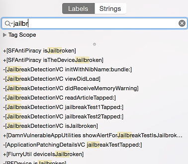

## アンチリバース防御のテスト (iOS)


### 脱獄検出のテスト

#### 概要

リバースエンジニアリング防御のコンテキストでは、脱獄検出メカニズムが追加され、脱獄されたデバイスでアプリを実行するのが少々難しくなり、リバースエンジニアが使用したいツールや技法が順々に妨げられます。他のほとんどの防御の場合と同様に、脱獄検出自体はあまり効果的な防御ではありませんが、複数のチェックをアプリ全体に施すことで耐改竄対策全体の有効性を向上させることができます。iOS の一般的な脱獄検出技法を以下に記します。

##### ファイルベースのチェック

以下のような脱獄に関連する典型的なファイルやディレクトリの存在を確認すること。

```
/Applications/Cydia.app
/Applications/FakeCarrier.app
/Applications/Icy.app
/Applications/IntelliScreen.app
/Applications/MxTube.app
/Applications/RockApp.app
/Applications/SBSettings.app
/Applications/WinterBoard.app
/Applications/blackra1n.app
/Library/MobileSubstrate/DynamicLibraries/LiveClock.plist
/Library/MobileSubstrate/DynamicLibraries/Veency.plist
/Library/MobileSubstrate/MobileSubstrate.dylib
/System/Library/LaunchDaemons/com.ikey.bbot.plist
/System/Library/LaunchDaemons/com.saurik.Cydia.Startup.plist
/bin/bash
/bin/sh
/etc/apt
/etc/ssh/sshd_config
/private/var/lib/apt
/private/var/lib/cydia
/private/var/mobile/Library/SBSettings/Themes
/private/var/stash
/private/var/tmp/cydia.log
/usr/bin/sshd
/usr/libexec/sftp-server
/usr/libexec/ssh-keysign
/usr/sbin/sshd
/var/cache/apt
/var/lib/apt
/var/lib/cydia
/var/log/syslog
/var/tmp/cydia.log
```

##### ファイルパーミッションのチェック

/private/ ディレクトリにファイルを書き込もうとすること。これは脱獄済みデバイスでのみ成功します。

```

NSError *error;
NSString *stringToBeWritten = @"This is a test.";
[stringToBeWritten writeToFile:@"/private/jailbreak.txt" atomically:YES
         encoding:NSUTF8StringEncoding error:&error];
if(error==nil){
   //Device is jailbroken
   return YES;
 } else {
   //Device is not jailbroken
   [[NSFileManager defaultManager] removeItemAtPath:@"/private/jailbreak.txt" error:nil];
 }

```

##### プロトコルハンドラのチェック

Cydia URL を開こうとすること。Cydia アプリストアはほとんどの脱獄ツールによりデフォルトでインストールされ、cydia:// プロトコルハンドラをインストールします。

```
if([[UIApplication sharedApplication] canOpenURL:[NSURL URLWithString:@"cydia://package/com.example.package"]]){
```

##### システム API のコール

-- TODO [Fork-based check] --

特権アクションを実行すること。脱獄されていないデバイスで NULL 引数を指定して system() 関数をコールすると「0」が返されます。脱獄済みデバイスで同じことをすると「1」が返されます。これは関数が /bin/sh にアクセスできるかどうかをチェックでき、これは脱獄済みデバイスの場合のみとなります。もうひとつの可能性はアプリケーションのサンドボックス外の場所に書き込むことです。これは、例えば /private ディレクトリにファイルを書き込もうとすることで実行できます。ファイルが正常に作成された場合、デバイスは脱獄済みであることを意味します。

##### ダイナミックローダーの使用

-- TODO [dyld-based check] --

##### SSH ループバック接続

-- TODO [Connect to localhost:22] --

#### 脱獄検出のバイパス

脱獄済みのデバイスで脱獄検出が有効であるアプリケーションを起動すると、以下のいずれかが行われます。

1. アプリケーションは通知なしで直ちに終了します
2. 脱獄済みデバイス上ではアプリケーションが実行されないことを示すポップアップウィンドウがあります

最初のケースでは、アプリケーションが脱獄なしのデバイスで完全に機能しているかどうかをチェックする価値があります。アプリケーションが実際にクラッシュしているか終了する原因となるバグがある可能性があります。試作版のアプリケーションをテストしているときに発生する可能性があります。

例として再度 Damn Vulnerable iOS アプリケーションを使用して、脱獄検出をバイパスする方法を見てみます。Hopper にバイナリをロードした後、アプリケーションが完全に逆アセンブルされるまで待つ必要があります(トップバーを見ます)。それから検索ボックスで 'jail' 文字列を探します。`SFAntiPiracy` と `JailbreakDetectionVC` の2つのクラスがあります。また、関数を逆コンパイルして、それらが何をしているか、特に何を返すのかを確認することもできます。

 

ご覧のとおり、クラスメソッド `+[SFAntiPiracy isTheDeviceJailbroken]` とインスタンスメソッド `-[JailbreakDetectionVC isJailbroken]` があります。主な相違点は、cycript を注入してクラスメソッドを直接コールできるのに対して、インスタンスメソッドの場合は、まず対象クラスのインスタンスを探す必要があるということです。関数 `choose` は与えられたクラスの既知のシグネチャに対するメモリヒープを探して、発見したインスタンスの配列を返します。クラスを実際にインスタンス化するには、アプリケーションを望ましい状態にすることが重要です。

プロセスに cycript を注入します(`top` で PID を探します)

```
iOS8-jailbreak:~ root# cycript -p 12345
cy# [SFAntiPiracy isTheDeviceJailbroken]
true
```

ご覧のようにクラスメソッドは直接コールされ true を返しました。では、`-[JailbreakDetectionVC isJailbroken]` インスタンスメソッドをコールしてみます。まず、`JailbreakDetectionVC` クラスのインスタンスを探すために `choose` 関数をコールする必要があります。

```
cy# a=choose(JailbreakDetectionVC)
[]
```

残念。返された配列は空です。これはランタイム内に登録されたこのクラスのインスタンスが存在しないことを意味します。実は、このクラスを実際に初期化する 'Jailbreak Test' ボタンの2回目がクリックされていませんでした。

```
cy# a=choose(JailbreakDetectionVC)
[#"<JailbreakDetectionVC: 0x14ee15620>"]
cy# [a[0] isJailbroken]
True
```


アプリケーションを望ましい状態にすることが重要である理由を理解したことでしょう。このケースでは脱獄検出をバイパスすることは簡単です。この関数は Boolean を返すことが分かるので、戻り値を置き換えるだけで済みます。関数の実装を cycript に置き換えることで、これを行うことができます。指定された名前の関数を実際に置き換えるので、関数がアプリケーション内の何かを変更する場合の副作用に注意します。

```
cy# JailbreakDetectionVC.prototype.isJailbroken=function(){return false}
cy# [a[0] isJailbroken]
false
```

 このケースでアプリケーションの脱獄検出をバイパスしました。

ここで、デバイスが脱獄済みであることを検出すると、アプリケーションがすぐに終了すると想像してみます。この場合、cycript を起動して関数の実装を置き換えるチャンス(時間)はありません。代わりに、CydiaSubstrate を使用し、`MSHookMessageEx` などの適切なフック関数を使用して、改変をコンパイルする必要があります。これを実行する方法についての良い情報源があります [15-16] が、私たちはより迅速で柔軟なアプローチを提供します。

**Frida** は動的計装フレームワークで、JavaScript API の中でアプリを計装するために使用できます。脱獄検出をバイパスするために使用する機能はいわゆる早期計装を実行することです。つまり、起動時に関数実装を置き換えます。

1. まず、`frida-server` が iDevice 上で動作していることを確認します
2. iDevice は USB ケーブルで接続する必要があります
3. ワークステーション上で `frida-trace` を使用します

```
$ frida-trace -U -f /Applications/DamnVulnerableIOSApp.app/DamnVulnerableIOSApp  -m "-[JailbreakDetectionVC isJailbroken]"
```

これは実際に DamnVulnerableIOSApp を開始して、`-[JailbreakDetectionVC isJailbroken]` への呼出をトレースし、`onEnter` および `onLeave` コールバック関数で JS フックを作成します。以下の例に示すように、`value.replace()` で戻り値を置き換えるのは簡単です。

```
    onLeave: function (log, retval, state) {
    console.log("Function [JailbreakDetectionVC isJailbroken] originally returned:"+ retval);
    retval.replace(0);  
      console.log("Changing the return value to:"+retval);
    }
```

これを実行すると、以下の結果が得られます。

```
$ frida-trace -U -f /Applications/DamnVulnerableIOSApp.app/DamnVulnerableIOSApp  -m "-[JailbreakDetectionVC isJailbroken]:"

Instrumenting functions...                                           `...
-[JailbreakDetectionVC isJailbroken]: Loaded handler at "./__handlers__/__JailbreakDetectionVC_isJailbroken_.js"
Started tracing 1 function. Press Ctrl+C to stop.                       
Function [JailbreakDetectionVC isJailbroken] originally returned:0x1
Changing the return value to:0x0
           /* TID 0x303 */
  6890 ms  -[JailbreakDetectionVC isJailbroken]
Function [JailbreakDetectionVC isJailbroken] originally returned:0x1
Changing the return value to:0x0
 22475 ms  -[JailbreakDetectionVC isJailbroken]
```

`-[JailbreakDetectionVC isJailbroken]` への呼出が2回あることに注意します。これはアプリの GUI 上での2回の物理タップに相当します。

Frida は非常に強力で多目的なツールです。詳細はドキュメント [3] を参照ください。

-- TODO [a generic Frida script that catches many JB detection methods] --

Objective-C メソッドおよびネイティブ関数をフックすること。

```python
import frida
import sys

try:
	session = frida.get_usb_device().attach("Target Process")
except frida.ProcessNotFoundError:
	print "Failed to attach to the target process. Did you launch the app?"
	sys.exit(0);

script = session.create_script("""

	// Handle fork() based check

  var fork = Module.findExportByName("libsystem_c.dylib", "fork");

	Interceptor.replace(fork, new NativeCallback(function () {
		send("Intercepted call to fork().");
	    return -1;
	}, 'int', []));

  var system = Module.findExportByName("libsystem_c.dylib", "system");

	Interceptor.replace(system, new NativeCallback(function () {
		send("Intercepted call to system().");
	    return 0;
	}, 'int', []));

	// Intercept checks for Cydia URL handler

	var canOpenURL = ObjC.classes.UIApplication["- canOpenURL:"];

	Interceptor.attach(canOpenURL.implementation, {
		onEnter: function(args) {
		  var url = ObjC.Object(args[2]);
		  send("[UIApplication canOpenURL:] " + path.toString());
		  },
		onLeave: function(retval) {
			send ("canOpenURL returned: " + retval);
	  	}

	});		

	// Intercept file existence checks via [NSFileManager fileExistsAtPath:]

	var fileExistsAtPath = ObjC.classes.NSFileManager["- fileExistsAtPath:"];
	var hideFile = 0;

	Interceptor.attach(fileExistsAtPath.implementation, {
		onEnter: function(args) {
		  var path = ObjC.Object(args[2]);
		  // send("[NSFileManager fileExistsAtPath:] " + path.toString());

		  if (path.toString() == "/Applications/Cydia.app" || path.toString() == "/bin/bash") {
		  	hideFile = 1;
		  }
		},
		onLeave: function(retval) {
			if (hideFile) {
		  		send("Hiding jailbreak file...");MM
				retval.replace(0);
				hideFile = 0;
			}

			// send("fileExistsAtPath returned: " + retval);
	  }
	});


	/* If the above doesn't work, you might want to hook low level file APIs as well

		var openat = Module.findExportByName("libsystem_c.dylib", "openat");
		var stat = Module.findExportByName("libsystem_c.dylib", "stat");
		var fopen = Module.findExportByName("libsystem_c.dylib", "fopen");
		var open = Module.findExportByName("libsystem_c.dylib", "open");
		var faccesset = Module.findExportByName("libsystem_kernel.dylib", "faccessat");

	*/

""")

def on_message(message, data):
	if 'payload' in message:
	  		print(message['payload'])

script.on('message', on_message)
script.load()
sys.stdin.read()
```

#### 静的解析

-- TODO [Describe how to assess this given either the source code or installer package (APK/IPA/etc.), but without running the app. Tailor this to the general situation (e.g., in some situations, having the decompiled classes is just as good as having the original source, in others it might make a bigger difference). If required, include a subsection about how to test with or without the original sources.] --

-- TODO [Confirm purpose of remark "Use the &lt;sup&gt; tag to reference external sources, e.g. Meyer's recipe for tomato soup<sup>[1]</sup>."] --

##### ソースコードあり

-- TODO [Add content for static analysis of "Testing Jailbreak Detection" with source code] --

##### ソースコードなし

-- TODO [Add content for static analysis of "Testing Jailbreak Detection" without source code] --

#### 動的解析

-- TODO [Describe how to test for this issue "Testing Jailbreak Detection" by running and interacting with the app. This can include everything from simply monitoring network traffic or aspects of the app’s behavior to code injection, debugging, instrumentation, etc.] --

#### 改善方法

-- TODO [Describe the best practices that developers should follow to prevent this issue "Testing Jailbreak Detection".] --

#### 参考情報

##### OWASP Mobile Top 10 2016

- M9 - リバースエンジニアリング - https://www.owasp.org/index.php/Mobile_Top_10_2016-M9-Reverse_Engineering

##### OWASP MASVS

-- TODO [Update reference to "VX.Y" below for "Testing Jailbreak Detection"] -- - VX.Y: "Requirement text, e.g. 'the keyboard cache is disabled on text inputs that process sensitive data'."

##### CWE

-- TODO [Add relevant CWE for "Testing Jailbreak Detection"] -- - CWE-312 - Cleartext Storage of Sensitive Information

##### その他

- [1] - Jailbreak Detection Methods on the Trustware Spiderlabs Blog - https://www.trustwave.com/Resources/SpiderLabs-Blog/Jailbreak-Detection-Methods/
- [2] - Dana Geist, Marat Nigmatullin: Jailbreak/Root Detection Evasion Study on iOS and Android - http://delaat.net/rp/2015-2016/p51/report.pdf
- [3] - http://frida.re/

##### ツール

-- TODO [Add relevant tools for "Testing Jailbreak Detection"] --* Enjarify - https://github.com/google/enjarify

### アンチデバッグのテスト

#### 概要

デバッグはアプリの実行時動作を解析する非常に効果的な方法です。それを使うことで、リバースエンジニアはコードをステップ実行し、任意のポイントでアプリの実行を停止し、変数の状態を検査および修正することなどができます。

-- TODO [Typical debugging defenses] --

Mach Exception Ports の検出 <sup>[1]</sup>:

```c
#include <mach/task.h>
#include <mach/mach_init.h>
#include <stdbool.h>

static bool amIAnInferior(void)
{
	mach_msg_type_number_t count = 0;
	exception_mask_t masks[EXC_TYPES_COUNT];
	mach_port_t ports[EXC_TYPES_COUNT];
	exception_behavior_t behaviors[EXC_TYPES_COUNT];
	thread_state_flavor_t flavors[EXC_TYPES_COUNT];
	exception_mask_t mask = EXC_MASK_ALL & ~(EXC_MASK_RESOURCE | EXC_MASK_GUARD);

	kern_return_t result = task_get_exception_ports(mach_task_self(), mask, masks, &count, ports, behaviors, flavors);
	if (result == KERN_SUCCESS)
	{
		for (mach_msg_type_number_t portIndex = 0; portIndex < count; portIndex++)
		{
			if (MACH_PORT_VALID(ports[portIndex]))
			{
				return true;
			}
		}
	}
	return false;
}
```

<code>ptrace()</code> の無効化。

```c
typedef int (*ptrace_ptr_t)(int _request, pid_t _pid, caddr_t _addr, int _data);

#define PT_DENY_ATTACH 31

void disable_ptrace() {
    void* handle = dlopen(0, RTLD_GLOBAL | RTLD_NOW);
    ptrace_ptr_t ptrace_ptr = dlsym(handle, "ptrace");
    ptrace_ptr(PT_DENY_ATTACH, 0, 0, 0);
    dlclose(handle);
}
```

```c
void disable_ptrace() {

	asm(
		"mov	r0, #31\n\t"	// PT_DENY_ATTACH
		"mov	r1, #0\n\t"
		"mov	r2, #0\n\t"
		"mov 	ip, #26\n\t"	// syscall no.
		"svc    0\n"
	);
}
```

```c
- (void)protectAgainstDebugger {
    int                 junk;
    int                 mib[4];
    struct kinfo_proc   info;
    size_t              size;

    info.kp_proc.p_flag = 0;

    // Initialize mib, which tells sysctl the info we want, in this case
    // we're looking for information about a specific process ID.

    mib[0] = CTL_KERN;
    mib[1] = KERN_PROC;
    mib[2] = KERN_PROC_PID;
    mib[3] = getpid();


    while(1) {
     
        size = sizeof(info);
        junk = sysctl(mib, sizeof(mib) / sizeof(*mib), &info, &size, NULL, 0);
        assert(junk == 0);

        // We're being debugged if the P_TRACED flag is set.

        if ((info.kp_proc.p_flag & P_TRACED) != 0) {
            exit(0);
        }

        sleep(1);

    }
}
```

アプリはデバッガがアタッチされることを積極的に防止するか、もしくはデバッガが検出されたときに終了させるかのいずれかを行うべきです。

#### アンチデバッグ防御のバイパス

-- TODO [Bypass techniques] --

```c
#import <substrate.h>

#define PT_DENY_ATTACH 31

static int (*_my_ptrace)(int request, pid_t pid, caddr_t addr, int data);


static int $_my_ptrace(int request, pid_t pid, caddr_t addr, int data) {
	if (request == PT_DENY_ATTACH) {
		request = -1;
	}
	return _ptraceHook(request,pid,addr,data);
}

%ctor {
	MSHookFunction((void *)MSFindSymbol(NULL,"_ptrace"), (void *)$ptraceHook, (void **)&_ptraceHook);
}
```

#### ホワイトボックステスト

-- TODO [Describe how to assess this with access to the source code and build configuration] --

#### ブラックボックステスト

-- TODO [Needs more detail] --

実行中のプロセスにデバッガをアタッチします。これは失敗するか、デバッガが検出されたときにアプリが終了するか誤動作する必要があります。例えば、ptrace(PT_DENY_ATTACH) が呼び出された場合、gdb はセグメンテーションフォルトでクラッシュします。

注意。いくつかのアンチデバッグ実装は人目につかない方法で応答するため動作の変化はすぐには分かりません。例えば、ソフトトークンアプリはデバッガが検出されたときに視覚的に応答しないかもしれませんが、代わりに内部変数の状態をひそかに変更するため、後で正しくない OTP が生成されます。完全なワークフローを実行して、デバッガをアタッチするとクラッシュや誤動作を引き起こすかどうかを確認します。

#### 改善方法

-- TODO [Describe the best practices that developers should follow to prevent this issue "Testing Anti-Debugging"] --

#### 参考情報

##### OWASP Mobile Top 10 2014

-- TODO [Add link to OWASP Mobile Top 10 2014 for "Testing Anti-Debugging"] --

##### OWASP MASVS

- V...: ""

##### CWE

-- TODO [Add relevant CWE for "Testing Anti-Debugging"] --

##### その他

- [1] Detecting the Debugger on OS X - https://zgcoder.net/ramblings/osx-debugger-detection

##### ツール

-- TODO [Add tools for "Testing Anti-Debugging"] --


### ファイル整合性監視のバイパス

#### 概要

ファイル整合性に関連するトピックは二つあります。

 1. _アプリケーションソースに関連する整合性チェック：_ 「改竄とリバースエンジニアリング」の章では、iOS IPA アプリケーションの署名チェックについて説明しています。また、リバースエンジニアは開発者証明書やエンタープライズ証明書を使用してアプリを再パッケージおよび再署名することで、このチェックを簡単に回避できることも判明しました。これをより困難にする方法のひとつは、署名が実行時に一致するかどうかをチェックする内部ランタイムチェックを追加することです。

 2. _ファイルストレージに関連する整合性チェック：_ ファイルがアプリケーションにより格納される、またはキーチェーン、`UserDefaults`/`NSUserDefaults`、SQLite データベース、Realm データベースにキー・バリューペアが格納されるとき、それらの完全性を保護する必要があります。

##### サンプル実装 - アプリケーションソース
整合性チェックは既に Apple が用心して DRM を使用しています。しかし、以下の例にあるように、制御を追加できます。ここでは `mach_header` を解析し、命令データの開始を計算し、それを使用して署名を生成しています。署名を与えられたものと比較します。比較される署名がどこに格納もしくはコード化されているか確認します。

```c
int xyz(char *dst) {
    const struct mach_header * header;
    Dl_info dlinfo;

    if (dladdr(xyz, &dlinfo) == 0 || dlinfo.dli_fbase == NULL) {
        NSLog(@" Error: Could not resolve symbol xyz");
        [NSThread exit];
    }

    while(1) {

        header = dlinfo.dli_fbase;  // Pointer on the Mach-O header
        struct load_command * cmd = (struct load_command *)(header + 1); // First load command
        // Now iterate through load command
        //to find __text section of __TEXT segment
        for (uint32_t i = 0; cmd != NULL && i < header->ncmds; i++) {
            if (cmd->cmd == LC_SEGMENT) {
                // __TEXT load command is a LC_SEGMENT load command
                struct segment_command * segment = (struct segment_command *)cmd;
                if (!strcmp(segment->segname, "__TEXT")) {
                    // Stop on __TEXT segment load command and go through sections
                    // to find __text section
                    struct section * section = (struct section *)(segment + 1);
                    for (uint32_t j = 0; section != NULL && j < segment->nsects; j++) {
                        if (!strcmp(section->sectname, "__text"))
                            break; //Stop on __text section load command
                        section = (struct section *)(section + 1);
                    }
                    // Get here the __text section address, the __text section size
                    // and the virtual memory address so we can calculate
                    // a pointer on the __text section
                    uint32_t * textSectionAddr = (uint32_t *)section->addr;
                    uint32_t textSectionSize = section->size;
                    uint32_t * vmaddr = segment->vmaddr;
                    char * textSectionPtr = (char *)((int)header + (int)textSectionAddr - (int)vmaddr);
                    // Calculate the signature of the data,
                    // store the result in a string
                    // and compare to the original one
                    unsigned char digest[CC_MD5_DIGEST_LENGTH];
                    CC_MD5(textSectionPtr, textSectionSize, digest);     // calculate the signature
                    for (int i = 0; i < sizeof(digest); i++)             // fill signature
                        sprintf(dst + (2 * i), "%02x", digest[i]);

                    // return strcmp(originalSignature, signature) == 0;    // verify signatures match

                    return 0;
                }
            }
            cmd = (struct load_command *)((uint8_t *)cmd + cmd->cmdsize);
        }
    }

}
```

##### サンプル実装 - ストレージ

アプリケーションストレージ自体に整合性を提供する場合は、指定されたキー・バリューペア上またはデバイスに格納されたファイル上に HMAC や署名を作成します。HMAC を作成する場合は、CommonCrypto 実装を使用することをお勧めします。
暗号化が必要な場合、[1] を参照して、暗号化してから HMAC を確認します。

CC で HMAC を生成する場合：

1. データを `NSMutableData` として取得する。
2. データキーを取得する (おそらくキーチェーンから) 。
3. ハッシュ値を計算する。
4. ハッシュ値を実データに追加する。
5. 手順 4. の結果を格納する。


```obj-c
	// Allocate a buffer to hold the digest, and perform the digest.
	NSMutableData* actualData = [getData]; 
 	//get the key from the keychain
	NSData* key = [getKey];	
   NSMutableData* digestBuffer = [NSMutableData dataWithLength:CC_SHA256_DIGEST_LENGTH];
   CCHmac(kCCHmacAlgSHA256, [actualData bytes], (CC_LONG)[key length], [actualData
     bytes], (CC_LONG)[actualData length], [digestBuffer mutableBytes]);
   [actualData appendData: digestBuffer];
```
代替として、手順 1 と 3 で NSData を使用できますが、手順 4 で新しいバッファを作成する必要があります。

CC で HMAC を検証する場合：
1. メッセージと HMAC バイトを個別の `NSData` として抽出する。
2. `NSData` で HMAC を生成する手順 1-3 を繰り返す。
3. 抽出された HMAC バイトを手順 1 の結果と比較する。

```obj-c
	NSData* hmac = [data subdataWithRange:NSMakeRange(data.length - CC_SHA256_DIGEST_LENGTH, CC_SHA256_DIGEST_LENGTH)];
	NSData* actualData = [data subdataWithRange:NSMakeRange(0, (data.length - hmac.length))];
	NSMutableData* digestBuffer = [NSMutableData dataWithLength:CC_SHA256_DIGEST_LENGTH];
	CCHmac(kCCHmacAlgSHA256, [actualData bytes], (CC_LONG)[key length], [actualData bytes], (CC_LONG)[actualData length], [digestBuffer mutableBytes]);
	return [hmac isEqual: digestBuffer];

```


##### ファイル整合性チェックのバイパス

*アプリケーションソースの整合性チェックをバイパスしようとする場合*

1. アンチデバッグ機能にパッチを当てる。それぞれのコードを NOP 命令で上書きするだけで、不要な動作を無効化できる。
2. コードの整合性を評価するために使用される格納されたハッシュにパッチを適用する。
3. Frida を使用して API をフックし、ファイルシステム API をフックする。改変されたファイルの代わりに元のファイルへのハンドルを返す。

*ストレージの整合性チェックをバイパスしようとする場合*

1. デバイス結合のセクションを参照して、デバイスからデータを取得する。
2. 取得したデータを改変して、ストレージに戻す。

#### Effectiveness Assessment

*For the application source integrity checks*
Run the app on the device in an unmodified state and make sure that everything works. Then apply patches to the executable using optool and re-sign the app as described in the chapter "Basic Security Testing" and run it. 
The app should detect the modification and respond in some way. At the very least, the app should alert the user and/or terminate the app. Work on bypassing the defenses and answer the following questions:

- Can the mechanisms be bypassed using trivial methods (e.g. hooking a single API function)?
- How difficult is it to identify the anti-debugging code using static and dynamic analysis?
- Did you need to write custom code to disable the defenses? How much time did you need to invest?
- What is your subjective assessment of difficulty?

For a more detailed assessment, apply the criteria listed under "Assessing Programmatic Defenses" in the "Assessing Software Protection Schemes" chapter.

*For the storage integrity checks*
A similar approach holds here, but now answer the following questions:
- Can the mechanisms be bypassed using trivial methods (e.g. changing the contents of a file or a key-value)?
- How difficult is it to obtain the HMAC key or the asymmetric private key?
- Did you need to write custom code to disable the defenses? How much time did you need to invest?
- What is your subjective assessment of difficulty?

#### 参考情報

##### OWASP Mobile Top 10 2016

- M9 - リバースエンジニアリング - https://www.owasp.org/index.php/Mobile_Top_10_2016-M9-Reverse_Engineering

##### OWASP MASVS

-- V8.3: "アプリはそれ自身のサンドボックス内の実行ファイルや重要なデータの改竄を検出し応答している。"

##### CWE

- N/A

##### その他

- [1] Authenticated Encryption: Relations among notions and analysis of the generic composition paradigm - http://cseweb.ucsd.edu/~mihir/papers/oem.html

### リバースエンジニアリングツールの検出のテスト

#### 概要

-- TODO [Provide a general description of the issue "Testing Detection of Reverse Engineering Tools".] --

#### 静的解析

-- TODO [Describe how to assess this given either the source code or installer package (APK/IPA/etc.), but without running the app. Tailor this to the general situation (e.g., in some situations, having the decompiled classes is just as good as having the original source, in others it might make a bigger difference). If required, include a subsection about how to test with or without the original sources.] --

-- TODO [Confirm purpose of "Use the &lt;sup&gt; tag to reference external sources, e.g. Meyer's recipe for tomato soup<sup>[1]</sup>."] --

##### ソースコードあり

-- TODO [Add content of static analysis of "Testing Detection of Reverse Engineering Tools" with source code] --

##### ソースコードなし

-- TODO [Add content of static analysis of "Testing Detection of Reverse Engineering Tools" without source code] --

#### 動的解析

-- TODO [Describe how to test for this issue "Testing Detection of Reverse Engineering Tools" by running and interacting with the app. This can include everything from simply monitoring network traffic or aspects of the app’s behavior to code injection, debugging, instrumentation, etc.] --

#### 改善方法

-- TODO [Describe the best practices that developers should follow to prevent this issue "Testing Detection of Reverse Engineering Tools".] --

#### 参考情報

##### OWASP Mobile Top 10 2016

- M9 - リバースエンジニアリング - https://www.owasp.org/index.php/Mobile_Top_10_2016-M9-Reverse_Engineering

##### OWASP MASVS

-- TODO [Update reference below "VX.Y" for "Testing Detection of Reverse Engineering Tools"] -- - VX.Y: "Requirement text, e.g. 'the keyboard cache is disabled on text inputs that process sensitive data'."

##### CWE

-- TODO [Add relevant CWE for "Testing Detection of Reverse Engineering Tools"] -- - CWE-312 - Cleartext Storage of Sensitive Information

##### その他

- [1] Meyer's Recipe for Tomato Soup - http://www.finecooking.com/recipes/meyers-classic-tomato-soup.aspx
- [2] Another Informational Article - http://www.securityfans.com/informational_article.html

##### ツール

-- TODO [Add relevant tools for "Testing Detection of Reverse Engineering Tools"] --* Enjarify - https://github.com/google/enjarify

### ランタイム整合性監視のテスト

#### 概要

-- TODO [Provide a general description of the issue "Testing Memory Integrity Checks".] --

#### 例

**Substrate インラインフックの検出***

インラインフックは関数の最初の数バイトをコントロールフローを攻撃者がコントロールするコードにリダイレクトするトランポリンで上書きすることにより実装されます。各関数の関数プロローグを異常なインストラクションや顕著なインストラクションでスキャンすることにより検出できます。例えば、substrate は以下のようになります。

inline int checkSubstrateTrampoline() attribute((always_inline)); int checkSubstrateTrampoline(void * funcptr) {

```
unsigned int *funcaddr = (unsigned int *)funcptr;

if(funcptr)
    // assuming the first word is the trampoline 
    if (funcaddr[0] == 0xe51ff004) // 0xe51ff004 = ldr pc, [pc-4]
        return 1; // bad

return 0; // good
```

\} Netitude blog <code>[2]</code> のコード例です。

#### 有効性評価

-- TODO [Describe how to test for this issue "Testing Memory Integrity Checks" by running and interacting with the app. This can include everything from simply monitoring network traffic or aspects of the app’s behavior to code injection, debugging, instrumentation, etc.] --

#### 改善方法

-- TODO [Describe the best practices that developers should follow to prevent this issue "Testing Memory Integrity Checks".] --

#### 参考情報

##### OWASP Mobile Top 10 2016

- M9 - リバースエンジニアリング - https://www.owasp.org/index.php/Mobile_Top_10_2016-M9-Reverse_Engineering

##### OWASP MASVS

-- TODO [Update reference below "VX.Y" for "Testing Memory Integrity Checks"] -- - VX.Y: "Requirement text, e.g. 'the keyboard cache is disabled on text inputs that process sensitive data'."

##### CWE

-- TODO [Add relevant CWE for "Testing Memory Integrity Checks"] -- - CWE-312 - Cleartext Storage of Sensitive Information

##### その他

- [1] Meyer's Recipe for Tomato Soup - http://www.finecooking.com/recipes/meyers-classic-tomato-soup.aspx
- [2] Another Informational Article - http://www.securityfans.com/informational_article.html

##### ツール

-- TODO [Add relevant tools for "Testing Memory Integrity Checks"] --* Enjarify - https://github.com/google/enjarify

### デバイス結合のテスト

#### 概要

デバイス結合の目的は、デバイス A からデバイス B へアプリとその状態をコピーしようとする攻撃者を妨害し、デバイス B のアプリの実行を継続することです。デバイス A が信頼されているとみなされた場合、デバイス B よりも多くの権限を持つ可能性がありますが、アプリをデバイス A からデバイス B へコピーする際に変更すべきではありません。

MAC アドレスなどの iOS 7.0 ハードウェア識別子は使用禁止であることに注意します [1] 。アプリケーションをデバイスに結合する方法は `identifierForVendor` を使用することに基づいています。`identifierForVendor` はキーチェーンに何かを格納するか、iOS 用の Google の InstanceID を使用します。詳細は改善方法を参照ください。

#### 静的解析

##### ソースコードあり

ソースコードを利用可能な場合は、以下のようなバッドプラクティスとなるコードを探します。

- MAC アドレス: MAC アドレスを見つけるにはさまざまな方法があります: `CTL_NET` (ネットワークサブシステム) の使用、`NET_RT_IFLIST` (設定されたインタフェースの取得) の使用、MAC アドレスが書式化されるときにはしばしば print 用の書式化コードとして `"%x:%x:%x:%x:%x:%x"` が見られる。
- UDID の使用: `[[[UIDevice currentDevice] identifierForVendor] UUIDString];` および Swift3では: `UIDevice.current.identifierForVendor?.uuidString`
- 任意のキーチェーンやファイルシステムに基づく結合: 任意の `SecAccessControlCreateFlags` により保護されない、または `kSecAttrAccessibleAlways` or `kSecAttrAccessibleAlwaysThisDeviceOnly` のような保護クラスを使用する。


##### ソースコードなし

-- TODO [Add content for static analysis of "Testing Device Binding" without source code] --

#### 動的解析

アプリケーションバインディングをテストする方法はいくつかあります。

##### シミュレータを用いた動的解析

シミュレータでアプリ・バインディングを検証する場合は、以下の手順を実行します。

1. シミュレータでアプリケーションを実行する。
2. アプリケーションのインスタンスで信頼を高められることを確認する (認証など) 。
3. シミュレータからデータを取得する。これにはいくつかの手順があります。
  - シミュレータは UUID を使用して自分自身を識別するため、デバッグポイントを作成して、その場所で `po NSHomeDirectory()` を実行することによりストレージを見つけることが容易になります。それでシミュレータがその内容を格納する場所がわかります。そうでなければ疑似 plist ファイル用に `find ~/Library/Developer/CoreSimulator/Devices/ | grep <appname>` を実行します。
  - 指定されたコマンドで表示されたディレクトリに移動する。
  - 見つかった3つのフォルダをすべてコピーする (Documents, Library, tmp) 。
  - キーチェーンの内容をコピーする、iOS8 以降では `~/Library/Developer/CoreSimulator/Devices/<Simulator Device ID>/data/Library/Keychains` にあります。
4. 別のシミュレータでアプリケーションを起動し、手順3の説明に従ってデータの場所を確認する。
5. 二つ目のシミュレータでアプリを停止し、既存のデータを手順3でコピーしたデータで上書きする。
6. 認証された状態で継続できますか？その場合、バインディングが正しく機能していない可能性があります。

シミュレータではすべてがユニークではないため、バインディングが機能していない「可能性がある」と言っていることに注意してください。

##### 2つの脱獄済みデバイスを用いた動的解析

Take the following steps when you want to verify app-binding by using 2 jailbroken devices:

1.	Run the app on your jailbroken device
2.	Make sure you can raise the trust in the instance of the application (e.g. authenticate)
3.	Retrieve the data from the jailbroken device:
   - you can ssh to your device and then extract the data (just as with a similator, either use debugging or a `find /private/var/mobile/Containers/Data/Application/ |grep <name of app>`. The directory is in `/private/var/mobile/Containers/Data/Application/<Application uuid>`
  - go to the directory printed with the given command using SSH or copy the folders in there using SCP (`scp <ipaddress>:/<folder_found_in_previous_step> targetfolder`. You can use an FTP client like Filezilla as well.
  - retrieve the data from the keychain, which is stored `/private/var/Keychains/keychain-2.db`, which you can retrieve using the keychain dumper[3]. For that you first need to make it world readable `chmod +r /private/var/Keychains/keychain-2.db` and then execute `./keychain_dumper -a`
4.	Install the application on the second jailbroken device.
5.	Overwrite the data of the application extracted from step 3. They keychain data will have to be manually added.
6.	Can you continue in an authenticated state? If so, then binding might not be working properly.

#### 改善方法

Before we describe the usable identifiers, let's quickly discuss how they can be used for binding. There are 3 methods which allow for device binding in iOS: 

- You can use `[[UIDevice currentDevice] identifierForVendor]` (in Objective-C) or `UIDevice.current.identifierForVendor?.uuidString` (in swift3) and `UIDevice.currentDevice().identifierForVendor?.UUIDString` (in swift2). Which might change upon reinstalling the application when no other applications from the same vendor are installed. 
- You can store something in the keychain to identify the application its instance. One needs to make sure that this data is not backed up by using `kSecAttrAccessibleWhenPasscodeSetThisDeviceOnly` (if you want to secure it and properly enforce having a passcode or touch-id) or by using `kSecAttrAccessibleAfterFirstUnlockThisDeviceOnly`, or `kSecAttrAccessibleWhenUnlockedThisDeviceOnly`. 
- You can use Google its instanceID for iOS [2].

Any scheme based on these variants will be more secure the moment passcode and/or touch-id has been enabled and the materials stored in the Keychain or filesystem have been protected with protectionclasses such as  `kSecAttrAccessibleAfterFirstUnlockThisDeviceOnly` and `kSecAttrAccessibleWhenUnlockedThisDeviceOnly` and the the `SecAccessControlCreateFlags` is set with `kSecAccessControlDevicePasscode` (for passcodes), `kSecAccessControlUserPresence` (passcode or touchid), `kSecAccessControlTouchIDAny` (touchID), `kSecAccessControlTouchIDCurrentSet` (touchID: but current fingerprints only). 


#### 参考情報

##### OWASP Mobile Top 10 2016

- M9 - リバースエンジニアリング - https://www.owasp.org/index.php/Mobile_Top_10_2016-M9-Reverse_Engineering

##### OWASP MASVS

-- TODO [Update reference "VX.Y" below for "Testing Device Binding"] -- - VX.Y: "Requirement text, e.g. 'the keyboard cache is disabled on text inputs that process sensitive data'."

##### CWE

-- TODO [Add relevant CWE for "Testing Device Binding"] -- - CWE-312 - Cleartext Storage of Sensitive Information

##### その他
- [1] iOS 7 release notes - https://developer.apple.com/library/content/releasenotes/General/RN-iOSSDK-7.0/index.html
- [2] iOS implementation instance-ID - https://developers.google.com/instance-id/guides/ios-implementation
- [3] Keychain Dumper - https://github.com/ptoomey3/Keychain-Dumper


##### ツール

- Keychain Dumper - https://github.com/ptoomey3/Keychain-Dumper
- Appsync Unified - https://cydia.angelxwind.net/?page/net.angelxwind.appsyncunified

### 難読化のテスト

#### 概要

-- TODO [Provide a general description of the issue "Testing Obfuscation".] --

#### 静的解析

-- TODO [Describe how to assess this given either the source code or installer package (APK/IPA/etc.), but without running the app. Tailor this to the general situation (e.g., in some situations, having the decompiled classes is just as good as having the original source, in others it might make a bigger difference). If required, include a subsection about how to test with or without the original sources.] --

-- TODO [Confirm purpose of remark "Use the &lt;sup&gt; tag to reference external sources, e.g. Meyer's recipe for tomato soup<sup>[1]</sup>."] --

##### ソースコードあり

-- TODO [Add content for static analysis of "Testing Obfuscation" with source code] --

##### ソースコードなし

-- TODO [Add content for static analysis of "Testing Obfuscation" without source code] --

#### 動的解析

-- TODO [Describe how to test for this issue "Testing Obfuscation" by running and interacting with the app. This can include everything from simply monitoring network traffic or aspects of the app’s behavior to code injection, debugging, instrumentation, etc.] --

#### 改善方法

-- TODO [Describe the best practices that developers should follow to prevent this issue "Testing Obfuscation".] --

#### 参考情報

##### OWASP Mobile Top 10 2016

- M9 - リバースエンジニアリング - https://www.owasp.org/index.php/Mobile_Top_10_2016-M9-Reverse_Engineering

##### OWASP MASVS

-- TODO [Update reference "VX.Y" below for "Testing Obfuscation"] -- - VX.Y: "Requirement text, e.g. 'the keyboard cache is disabled on text inputs that process sensitive data'."

##### CWE

-- TODO [Add relevant CWE for "Testing Obfuscation"] -- - CWE-312 - Cleartext Storage of Sensitive Information

##### その他

- [1] Meyer's Recipe for Tomato Soup - http://www.finecooking.com/recipes/meyers-classic-tomato-soup.aspx
- [2] Another Informational Article - http://www.securityfans.com/informational_article.html

##### ツール

-- TODO [Add relevant tools for "Testing Obfuscation"] --* Enjarify - https://github.com/google/enjarify
