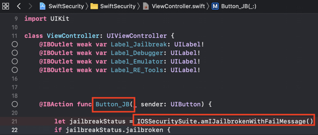

## iOS のアンチリバース防御

### 脱獄検出 (MSTG-RESILIENCE-1)

#### 概要

脱獄検出メカニズムがリバースエンジニアリング防御に追加されると、脱獄済みデバイス上でのアプリ実行がより困難になります。これによりリバースエンジニアが使用したいツールや技法の一部がブロックされます。他のほとんどの種類の防御の場合と同様に、脱獄検出自体はあまり効果的ではありませんが、アプリのソースコード全体にチェックを分散されることで改竄防止スキーム全体の有効性を向上させることができます。 [iOS の一般的な脱獄検出技法のリストが Trustwave により公開されています](https://www.trustwave.com/Resources/SpiderLabs-Blog/Jailbreak-Detection-Methods/ "Jailbreak Detection Methods on the Trustware Spiderlabs Blog") 。

##### ファイルベースのチェック

以下のような脱獄に関連する典型的なファイルやディレクトリの存在を確認します。

```default
/Applications/Cydia.app
/Applications/FakeCarrier.app
/Applications/Icy.app
/Applications/IntelliScreen.app
/Applications/MxTube.app
/Applications/RockApp.app
/Applications/SBSettings.app
/Applications/WinterBoard.app
/Applications/blackra1n.app
/Library/MobileSubstrate/DynamicLibraries/LiveClock.plist
/Library/MobileSubstrate/DynamicLibraries/Veency.plist
/Library/MobileSubstrate/MobileSubstrate.dylib
/System/Library/LaunchDaemons/com.ikey.bbot.plist
/System/Library/LaunchDaemons/com.saurik.Cydia.Startup.plist
/bin/bash
/bin/sh
/etc/apt
/etc/ssh/sshd_config
/private/var/lib/apt
/private/var/lib/cydia
/private/var/mobile/Library/SBSettings/Themes
/private/var/stash
/private/var/tmp/cydia.log
/var/tmp/cydia.log
/usr/bin/sshd
/usr/libexec/sftp-server
/usr/libexec/ssh-keysign
/usr/sbin/sshd
/var/cache/apt
/var/lib/apt
/var/lib/cydia
/usr/sbin/frida-server
/usr/bin/cycript
/usr/local/bin/cycript
/usr/lib/libcycript.dylib
/var/log/syslog
```

##### ファイルパーミッションのチェック

脱獄メカニズムを確認するもう一つの方法として、アプリケーションのサンドボックス外にある場所に書き込みを試みます。アプリケーションが例えば `/private ディレクトリ` にファイルの作成を試みることでこれを行うことができます。ファイルの作成に成功した場合、デバイスは脱獄されています。

```objectivec
NSError *error;
NSString *stringToBeWritten = @"This is a test.";
[stringToBeWritten writeToFile:@"/private/jailbreak.txt" atomically:YES
         encoding:NSUTF8StringEncoding error:&error];
if(error==nil){
   //Device is jailbroken
   return YES;
 } else {
   //Device is not jailbroken
   [[NSFileManager defaultManager] removeItemAtPath:@"/private/jailbreak.txt" error:nil];
 }
```

##### プロトコルハンドラのチェック

Cydia URL を開くことを試みることでプロトコルハンドラをチェックできます。Cydia アプリストアは事実上すべての脱獄ツールによりデフォルトでインストールされ、 cydia:// プロトコルハンドラをインストールします。

```objectivec
if([[UIApplication sharedApplication] canOpenURL:[NSURL URLWithString:@"cydia://package/com.example.package"]]){
```

##### システム API のコール

脱獄されていないデバイスで "NULL" 引数を指定して `system` 関数をコールすると "0" を返します。脱獄済みデバイスで同じことをすると "1" を返します。この違いは脱獄済みデバイス上でのみ `/bin/sh` にアクセスできる関数をチェックするためです。

#### 脱獄検出のバイパス

脱獄済みデバイスで脱獄検出が有効であるアプリケーションを起動すると、以下のいずれかのことに気づくでしょう。

1. アプリケーションは通知なしで直ちに終了します。
2. 脱獄済みデバイス上ではアプリケーションが実行されないことを示すポップアップウィンドウが表示されます。

最初のケースでは、アプリケーションが脱獄なしのデバイスで完全に機能していることを確認します。アプリケーションがクラッシュしているか終了する原因となるバグがある可能性があります。これは試作版のアプリケーションをテストしているときに発生する可能性があります。

例として再度 Damn Vulnerable iOS アプリケーションを使用して、脱獄検出のバイパスを見てみます。 Hopper にバイナリをロードした後、アプリケーションが完全に逆アセンブルされるまで待つ必要があります (トップバーを見てステータスを確認します) 。それから検索ボックスで "jail" 文字列を探します。`SFAntiPiracy` と `JailbreakDetectionVC` の2つのクラスがあります。関数を逆コンパイルして、それらが何をしているか、特に何を返すのかを確認することもできます。


ご覧のとおり、クラスメソッド `+[SFAntiPiracy isTheDeviceJailbroken]` とインスタンスメソッド `-[JailbreakDetectionVC isJailbroken]` があります。主な相違点は、Cycript をアプリに注入してクラスメソッドを直接コールできるのに対して、インスタンスメソッドではまず対象クラスのインスタンスを探す必要があるということです。関数 `choose` はメモリヒープ内で与えられたクラスの既知のシグネチャを探して、インスタンスの配列を返します。アプリケーションを望ましい状態にする (クラスを実際にインスタンス化されるようにする) ことが重要です。

プロセスに Cycript を注入しましょう (`top` で PID を探します) 。

```bash
iOS8-jailbreak:~ root# cycript -p 12345
cy# [SFAntiPiracy isTheDeviceJailbroken]
true
```

ご覧のようにクラスメソッドは直接コールされ "true" を返しました。ここで、 `-[JailbreakDetectionVC isJailbroken]` インスタンスメソッドをコールしてみましょう。まず、`JailbreakDetectionVC` クラスのインスタンスを探すために `choose` 関数をコールする必要があります。

```bash
cy# a=choose(JailbreakDetectionVC)
[]
```

残念。戻り値は空の配列です。つまりランタイム内にこのクラスのインスタンスが登録されていないことを意味します。実際、このクラスを初期化する二つ目の "Jailbreak Test" ボタンをクリックしてはいません。

```bash
cy# a=choose(JailbreakDetectionVC)
[#"<JailbreakDetectionVC: 0x14ee15620>"]
cy# [a[0] isJailbroken]
True
```


アプリケーションを望ましい状態にすることが重要である理由を理解したことでしょう。この時点で Cycript を使用して脱獄検出をバイパスすることは簡単です。この関数はブール値を返すことが分かるので、戻り値を置き換えるだけです。関数の実装を Cycript に置き換えることで、戻り値を置き換えることができます。指定された名前の関数を実際に置き換えるので、関数がアプリケーション内の何かを変更する場合の副作用に注意してください。

```bash
cy# JailbreakDetectionVC.prototype.isJailbroken=function(){return false}
cy# [a[0] isJailbroken]
false
```


このケースではアプリケーションの脱獄検出をバイパスしました。

ここで、デバイスが脱獄済みであることを検出すると、アプリケーションがすぐに終了すると想像してみます。Cycript を起動して関数の実装を置き換える時間はありません。代わりに、CydiaSubstrate を使用し、 `MSHookMessageEx` などの適切なフック関数を使用して、改変をコンパイルする必要があります。これを実行する方法についての [良い情報源](http://delaat.net/rp/2015-2016/p51/report.pdf "Jailbreak/Root Detection Evasion Study on iOS and Android") がありますが、 Frida を使用することにより、早期計装をより簡単に実行でき、以前のテストから収集したスキルを活用できます。

脱獄検出をバイパスするために使用する Frida の機能はいわゆる早期計装です。つまり、起動時に関数実装を置き換えます。

1. `frida-server` が iOS デバイス上で動作していることを確認します。
2. ワークステーションに `Frida` が [インストール]( https://www.frida.re/docs/installation/ "Frida Installation") されていることを確認します。
3. iOS デバイスは USB ケーブルで接続する必要があります。
4. ワークステーション上で `frida-trace` を使用します。

```bash
$ frida-trace -U -f /Applications/DamnVulnerableIOSApp.app/DamnVulnerableIOSApp  -m "-[JailbreakDetectionVC isJailbroken]"
```

これは DamnVulnerableIOSApp を開始して、`-[JailbreakDetectionVC isJailbroken]` への呼出をトレースし、`onEnter` および `onLeave` コールバック関数で JavaScript フックを作成します。以下の例に示すように、`value.replace` で戻り値を置き換えるのは簡単です。

```javascript
    onLeave: function (log, retval, state) {
    console.log("Function [JailbreakDetectionVC isJailbroken] originally returned:"+ retval);
    retval.replace(0);  
      console.log("Changing the return value to:"+retval);
    }
```

これにより以下の結果が得られます。

```bash
$ frida-trace -U -f /Applications/DamnVulnerableIOSApp.app/DamnVulnerableIOSApp  -m "-[JailbreakDetectionVC isJailbroken]:"

Instrumenting functions...                                           `...
-[JailbreakDetectionVC isJailbroken]: Loaded handler at "./__handlers__/__JailbreakDetectionVC_isJailbroken_.js"
Started tracing 1 function. Press Ctrl+C to stop.
Function [JailbreakDetectionVC isJailbroken] originally returned:0x1
Changing the return value to:0x0
           /* TID 0x303 */
  6890 ms  -[JailbreakDetectionVC isJailbroken]
Function [JailbreakDetectionVC isJailbroken] originally returned:0x1
Changing the return value to:0x0
 22475 ms  -[JailbreakDetectionVC isJailbroken]
```

`-[JailbreakDetectionVC isJailbroken]` へのコールが二回あることに注意します。これはアプリの GUI 上での二回の物理的なタップに相当します。

ファイルシステムチェックに依存する脱獄検出メカニズムをバイパスするもう一つの方法は objection です。脱獄バイパスの実装は [jailbreak.ts スクリプト](https://github.com/sensepost/objection/blob/master/agent/src/ios/jailbreak.ts "jailbreak.ts") にあります。

Objective-C メソッドやネイティブ関数をフックするための Python スクリプトは以下を参照します。

```python
import frida
import sys

try:
    session = frida.get_usb_device().attach("Target Process")
except frida.ProcessNotFoundError:
    print "Failed to attach to the target process. Did you launch the app?"
    sys.exit(0);

script = session.create_script("""

    // Handle fork() based check

    var fork = Module.findExportByName("libsystem_c.dylib", "fork");

    Interceptor.replace(fork, new NativeCallback(function () {
        send("Intercepted call to fork().");
        return -1;
    }, 'int', []));

    var system = Module.findExportByName("libsystem_c.dylib", "system");

    Interceptor.replace(system, new NativeCallback(function () {
        send("Intercepted call to system().");
        return 0;
    }, 'int', []));

    // Intercept checks for Cydia URL handler

    var canOpenURL = ObjC.classes.UIApplication["- canOpenURL:"];

    Interceptor.attach(canOpenURL.implementation, {
        onEnter: function(args) {
          var url = ObjC.Object(args[2]);
          send("[UIApplication canOpenURL:] " + path.toString());
          },
        onLeave: function(retval) {
            send ("canOpenURL returned: " + retval);
        }

    });

    // Intercept file existence checks via [NSFileManager fileExistsAtPath:]

    var fileExistsAtPath = ObjC.classes.NSFileManager["- fileExistsAtPath:"];
    var hideFile = 0;

    Interceptor.attach(fileExistsAtPath.implementation, {
        onEnter: function(args) {
          var path = ObjC.Object(args[2]);
          // send("[NSFileManager fileExistsAtPath:] " + path.toString());

          if (path.toString() == "/Applications/Cydia.app" || path.toString() == "/bin/bash") {
            hideFile = 1;
          }
        },
        onLeave: function(retval) {
            if (hideFile) {
                send("Hiding jailbreak file...");MM
                retval.replace(0);
                hideFile = 0;
            }

            // send("fileExistsAtPath returned: " + retval);
      }
    });


    /* If the above doesn't work, you might want to hook low level file APIs as well

        var openat = Module.findExportByName("libsystem_c.dylib", "openat");
        var stat = Module.findExportByName("libsystem_c.dylib", "stat");
        var fopen = Module.findExportByName("libsystem_c.dylib", "fopen");
        var open = Module.findExportByName("libsystem_c.dylib", "open");
        var faccesset = Module.findExportByName("libsystem_kernel.dylib", "faccessat");

    */

""")

def on_message(message, data):
    if 'payload' in message:
            print(message['payload'])

script.on('message', on_message)
script.load()
sys.stdin.read()
```

### アンチデバッグ検出のテスト (MSTG-RESILIENCE-2)

#### 概要

デバッガを使用してアプリケーションを探索することはリバース時の非常に強力なテクニックです。機密データを含む変数を追跡し、アプリケーションのコントロールフローを変更するだけでなく、メモリやレジスタの読み取りと改変もできます。

iOS に適用可能なアンチデバッグテクニックがいくつかあり、予防的または対処的に分類できます。それらのいくつかを以下で説明します。防御の第一線として、デバッガがアプリケーションにアタッチすることを完全に妨げる防止テクニックを使用できます。さらに、アプリケーションがデバッガの存在を検出し、通常の動作から逸脱する機会を与える対処的テクニックを適用することもできます。アプリ全体に適切に分散されている場合、これらのテクニックは全体的な耐性を高めるための二次的または支援的な施策として機能します。

機密性の高いデータを処理するアプリのアプリケーション開発者はデバッグを防ぐことが事実上不可能であることを認識しておくべきです。アプリが公開されている場合、信頼できないデバイスで実行され、それは攻撃者の完全な制御下にあります。決意を固めた攻撃者はアプリバイナリにパッチを適用するか、 Frida などのツールで実行時にアプリの動作を動的に改変することにより、最終的にすべてのアプリのアンチデバッグコントロールをバイパスできます。

Apple によると、 "[上記のコードの使用をプログラムのデバッグビルドに制限](https://developer.apple.com/library/archive/qa/qa1361/_index.html "Detecting the Debugger")" すべきです。しかし、調査によると [多くの App Store アプリにはこれらのチェックを含むことがよくあります](https://seredynski.com/articles/a-security-review-of-1300-appstore-applications.html "A security review of 1,300 AppStore applications - 5 April 2020") 。

##### ptrace の使用

"[iOS の改竄とリバースエンジニアリング](0x06c-Reverse-Engineering-and-Tampering.md#debugging)" の章にあるように、iOS XNU カーネルは `ptrace` システムコールを実装していますが、プロセスを適切にデバッグするために必要となる機能のほとんどを欠如しています (例えば、アタッチやステップ実行は可能ですが、メモリやレジスタの読み取りや書き込みはできません) 。

ですが、 `ptrace` syscall の iOS 実装には非標準で非常に便利な機能が含まれています。プロセスのデバッグを防止するのです。この機能は `PT_DENY_ATTACH` として実装されており、 [公式の BSD システムコールマニュアル](https://developer.apple.com/library/archive/documentation/System/Conceptual/ManPages_iPhoneOS/man2/ptrace.2.html "PTRACE(2)") で説明されています。簡単に言うと、他のデバッガが呼び出し側プロセスにアタッチできないことを保証します。デバッガがアタッチしようとすると、そのプロセスは終了します。 `PT_DENY_ATTACH` の使用はかなりよく知られているアンチデバッグテクニックであるため、 iOS ペンテスト時によく遭遇する可能性があります。

> 詳細に入る前に、 `ptrace` は公開 iOS API の一部ではないことを知っておくことが重要です。非公開 API は禁止されており、 App Store はそれらを含むアプリを拒否する可能性があります。このため、 `ptrace` はコード内で直接呼び出されることはありません。これは `dlsym` を介して `ptrace` 関数ポインタを取得された際に呼び出されます。

以下は上記ロジックの実装例です。

```objectivec
#import <dlfcn.h>
#import <sys/types.h>
#import <stdio.h>
typedef int (*ptrace_ptr_t)(int _request, pid_t _pid, caddr_t _addr, int _data);
void anti_debug() {
  ptrace_ptr_t ptrace_ptr = (ptrace_ptr_t)dlsym(RTLD_SELF, "ptrace");
  ptrace_ptr(31, 0, 0, 0); // PTRACE_DENY_ATTACH = 31
}
```

このテクニックをバイパスする方法を示すために、このアプローチを実装する逆アセンブルされたバイナリの例を使用します。


バイナリで何が起きているかを見てみましょう。第二引数 (レジスタ R1) に `ptrace` を指定して `dlsym` が呼び出されます。レジスタ R0 の戻り値はオフセット 0x1908A でレジスタ R6 に移動されます。オフセット 0x19098 で、 BLX R6 命令を使用してレジスタ R6 のポインタ値が呼び出されます。 `ptrace` 呼び出しを無効にするには、 `BLX R6` 命令 (リトルエンディアンで `0xB0 0x47`) を `NOP` 命令 (リトルエンディアンで `0x00 0xBF`) に置き換える必要があります。パッチを適用すると、コードは以下のようになります。


[Armconverter.com](http://armconverter.com/ "Armconverter") はバイトコードと命令ニーモニック間の変換を行うための便利なツールです。

他の ptrace ベースのアンチデバッグテクニックに対するバイパスは ["Defeating Anti-Debug Techniques: macOS ptrace variants" by Alexander O'Mara](https://alexomara.com/blog/defeating-anti-debug-techniques-macos-ptrace-variants/ "Defeating Anti-Debug Techniques: macOS ptrace variants") を参照してください。

##### sysctl の使用

呼び出し側プロセスにアタッチされているデバッガを検出する別のアプローチには `sysctl` があります。 Apple のドキュメントによると、プロセスがシステム情報を設定する (適切な権限を持つ場合) 、または単にシステム情報を取得する (プロセスがデバッグされているかどうかなど) ことが可能です。ただし、アプリが `sysctl` を使用しているという事実だけがアンチデバッグコントロールの指標である可能性があることに注意します。これは [常にそうであるとは限りません](http://www.cocoawithlove.com/blog/2016/03/08/swift-wrapper-for-sysctl.html "Gathering system information in Swift with sysctl") 。

[Apple ドキュメントアーカイブ](https://developer.apple.com/library/content/qa/qa1361/_index.html "How do I determine if I\'m being run under the debugger?") の以下の例では適切なパラメータを使用して `sysctl` の呼び出しにより返された `info.kp_proc.p_flag` フラグをチェックしています。

```c
#include <assert.h>
#include <stdbool.h>
#include <sys/types.h>
#include <unistd.h>
#include <sys/sysctl.h>

static bool AmIBeingDebugged(void)
    // Returns true if the current process is being debugged (either
    // running under the debugger or has a debugger attached post facto).
{
    int                 junk;
    int                 mib[4];
    struct kinfo_proc   info;
    size_t              size;

    // Initialize the flags so that, if sysctl fails for some bizarre
    // reason, we get a predictable result.

    info.kp_proc.p_flag = 0;

    // Initialize mib, which tells sysctl the info we want, in this case
    // we're looking for information about a specific process ID.

    mib[0] = CTL_KERN;
    mib[1] = KERN_PROC;
    mib[2] = KERN_PROC_PID;
    mib[3] = getpid();

    // Call sysctl.

    size = sizeof(info);
    junk = sysctl(mib, sizeof(mib) / sizeof(*mib), &info, &size, NULL, 0);
    assert(junk == 0);

    // We're being debugged if the P_TRACED flag is set.

    return ( (info.kp_proc.p_flag & P_TRACED) != 0 );
}
```

このチェックをバイパスする方法の一つはバイナリにパッチを適用することです。上記のコードをコンパイルすると、コードの後半の逆アセンブル版は以下のようになります。


オフセット 0xC13C の `MOVNE R0, #1` 命令をパッチして `MOVNE R0, #0` (バイトコードで 0x00 0x20) に変更した後、パッチされたコードは以下のようになります。


デバッガ自体を使用して `sysctl` の呼び出しにブレークポイントを設定することで `sysctl` チェックもバイパスできます。このアプローチは [iOS アンチデバッグ保護 #2](https://www.coredump.gr/articles/ios-anti-debugging-protections-part-2/ "iOS Anti-Debugging Protections #2") に記されています。

#### getppid の使用

iOS 上のアプリケーションは親の PID を確認することによりデバッガから起動されたかどうかを検出できます。通常、アプリケーションは [launchd](http://newosxbook.com/articles/Ch07.pdf) プロセスにより起動されます。これは _user モード_ で実行される最初のプロセスであり PID=1 です。しかし、デバッガがアプリケーションを起動すると、 `getppid` が 1 以外の PID を返すことがわかります。この検出技法は以下で示すように Objective-C または Swift を使用して、 (syscalls を介して) ネイティブコードで実装できます。

```default
func AmIBeingDebugged() -> Bool {
    return getppid() != 1
}
```

他のテクニックと同様に、これにも簡単なバイパスがあります (バイナリにパッチを適用する、 Frida フックを使用するなど) 。

### ファイル整合性チェック (MSTG-RESILIENCE-3 および MSTG-RESILIENCE-11)

#### 概要

ファイル整合性に関連するトピックは二つあります。

 1. _アプリケーションソースコード整合性チェック:_ 「改竄とリバースエンジニアリング」の章では、iOS IPA アプリケーションの署名チェックについて説明しています。また、リバースエンジニアは開発者証明書やエンタープライズ証明書を使用してアプリを再パッケージおよび再署名することで、このチェックをバイパスできることもわかりました。これをより困難にする方法のひとつは、署名が実行時に一致するかどうかをチェックするカスタムチェックを追加することです。

 2. _ファイルストレージ整合性チェック:_ キーチェーンのキー・バリューペア、 `UserDefaults`/`NSUserDefaults` 、 SQLite データベース、 Realm データベースなど、ファイルがアプリケーションにより格納される際、これらの整合性を保護する必要があります。

##### サンプル実装 - アプリケーションソースコード

Apple は DRM を使用して整合性チェックを行います。しかし、 (以下の例にあるように) 制御を追加できます。 `mach_header` を解析し、署名を生成するために使用される命令データの開始を計算します。次に、署名を与えられたものと比較します。生成された署名がどこに格納もしくはコード化されているか確認します。

```c
int xyz(char *dst) {
    const struct mach_header * header;
    Dl_info dlinfo;

    if (dladdr(xyz, &dlinfo) == 0 || dlinfo.dli_fbase == NULL) {
        NSLog(@" Error: Could not resolve symbol xyz");
        [NSThread exit];
    }

    while(1) {

        header = dlinfo.dli_fbase;  // Pointer on the Mach-O header
        struct load_command * cmd = (struct load_command *)(header + 1); // First load command
        // Now iterate through load command
        //to find __text section of __TEXT segment
        for (uint32_t i = 0; cmd != NULL && i < header->ncmds; i++) {
            if (cmd->cmd == LC_SEGMENT) {
                // __TEXT load command is a LC_SEGMENT load command
                struct segment_command * segment = (struct segment_command *)cmd;
                if (!strcmp(segment->segname, "__TEXT")) {
                    // Stop on __TEXT segment load command and go through sections
                    // to find __text section
                    struct section * section = (struct section *)(segment + 1);
                    for (uint32_t j = 0; section != NULL && j < segment->nsects; j++) {
                        if (!strcmp(section->sectname, "__text"))
                            break; //Stop on __text section load command
                        section = (struct section *)(section + 1);
                    }
                    // Get here the __text section address, the __text section size
                    // and the virtual memory address so we can calculate
                    // a pointer on the __text section
                    uint32_t * textSectionAddr = (uint32_t *)section->addr;
                    uint32_t textSectionSize = section->size;
                    uint32_t * vmaddr = segment->vmaddr;
                    char * textSectionPtr = (char *)((int)header + (int)textSectionAddr - (int)vmaddr);
                    // Calculate the signature of the data,
                    // store the result in a string
                    // and compare to the original one
                    unsigned char digest[CC_MD5_DIGEST_LENGTH];
                    CC_MD5(textSectionPtr, textSectionSize, digest);     // calculate the signature
                    for (int i = 0; i < sizeof(digest); i++)             // fill signature
                        sprintf(dst + (2 * i), "%02x", digest[i]);

                    // return strcmp(originalSignature, signature) == 0;    // verify signatures match

                    return 0;
                }
            }
            cmd = (struct load_command *)((uint8_t *)cmd + cmd->cmdsize);
        }
    }

}
```

##### サンプル実装 - ストレージ

アプリケーションストレージ自体に整合性を確保する場合は、指定されたキー・バリューペア上またはデバイスに保存されたファイル上のいずれかに HMAC や署名を作成できます。 HMAC を作成するには CommonCrypto 実装が最適です。
暗号化が必要な場合には、 [Authenticated Encryption](https://cseweb.ucsd.edu/~mihir/papers/oem.html "Authenticated Encryption: Relations among notions and analysis of the generic composition paradigm") で説明されているように暗号化してから HMAC にすることを確認します。

CC で HMAC を生成する場合:

1. データを `NSMutableData` として取得します。
2. データキーを (可能であればキーチェーンから) 取得します。
3. ハッシュ値を計算します。
4. ハッシュ値を実データに追加します。
5. 手順 4. の結果を格納します。

```objectivec
    // Allocate a buffer to hold the digest and perform the digest.
    NSMutableData* actualData = [getData];
    //get the key from the keychain
    NSData* key = [getKey];
    NSMutableData* digestBuffer = [NSMutableData dataWithLength:CC_SHA256_DIGEST_LENGTH];
    CCHmac(kCCHmacAlgSHA256, [actualData bytes], (CC_LONG)[key length], [actualData bytes], (CC_LONG)[actualData length], [digestBuffer mutableBytes]);
    [actualData appendData: digestBuffer];
```

代替として、手順 1 と 3 で NSData を使用できますが、手順 4 で新しいバッファを作成する必要があります。

CC で HMAC を検証する場合、以下の手順で行います:

1. メッセージと HMAC バイトを個別の `NSData` として抽出します。
2. `NSData` で HMAC を生成する手順 1-3 を繰り返します。
3. 抽出された HMAC バイトを手順 1 の結果と比較します。

```objectivec
  NSData* hmac = [data subdataWithRange:NSMakeRange(data.length - CC_SHA256_DIGEST_LENGTH, CC_SHA256_DIGEST_LENGTH)];
  NSData* actualData = [data subdataWithRange:NSMakeRange(0, (data.length - hmac.length))];
  NSMutableData* digestBuffer = [NSMutableData dataWithLength:CC_SHA256_DIGEST_LENGTH];
  CCHmac(kCCHmacAlgSHA256, [actualData bytes], (CC_LONG)[key length], [actualData bytes], (CC_LONG)[actualData length], [digestBuffer mutableBytes]);
  return [hmac isEqual: digestBuffer];

```

##### ファイル整合性チェックのバイパス

###### アプリケーションソース整合性チェックをバイパスしようとする場合

1. アンチデバッグ機能にパッチを適用し、関連するコードを NOP 命令で上書きすることにより望まれない動作を無効にします。
2. コードの整合性を評価するために使用される格納されたハッシュにパッチを適用します。
3. Frida を使用してファイルシステム API をフックし、改変されたファイルの代わりに元のファイルへのハンドルを返します。

###### ストレージ整合性チェックをバイパスしようとする場合

1. "[デバイスバインディング](#device-binding-mstg-resilience-10 "Device Binding")" セクションの説明にあるようにデバイスからデータを取得します。
2. 取得したデータを改変してストレージに戻します。

#### 有効性評価

*アプリケーションソースコード整合性チェックについて*
改変していない状態でデバイス上でアプリを実行し、すべてが機能することを確認します。それから optool を使用して実行可能ファイルにパッチを適用し、「セキュリティテスト入門」の章に説明されているようにアプリを再署名し、実行します。
アプリは改変を検出して何らかの方法で応答する必要があります。少なくとも、アプリはユーザーに警告したりアプリを終了する必要があります。防御のバイパスが機能するか、以下の質問に答えてください。

- メカニズムを簡単にバイパスできますか (単一の API 関数をフックするなど) 。
- 静的解析や動的解析を使用してアンチデバッグコードを特定することはどのくらい困難ですか。
- 防御を無効化するためにカスタムコードを書く必要はありますか。どのくらいの時間を投じる必要がありますか。
- メカニズムをバイパスすることの難しさについてあなたの評価はどうですか。

*ストレージ整合性チェックについて*
同様のアプローチが機能します。以下の質問に答えてください。

- メカニズムを簡単にバイパスできますか (ファイルやキー・バリューペアの内容を変更するなど) 。
- HMAC 鍵や非対称秘密鍵を取得することはどのくらい困難ですか。
- 防御を無効化するためにカスタムコードを書く必要はありますか。どのくらいの時間を投じる必要がありますか。
- メカニズムをバイパスすることの難しさについてあなたの評価はどうですか。

### リバースエンジニアリングツール検出のテスト (MSTG-RESILIENCE-4)

#### 概要

リバースエンジニアが一般的に使用するツール、フレームワーク、アプリの存在はリバースエンジニアアプリの試みを示していると考えられます。これらのツールには脱獄済みデバイスでのみ実行できるものもあれば、アプリを強制的にデバッグモードにしたり、モバイルフォンのバックグラウンドサービスの開始に依存するものもあります。したがって、リバースエンジニアリング攻撃を検出し、それ自体を終了させるなどの対応を実装する方法はさまざまです。

#### 検出手法

関連するアプリケーションパッケージ、ファイル、プロセス、またはその他のツール固有の改変や成果物を探すことで、改変されていない形式でインストールされている一般的なリバースエンジニアリングツールを検出できます。以下の例では、 Frida 計装フレームワークを検出するさまざまな方法について説明します。 Frida 計装フレームワークはこのガイドと現実世界でも広く使用されています。 Cydia Substrate や Cycript などの他のツールも同様に検出できます。インジェクション、フッキング、 DBI (動的バイナリ計装) ツールは、以下で説明する実行時整合性チェックを通じて暗黙的に検出できることが多いことに注意します。

例えば、 Frida は脱獄済みデバイス上ではデフォルト設定 (インジェクションモード) で frida-server という名前で動作します。ターゲットアプリに明示的に (frida-trace や Frida CLI などを介して) アタッチすると、 Frida はアプリのメモリ内に frida-agent を注入します。したがって、アプリにアタッチした後 (前ではありません) では、それが見つかるはずです。 Android では、 `proc` ディレクトリのプロセス ID のメモリマップ (`/proc/<pid>/maps`) で文字列 "frida" を grep するだけなので、これを検証するのは非常に簡単です。
しかし、 iOS では `proc` ディレクトリが利用できませんが、関数 `_dyld_image_count` を利用してアプリにロードされている動的ライブラリを一覧表示できます。

Frida はいわゆる組み込みモードでも動作できます。これは脱獄済みではないデバイスでも機能します。 [frida-gadget](https://www.frida.re/docs/gadget/ "Frida Gadget") を IPA に組み込み、それをネイティブライブラリの一つとしてロードすることをアプリに _強制_ します。

ARM コンパイルされたバイナリやその外部ライブラリなどのアプリケーションの静的コンテンツは `<Application>.app` ディレクトリ内に保存されます。 `/var/containers/Bundle/Application/<UUID>/<Application>.app` ディレクトリのコンテンツを調べると、組み込まれた frida-gadget が FridaGadget.dylib として見つかります。

```bash
iPhone:/var/containers/Bundle/Application/AC5DC1FD-3420-42F3-8CB5-E9D77C4B287A/SwiftSecurity.app/Frameworks root# ls -alh
total 87M
drwxr-xr-x 10 _installd _installd  320 Nov 19 06:08 ./
drwxr-xr-x 11 _installd _installd  352 Nov 19 06:08 ../
-rw-r--r--  1 _installd _installd  70M Nov 16 06:37 FridaGadget.dylib
-rw-r--r--  1 _installd _installd 3.8M Nov 16 06:37 libswiftCore.dylib
-rw-r--r--  1 _installd _installd  71K Nov 16 06:37 libswiftCoreFoundation.dylib
-rw-r--r--  1 _installd _installd 136K Nov 16 06:38 libswiftCoreGraphics.dylib
-rw-r--r--  1 _installd _installd  99K Nov 16 06:37 libswiftDarwin.dylib
-rw-r--r--  1 _installd _installd 189K Nov 16 06:37 libswiftDispatch.dylib
-rw-r--r--  1 _installd _installd 1.9M Nov 16 06:38 libswiftFoundation.dylib
-rw-r--r--  1 _installd _installd  76K Nov 16 06:37 libswiftObjectiveC.dylib
```

Frida が _残した_ これらの _トレース_ を見ると、 Frida を検出することは簡単な作業であると想像できることでしょう。そしてこれらのライブラリを検出することは簡単ですが、そのような検出をバイパスすることも同様に簡単です。ツールの検出はいたちごっこであり、事態はさらに複雑になるかもしれません。以下の表は典型的な Frida 検出方法とその有効性について簡単な説明をまとめたものです。

<div style="page-break-after: always;">
</div>

> [iOS Security Suite](https://github.com/securing/IOSSecuritySuite "iOS Security Suite") には以下の検出方法の一部が実装されています。

| 手法 | 説明 | 考察 |
| --- | --- | --- |
| **関連する成果物がないか環境をチェックする**  | 成果物にはパッケージ化されたファイル、バイナリ、ライブラリ、プロセス、一時ファイルがあります。 Frida の場合、これはターゲット (脱獄済み) システムで動作している frida-server (TCP 経由で Frida を公開するためのデーモン) 、またはアプリによりロードされた frida ライブラリです。 | 脱獄されていないデバイス上の iOS アプリでは実行中のサービスを検査することはできません。 Swift メソッド [CommandLine](https://developer.apple.com/documentation/swift/commandline "CommandLine") は iOS 上での実行中のプロセスに関する情報を照会することはできませんが、 [NSTask](https://stackoverflow.com/a/56619466 "How can I run Command Line commands or tasks with Swift in iOS?") を使用するなどの非公式な方法があります。とはいえ、この手法を使用すると、 App Store レビュープロセスでアプリがリジェクトされるでしょう。 iOS アプリ内で実行中のプロセスの照会やシステムコマンドの実行に使用できる他の公開 API はありません。仮に可能であるとしても、これをバイパスすることは簡単であり、対応する Frida 成果物 (frida-server/frida-gadget/frida-agent) の名前を変更するだけです。 Frida を検出するもう一つの方法は、ロードされたライブラリのリストをウォークスルーして、疑わしいもの (名前に "frida" を含むものなど) をチェックすることです。これは `_dyld_get_image_name` を使用して実行できます。 |
| **TCP ポートが開いているかをチェックする** | frida-server プロセスはデフォルトで TCP ポート 27042 にバインドされています。このポートが開いているかどうかをテストすることがデーモンを検出するもう一つの方法です。 | この手法はデフォルトモードでの frida-server を検出しますが、リスニングポートはコマンドライン引数で変更できるため、これをバイパスすることは非常に簡単です。 |
| **D-Bus Auth に応答するポートをチェックする** | `frida-server` は D-Bus プロトコルを使用して通信するため、 D-Bus AUTH に応答することが期待できます。開いているすべてのポートに D-Bus AUTH メッセージを送信し、 `frida-server` がそれ自体を明らかにすることを期待して回答をチェックします。 | これは `frida-server` を検出するかなり堅牢な方法ですが、 Frida は frida-server を必要としない代替の操作モードを提供しています。 |

この表は完全ではないことを忘れないでください。例えば、他に二つの検出メカニズムが考えられます。

- [名前付きパイプ](https://en.wikipedia.org/wiki/Named_pipe "Named Pipes") の検出 (frida-server が外部通信に使用しています)
- [トランポリン](https://en.wikipedia.org/wiki/Trampoline_%28computing%29 "Trampolines") の検出 (iOS アプリでのトランポリンを検出するための詳細な説明とサンプルコードについては "[iOS アプリケーションでの SSL 証明書ピンニングのバイパスを防止する](https://www.guardsquare.com/en/blog/iOS-SSL-certificate-pinning-bypassing "Prevent bypassing of SSL certificate pinning in iOS applications")" を参照してください)

いずれも Substrate や Frida's Interceptor を検出するのに _役立ち_ ますが、たとえば、 Frida's Stalker に対しては効果的ではありません。これらの各検出方法が成功するかどうかは、脱獄済みデバイスを使用しているかどうか、特定バージョンの脱獄および手法やツール自体のバージョンにより依存することを忘れないでください。最後に、これはコントロールされていない環境 (エンドユーザーのデバイス) で処理されているデータを保護するいたちごっこの一部です。

> これらのコントロールはリバースエンジニアリングプロセスの複雑さを増すだけであることに注意することが重要です。使用する場合には、コントロールを個別に使用するのではなく、巧妙に組み合わせることが最善の方法です。ただし、リバースエンジニアは常にデバイスにフルアクセスでき、したがって常に勝利するため、100％ の効果を保証できるものではありません。また、アプリに一部のコントロールを統合すると、アプリの複雑さが増し、パフォーマンスに影響を与える可能性があることも考慮する必要があります。

#### 有効性評価

テストデバイスにさまざまなリバースエンジニアリングツールおよびフレームワークをインストールした状態でアプリを起動します。少なくとも次のものを含めます。 Frida, Cydia Substrate, Cycript, SSL Kill Switch, Needle Agent

アプリはこれらのツールの存在に何らかの形で応答する必要があります。以下に例を示します。

- ユーザーに警告し、責任を負うことを要求します。
- 円滑に終了することにより実行を防止します。
- デバイスに保存された機密データをセキュアに消去します。
- バックエンドサーバーに不正検出などを報告します。

次に、リバースエンジニアリングツールの検出をバイパスする作業を行い、以下の質問に答えます。

- メカニズムは簡単に (例えば、単一の API 関数をフックすることにより) バイパスできますか。
- 静的解析や動的解析を介してアンチリバースエンジニアリングコードを特定することはどのくらい困難ですか。
- 防御を無効化するカスタムコードを書く必要はありましたか。どのくらいの時間が必要でしたか。
- メカニズムをバイパスすることの難しさについてあなたの評価はどうですか。

以下の手順はリバースエンジニアリングツールの検出をバイパスする際のガイドとなります。

1. アンチリバースエンジニアリング機能にパッチを適用します。 radare2/Cutter や Ghidra を使用してバイナリにパッチを適用し、望まれない動作を無効にします。
2. Frida や Cydia Substrate を使用して Objective-C/Swift やネイティブレイヤのファイルシステム API をフックします。改変されたファイルではなく元のファイルへのハンドルを返します。

パッチ適用やコードインジェクションの例については [iOS の改竄とリバースエンジニアリング](0x06c-Reverse-Engineering-and-Tampering.md) の章を参照してください。

### エミュレータ検出のテスト (MSTG-RESILIENCE-5)

#### 概要

エミュレータ検出の目標はエミュレートされたデバイス上でアプリを実行する難易度を上げることです。これにより、リバースエンジニアはエミュレータチェックを無効にするか、物理デバイスを利用することを余儀なくされ、大規模なデバイス解析に必要なアクセスができなくなります。

しかし、これは iOS では気にすることではありません。セキュリティテスト入門の章の [iOS シミュレータ上でのテスト](0x06b-Basic-Security-Testing.md "Testing on the iOS Simulator") セクションで説明したように、利用可能な唯一のシミュレータは Xcode に同梱されているものです。シミュレータバイナリは ARM コードではなく x86 コードにコンパイルされており、実デバイス (ARM アーキテクチャ) 用にコンパイルされたアプリはシミュレータでは動作しません。そのためシミュレータはブラックボックス解析やリバースエンジニアリングには役に立ちません。

### 難読化のテスト (MSTG-RESILIENCE-9)

#### 概要

難読化はコードを変換して逆アセンブルや理解を困難にするプロセスであり、すべてのソフトウェア保護スキームに不可欠なものです。アプリケーションは難読化後も元の機能を維持します。理解するうえで重要なのは、難読化は単にオンまたはオフにできるものではないということです。プログラムは全体的または部分的に、多くの方法で、程度の差はあるものの理解しづらくすることができます。

> 以下に示すすべての技法でリバースエンジニアを止められるとは限りませんが、これらの技法をすべて組み合わせることで作業が大幅に難しくなります。これらの技法の目的はリバースエンジニアがそれ以上の解析を行わないようにすることです。

以下の技法を使用して、アプリケーションを難読化できます。

- 名前の難読化
- 命令の差し替え
- 制御フローの平坦化
- デッドコードインジェクション
- 文字列の暗号化

#### 名前の難読化

標準コンパイラはソースコードのクラス名と関数名に基づいてバイナリシンボルを生成します。したがって、難読化が適用されない場合には、シンボル名は意味を持ち、アプリバイナリから直接簡単に読み取ることができます。例えば、脱獄を検出する関数は関連するキーワード ("jailbreak" など) を検索することで見つけることができます。以下のリストは Damn Vulnerable iOS App (DVIA-v2) から逆アセンブルされた関数 `JailbreakDetectionViewController.jailbreakTest4Tapped` を示しています。

```assembly
__T07DVIA_v232JailbreakDetectionViewControllerC20jailbreakTest4TappedyypF:
stp        x22, x21, [sp, #-0x30]!
mov        rbp, rsp
```

難読化後は以下のリストに示すようにシンボルの名前が意味をなさなくなったことがわかります。

```assembly
__T07DVIA_v232zNNtWKQptikYUBNBgfFVMjSkvRdhhnbyyFySbyypF:
stp        x22, x21, [sp, #-0x30]!
mov        rbp, rsp
```

とはいえ、これは関数、クラス、フィールドの名前にのみ適用されます。実際のコードは変更されないままであるため、攻撃者は逆アセンブルされたバージョンの関数を読み取り、(たとえば、セキュリティアルゴリズムのロジックを取得するために) その目的を理解しようとすることができます。

#### 命令の差し替え

この技法は加算や減算などの標準的な二項演算子をより複雑な表現に置き換えます。例えば、加算 `x = a + b` は `x = -(-a) - (-b)` として表すことができます。ただし、同じ置換表現を使用することで簡単に元に戻すことができるため、単一のケースに複数の差し替え技法を追加して、ランダム因子を導入することをお勧めします。この技法は難読化解除に対して脆弱ですが、差し替えの複雑さと深さによっては適用に時間がかかることがあります。

#### 制御フローの平坦化

制御フローの平坦化は元のコードをより複雑な表現に置き換えます。この変換は関数の本体を基本ブロックに分割し、プログラムフローを制御する switch ステートメントを使用して、それらすべてを単一の無限ループ内に配置します。これにより、通常はコードが読みやすくなる自然な条件構造が削除されるため、プログラムフローをたどることが著しく困難になります。


この画像は制御フローの平坦化がコードをどのように変更するかを示しています ("[制御フローの平坦化による C++ プログラムの難読化](http://ac.inf.elte.hu/Vol_030_2009/003.pdf)" を参照)

#### デッドコードインジェクション

この技法ではデッドコードをプログラムに挿入することにより、プログラムの制御フローがより複雑になります。デッドコードは元のプログラムの動作に影響を与えないコードのスタブですが、リバースエンジニアリングプロセスに対するオーバーヘッドを増加させます。

#### 文字列の暗号化

アプリケーションはハードコードされた鍵、ライセンス、トークン、エンドポイント URL とともにコンパイルされることがよくあります。デフォルトでは、これらはすべて、アプリケーションのバイナリのデータセクションにプレーンテキストで保存されます。この技法はこれらの値を暗号化し、プログラムにより使用される前にデータを復号化するコードのスタブをプログラムに挿入します。

#### 推奨ツール

- [SwiftShield](https://github.com/rockbruno/swiftshield) を使用して名前の難読化を実行できます。 Xcode プロジェクトのソースコードを読み取り、コンパイラが使用される前にクラス、メソッド、フィールドのすべての名前をランダムな値に置き換えます。
- [obfuscator-llvm](https://github.com/obfuscator-llvm) は中間表現 (Intermediate Representation, IR) で動作します。シンボルの難読化、文字列の暗号化、制御フローの平坦化に使用できます。 IR をベースとしているため、 SwiftShield と比較してアプリケーションの情報を大幅に隠すことができます。

#### SwiftShield の使い方

> 警告: SwiftShield はすべてのソースファイルを非可逆的に上書きします。理想的には、 CI サーバーとリリースビルドのみで実行すべきです。

[SwiftShield](https://github.com/rockbruno/swiftshield "SwiftShield") は iOS プロジェクトのオブジェクト (Pod や Storyboard を含む) に対して不可逆的で暗号化された名前を生成するツールです。これはリバースエンジニアに対して水準を引き上げ、 class-dump や Frida などのリバースエンジニアリングツールを使用した場合にあまり有益ではない出力を生成することになります。

サンプルの Swift プロジェクトを使用して、 SwiftShield の使い方を示します。

- <https://github.com/sushi2k/SwiftSecurity> をチェックアウトします。
- Xcode でそのプロジェクトを開き、プロジェクトが正常にビルドされることを確認します (Product / Build または Apple-Key + B) 。
- SwiftShield の最新リリースを [ダウンロード](https://github.com/rockbruno/swiftshield/releases "SwiftShield Download") して、それを展開します。
- SwiftShield をダウンロードしたディレクトリに移動し、 swiftshield 実行可能ファイルを `/usr/local/bin` にコピーします。

```bash
$ cp swiftshield/swiftshield /usr/local/bin/
```

- terminal で SwiftSecurity ディレクトリ (手順 1 でチェックアウトした場所) に移動し、 swiftshield コマンド (手順 3 でダウンロードしたもの) を実行します。

```bash
$ cd SwiftSecurity
$ swiftshield -automatic -project-root . -automatic-project-file SwiftSecurity.xcodeproj -automatic-project-scheme SwiftSecurity
SwiftShield 3.4.0
Automatic mode
Building project to gather modules and compiler arguments...
-- Indexing ReverseEngineeringToolsChecker.swift --
Found declaration of ReverseEngineeringToolsChecker (s:13SwiftSecurity30ReverseEngineeringToolsCheckerC)
Found declaration of amIReverseEngineered (s:13SwiftSecurity30ReverseEngineeringToolsCheckerC20amIReverseEngineeredSbyFZ)
Found declaration of checkDYLD (s:13SwiftSecurity30ReverseEngineeringToolsCheckerC9checkDYLD33_D6FE91E9C9AEC4D13973F8ABFC1AC788LLSbyFZ)
Found declaration of checkExistenceOfSuspiciousFiles (s:13SwiftSecurity30ReverseEngineeringToolsCheckerC31checkExistenceOfSuspiciousFiles33_D6FE91E9C9AEC4D13973F8ABFC1AC788LLSbyFZ)
...
```

SwiftShield はクラス名とメソッド名を検出し、それらの識別子を暗号化された値に置き換えています。

元のソースコードですべてのクラスとメソッドの識別子を確認できます。



SwiftShield はそれらすべてを暗号化された値に置き換え、クラスやメソッドの元の名前や意図するものを痕跡に残さないようにします。


`swiftshield` を実行すると `swiftshield-output` という新しいディレクトリが作成されます。このディレクトリにはフォルダ名にタイムスタンプを付けられた別のディレクトリが作成されます。このディレクトリには暗号化された文字列と元の値をマップしている `conversionMap.txt` というテキストファイルが含まれています。

```bash
$ cat conversionMap.txt
//
// SwiftShield Conversion Map
// Automatic mode for SwiftSecurity, 2020-01-02 13.51.03
// Deobfuscate crash logs (or any text file) by running:
// swiftshield -deobfuscate CRASH_FILE -deobfuscate_map THIS_FILE
//

ViewController ===> hTOUoUmUcEZUqhVHRrjrMUnYqbdqWByU
viewDidLoad ===> DLaNRaFbfmdTDuJCPFXrGhsWhoQyKLnO
sceneDidBecomeActive ===> SUANAnWpkyaIWlGUqwXitCoQSYeVilGe
AppDelegate ===> KftEWsJcctNEmGuvwZGPbusIxEFOVcIb
Deny_Debugger ===> lKEITOpOvLWCFgSCKZdUtpuqiwlvxSjx
Button_Emulator ===> akcVscrZFdBBYqYrcmhhyXAevNdXOKeG
```

これは [暗号化されたクラッシュログを解読する](https://github.com/rockbruno/swiftshield#-deobfuscating-encrypted-crash-logs "Deobfuscating encrypted Crash logs") ために必要となります。

SwiftShield の [Github リポジトリ](https://github.com/rockbruno/swiftshield/tree/master/ExampleProject "SwiftShieldExample") には別のサンプルプロジェクトがあり、 SwiftShield の実行をテストするために使用できます。

#### 有効性評価

IPA の Mach-O と "Frameworks" ディレクトリに含まれるライブラリファイル (.dylib または .framework ファイル) を逆アセンブルして、静的解析を実行してみます。少なくとも、アプリのコア機能 (つまり、難読化されるべき機能) は容易には判別できるべきではありません。それを検証します。

- クラス名、メソッド名、変数名など意味のある識別子は破棄されている。
- 文字列リソースとバイナリ内の文字列は暗号化されている。
- 保護される機能に関連するコードおよびデータは暗号化、パック化、またはその他の方法で隠されている。

より詳細な評価を行うには、関連する脅威と使用されている難読化手法を詳細に理解する必要があります。

### デバイスバインディング (MSTG-RESILIENCE-10)

#### 概要

デバイスバインディングの目的は、デバイス A からデバイス B へアプリとその状態をコピーし、デバイス B 上でアプリの実行を継続しようとする攻撃者を妨害することです。デバイス A が信頼されていると判断された後、デバイス B よりも多くの権限を持つ可能性があります。アプリをデバイス A からデバイス B へコピーする際にこの状況を変更すべきではありません。

[iOS 7.0 以降](https://developer.apple.com/library/content/releasenotes/General/RN-iOSSDK-7.0/index.html "iOS 7 release notes"), hardware identifiers (such as MAC addresses) 、ハードウェア識別子 (MAC アドレスなど) は制限されています。アプリケーションをデバイスにバインドする方法は `identifierForVendor` をベースにするか、キーチェーンに何かを格納するか、 iOS 用の Google の InstanceID を使用することです。詳細は "[改善方法](#remediation "Remediation")" セクションを参照ください。

#### 静的解析

ソースコードを利用可能な場合は、以下のようないくつかのバッドコーディングプラクティスを探します。

- MAC アドレス: MAC アドレスを見つけるにはさまざまな方法があります。 `CTL_NET` (ネットワークサブシステム) や `NET_RT_IFLIST` (設定されたインタフェースの取得) を使用する場合や MAC アドレスを書式化する場合に、 `"%x:%x:%x:%x:%x:%x"` のような印字用の書式化コードがよく見られます。
- UDID の使用: `[[[UIDevice currentDevice] identifierForVendor] UUIDString];` および Swift3 では `UIDevice.current.identifierForVendor?.uuidString` 。
- 任意のキーチェーンベースやファイルシステムベースのバインディング: `SecAccessControlCreateFlags` により保護されていない、または `kSecAttrAccessibleAlways` や `kSecAttrAccessibleAlwaysThisDeviceOnly` などの保護クラスを使用していない。

#### 動的解析

アプリケーションバインディングをテストする方法はいくつかあります。

##### シミュレータを用いた動的解析

シミュレータでアプリバインディングを検証する場合は以下の手順を実行します。

1. シミュレータ上でアプリケーションを実行します。
2. アプリケーションインスタンスで信頼を高めることができることを確認します (アプリ内で認証など) 。
3. シミュレータからデータを取得します。
    - シミュレータは UUID を使用して自分自身を識別するため、デバッグポイントを作成して、その場所で `po NSHomeDirectory()` を実行することによりストレージを見つけることが容易になります。これによりシミュレータに保存されたコンテンツの場所が明らかになります。また、疑わしい plist ファイルについて `find ~/Library/Developer/CoreSimulator/Devices/ | grep <appname>` を実行することもできます。
    - 指定されたコマンドの出力で示されたディレクトリに移動します。
    - 見つけた三つのフォルダ (Documents, Library, tmp) をすべてコピーします。
    - キーチェーンのコンテンツをコピーします。 iOS8 以降では `~/Library/Developer/CoreSimulator/Devices/<Simulator Device ID>/data/Library/Keychains` にあります。
4. 別のシミュレータでアプリケーションを起動し、手順 3 の説明に従ってデータの場所を見つけます。
5. 二つ目のシミュレータでアプリを停止し、既存のデータを手順 3 でコピーしたデータで上書きします。
6. 認証された状態で継続できますか。そうである場合、バインディングが正しく機能していない可能性があります。

シミュレータではすべてがユニークではないため、バインディングが機能していない「可能性がある」と言っていることに注意してください。

##### 二台の脱獄済みデバイスを用いた動的解析

二台の脱獄済みデバイスを用いてアプリバインディングを検証する場合は以下の手順を実行します。

1. 脱獄済みデバイス上でアプリを実行します。
2. アプリケーションインスタンスで信頼を高めることができることを確認します (アプリ内で認証など) 。
3. 脱獄済みデバイスからデータを取得します。
    - デバイスに SSH してデータを抽出します (シミュレータの場合と同様に、デバッグを使用するか、 `find /private/var/mobile/Containers/Data/Application/ |grep <name of app>` を使用します) 。ディレクトリは `/private/var/mobile/Containers/Data/Application/<Application uuid>` にあります。
    - SSH を使用して、指定されたコマンドの出力で示されたディレクトリに移動するか、 SCP (`scp <ipaddress>:/<folder_found_in_previous_step> targetfolder`) を使用して、そのフォルダとデータをコピーします。 Filezilla などの FTP クライアントを使うこともできます。
    - キーチェーンからデータを取得します。 `/private/var/Keychains/keychain-2.db` に格納されており、 [keychain dumper](https://github.com/ptoomey3/Keychain-Dumper "Keychain Dumper") を使用して取得できます。まずキーチェーンを world-readable に (`chmod +r /private/var/Keychains/keychain-2.db`) して、それからそれを実行 (`./keychain_dumper -a`) します。
4. 二代目の脱獄済みデバイスにアプリケーションをインストールします。
5. 手順 3 で抽出したアプリケーションデータを上書きします。キーチェーンデータは手動で追加する必要があります。
6. 認証された状態で継続できますか。そうである場合、バインディングが正しく機能していない可能性があります。

#### 改善方法

使用可能な識別子について説明する前に、バインディングを使用する方法について簡単に説明します。 iOS のデバイスバインディングには三つの方法があります。

- `[[UIDevice currentDevice] identifierForVendor]` (Objective-C の場合) 、 `UIDevice.current.identifierForVendor?.uuidString` (Swift3 の場合) 、 `UIDevice.currentDevice().identifierForVendor?.UUIDString` (Swift2 の場合) を使用します。同じベンダーの他のアプリケーションをインストールした後にアプリを再インストールした場合、 `identifierForVendor` の値は同じではない可能性があり、アプリバンドルの名前を更新するとそれは変更される可能性があります。したがって、キーチェーンの何かと組み合わせるのが最善です。
- キーチェーンに何かを格納して、アプリケーションのインスタンスを識別できます。このデータがバックアップされないようにするには、 `kSecAttrAccessibleWhenPasscodeSetThisDeviceOnly` (データをセキュアにして、パスコードや Touch ID 要件を適切に適用する場合) 、 `kSecAttrAccessibleAfterFirstUnlockThisDeviceOnly` または `kSecAttrAccessibleWhenUnlockedThisDeviceOnly` を使用します。
- [iOS](https://developers.google.com/instance-id/guides/ios-implementation "iOS implementation Google Instance ID") 用の Google の Instance ID を使用できます。

これらのメソッドに基づくスキームはパスコードや Touch ID が有効になった時点でよりセキュアになります。キーチェーンやファイルシステムに格納されるマテリアルは保護クラス (`kSecAttrAccessibleAfterFirstUnlockThisDeviceOnly` や `kSecAttrAccessibleWhenUnlockedThisDeviceOnly` など) で保護されます。 `SecAccessControlCreateFlags` には `kSecAccessControlDevicePasscode` (パスコードの場合), `kSecAccessControlUserPresence` (パスコード、 Face ID または Touch ID), `kSecAccessControlBiometryAny` (Face ID または Touch ID), `kSecAccessControlBiometryCurrentSet` (Face ID / Touch ID: 但し現在登録済みの生体認証のみ) のいずれかが設定されます。

### 参考情報

- [#geist] Dana Geist, Marat Nigmatullin. Jailbreak/Root Detection Evasion Study on iOS and Android - <https://github.com/crazykid95/Backup-Mobile-Security-Report/blob/master/Jailbreak-Root-Detection-Evasion-Study-on-iOS-and-Android.pdf>
- Jan Seredynski. A security review of 1,300 AppStore applications (5 April 2020) - <https://seredynski.com/articles/a-security-review-of-1300-appstore-applications.html>

#### OWASP MASVS

- MSTG-RESILIENCE-1: "アプリはユーザーに警告するかアプリを終了することでルート化デバイスや脱獄済みデバイスの存在を検知し応答している。"
- MSTG-RESILIENCE-2: "アプリはデバッグを防止し、デバッガのアタッチを検知し応答している。利用可能なすべてのデバッグプロトコルを網羅している必要がある。"
- MSTG-RESILIENCE-3: "アプリはそれ自身のサンドボックス内の実行ファイルや重要なデータの改竄を検知し応答している。"
- MSTG-RESILIENCE-4: "アプリはそのデバイスで広く使用されるリバースエンジニアリングツールやフレームワークの存在を検知し応答している。"
- MSTG-RESILIENCE-5: "アプリはエミュレータ内で動作していることを検知し応答している。"
- MSTG-RESILIENCE-9: "難読化はプログラムの防御に適用されており、動的解析による逆難読化を妨げている。"
- MSTG-RESILIENCE-10: "アプリはデバイスに固有の複数のプロパティから由来するデバイスフィンガープリントを使用して「デバイスバインディング」機能を実装している。"
- MSTG-RESILIENCE-11: "アプリに属するすべての実行可能ファイルとライブラリはファイルレベルで暗号化されているか、実行可能ファイル内の重要なコードやデータセグメントが暗号化またはパック化されている。簡単な静的解析では重要なコードやデータは明らかにならない。"

#### ツール

- Appsync Unified - <https://cydia.angelxwind.net/?page/net.angelxwind.appsyncunified>
- Frida - <http://frida.re/>
- Keychain Dumper - <https://github.com/ptoomey3/Keychain-Dumper>
