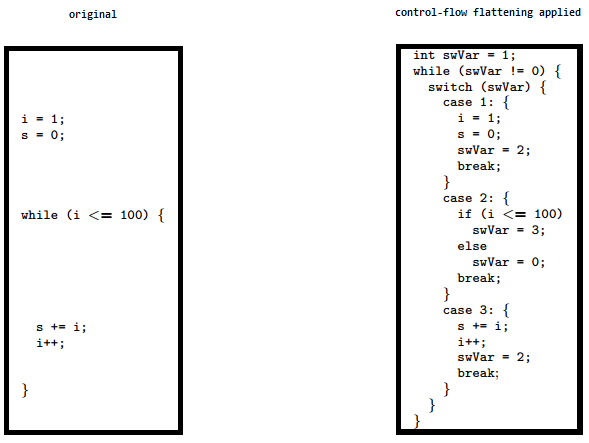

# iOS のアンチリバース防御

## 概要

この章では機密データや機能を処理したり、アクセスを許可するアプリに推奨される多層防御対策について説明します。調査によると [多くの App Store アプリにはこれらの対策が含まれていることがよくあります](https://seredynski.com/articles/a-security-review-of-1-300-appstore-applications "A security review of 1,300 AppStore applications - 5 April 2020") 。

アプリの不正改竄やコードのリバースエンジニアリングによって引き起こされるリスクの評価に基づいて、必要に応じてこれらの対策を適用すべきです。

- アプリはこれらの対策を決してセキュリティコントロールの代わりとして使用してはいけません。つまり、別の MASVS セキュリティコントロールなど、他の基本的なセキュリティ対策を満たすことが期待されます。
- アプリはこれらの対策を個別に使用するのではなく、巧みに組み合わせるべきです。その目的はリバースエンジニアがさらなる解析を行うことを阻止することです。
- アプリにいくつかのコントロールを統合すると、アプリの複雑さが増し、パフォーマンスに影響を与えることがあります。

リバースエンジニアリングとコード変更の原則と技術的リスクについての詳細は以下の OWASP ドキュメントを参照してください。

- [OWASP Architectural Principles That Prevent Code Modification or Reverse Engineering](https://wiki.owasp.org/index.php/OWASP_Reverse_Engineering_and_Code_Modification_Prevention_Project "OWASP Architectural Principles That Prevent Code Modification or Reverse Engineering")
- [OWASP Technical Risks of Reverse Engineering and Unauthorized Code Modification](https://wiki.owasp.org/index.php/Technical_Risks_of_Reverse_Engineering_and_Unauthorized_Code_Modification "OWASP Technical Risks of Reverse Engineering and Unauthorized Code Modification")

### 一般的な免責事項

**これらの対策のいずれが欠けても、脆弱性を生み出すことはありません** 。むしろ、リバースエンジニアリングや特定のクライアントサイド攻撃に対するアプリの耐性を高めることを目的としています。

リバースエンジニアは常にデバイスにフルアクセスできるので (十分な時間とリソースがあれば) 必ず勝利できるため、これらの対策はいずれも 100% の効果を保証するものではありません。

たとえば、デバッグを防止することは事実上不可能です。アプリを公開している場合、攻撃者の完全な制御下にある信頼できないデバイス上で実行される可能性があります。非常に意志の固い攻撃者はアプリバイナリにパッチを当てるか Frida などのツールを使用して実行時にアプリの動作を動的に変更して、最終的にアプリのアンチデバッグ制御をすべてバイパスするでしょう。

### 脱獄検出

脱獄検出メカニズムがリバースエンジニアリング防御に追加されると、脱獄済みデバイス上でのアプリ実行がより困難になります。これによりリバースエンジニアが使用したいツールや技法の一部がブロックされます。他のほとんどの種類の防御の場合と同様に、脱獄検出自体はあまり効果的ではありませんが、アプリのソースコード全体にチェックを分散されることで改竄防止スキーム全体の有効性を向上させることができます。

> 脱獄検出やルート検出についての詳細は Dana Geist と Marat Nigmatullin による調査研究 ["Jailbreak/Root Detection Evasion Study on iOS and Android"](https://github.com/crazykid95/Backup-Mobile-Security-Report/blob/master/Jailbreak-Root-Detection-Evasion-Study-on-iOS-and-Android.pdf "Jailbreak/Root Detection Evasion Study on iOS and Android") を参照してください。

#### 一般的な脱獄検出チェック

ここでは三つの典型的な脱獄検出技法を紹介します。

**ファイルベースのチェック:**

アプリは以下のような脱獄に関連する典型的なファイルやディレクトリをチェックしてみる可能性があります。

```default
/Applications/Cydia.app
/Applications/FakeCarrier.app
/Applications/Icy.app
/Applications/IntelliScreen.app
/Applications/MxTube.app
/Applications/RockApp.app
/Applications/SBSettings.app
/Applications/WinterBoard.app
/Applications/blackra1n.app
/Library/MobileSubstrate/DynamicLibraries/LiveClock.plist
/Library/MobileSubstrate/DynamicLibraries/Veency.plist
/Library/MobileSubstrate/MobileSubstrate.dylib
/System/Library/LaunchDaemons/com.ikey.bbot.plist
/System/Library/LaunchDaemons/com.saurik.Cydia.Startup.plist
/bin/bash
/bin/sh
/etc/apt
/etc/ssh/sshd_config
/private/var/lib/apt
/private/var/lib/cydia
/private/var/mobile/Library/SBSettings/Themes
/private/var/stash
/private/var/tmp/cydia.log
/var/tmp/cydia.log
/usr/bin/sshd
/usr/libexec/sftp-server
/usr/libexec/ssh-keysign
/usr/sbin/sshd
/var/cache/apt
/var/lib/apt
/var/lib/cydia
/usr/sbin/frida-server
/usr/bin/cycript
/usr/local/bin/cycript
/usr/lib/libcycript.dylib
/var/log/syslog
```

**ファイルパーミッションのチェック:**

アプリはアプリケーションのサンドボックスの外にある場所に書き込もうとしてみる可能性があります。たとえば、`/private` ディレクトリにファイルを作成しようとするかもしれません。ファイルが正常に作成された場合、アプリはデバイスが脱獄されていると判断できます。

```swift
do {
    let pathToFileInRestrictedDirectory = "/private/jailbreak.txt"
    try "This is a test.".write(toFile: pathToFileInRestrictedDirectory, atomically: true, encoding: String.Encoding.utf8)
    try FileManager.default.removeItem(atPath: pathToFileInRestrictedDirectory)
    // Device is jailbroken
} catch {
    // Device is not jailbroken
}
```

**プロトコルハンドラのチェック:**

アプリは `cydia://` ([Cydia](../tools/ios/MASTG-TOOL-0047.md) をインストール後にデフォルトで利用可能) などのよく知られたプロトコルハンドラを呼び出してみる可能性があります。

```swift
if let url = URL(string: "cydia://package/com.example.package"), UIApplication.shared.canOpenURL(url) {
    // Device is jailbroken
}
```

#### 自動化された脱獄検出のバイパス

一般的な脱獄検出メカニズムをバイパスする最も迅速な方法は [objection](../tools/generic/MASTG-TOOL-0038.md) です。脱獄バイパスの実装は [jailbreak.ts script](https://github.com/sensepost/objection/blob/master/agent/src/ios/jailbreak.ts "jailbreak.ts") にあります。

#### 手動の脱獄検出のバイパス

自動バイパスが有効でない場合、自ら手を動かしてアプリバイナリをリバースエンジニアリングし、検出の原因となるコード部分を見つけ、静的にパッチを当てるかランタイムフックを適用して無効にする必要があります。

**Step 1: リバースエンジニアリング:**

バイナリをリバースエンジニアリングして脱獄検出を探す必要がある場合、最も明白な方法は "jail" や "jailbreak" といった既知の文字列を検索することです。耐性対策が施されている場合や開発者がそのような明白な用語を避けている場合には特に、これは常に有効であるとは限らないことに注意してください。

例: [DVIA-v2](../apps/ios/MASTG-APP-0024.md) をダウンロードして unzip し、メインバイナリを [radare2 for iOS](../tools/ios/MASTG-TOOL-0073.md) にロードして解析が完了するまで待ちます。

```sh
r2 -A ./DVIA-v2-swift/Payload/DVIA-v2.app/DVIA-v2
```

これで `is` コマンドを使用してバイナリのシンボルを一覧表示し、文字列 "jail" に対して大文字小文字を区別しない grep (`~+`) を適用できるようになります。

```sh
[0x1001a9790]> is~+jail
...
2230  0x001949a8 0x1001949a8 GLOBAL FUNC 0        DVIA_v2.JailbreakDetectionViewController.isJailbroken.allocator__Bool
7792  0x0016d2d8 0x10016d2d8 LOCAL  FUNC 0        +[JailbreakDetection isJailbroken]
...
```

ご覧のように、シグネチャ `-[JailbreakDetectionVC isJailbroken]` を持つインスタンスメソッドがあります。

**Step 2: 動的フック:**

ここで Frida を使用して、いわゆる early instrumentation、つまり起動時に関数の実装を置き換えることで脱獄検出をバイパスできるようになります。

ホストコンピュータ上で `frida-trace` を使用します。

```bash
frida-trace -U -f /Applications/DamnVulnerableIOSApp.app/DamnVulnerableIOSApp  -m "-[JailbreakDetectionVC isJailbroken]"
```

これによりアプリを起動し、`-[JailbreakDetectionVC isJailbroken]` への呼び出しをトレースし、一致する要素ごとに JavaScript フックを作成します。
お気に入りのエディタで `./__handlers__/__JailbreakDetectionVC_isJailbroken_.js` を開き、 `onLeave` コールバック関数を編集します。 `retval.replace()` を使用して返り値を置き換えるだけで常に `0` を返すようにできます。

```javascript
onLeave: function (log, retval, state) {
    console.log("Function [JailbreakDetectionVC isJailbroken] originally returned:"+ retval);
    retval.replace(0);
    console.log("Changing the return value to:"+retval);
}
```

これにより以下の結果が得られます。

```bash
$ frida-trace -U -f /Applications/DamnVulnerableIOSApp.app/DamnVulnerableIOSApp  -m "-[JailbreakDetectionVC isJailbroken]:"

Instrumenting functions...                                           `...
-[JailbreakDetectionVC isJailbroken]: Loaded handler at "./__handlers__/__JailbreakDetectionVC_isJailbroken_.js"
Started tracing 1 function. Press Ctrl+C to stop.

Function [JailbreakDetectionVC isJailbroken] originally returned:0x1
Changing the return value to:0x0
```

### アンチデバッグ検出

デバッガを使用してアプリケーションを探索することはリバース時の非常に強力なテクニックです。機密データを含む変数を追跡し、アプリケーションのコントロールフローを変更するだけでなく、メモリやレジスタの読み取りと改変もできます。

iOS に適用可能なアンチデバッグテクニックがいくつかあり、予防的または対処的に分類できます。アプリ全体に適切に分散されている場合、これらのテクニックは全体的な耐性を高めるための二次的または支援的な施策として機能します。

- 予防的テクニックはデバッガがアプリケーションにアタッチできないようにするための最初の防御線として機能します。
- 対処的テクニックはアプリケーションがデバッガの存在を検出し、通常の動作から逸脱する機会を得ることができます。

#### ptrace の使用

[デバッグ (Debugging)](../techniques/ios/MASTG-TECH-0084.md) にあるように、iOS XNU カーネルは `ptrace` システムコールを実装していますが、プロセスを適切にデバッグするために必要となる機能のほとんどを欠如しています (例えば、アタッチやステップ実行は可能ですが、メモリやレジスタの読み取りや書き込みはできません) 。

ですが、 `ptrace` syscall の iOS 実装には非標準で非常に便利な機能が含まれています。プロセスのデバッグを防止するのです。この機能は `PT_DENY_ATTACH` として実装されており、 [公式の BSD システムコールマニュアル](https://developer.apple.com/library/archive/documentation/System/Conceptual/ManPages_iPhoneOS/man2/ptrace.2.html "PTRACE(2)") で説明されています。簡単に言うと、他のデバッガが呼び出し側プロセスにアタッチできないことを保証します。デバッガがアタッチしようとすると、そのプロセスは終了します。 `PT_DENY_ATTACH` の使用はかなりよく知られているアンチデバッグテクニックであるため、 iOS ペンテスト時によく遭遇する可能性があります。

> 詳細に入る前に、 `ptrace` は公開 iOS API の一部ではないことを知っておくことが重要です。非公開 API は禁止されており、 App Store はそれらを含むアプリを拒否する可能性があります。このため、 `ptrace` はコード内で直接呼び出されることはありません。これは `dlsym` を介して `ptrace` 関数ポインタを取得された際に呼び出されます。

以下は上記ロジックの実装例です。

```objectivec
#import <dlfcn.h>
#import <sys/types.h>
#import <stdio.h>
typedef int (*ptrace_ptr_t)(int _request, pid_t _pid, caddr_t _addr, int _data);
void anti_debug() {
  ptrace_ptr_t ptrace_ptr = (ptrace_ptr_t)dlsym(RTLD_SELF, "ptrace");
  ptrace_ptr(31, 0, 0, 0); // PTRACE_DENY_ATTACH = 31
}
```

**バイパス:** このテクニックをバイパスする方法を示すために、このアプローチを実装する逆アセンブルされたバイナリの例を使用します。


バイナリで何が起きているかを見てみましょう。第二引数 (レジスタ R1) に `ptrace` を指定して `dlsym` が呼び出されます。レジスタ R0 の戻り値はオフセット 0x1908A でレジスタ R6 に移動されます。オフセット 0x19098 で、 BLX R6 命令を使用してレジスタ R6 のポインタ値が呼び出されます。 `ptrace` 呼び出しを無効にするには、 `BLX R6` 命令 (リトルエンディアンで `0xB0 0x47`) を `NOP` 命令 (リトルエンディアンで `0x00 0xBF`) に置き換える必要があります。パッチを適用すると、コードは以下のようになります。


[Armconverter.com](http://armconverter.com/ "Armconverter") はバイトコードと命令ニーモニック間の変換を行うための便利なツールです。

他の ptrace ベースのアンチデバッグテクニックに対するバイパスは ["Defeating Anti-Debug Techniques: macOS ptrace variants" by Alexander O'Mara](https://alexomara.com/blog/defeating-anti-debug-techniques-macos-ptrace-variants/ "Defeating Anti-Debug Techniques: macOS ptrace variants") を参照してください。

#### sysctl の使用

呼び出し側プロセスにアタッチされているデバッガを検出する別のアプローチには `sysctl` があります。 Apple のドキュメントによると、プロセスがシステム情報を設定する (適切な権限を持つ場合) 、または単にシステム情報を取得する (プロセスがデバッグされているかどうかなど) ことが可能です。ただし、アプリが `sysctl` を使用しているという事実だけがアンチデバッグコントロールの指標である可能性があることに注意します。これは [常にそうであるとは限りません](http://www.cocoawithlove.com/blog/2016/03/08/swift-wrapper-for-sysctl.html "Gathering system information in Swift with sysctl") 。

[Apple ドキュメントアーカイブ](https://developer.apple.com/library/content/qa/qa1361/_index.html "How do I determine if I\'m being run under the debugger?") には、適切なパラメータを使用して `sysctl` の呼び出しにより返された `info.kp_proc.p_flag` フラグをチェックする例があります。Apple によると、 [プログラムのデバッグビルド](https://developer.apple.com/library/archive/qa/qa1361/_index.html "Detecting the Debugger") 以外には **このコードを使用すべきではありません** 。

**バイパス:** このチェックをバイパスする方法の一つはバイナリにパッチを適用することです。上記のコードをコンパイルすると、コードの後半の逆アセンブル版は以下のようになります。


オフセット 0xC13C の `MOVNE R0, #1` 命令をパッチして `MOVNE R0, #0` (バイトコードで 0x00 0x20) に変更した後、パッチされたコードは以下のようになります。


デバッガ自体を使用して `sysctl` の呼び出しにブレークポイントを設定することで `sysctl` チェックもバイパスできます。このアプローチは [iOS アンチデバッグ保護 #2](https://www.coredump.gr/articles/ios-anti-debugging-protections-part-2/ "iOS Anti-Debugging Protections #2") に記されています。

#### getppid の使用

iOS 上のアプリケーションは親の PID を確認することによりデバッガから起動されたかどうかを検出できます。通常、アプリケーションは [launchd](http://newosxbook.com/articles/Ch07.pdf) プロセスにより起動されます。これは _user モード_ で実行される最初のプロセスであり PID=1 です。しかし、デバッガがアプリケーションを起動すると、 `getppid` が `1` 以外の PID を返すことがわかります。この検出技法は以下で示すように Objective-C または Swift を使用して、 (syscalls を介して) ネイティブコードで実装できます。

```default
func AmIBeingDebugged() -> Bool {
    return getppid() != 1
}
```

**バイパス:** 他のテクニックと同様に、これにも簡単なバイパスがあります (バイナリにパッチを適用する、 Frida フックを使用するなど) 。

### ファイル完全性チェック

ファイル完全性をチェックするにはアプリケーションのソースコードの完全性チェックを使用するものとファイルストレージの完全性チェックを使用するものの二つの一般的なアプローチがあります。

#### アプリケーションのソースコードの完全性チェック

[デバッグ (Debugging)](../techniques/ios/MASTG-TECH-0084.md) では、iOS IPA アプリケーションの署名チェックについて説明しています。また、リバースエンジニアは開発者証明書やエンタープライズ証明書を使用してアプリを再パッケージおよび再署名することで、このチェックをバイパスできることも学びました。これをより困難にする方法のひとつは、署名が実行時に一致するかどうかをチェックするカスタムチェックを追加することです。

Apple は DRM を使用して完全性チェックを行います。しかし、 (以下の例にあるように) 制御を追加できます。 `mach_header` を解析し、署名を生成するために使用される命令データの開始を計算します。次に、署名を与えられたものと比較します。生成された署名がどこに格納もしくはコード化されているか確認します。

```c
int xyz(char *dst) {
    const struct mach_header * header;
    Dl_info dlinfo;

    if (dladdr(xyz, &dlinfo) == 0 || dlinfo.dli_fbase == NULL) {
        NSLog(@" Error: Could not resolve symbol xyz");
        [NSThread exit];
    }

    while(1) {

        header = dlinfo.dli_fbase;  // Pointer on the Mach-O header
        struct load_command * cmd = (struct load_command *)(header + 1); // First load command
        // Now iterate through load command
        //to find __text section of __TEXT segment
        for (uint32_t i = 0; cmd != NULL && i < header->ncmds; i++) {
            if (cmd->cmd == LC_SEGMENT) {
                // __TEXT load command is a LC_SEGMENT load command
                struct segment_command * segment = (struct segment_command *)cmd;
                if (!strcmp(segment->segname, "__TEXT")) {
                    // Stop on __TEXT segment load command and go through sections
                    // to find __text section
                    struct section * section = (struct section *)(segment + 1);
                    for (uint32_t j = 0; section != NULL && j < segment->nsects; j++) {
                        if (!strcmp(section->sectname, "__text"))
                            break; //Stop on __text section load command
                        section = (struct section *)(section + 1);
                    }
                    // Get here the __text section address, the __text section size
                    // and the virtual memory address so we can calculate
                    // a pointer on the __text section
                    uint32_t * textSectionAddr = (uint32_t *)section->addr;
                    uint32_t textSectionSize = section->size;
                    uint32_t * vmaddr = segment->vmaddr;
                    char * textSectionPtr = (char *)((int)header + (int)textSectionAddr - (int)vmaddr);
                    // Calculate the signature of the data,
                    // store the result in a string
                    // and compare to the original one
                    unsigned char digest[CC_MD5_DIGEST_LENGTH];
                    CC_MD5(textSectionPtr, textSectionSize, digest);     // calculate the signature
                    for (int i = 0; i < sizeof(digest); i++)             // fill signature
                        sprintf(dst + (2 * i), "%02x", digest[i]);

                    // return strcmp(originalSignature, signature) == 0;    // verify signatures match

                    return 0;
                }
            }
            cmd = (struct load_command *)((uint8_t *)cmd + cmd->cmdsize);
        }
    }

}
```

**バイパス:**

1. アンチデバッグ機能にパッチを当て、関連するコードを NOP 命令で上書きすることで望ましくない動作を無効にします。
2. コードの完全性を評価するために使用される保存されたハッシュにパッチを当てます。
3. Frida を使用してファイルシステム API をフックして、改変したファイルではなく元のファイルへのハンドルを返します。

#### ファイルストレージの完全性チェック

アプリはキーチェーン、`UserDefaults`/`NSUserDefaults`、任意のデータベースなど、特定のキーバリューペアやデバイス上に保存されているファイルに対して HMAC やシグネチャを作成することで、アプリケーションストレージ自体の完全性を確保することを選択することがあります。

たとえば、アプリには `CommonCrypto` で HMAC を生成する以下のようなコードが含まれているかもしれません。

```objectivec
    // Allocate a buffer to hold the digest and perform the digest.
    NSMutableData* actualData = [getData];
    //get the key from the keychain
    NSData* key = [getKey];
    NSMutableData* digestBuffer = [NSMutableData dataWithLength:CC_SHA256_DIGEST_LENGTH];
    CCHmac(kCCHmacAlgSHA256, [actualData bytes], (CC_LONG)[key length], [actualData bytes], (CC_LONG)[actualData length], [digestBuffer mutableBytes]);
    [actualData appendData: digestBuffer];
```

このスクリプトは以下の手順を実行します。

1. データを `NSMutableData` として取得します。
2. データキーを (一般的にキーチェーンから) 取得します。
3. ハッシュ値を計算します。
4. ハッシュ値を実データに追加します。
5. 手順 4. の結果を格納します。

その後、以下のようにして HMAC を検証していることがあります。

```objectivec
  NSData* hmac = [data subdataWithRange:NSMakeRange(data.length - CC_SHA256_DIGEST_LENGTH, CC_SHA256_DIGEST_LENGTH)];
  NSData* actualData = [data subdataWithRange:NSMakeRange(0, (data.length - hmac.length))];
  NSMutableData* digestBuffer = [NSMutableData dataWithLength:CC_SHA256_DIGEST_LENGTH];
  CCHmac(kCCHmacAlgSHA256, [actualData bytes], (CC_LONG)[key length], [actualData bytes], (CC_LONG)[actualData length], [digestBuffer mutableBytes]);
  return [hmac isEqual: digestBuffer];
```

1. メッセージと HMAC バイトを個別の `NSData` として抽出します。
2. `NSData` で HMAC を生成する手順 1-3 を繰り返します。
3. 抽出された HMAC バイトを手順 1 の結果と比較します。

注: アプリがファイルの暗号化も行う場合には、 [Authenticated Encryption](https://web.archive.org/web/20210804035343/https://cseweb.ucsd.edu/~mihir/papers/oem.html "Authenticated Encryption: Relations among notions and analysis of the generic composition paradigm") で説明されているように、暗号化してから HMAC を計算するようにします。

**バイパス:**

1. ["デバイスバインディング"](#device-binding) セクションで説明されているように、デバイスからデータを取得します。
2. 取得したデータを改変してストレージに戻します。

### リバースエンジニアリングツール検出

リバースエンジニアが一般的に使用するツール、フレームワーク、アプリの存在はリバースエンジニアアプリの試みを示していると考えられます。これらのツールには脱獄済みデバイスでのみ実行できるものもあれば、アプリを強制的にデバッグモードにしたり、モバイルフォンのバックグラウンドサービスの開始に依存するものもあります。したがって、リバースエンジニアリング攻撃を検出し、それ自体を終了させるなどの対応を実装する方法はさまざまです。

関連するアプリケーションパッケージ、ファイル、プロセス、またはその他のツール固有の改変や成果物を探すことで、改変されていない形式でインストールされている一般的なリバースエンジニアリングツールを検出できます。以下の例では、 Frida 計装フレームワークを検出するさまざまな方法について説明します。 Frida 計装フレームワークはこのガイドと現実世界でも広く使用されています。 Cydia Substrate や Cycript などの他のツールも同様に検出できます。インジェクション、フッキング、 DBI (動的バイナリ計装) ツールは、以下で説明する実行時完全性チェックを通じて暗黙的に検出できることが多いことに注意します。

**バイパス:**

リバースエンジニアリングツールの検出をバイパスする際には以下の手順を参照にしてください。

1. アンチリバースエンジニアリング機能にパッチを当てます。radare2/[iaito](https://github.com/radareorg/iaito "iaito") や Ghidra を使用してバイナリにパッチを当て、望ましくない動作を無効にします。
2. Frida や Cydia Substrate を使用して、Objective-C/Swift やネイティブレイヤでファイルシステム API を フックします。改変されたファイルではなく、元のファイルのハンドルを返します。

#### Frida の検出

Frida は脱獄済みデバイス上ではデフォルト設定 (インジェクションモード) で frida-server という名前で動作します。ターゲットアプリに明示的に (frida-trace や Frida CLI などを介して) アタッチすると、 Frida はアプリのメモリ内に frida-agent を注入します。したがって、アプリにアタッチした後 (前ではありません) では、それが見つかるはずです。 Android では、 `proc` ディレクトリのプロセス ID のメモリマップ (`/proc/<pid>/maps`) で文字列 "frida" を grep するだけなので、これを検証するのは非常に簡単です。
しかし、 iOS では `proc` ディレクトリが利用できませんが、関数 `_dyld_image_count` を利用してアプリにロードされている動的ライブラリを一覧表示できます。

Frida はいわゆる組み込みモードでも動作できます。これは脱獄済みではないデバイスでも機能します。 [frida-gadget](https://www.frida.re/docs/gadget/ "Frida Gadget") を IPA に組み込み、それをネイティブライブラリの一つとしてロードすることをアプリに _強制_ します。

ARM コンパイルされたバイナリやその外部ライブラリなどのアプリケーションの静的コンテンツは `<Application>.app` ディレクトリ内に保存されます。 `/var/containers/Bundle/Application/<UUID>/<Application>.app` ディレクトリのコンテンツを調べると、組み込まれた frida-gadget が FridaGadget.dylib として見つかります。

```bash
iPhone:/var/containers/Bundle/Application/AC5DC1FD-3420-42F3-8CB5-E9D77C4B287A/SwiftSecurity.app/Frameworks root# ls -alh
total 87M
drwxr-xr-x 10 _installd _installd  320 Nov 19 06:08 ./
drwxr-xr-x 11 _installd _installd  352 Nov 19 06:08 ../
-rw-r--r--  1 _installd _installd  70M Nov 16 06:37 FridaGadget.dylib
-rw-r--r--  1 _installd _installd 3.8M Nov 16 06:37 libswiftCore.dylib
-rw-r--r--  1 _installd _installd  71K Nov 16 06:37 libswiftCoreFoundation.dylib
-rw-r--r--  1 _installd _installd 136K Nov 16 06:38 libswiftCoreGraphics.dylib
-rw-r--r--  1 _installd _installd  99K Nov 16 06:37 libswiftDarwin.dylib
-rw-r--r--  1 _installd _installd 189K Nov 16 06:37 libswiftDispatch.dylib
-rw-r--r--  1 _installd _installd 1.9M Nov 16 06:38 libswiftFoundation.dylib
-rw-r--r--  1 _installd _installd  76K Nov 16 06:37 libswiftObjectiveC.dylib
```

Frida が _残した_ これらの _トレース_ を見ると、 Frida を検出することは簡単な作業であると想像できることでしょう。そしてこれらのライブラリを検出することは簡単ですが、そのような検出をバイパスすることも同様に簡単です。ツールの検出はいたちごっこであり、事態はさらに複雑になるかもしれません。以下の表は典型的な Frida 検出方法とその有効性について簡単な説明をまとめたものです。

<div style="page-break-after: always;">
</div>

> [iOS Security Suite](https://github.com/securing/IOSSecuritySuite "iOS Security Suite") には以下の検出方法の一部が実装されています。

| 手法 | 説明 | 考察 |
| --- | --- | --- |
| **関連する成果物がないか環境をチェックする**  | 成果物にはパッケージ化されたファイル、バイナリ、ライブラリ、プロセス、一時ファイルがあります。 Frida の場合、これはターゲット (脱獄済み) システムで動作している frida-server (TCP 経由で Frida を公開するためのデーモン) 、またはアプリによりロードされた frida ライブラリです。 | 脱獄されていないデバイス上の iOS アプリでは実行中のサービスを検査することはできません。 Swift メソッド [CommandLine](https://developer.apple.com/documentation/swift/commandline "CommandLine") は iOS 上での実行中のプロセスに関する情報を照会することはできませんが、 [NSTask](https://stackoverflow.com/a/56619466 "How can I run Command Line commands or tasks with Swift in iOS?") を使用するなどの非公式な方法があります。とはいえ、この手法を使用すると、 App Store レビュープロセスでアプリがリジェクトされるでしょう。 iOS アプリ内で実行中のプロセスの照会やシステムコマンドの実行に使用できる他の公開 API はありません。仮に可能であるとしても、これをバイパスすることは簡単であり、対応する Frida 成果物 (frida-server/frida-gadget/frida-agent) の名前を変更するだけです。 Frida を検出するもう一つの方法は、ロードされたライブラリのリストをウォークスルーして、疑わしいもの (名前に "frida" を含むものなど) をチェックすることです。これは `_dyld_get_image_name` を使用して実行できます。 |
| **TCP ポートが開いているかをチェックする** | frida-server プロセスはデフォルトで TCP ポート 27042 にバインドされています。このポートが開いているかどうかをテストすることがデーモンを検出するもう一つの方法です。 | この手法はデフォルトモードでの frida-server を検出しますが、リスニングポートはコマンドライン引数で変更できるため、これをバイパスすることは非常に簡単です。 |
| **D-Bus Auth に応答するポートをチェックする** | `frida-server` は D-Bus プロトコルを使用して通信するため、 D-Bus AUTH に応答することが期待できます。開いているすべてのポートに D-Bus AUTH メッセージを送信し、 `frida-server` がそれ自体を明らかにすることを期待して回答をチェックします。 | これは `frida-server` を検出するかなり堅牢な方法ですが、 Frida は frida-server を必要としない代替の操作モードを提供しています。 |

この表は完全ではないことを忘れないでください。例えば、他に二つの検出メカニズムが考えられます。

- [名前付きパイプ](https://en.wikipedia.org/wiki/Named_pipe "Named Pipes") の検出 (frida-server が外部通信に使用しています)
- [トランポリン](https://en.wikipedia.org/wiki/Trampoline_%28computing%29 "Trampolines") の検出 (iOS アプリでのトランポリンを検出するための詳細な説明とサンプルコードについては ["iOS アプリケーションでの SSL 証明書ピンニングのバイパスを防止する"](https://www.guardsquare.com/en/blog/iOS-SSL-certificate-pinning-bypassing "Prevent bypassing of SSL certificate pinning in iOS applications") を参照してください)

いずれも Substrate や Frida's Interceptor を検出するのに _役立ち_ ますが、たとえば、 Frida's Stalker に対しては効果的ではありません。これらの各検出方法が成功するかどうかは、脱獄済みデバイスを使用しているかどうか、特定バージョンの脱獄および手法やツール自体のバージョンにより依存することを忘れないでください。最後に、これはコントロールされていない環境 (エンドユーザーのデバイス) で処理されているデータを保護するいたちごっこの一部です。

### エミュレータ検出

エミュレータ検出の目標はエミュレートされたデバイス上でアプリを実行する難易度を上げることです。これにより、リバースエンジニアはエミュレータチェックを無効にするか、物理デバイスを利用することを余儀なくされ、大規模なデバイス解析に必要なアクセスができなくなります。

セキュリティテスト入門の章の [iOS シミュレータ上でのテスト](0x06b-iOS-Security-Testing.md#testing-on-the-ios-simulator "Testing on the iOS Simulator") セクションで説明したように、利用可能なシミュレータは Xcode に同梱されているものだけです。シミュレータバイナリは ARM コードではなく x86 コードにコンパイルされており、実デバイス (ARM アーキテクチャ) 用にコンパイルされたアプリはシミュレータでは動作しないため、幅広い _エミュレーション_ 選択肢が利用できる Android とは対照的に、 iOS アプリに関して _シミュレーション_ 保護はそれほど気にする必要はありませんでした。

しかし、 [Corellium](https://www.corellium.com/) (商用ツール) はそのリリース以来、リアルエミュレーションを可能にし、 [iOS シミュレータとは一線を画しています](https://www.corellium.com/compare/ios-simulator "Corellium vs Apple\'s iOS Simulator") 。それに加えて、SaaS ソリューションであるため、Corellium は資金的な制約のみで大規模なデバイス解析が可能です。

Apple Silicon (ARM) ハードウェアが広く普及しているため、x86 / x64 アーキテクチャの存在を確認する従来のチェックでは不十分なことがあります。潜在的な検出戦略の一つとして一般的に使用されるエミュレーションソリューションで利用可能な機能と制限を特定することがあります。たとえば、Corellium は iCloud、セルラーサービス、カメラ、NFC、Bluetooth、App Store アクセス、GPU ハードウェアエミュレーション ([Metal](https://developer.apple.com/documentation/metal/gpu_devices_and_work_submission/getting_the_default_gpu "Apple Metal Framework")) をサポートしていません。したがって、これらの機能のいずれかを含むチェックを賢く組み合わせることで、エミュレートされた環境の存在を示す指標となる可能性があります。

これらの結果と [iOS Security Suite](https://github.com/securing/IOSSecuritySuite#emulator-detector-module), [Trusteer](https://www.ibm.com/products/trusteer-mobile-sdk/details) などのサードパーティフレームワーク、あるいは [Appdome](https://www.appdome.com/) (商用ソリューション) のようなノーコードソリューションを組み合わせれば、エミュレータを利用した攻撃に対して優れた防御策を提供するでしょう。

### 難読化

["モバイルアプリの改竄とリバースエンジニアリング"](0x04c-Tampering-and-Reverse-Engineering.md#obfuscation) の章では一般的にモバイルアプリで使用できるよく知られた難読化技法をいくつか紹介しています。

#### 名前の難読化

標準コンパイラはソースコードのクラス名と関数名に基づいてバイナリシンボルを生成します。したがって、難読化が適用されない場合には、シンボル名は意味を持ち、アプリバイナリから直接簡単に読み取ることができます。例えば、脱獄を検出する関数は関連するキーワード ("jailbreak" など) を検索することで見つけることができます。以下のリストは [DVIA-v2](../apps/ios/MASTG-APP-0024.md) から逆アセンブルされた関数 `JailbreakDetectionViewController.jailbreakTest4Tapped` を示しています。

```assembly
__T07DVIA_v232JailbreakDetectionViewControllerC20jailbreakTest4TappedyypF:
stp        x22, x21, [sp, #-0x30]!
mov        rbp, rsp
```

難読化後は以下のリストに示すようにシンボルの名前が意味をなさなくなったことがわかります。

```assembly
__T07DVIA_v232zNNtWKQptikYUBNBgfFVMjSkvRdhhnbyyFySbyypF:
stp        x22, x21, [sp, #-0x30]!
mov        rbp, rsp
```

とはいえ、これは関数、クラス、フィールドの名前にのみ適用されます。実際のコードは変更されないままであるため、攻撃者は逆アセンブルされたバージョンの関数を読み取り、(たとえば、セキュリティアルゴリズムのロジックを取得するために) その目的を理解しようとすることができます。

#### 命令の差し替え

この技法は加算や減算などの標準的な二項演算子をより複雑な表現に置き換えます。例えば、加算 `x = a + b` は `x = -(-a) - (-b)` として表すことができます。ただし、同じ置換表現を使用することで簡単に元に戻すことができるため、単一のケースに複数の差し替え技法を追加して、ランダム因子を導入することをお勧めします。この技法は難読化解除に対して脆弱ですが、差し替えの複雑さと深さによっては適用に時間がかかることがあります。

#### 制御フローの平坦化

制御フローの平坦化は元のコードをより複雑な表現に置き換えます。この変換は関数の本体を基本ブロックに分割し、プログラムフローを制御する switch ステートメントを使用して、それらすべてを単一の無限ループ内に配置します。これにより、通常はコードが読みやすくなる自然な条件構造が削除されるため、プログラムフローをたどることが著しく困難になります。



この画像は制御フローの平坦化がコードをどのように変更するかを示しています。詳細については ["制御フローの平坦化による C++ プログラムの難読化"](https://web.archive.org/web/20240414202600/http://ac.inf.elte.hu/Vol_030_2009/003.pdf) を参照してください。

#### デッドコードインジェクション

この技法ではデッドコードをプログラムに挿入することにより、プログラムの制御フローがより複雑になります。デッドコードは元のプログラムの動作に影響を与えないコードのスタブですが、リバースエンジニアリングプロセスに対するオーバーヘッドを増加させます。

#### 文字列の暗号化

アプリケーションはハードコードされた鍵、ライセンス、トークン、エンドポイント URL とともにコンパイルされることがよくあります。デフォルトでは、これらはすべて、アプリケーションのバイナリのデータセクションにプレーンテキストで保存されます。この技法はこれらの値を暗号化し、プログラムにより使用される前にデータを復号化するコードのスタブをプログラムに挿入します。

#### 推奨ツール

- [SwiftShield](../tools/ios/MASTG-TOOL-0068.md) を使用して名前の難読化を実行できます。 Xcode プロジェクトのソースコードを読み取り、コンパイラが使用される前にクラス、メソッド、フィールドのすべての名前をランダムな値に置き換えます。
- [obfuscator-llvm](https://github.com/obfuscator-llvm) は中間表現 (Intermediate Representation, IR) で動作します。シンボルの難読化、文字列の暗号化、制御フローの平坦化に使用できます。 IR をベースとしているため、 SwiftShield と比較してアプリケーションの情報を大幅に隠すことができます。

iOS の難読化技法については記事 ["Protecting Million-User iOS Apps with Obfuscation: Motivations, Pitfalls, and Experience"](https://faculty.ist.psu.edu/wu/papers/obf-ii.pdf "Paper - Protecting Million-User iOS Apps with Obfuscation: Motivations, Pitfalls, and Experience") をご覧ください。

### デバイスバインディング

デバイスバインディングの目的は、デバイス A からデバイス B へアプリとその状態をコピーし、デバイス B 上でアプリの実行を継続しようとする攻撃者を妨害することです。デバイス A が信頼されていると判断された後、デバイス B よりも多くの権限を持つ可能性があります。アプリをデバイス A からデバイス B へコピーする際にこの状況を変更すべきではありません。

[iOS 7.0 以降](https://developer.apple.com/library/content/releasenotes/General/RN-iOSSDK-7.0/index.html "iOS 7 release notes")、ハードウェア識別子 (MAC アドレスなど) は制限されていますが、iOS でデバイスバインディングを実装する他の方法があります。

- **`identifierForVendor`**: `[[UIDevice currentDevice] identifierForVendor]` (Objective-C の場合), `UIDevice.current.identifierForVendor?.uuidString` (Swift3 の場合), `UIDevice.currentDevice().identifierForVendor?.UUIDString` (Swift2 の場合) を使用できます。同じベンダーの他のアプリをインストールした後にアプリを再インストールすると `identifierForVendor` の値は同じにならないことがあり、アプリバンドル名を更新すると変わることがあります。したがって、キーチェーン内の何かと組み合わせるのが最良です。
- **キーチェーンの使用**: アプリケーションのインスタンスを識別するためにキーチェーンに何かを保存できます。このデータがバックアップされないようにするには `kSecAttrAccessibleWhenPasscodeSetThisDeviceOnly` (データを保護し、パスコードや Touch ID の要件を適切に実施したい場合), `kSecAttrAccessibleAfterFirstUnlockThisDeviceOnly`, `kSecAttrAccessibleWhenUnlockedThisDeviceOnly` を使用します。
- **Google Instance ID の使用**: [iOS の実装はこちら](https://developers.google.com/instance-id/guides/ios-implementation "iOS implementation Google Instance ID") を参照してください。

これらのメソッドに基づくスキームはパスコードや Touch ID が有効で、キーチェーンやファイルシステムに保存されているマテリアルが保護クラス (`kSecAttrAccessibleAfterFirstUnlockThisDeviceOnly` や `kSecAttrAccessibleWhenUnlockedThisDeviceOnly` など) で保護されていて、 `SecAccessControlCreateFlags` が `kSecAccessControlDevicePasscode` (パスコード用), `kSecAccessControlUserPresence` (パスコード、Face ID または Touch ID), `kSecAccessControlBiometryAny` (Face ID または Touch ID), `kSecAccessControlBiometryCurrentSet` (Face ID / Touch ID: ただし、現在登録されている生体認証のみ) のいずれかに設定されているとより安全です。
