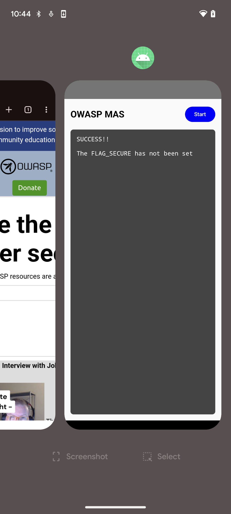
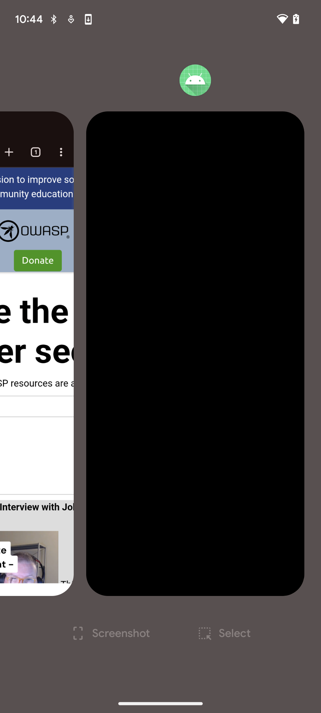

# MASTG-BEST-0014 スクリーンショットと画面録画を防止する (Preventing Screenshots and Screen Recording)

アプリが、スクリーンショット、画面録画、安全でないディスプレイ、タスクスイッチャのサムネイル、リモート画面共有から、カード番号やパスコードなど、機密コンテンツを隠していることを確認してください。マルウェアは画面出力をキャプチャし、機密情報を抽出する可能性があります。パスコードフィールドからキーストロークを漏洩する可能性があるため、スクリーンキーボードやカスタムキーパッドビューを保護してください。スクリーンショットは他のアプリやローカルの攻撃者がアクセスできる場所に保存される可能性があります。

ウィンドウに [`FLAG_SECURE`](https://developer.android.com/security/fraud-prevention/activities#flag_secure) を設定すると、スクリーンショットを防止 (または黒く表示) し、画面録画をブロックし、安全でないディスプレイとシステムタスクスイッチャのコンテンツを隠します。

<figure><figcaption>
<code>FLAG_SECURE</code> なし
</figcaption></figure> <figure><figcaption>
<code>FLAG_SECURE</code> あり
</figcaption></figure>

アプリに `FLAG_SECURE` を実装するには公式のドキュメントに従って、["機密性の高いアクティビティを保護する"](https://developer.android.com/security/fraud-prevention/activities) を参照してください。
