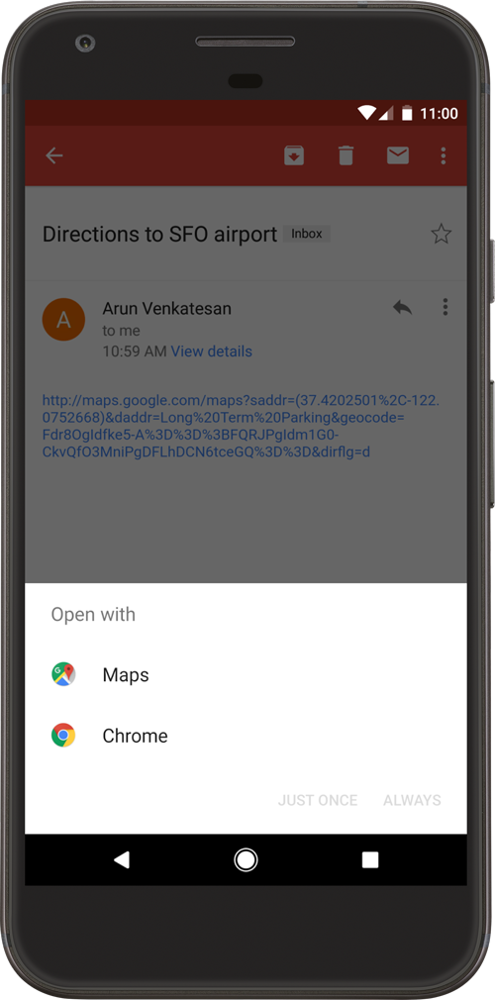

_ディープリンク_ はユーザーをアプリ内の特定のコンテンツに直接誘導するスキームの URI です。アプリは、Android Manifest に _インテントフィルタ_ を追加し、受信したインテントからデータを抽出してユーザーを適切なアクティビティに誘導することで、[ディープリンクをセットアップ](https://developer.android.com/training/app-links/deep-linking) できます。

For a large-scale analysis of how Android apps implement and handle deep links, see the research paper ["Measuring the Insecurity of Mobile Deep Links of Android"](https://people.cs.vt.edu/gangwang/deep17.pdf).

Android は二種類のディープリンクをサポートしています。

- **カスタム URL スキーム**: 任意のカスタム URL スキーム (例: `myapp://`) を使用するディープリンクです (OS による検証は行われません)。
- **Android アプリリンク** (Android 6.0 (API レベル 23) 以降):`http://` および `https://` スキームを使用し、`autoVerify` 属性 (OS による検証をトリガーします) を含むディープリンクです。

**ディープリンクの衝突:**

検証されていないディープリンクを使用すると、重大な問題を引き起こす可能性があります。ユーザーのデバイスにインストールされている他のアプリが同じインテントを宣言し、処理しようとする可能性があるためです。これは **ディープリンクの衝突** として知られています。任意のアプリケーションが他のアプリケーションに属するまったく同じディープリンクの制御を宣言できます。

Android の最新バージョンでは、いわゆる _曖昧性解消ダイアログ_ が表示され、ディープリンクを処理すべきアプリケーションを選択するようにユーザーに促します。ユーザーは正規のアプリケーションではなく悪意のあるものを選択するミスをする可能性があります。

**Android アプリリンク:**

ディープリンクの衝突問題を解決するため、Android 6.0 (API レベル 23) では [**Android アプリリンク**](https://developer.android.com/training/app-links) を導入しました。これは開発者が明示的に登録したウェブサイト URL に基づく [検証済みディープリンク](https://developer.android.com/training/app-links/verify-site-associations "Verify Android App Links") です。アプリリンクをクリックすると、インストール済みのアプリであればすぐにオープンします。

未検証のディープリンクとの主な違いは以下のとおりです。

- アプリリンクは `http://` および `https://` スキームのみを使用し、その他のカスタム URL スキームは許可されません。
- アプリリンクは [Digital Asset Links ファイル](https://developers.google.com/digital-asset-links/v1/getting-started "Digital Asset Link") を HTTPS 経由で提供するために、有効なドメインが必要です。
- アプリリンクはディープリンクの衝突が発生しないため、ユーザーが開いたときに曖昧性解消ダイアログを表示しません。

## Declaring Deep Links

Deep links are declared with [`<intent-filter>` elements](https://developer.android.com/guide/components/intents-filters#DataTest) on an `<activity>` in the `AndroidManifest.xml`. A browsable web deep link combines the `android.intent.action.VIEW` action, the `android.intent.category.DEFAULT` and `android.intent.category.BROWSABLE` categories, and one or more `<data>` elements that define the `scheme`, `host`, and `path`.

`<data>` elements within the same `<intent-filter>` are merged across all combinations of their attributes. See @MASTG-TECH-0172 for how to enumerate the resulting deep links.

## App Link Verification

An app opts into App Link verification by adding [`android:autoVerify="true"`](https://developer.android.com/training/app-links/verify-android-applinks) to the `<intent-filter>`. When the app is installed, Android reaches out to each declared `android:host` and checks the [Digital Asset Links file](https://developers.google.com/digital-asset-links/v1/getting-started) served at `https://<host>/.well-known/assetlinks.json`. A deep link is treated as an App Link only after this verification succeeds.

Verification depends on the Digital Asset Links file being reachable and correct:

- It must be served over HTTPS and list the app's package name and signing certificate fingerprint.
- A server-side redirect (for example, `http` to `https`, or `example.com` to `www.example.com`) [stops Android from verifying](https://developer.android.com/training/app-links/verify-android-applinks#fix-errors) the affected links.
- Each declared host, including every subdomain, needs its own file. A wildcard host (such as `*.example.com`) is verified against the file at the root domain.

The Android version also affects verification behavior:

- Before Android 12 (API level 31), a single [non-verifiable link](https://developer.android.com/training/app-links/verify-android-applinks#fix-errors) (for example, a missing `autoVerify`, an invalid Digital Asset Links file, or a custom URL scheme in a verified intent filter) can cause the system to skip verification for all of the app's App Links.
- Starting with Android 12 (API level 31), a generic web intent [resolves to the user's default browser](https://developer.android.com/training/app-links/deep-linking) unless the target app is approved for the specific domain in the intent.

You can inspect the verification state on a device as described in @MASTG-TECH-0174.

## Handling Incoming Deep Links

The activity declared for a deep link receives the incoming URI through the [`Intent`](https://developer.android.com/reference/android/content/Intent) that launched it. The handler typically obtains it with [`getIntent()`](https://developer.android.com/reference/android/app/Activity#getIntent()) followed by [`Intent.getData()`](https://developer.android.com/reference/android/content/Intent#getData()), or through [`onNewIntent()`](https://developer.android.com/reference/android/app/Activity#onNewIntent(android.content.Intent)) when the activity is already running.

Individual components of the resulting [`Uri`](https://developer.android.com/reference/android/net/Uri) are read with methods such as [`getQueryParameter()`](https://developer.android.com/reference/android/net/Uri#getQueryParameter(java.lang.String)), [`getPathSegments()`](https://developer.android.com/reference/android/net/Uri#getPathSegments()), and [`getLastPathSegment()`](https://developer.android.com/reference/android/net/Uri#getLastPathSegment()). See @MASTG-DEMO-0152 for a handler that reads a query parameter from an incoming deep link.

Unlike iOS, which exposes the caller's bundle identifier through the `sourceApplication` property, Android provides no built-in mechanism for a deep link handler to identify which app sent the Intent. Any app on the device can send an Intent that matches an exported intent filter.
