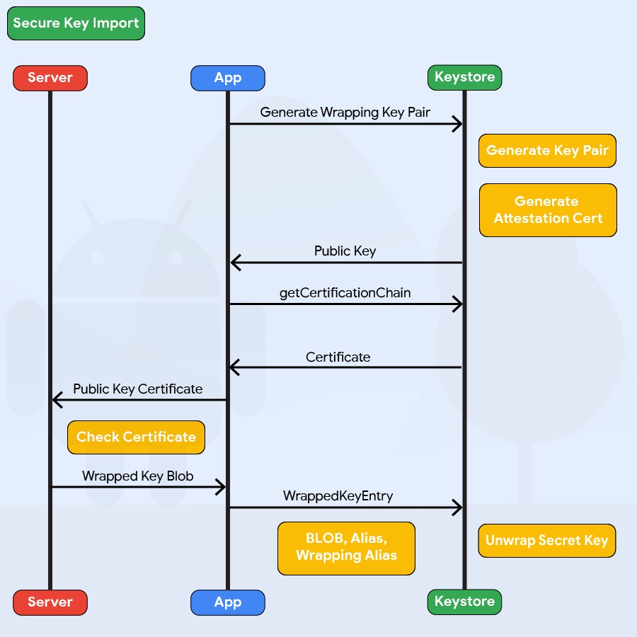

Android 9 (API レベル 28) では `AndroidKeystore` に鍵を安全にインポートする機能を追加しました。まず、`AndroidKeystore` は `PURPOSE_WRAP_KEY` を使用して鍵ペアを生成します。これもアテステーション証明書で保護する必要があります。このペアは `AndroidKeystore` にインポートされる鍵を保護することを目的としています。暗号化された鍵は `SecureKeyWrapper` 形式の ASN.1 エンコードされたメッセージとして生成されます。これはインポートされた鍵が使用方法の説明も含んでいます。その後、鍵はラッピング鍵を生成した特定のデバイスに属している `AndroidKeystore` ハードウェア内で復号化されるため、デバイスのホストメモリに平文として現れることはありません。



Java の例:

```java
KeyDescription ::= SEQUENCE {
    keyFormat INTEGER,
    authorizationList AuthorizationList
}

SecureKeyWrapper ::= SEQUENCE {
    wrapperFormatVersion INTEGER,
    encryptedTransportKey OCTET_STRING,
    initializationVector OCTET_STRING,
    keyDescription KeyDescription,
    secureKey OCTET_STRING,
    tag OCTET_STRING
}
```

上記のコードは SecureKeyWrapper 形式で暗号化された鍵を生成する際に設定するさまざまなパラメータを示しています。詳細については Android ドキュメントの [`WrappedKeyEntry`](https://developer.android.com/reference/android/security/keystore/WrappedKeyEntry "WrappedKeyEntry") をチェックしてください。

KeyDescription AuthorizationList を定義する際、以下のパラメータが暗号化される鍵のセキュリティに影響します。

- `algorithm` パラメータは鍵が使用される暗号アルゴリズムを指定します。
- `keySize` パラメータは鍵のサイズをビット単位で指定します。鍵のアルゴリズムに対する通常の方法で測定します。
- `digest` パラメータは署名および検証操作を実行するために鍵で使用できるダイジェストアルゴリズムを指定します。
