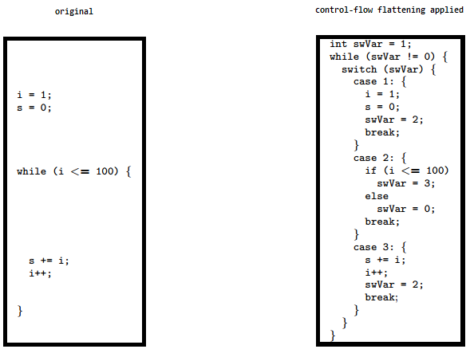

難読化とはコードやデータを変換して、より理解しにくくする (ときには逆アセンブルさえも難しくする) ためのプロセスです。これは通常、ソフトウェア保護スキームに不可欠なものです。難読化は単純にオンまたはオフにできるものではなく、プログラムの全体または一部を、多くの方法でさまざまな度合いで理解できないようにすることができます。

> [!NOTE]
> 以下に示すすべての技法は十分な時間と予算がある人があなたのアプリをリバースエンジニアリングすることを止められるものではありません。しかし、これらの技法を組み合わせることでその作業は著しく困難になります。したがって、その目的はリバースエンジニアがさらなる解析を実行することを思いとどまらせ、その努力に見合わないようにすることです。

アプリケーションの難読化には以下のような技法があります。

- 名前の難読化 (Name obfuscation)
- 命令の置換 (Instruction substitution)
- 制御フローの平坦化 (Control flow flattening)
- デッドコードインジェクション (Dead code injection)
- 文字列の暗号化 (String encryption)
- パッキング (Packing)

## 名前の難読化 (Name Obfuscation)

標準のコンパイラはソースコードからクラスメイト関数名を基にバイナリシンボルを生成します。したがって、難読化を行わなければ、シンボル名は意味があるままと残り、アプリのバイナリから簡単に抽出できます。たとえば、脱獄を検出する関数は関連するキーワード ("jailbreak" など) を検索することで見つけることができます。以下のリストは [DVIA-v2](../../../apps/ios/MASTG-APP-0024.md) から逆アセンブルされた関数 `JailbreakDetectionViewController.jailbreakTest4Tapped` を示しています。

```assembly
__T07DVIA_v232JailbreakDetectionViewControllerC20jailbreakTest4TappedyypF:
stp        x22, x21, [sp, #-0x30]!
mov        rbp, rsp
```

難読化した後では以下のリストが示すようにシンボルの名前はもはや意味をなさないことがわかります。

```assembly
__T07DVIA_v232zNNtWKQptikYUBNBgfFVMjSkvRdhhnbyyFySbyypF:
stp        x22, x21, [sp, #-0x30]!
mov        rbp, rsp
```

とはいえ、これは関数、クラス、フィールドの名前にのみ適用されます。実際のコードは変更されないままなので、攻撃者は逆アセンブルされたバージョンの関数を読み、その目的を理解しようと試みることが可能です (セキュリティアルゴリズムのロジックを取得するためなど) 。

## 命令の置換 (Instruction Substitution)

この技法は加算や減算などの標準的な二項演算子をより複雑な表現に置き換えるものです。たとえば、加算 `x = a + b` は `x = -(-a) - (-b)` と表現できます。しかし、同じ置換表現を使用すると簡単にリバースできてしまうので、一つのケースに対して複数の置換手法を追加し、ランダムな要素を導入することをお勧めします。この技法は逆コンパイル時にリバースできますが、置換の複雑さと深さによってはリバースに時間がかかるようになります。

## 制御フローの平坦化 (Control Flow Flattening)

制御フローの平坦化では元のコードをより複雑な表現に置き換えます。この変換では関数本体を基本的なブロックに分割し、それらをすべて単一の無限ループに配置し、switch ステートメントでプログラムフローを制御します。これにより通常はコードを読みやすくする自然な条件構造が削除されるため、プログラムフローをたどることが著しく困難になります。



この画像は制御フローの平坦化がどのようにコードを変更するかを示しています。詳細については ["Obfuscating C++ programs via control flow flattening"](https://web.archive.org/web/20240414202600/http://ac.inf.elte.hu/Vol_030_2009/003.pdf) を参照してください。

## デッドコードインジェクション (Dead Code Injection)

この技法はデッドコードをプログラムに注入することによってプログラムの制御フローをより複雑にします。デッドコードは元のプログラムの動作には影響を与えないが、リバースエンジニアリングプロセスのオーバーヘッドを増加させるコードのスタブです。

## 文字列の暗号化 (String Encryption)

アプリケーションはハードコードされた鍵、ライセンス、トークン、エンドポイント URL とともにコンパイルされることがよくあります。デフォルトでは、これらはすべて、アプリケーションのバイナリのデータセクションに平文で格納されます。この技法ではこれらの値を暗号化し、プログラムで使用される前にそのデータを復号化するコードのスタブをプログラムに注入します。

## パッキング (Packing)

[Packing](https://attack.mitre.org/techniques/T1027/002/) は元の実行可能ファイルを圧縮または暗号化して実行時に動的に復元する、動的書き換えの難読化技法です。実行可能ファイルをパッキングすると、署名ベースの検出を回避するためにファイル署名を変更します。
