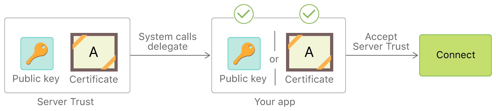

ATS は Transport Layer Security (TLS) プロトコルで規定されたデフォルトのサーバー信頼性評価を補完する拡張セキュリティチェックを課します。ATS 制限を緩めているとアプリのセキュリティが低下します。アプリは ATS 例外を追加する前に、サーバーセキュリティを向上させる別の方法を優先させるべきです。

[Apple Developer ドキュメント](https://developer.apple.com/documentation/security/preventing_insecure_network_connections) ではアプリは `URLSession` を使用してサーバー信頼性評価を自動的に処理できると説明しています。しかし、アプリはそのプロセスをカスタマイズすることもできます。たとえば、以下のことができます。

- 証明書の有効期限をバイパスまたはカスタマイズする。
- 信頼性を緩める/広げる: システムによって拒否されるようなサーバー資格情報を受け入れる。たとえば、アプリに埋め込まれた自己署名証明書を使用して開発サーバーにセキュア接続を行う。
- 信頼性を強める: システムによって受け入れられるサーバー資格証明を拒否します。
- その他

Whenever an app accesses [`URLAuthenticationChallenge`](https://developer.apple.com/documentation/foundation/urlauthenticationchallenge) — which only happens when it implements an authentication-challenge delegate method such as `urlSession(_:didReceive:completionHandler:)` or `webView(_:didReceive:completionHandler:)` — it has taken over part of the server trust evaluation from the system. This is true regardless of whether the implementation ultimately calls `SecTrustEvaluateWithError`: the mere presence of custom challenge handling means the default ATS-enforced evaluation is being supplemented or replaced, and every such code path should be reviewed manually.



参考情報:

- [Preventing Insecure Network Connections](https://developer.apple.com/documentation/security/preventing_insecure_network_connections)
- [Performing Manual Server Trust Authentication](https://developer.apple.com/documentation/foundation/url_loading_system/handling_an_authentication_challenge/performing_manual_server_trust_authentication)
- [Certificate, Key, and Trust Services](https://developer.apple.com/documentation/security/certificate_key_and_trust_services)

## Certificate Pinning

[Certificate pinning](../../../Document/0x04f-Testing-Network-Communication.md#restricting-trust-identity-pinning) allows an iOS app to reject certificates that don't match a specific expected identity, guarding against Machine-in-the-Middle (MITM) attacks even when an attacker controls a CA that is trusted by the system.

Because pinning is layered on top of standard HTTPS, it does not weaken the underlying TLS connection. The risk lies in misconfiguration rather than in the mechanism itself. If pins are not maintained correctly, for example pinning a public key without providing a backup pin, or failing to update the pinned values before the server's certificate or key is rotated, the app will reject otherwise valid connections and break communication with the affected endpoints. This makes pinning misconfiguration an availability risk for the APIs the app depends on. For more general details on pinning, refer to @MASWE-0047.

**Important Considerations:**

Certificate pinning is a **hardening practice**, but it's not foolproof. There are multiple ways an attacker can bypass it, such as:

- **Modifying the certificate validation logic** in the app's `URLSessionDelegate` or custom `SecTrust` evaluation.
- **Replacing pinned certificates** stored in the app bundle.
- **Altering or removing pins** in the `Info.plist` `NSPinnedDomains` configuration.

Any such modification **invalidates the app's code signature**, requiring the attacker to **re-sign the app**. To mitigate these risks, additional protections such as integrity checks and runtime verification may be required.

### Pinning via App Transport Security (ATS)

Apple's [Identity Pinning](https://developer.apple.com/news/?id=g9ejcf8y) feature lets you declare expected CA public key hashes directly in the `Info.plist` file under [`NSPinnedDomains`](https://developer.apple.com/documentation/bundleresources/information-property-list/nsapptransportsecurity/nspinneddomains). This is the recommended approach because it requires no code changes and is enforced by the system for connections made through the URL Loading System.

```xml
<key>NSAppTransportSecurity</key>
<dict>
    <key>NSPinnedDomains</key>
    <dict>
        <key>example.com</key>
        <dict>
            <key>NSIncludesSubdomains</key>
            <true/>
            <key>NSPinnedCAIdentities</key>
            <array>
                <dict>
                    <key>SPKI-SHA256-BASE64</key>
                    <string>+[BASE64-ENCODED SHA-256 HASH OF SUBJECT PUBLIC KEY INFO]</string>
                </dict>
            </array>
        </dict>
    </dict>
</dict>
```

The `NSPinnedCAIdentities` key pins an intermediate or root CA's public key. You can alternatively use `NSPinnedLeafIdentities` to pin the leaf (server) certificate's public key, though pinning to a CA is more resilient to certificate renewals.

**Important Considerations:**

- **Backup Pins:** Apple recommends including at least one backup pin (a different CA or leaf key) to maintain connectivity if the primary certificate changes unexpectedly.
- **No Expiration Support:** Unlike the Android Network Security Configuration, `NSPinnedDomains` doesn't support expiration dates. Developers must manage certificate rotation manually.
- **Scope:** ATS pinning applies only to connections made via the URL Loading System (for example, `URLSession`). It doesn't apply to `Network` framework, `CFNetwork`, or BSD socket connections.

### Pinning via Manual Server Trust Evaluation

Apps can implement pinning in code by implementing the [`URLSessionDelegate`](https://developer.apple.com/documentation/foundation/urlsessiondelegate) method [`urlSession(_:didReceive:completionHandler:)`](https://developer.apple.com/documentation/foundation/urlsessiondelegate/1409308-urlsession) to perform [manual server trust authentication](https://developer.apple.com/documentation/foundation/url_loading_system/handling_an_authentication_challenge/performing_manual_server_trust_authentication). This approach gives full programmatic control over which credentials to accept.

A typical implementation extracts the server's `SecTrust` from the authentication challenge, then compares the certificate's or public key's fingerprint against a hardcoded expected value.

**Important Note:** Manual trust evaluation is **error-prone**. Common mistakes include:

- Calling `completionHandler(.useCredential, ...)` unconditionally without verifying the certificate.
- Forgetting to call `completionHandler(.cancelAuthenticationChallenge, nil)` on mismatch, leaving the connection open.
- Using certificate-level pinning instead of public key pinning, which requires an app update on every certificate renewal.

### Pinning via Third-party Libraries

Several third-party libraries simplify certificate pinning on iOS:

- **[TrustKit](https://github.com/datatheorem/TrustKit)**: Configure public key hashes in `Info.plist` or in code. TrustKit swizzles `NSURLSession` and `NSURLConnection` delegates to enforce pinning transparently.
- **[Alamofire](https://github.com/Alamofire/Alamofire)**: Define a `ServerTrustManager` with a `PinnedCertificatesTrustEvaluator` or `PublicKeysTrustEvaluator` per domain. See the [Alamofire Security documentation](https://github.com/Alamofire/Alamofire/blob/master/Documentation/AdvancedUsage.md#security) for details.

These libraries typically provide higher-level abstractions over the `URLSession` delegate mechanism, but they may not cover all network traffic in the app (for example, traffic from native code or third-party SDKs with their own network stacks).

### Pinning in WebViews

`WKWebView` doesn't expose a direct API for certificate pinning equivalent to `URLSession`'s delegate. However, you can intercept navigation requests using [`WKNavigationDelegate`](https://developer.apple.com/documentation/webkit/wknavigationdelegate) and the method [`webView(_:didReceive:completionHandler:)`](https://developer.apple.com/documentation/webkit/wknavigationdelegate/1455638-webview) to perform custom trust evaluation, similar to the `URLSession` delegate approach.

Note that this method only covers top-level navigation challenges. Sub-resource loads (images, scripts, XHR) inside a `WKWebView` aren't covered, so this approach provides incomplete pinning coverage for web content.

### Pinning in Native Code

Pinning can also be implemented in native (C/C++) code using the Security framework's lower-level [`SecTrust`](https://developer.apple.com/documentation/security/certificate_key_and_trust_services/trust) APIs or via the `Network` framework. Embedding certificate or public key verification within compiled native libraries increases the difficulty of bypassing or modifying pinning via typical IPA reverse engineering, but it also makes maintenance and debugging more complex.

### Pinning in Cross-Platform Frameworks

Cross-platform frameworks (Flutter, React Native, Cordova, Xamarin) often require special considerations for certificate pinning, because they may use their own network stack instead of the platform's URL Loading System:

- **Flutter**: Uses Dart's `HttpClient` backed by BoringSSL, bypassing ATS entirely. Certificate pinning must be implemented at the Dart level using `SecurityContext` or a custom `badCertificateCallback`, or via a native plugin.
- **React Native**: Network requests go through the native iOS networking stack by default, so ATS and `URLSession`-based pinning can apply. Third-party plugins (for example, `react-native-ssl-pinning`) also exist.
- **Cordova / Ionic**: Requests from JavaScript are typically made through a `WKWebView`. See the WebViews section above, and also consider Cordova plugins that add native pinning support.

Understanding how a framework handles networking is crucial for ensuring that pinning is actually enforced.
