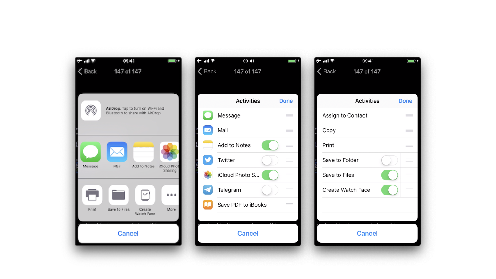

iOS 6 以降では、サードパーティアプリが [たとえば AirDrop などの](https://developer.apple.com/library/archive/documentation/iPhone/Conceptual/iPhoneOSProgrammingGuide/Inter-AppCommunication/Inter-AppCommunication.html#//apple_ref/doc/uid/TP40007072-CH6-SW3 "Supporting AirDrop") 特定のメカニズムを介してデータ (アイテム) を共有できます。ユーザーの視点から、この機能は「共有」ボタンをクリックした後に表示される、システム全体でよく知られている「共有アクティビティシート」です。

利用可能な組み込み共有メカニズム (アクティビティタイプ) には以下があります。

- airDrop
- assignToContact
- copyToPasteboard
- mail
- message
- postToFacebook
- postToTwitter

完全なリストは [UIActivity.ActivityType](https://developer.apple.com/documentation/uikit/uiactivity/activitytype "UIActivity ActivityType") にあります。アプリに適さないと判断された場合、開発者はこれらの共有メカニズムの一部を除外することができます。
