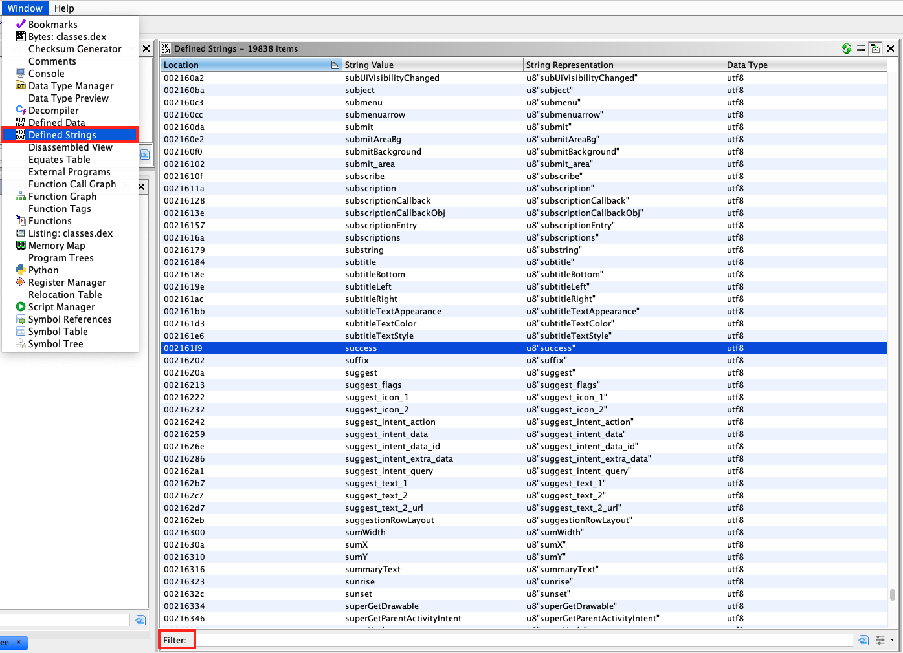

任意の種類のバイナリ解析を実行する際、文字列はコンテキストを提供するため、最も価値のある出発点の一つとみなすことができます。たとえば、"Data encryption failed." のようなエラーログ文字列は、隣接するコードが何らかの暗号操作を実行していることを示唆している可能性があります。

## Java および Kotlin バイトコード

ご存じのとおり、Android アプリケーションの Java および Kotlin バイトコードはすべて DEX ファイルにコンパイルされます。各 DEX ファイルは [文字列識別子のリスト](https://source.android.com/devices/tech/dalvik/dex-format#file-layout "string identifiers list") (strings_ids) を含み、内部名 (例: 型記述子) や、コードによって参照される定数オブジェクト (例: ハードコードされた文字列) など、文字列が参照されるたびにバイナリ内で使用されるすべての文字列識別子を含みます。Ghidra (GUI ベース) や [Dextra](http://www.newandroidbook.com/tools/dextra.html "Dextra") (CLI ベース) などのツールを使用して、このリストを簡単にダンプできます。

Ghidra では、DEX ファイルをロードし、メニューで **Window -> Defined strings** を選択するだけで、文字列を取得できます。

> APK ファイルを Ghidra に直接ロードすると、不整合につながる可能性があります。そのため、APK ファイルを展開して DEX ファイルを抽出し、Ghidra にロードすることをお勧めします。



Dextra では、以下のコマンドを使用してすべての文字列をダンプできます。

```bash
dextra -S classes.dex
```

Dextra からの出力は、たとえば `grep` を使用して特定のキーワードを検索するなど、標準の Linux コマンドを使用して操作できます。

上記のツールを使用して取得した文字列のリストは、アプリケーションで使用されるさまざまなクラス名やパッケージ名も含むため、非常に大きくなる可能性があることを認識しておくことが重要です。特に大きなバイナリの場合、リスト全体を確認することは非常に面倒です。そのため、キーワードベースの検索から始め、キーワード検索が役に立たない場合にのみリストを確認することをお勧めします。良い出発点となる一般的なキーワードとしては password, key, secret があります。アプリのコンテキストに固有のその他の有用なキーワードは、アプリ自体を使用しているときに取得できます。たとえば、アプリがログインフォームを持つとします。入力フィールドに表示されるプレースホルダやタイトルテキストに注目し、それを静的解析のエントリポイントとして使用できます。

## ネイティブコード

Android アプリケーションで使用されるネイティブコードから文字列を抽出するには、Ghidra や [iaito](https://github.com/radareorg/iaito "iaito") などの GUI ツールを使用するか、_strings_ Unix ユーティリティ (`strings <path_to_binary>`) や radare2 の [rabin2](../../tools/generic/MASTG-TOOL-0129.md) (`rabin2 -zz <path_to_binary>`) などの CLI ベースのツールを使用できます。CLI ベースのものを使用する場合、grep (例: 正規表現と組み合わせる) などの他のツールを活用して、結果をさらにフィルタして解析できます。
