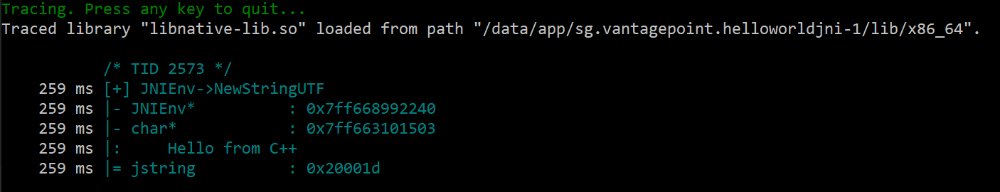

[逆アセンブルされたネイティブコードのレビュー (Reviewing Disassembled Native Code)](MASTG-TECH-0024.md) で詳しく説明しているように、すべての JNI 関数に渡される最初の引数は JNI インタフェースポインタです。このポインタにはネイティブコードが Android Runtime にアクセスできるようにする関数のテーブルを含みます。これらの関数の呼び出しを特定することで、どのような文字列が作成されるか、どのような Java メソッドが呼び出されるかといったライブラリの機能を理解するのに役立ちます。

[jnitrace](https://github.com/chame1eon/jnitrace "jnitrace") は frida-trace に似た Frida ベースのツールで、特にネイティブライブラリによる Android の JNI API の使用をターゲットにしており、引数と戻り値を含む、JNI メソッドトレースを取得する便利な方法を提供します。

`pip install jnitrace` を実行して簡単にインストールし、以下のようにすぐに実行できます。

```bash
jnitrace -l libnative-lib.so sg.vantagepoint.helloworldjni
```

> `-l` オプションを複数回指定して複数のライブラリをトレースするか、`*` オプションを指定してすべてのライブラリをトレースできます。ただし、これは出力が多くなる可能性があります。



出力では、ネイティブコードから行われた `NewStringUTF` 呼び出しのトレースを確認できます (その戻り値は Java コードに返されます。詳細については [逆アセンブルされたネイティブコードのレビュー (Reviewing Disassembled Native Code)](MASTG-TECH-0024.md) を参照してください)。frida-trace と同様に、出力が色分けされ、異なるスレッドを視覚的に区別するのに役立っていることに注目してください。

JNI API 呼び出しをトレースすると、先頭にスレッド ID が表示され、続いてメソッド名、入力引数、戻り値を含む、JNI メソッド呼び出しが表示されます。ネイティブコードから Java メソッドを呼び出す場合は、Java メソッド引数も提供されます。最後に、jnitrace は Frida バックトレースライブラリを使用して JNI 呼び出しがどこから行われたかを表示します。

高度な使い方をするためのすべてのオプションの詳細については [jnitrace GitHub ページのドキュメント](https://github.com/chame1eon/jnitrace "documentation") をチェックしてください。
