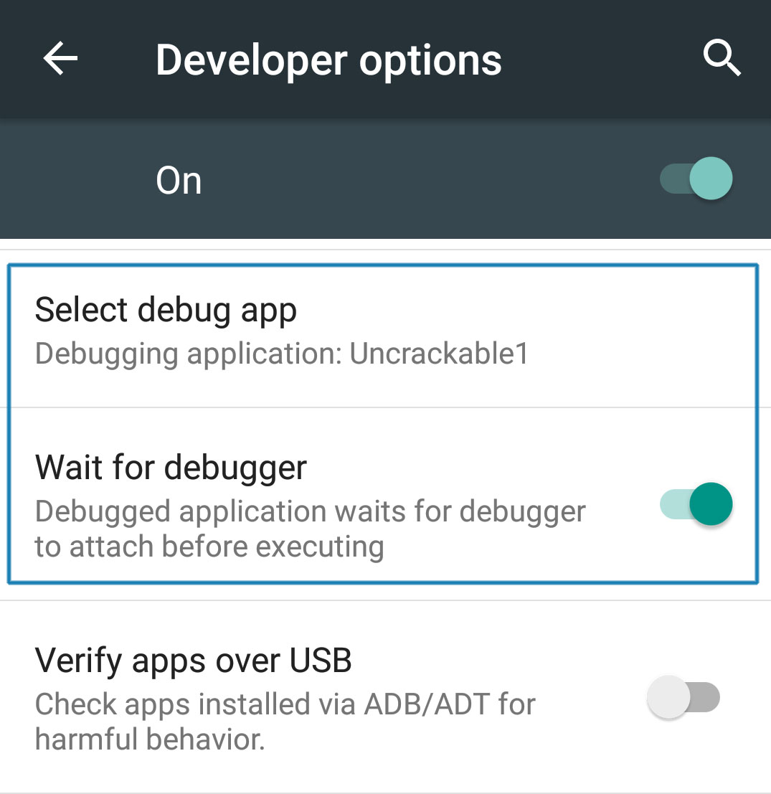

[Android UnCrackable L1](../../apps/android/MASTG-APP-0003.md) は愚かではありません。デバッグモードで実行されたことに気付き、シャットダウンすることで反応します。すぐにモーダルダイアログが表示され、"OK" をタップすると crackme が終了します。

幸いなことに、Android の「開発者向けオプション」には便利な「デバッガを待機」機能があり、起動時に JDWP デバッガが接続するまでアプリを自動的に停止できます。この機能を使用すると、検出メカニズムが実行する前にデバッガに接続し、そのメカニズムをトレース、デバッグ、無効化できます。これは実に不公平なアドバンテージですが、一方で、リバースエンジニアは決してフェアプレーをしません！

開発者向けオプションで、デバッグアプリケーションとして `Uncrackable1` を選択し、「デバッガを待機」スイッチを有効にします。

注: `default.prop` で `ro.debuggable` を "1" に設定しても、Android Manifest で `android:debuggable` が `"true"` に設定されていない限り、アプリは「デバッグアプリ」リストに表示されません。
