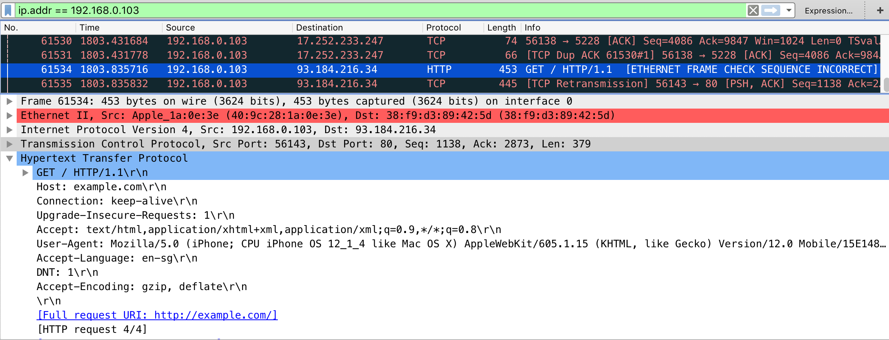

非 HTTP プロトコルやプロキシ非対応アプリによってプロキシベースの傍受が失敗した際、**ARP スプーフィング** を使用してネットワークトラフィックをリダイレクトできます。ARP スプーフィングは **レイヤー 2 攻撃** であり、攻撃者がネットワークゲートウェイになりすまし、モバイルデバイスに攻撃者のマシンを通じてトラフィックを送信するように仕向けます。

この技法は、攻撃が OSI レイヤー 2 で実行されるため、あらゆるデバイスとオペレーティングシステムに対して機能します。MITM の場合、転送時のデータは TLS で暗号化されているため、クリアテキストデータを見ることはできないかもしれませんが、関係するホスト、使用されているプロトコル、アプリが通信しているポートについての貴重な情報を得ることができます。

ARP スプーフィング攻撃を実行するには、[bettercap](../../tools/network/MASTG-TOOL-0076.md) を使用できます。

> **重要:** 最新のオペレーティングシステムは、暗号化された DNS (DoH, DoT)、MAC アドレスのランダム化、ARP スプーフィングの検出などの防御を実装しており、この技法は新しいデバイスでは効果が薄れます。

## ネットワーク設定

[中間マシン (Machine-in-the-Middle, MITM)](../../Document/0x04f-Testing-Network-Communication.md#intercepting-network-traffic-through-mitm) ポジションを成し遂げるには、ホストコンピュータがモバイルデバイスおよび通信先のゲートウェイと同じワイヤレスネットワーク上にある必要があります。これが設定されたら、モバイルデバイスの IP アドレスを取得する必要があります。モバイルアプリの完全な動的解析には、すべてのネットワークトラフィックを傍受して解析する必要があります。

## MITM 攻撃

まずお好みのネットワークアナライザツールを起動し、次に以下のコマンドで [bettercap](../../tools/network/MASTG-TOOL-0076.md) を起動します。以下の IP アドレス (X.X.X.X) を、MITM 攻撃を実行したいターゲットに置き換えてください。

```bash
$ sudo bettercap -eval "set arp.spoof.targets X.X.X.X; arp.spoof on; set arp.spoof.internal true; set arp.spoof.fullduplex true;"
bettercap v2.22 (built for darwin amd64 with go1.12.1) [type 'help' for a list of commands]

[19:21:39] [sys.log] [inf] arp.spoof enabling forwarding
[19:21:39] [sys.log] [inf] arp.spoof arp spoofer started, probing 1 targets.
```

bettercap はパケットを (無線) ネットワークのネットワークゲートウェイに自動的に送信し、トラフィックを傍受します。2019 年初頭、bettercap に [全二重 ARP スプーフィング](https://github.com/bettercap/bettercap/issues/426 "Full Duplex ARP Spoofing") が追加されました。

モバイルフォンでブラウザを起動し、`http://example.com` に移動します。Wireshark を使用している場合、以下のような出力を表示するはずです。



その場合、ここでモバイルフォンが送受信するネットワークトラフィック全体を確認できます。これは DNS, DHCP, その他の形態の通信も含むため、非常に「雑音が多く」なる可能性があります。そのため [Wireshark の DisplayFilters](https://wiki.wireshark.org/DisplayFilters "DisplayFilters") の使い方や [tcpdump のフィルタ方法](https://danielmiessler.com/study/tcpdump/#gs.OVQjKbk "A tcpdump Tutorial and Primer with Examples") を理解して、関連するトラフィックのみに注目する必要があります。
