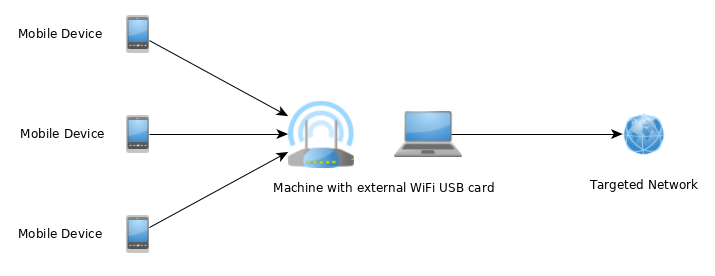

# MASTG-TECH-0124 不正アクセスポイントを使用して MITM ポジションを獲得する (Achieving a MITM Position Using a Rogue Access Point)

[中間マシン (Machine-in-the-Middle, MITM)](../../Document/0x04f-Testing-Network-Communication.md#intercepting-network-traffic-through-mitm) ポジションを成し遂げるには、ターゲットとなるモバイルデバイスと外部ネットワーク間のすべてのトラフィックがホストコンピュータを通じてルートするネットワークをセットアップします。これは以下の二つの方法で行えます。

**オプション 1: 外部アクセスポイントを使用する**: モバイルデバイスとホストコンピュータの両方を別のアクセスポイントに接続します。このセットアップは、公共ネットワークや企業ネットワークでのホスト分離メカニズムを回避するのに役立ちます。モバイルデバイスからのトラフィックはホストコンピュータを通じてリダイレクトされて傍受されます。

独立したアクセスポイントを用いるシナリオでは AP の設定にアクセスする必要があり、まず AP が以下のいずれかをサポートしているかどうかをチェックする必要があります。

* ポートフォワーディング、または
* SPAN ポートまたはミラーポートを備えている。

**オプション 2: ホストをアクセスポイントとして使用する**: ホストコンピュータ自体がアクセスポイントとして機能し、ネットワークトラフィックを直接制御します。これは以下のさまざまな方法で設定できます。 - **ホストの内蔵 Wi-Fi カード** をアクセスポイントとして使用し、有線接続でターゲットネットワークに接続する。 - **外部 USB Wi-Fi アダプタ** をアクセスポイントとして使用し、内蔵 Wi-Fi でターゲットネットワーク (または逆) に接続する。

まず、外部 USB Wi-Fi カードを使用する場合は、そのカードがアクセスポイントを作成する機能を備えていることを確認します。Kali Linux で `iwconfig` コマンドを使用することにより、Wi-Fi カードが AP 機能を備えているかどうかを検証できます。

```bash
iw list | grep AP
```

どちらの場合も AP がホストコンピュータの IP を指すように設定する必要があります。ホストコンピュータは AP に (有線接続または Wi-Fi を介して) 接続されている必要があり、ターゲットネットワークに接続する必要があります (AP へのものと同じ接続でも可能です)。ターゲットネットワークにトラフィックをルートするために、ホストコンピュータに追加の設定が必要になることがあります。



### インストール

以下の手順は、アクセスポイントと追加のネットワークインタフェースを使用して、MITM ポジションをセットアップします。

独立したアクセスポイント、外付け USB Wi-Fi カード、またはホストコンピュータの内蔵カードのいずれかを通じて、Wi-Fi ネットワークを作成します。

これは macOS の内蔵ユーティリティを使用して行うことができます。[Mac でインターネット接続を他のネットワークユーザーと共有する](https://support.apple.com/en-ke/guide/mac-help/mchlp1540/mac) を使用できます。

すべての主要な Linux および Unix オペレーティングシステムでは以下のようなツールが必要です。

* hostapd
* dnsmasq
* iptables
* wpa\_supplicant
* airmon-ng

Kali Linux ではこれらのツールを `apt-get` でインストールできます。

```bash
apt-get update
apt-get install hostapd dnsmasq aircrack-ng
```

> iptables と wpa\_supplicant は Kali Linux にデフォルトでインストールされています。

独立したアクセスポイントの場合、トラフィックをホストコンピュータにルートします。外部 USB Wi-Fi カードや内蔵 Wi-Fi カードの場合、トラフィックはすでにホストコンピュータ上で利用可能です。

Wi-Fi からの受信トラフィックを、そのトラフィックがターゲットネットワークに到達できる追加のネットワークインタフェースにルートします。追加のネットワークインタフェースは、設定に応じて、有線接続または他の Wi-Fi カードにできます。

### 設定

Kali Linux の設定ファイルに焦点を当てます。以下の値が定義される必要があります。

* wlan1 - AP ネットワークインタフェースの ID (AP 機能を持つ)
* wlan0 - ターゲットネットワークインタフェースの ID (これは有線インタフェースまたは他の Wi-Fi カード)
* 10.0.0.0/24 - AP ネットワークの IP アドレスとマスク

以下の設定ファイルを適宜変更および調整する必要があります。

*   hostapd.conf

    ```bash
    # Name of the WiFi interface we use
    interface=wlan1
    # Use the nl80211 driver
    driver=nl80211
    hw_mode=g
    channel=6
    wmm_enabled=1
    macaddr_acl=0
    auth_algs=1
    ignore_broadcast_ssid=0
    wpa=2
    wpa_key_mgmt=WPA-PSK
    rsn_pairwise=CCMP
    # Name of the AP network
    ssid=STM-AP
    # Password of the AP network
    wpa_passphrase=password
    ```
*   wpa\_supplicant.conf

    ```bash
    network={
        ssid="NAME_OF_THE_TARGET_NETWORK"
        psk="PASSWORD_OF_THE_TARGET_NETWORK"
    }
    ```
*   dnsmasq.conf

    ```bash
    interface=wlan1
    dhcp-range=10.0.0.10,10.0.0.250,12h
    dhcp-option=3,10.0.0.1
    dhcp-option=6,10.0.0.1
    server=8.8.8.8
    log-queries
    log-dhcp
    listen-address=127.0.0.1
    ```

### MITM 攻撃

MITM ポジションを得ることができるには、上記の設定を実行する必要があります。これは Kali Linux の以下のコマンドを使用することにより実行できます。

```bash
# check if other process is not using WiFi interfaces
$ airmon-ng check kill
# configure IP address of the AP network interface
$ ifconfig wlan1 10.0.0.1 up
# start access point
$ hostapd hostapd.conf
# connect the target network interface
$ wpa_supplicant -B -i wlan0 -c wpa_supplicant.conf
# run DNS server
$ dnsmasq -C dnsmasq.conf -d
# enable routing
$ echo 1 > /proc/sys/net/ipv4/ip_forward
# iptables will NAT connections from AP network interface to the target network interface
$ iptables --flush
$ iptables --table nat --append POSTROUTING --out-interface wlan0 -j MASQUERADE
$ iptables --append FORWARD --in-interface wlan1 -j ACCEPT
$ iptables -t nat -A POSTROUTING -j MASQUERADE
```

これでモバイルデバイスをアクセスポイントに接続できます。
