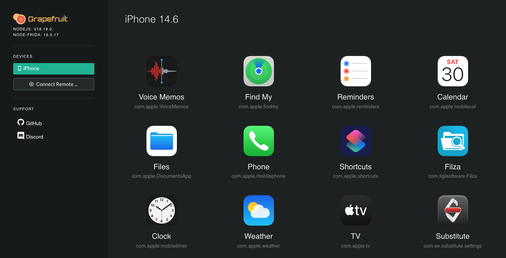

デバイスにインストールされているアプリをターゲットにする場合、まず解析したいアプリケーションの正しいバンドル識別子を把握する必要があります。`frida-ps -Uai` を使用して、接続されている USB デバイス (`-U`) に現在インストールされている (`-i`) すべてのアプリ (`-a`) を取得できます。

```bash
$ frida-ps -Uai
 PID  Name                 Identifier
----  -------------------  -----------------------------------------
6853  iGoat-Swift          OWASP.iGoat-Swift
6847  Calendar             com.apple.mobilecal
6815  Mail                 com.apple.mobilemail
   -  App Store            com.apple.AppStore
   -  Apple Store          com.apple.store.Jolly
   -  Calculator           com.apple.calculator
   -  Camera               com.apple.camera
```

また、どれが現在実行されているかも表示します ([iGoat-Swift](../../apps/ios/MASTG-APP-0028.md) の例)。今後の解析に必要となるため、"Identifier" (バンドル識別子: `OWASP.iGoat-Swift`) と PID (`6853`) をメモしておいてください。

[Grapefruit](../../tools/ios/MASTG-TOOL-0061.md) を直接開き、iOS デバイスを選択すると、インストール済みアプリの一覧を取得できます。


