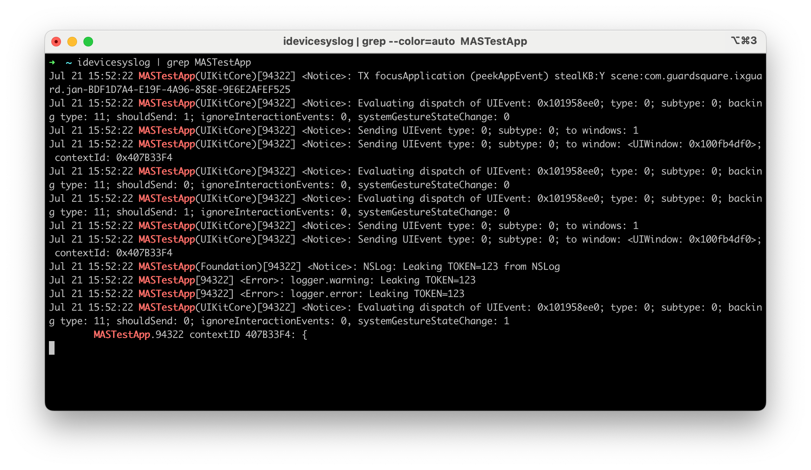

多くのアプリはコンソールログに有益な (そして機密の可能性がある) メッセージをログ記録します。またログにはクラッシュレポートやその他の有用な情報も含みます。コンソールログは複数の手法で収集できます。

## [Xcode](../../tools/ios/MASTG-TOOL-0070.md) を使用する

1. Xcode を起動します。
2. デバイスをホストコンピュータに接続します。
3. **Window** -> **Devices and Simulators** を選択します。
4. Devices ウィンドウの左側のセクションで、接続した iOS デバイスをクリックします。
5. 問題を再現します。
6. Devices ウィンドウの右上にある **Open Console** ボタンをクリックして、別ウィンドウにコンソールログを表示します。

コンソール出力をテキストファイルに保存するには、Console ウィンドウの右上にある **Save** ボタンをクリックします。

## [libimobiledevice suite](../../tools/ios/MASTG-TOOL-0126.md) を使用する

1. デバイスをホストコンピュータに接続します。
2. ターミナルで `idevicesyslog | grep YOUR_APP_NAME` を実行します。出力結果には特定のアプリに関連するデバイス固有のログを多数含みます。

> **注**: `idevicesyslog` はすべての種類のログをログ記録しない可能性があります。たとえば、[debug](https://developer.apple.com/documentation/os/oslogtype/debug) や [info](https://developer.apple.com/documentation/os/oslogtype/info) のログはログ記録されない可能性があります。
