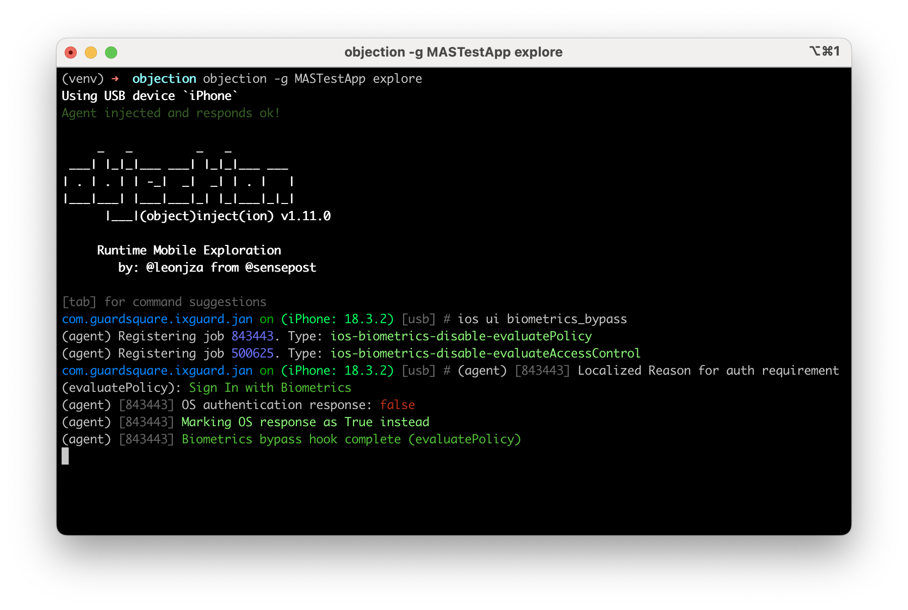
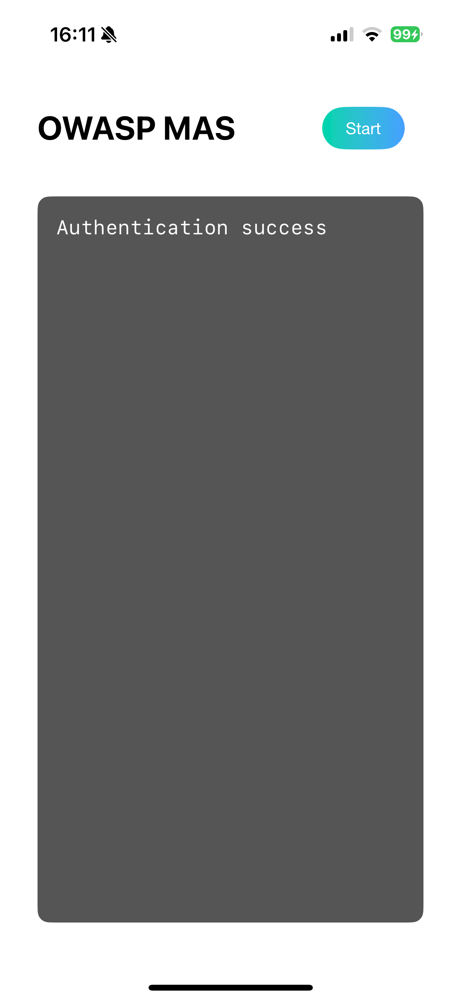

この技法は通常 **[`SecAccessControlCreateWithFlags`](https://developer.apple.com/documentation/security/secaccesscontrolcreatewithflags(_:_:_:_:)) Keychain API を使用してユーザーの存在を要求する代わりに** _success_ や _failure_ の結果 (例: `if authenticated {...}` チェック) のみを返すことによって生体認証を実行するアプリで生体認証をバイパスするために使用できます。

## 脱獄済みデバイスと非脱獄済みデバイスでの手法

frida-server がインストールされた脱獄済みデバイスを持つ場合、[objection](../../tools/generic/MASTG-TOOL-0038.md) で `ios ui biometrics_bypass` コマンドを実行することで生体認証をバイパスできます。

```bash
objection -n "MASTestApp" start
ios ui biometrics_bypass
```

[Frida での LAContext.evaluatePolicy の実行時使用 (Runtime Use of LAContext.evaluatePolicy with Frida)](demos/ios/MASVS-AUTH/MASTG-DEMO-0042/MASTG-DEMO-0042.md) デモアプリに対してこの技法を使用した際のサンプル出力をご覧ください。




## 非脱獄済みデバイスでの手法

[objection](../../tools/generic/MASTG-TOOL-0038.md) は、アプリが `get-task-allow` フラグで再パッケージ化されていない限り、非脱獄済みデバイス上のアプリにアタッチできません。[デバッグ (Debugging)](MASTG-TECH-0084.md) ではこのフラグでアプリを再署名する方法を説明しています。再署名後、脱獄済みデバイスと同じ手法を使用できます。
