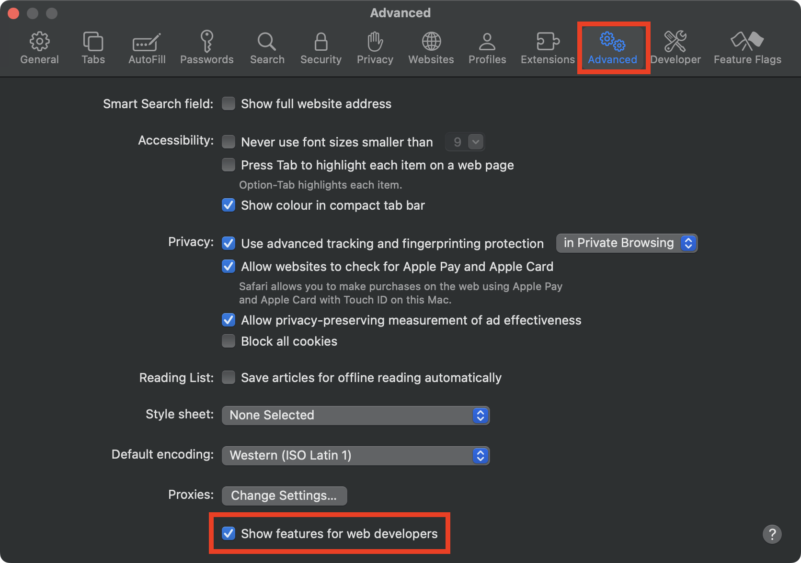
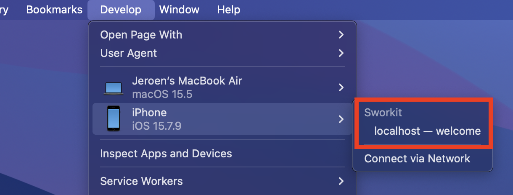
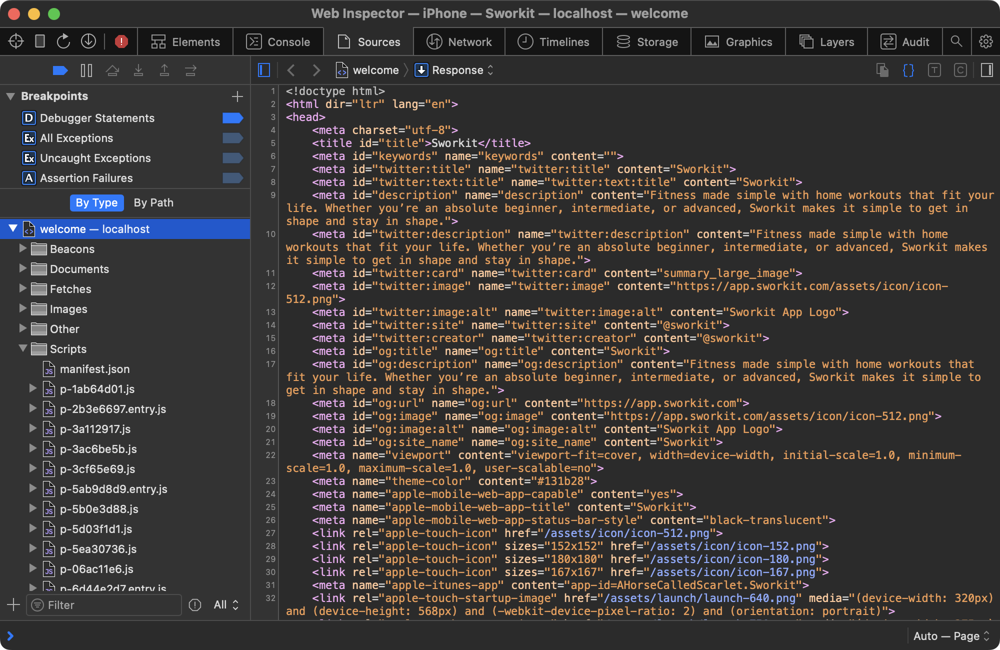

脱獄済みデバイスに [GlobalWebInspect](../../tools/ios/MASTG-TOOL-0137.md) をインストールした後、App Store からインストールされたアプリ内の任意の `WKWebView` に Safari 開発者ツールをアタッチできます。

ウェブインスペクションを有効にするには、以下の手順に従ってください。

1. iOS デバイスで設定アプリを開きます。**Safari** -> **詳細** に移動して _Web インスペクタ_ をトグルします。
2. macOS デバイスで Safari を開きます。メニューバーで **Safari** -> **環境設定** -> **詳細** に移動し、_メニューバーに開発メニューを表示_ を有効にします。
3. iOS デバイスを macOS デバイスに接続し、ロックを解除します。iOS デバイス名が **開発** メニューに現れるはずです。
4. (まだ信頼されていない場合) macOS の Safari で **開発** メニューに移動し、**'iOS デバイス名'** -> **開発に使用** をクリックして信頼を有効にします。

Web インスペクタを開いて WebView をデバッグするには:

1. iOS でアプリを開き、WebView を含む画面に移動します。
2. macOS Safari で **開発** -> **'iOS デバイス名'** に移動すると、WebView ベースのコンテキストの名前を表示するはずです。それをクリックして Web インスペクタを開きます。

これでデスクトップブラウザ上の通常のウェブページと同じように WebView をデバッグできます。

すべてが正しく設定されていれば、Safari で任意の WebView にアタッチできます。

