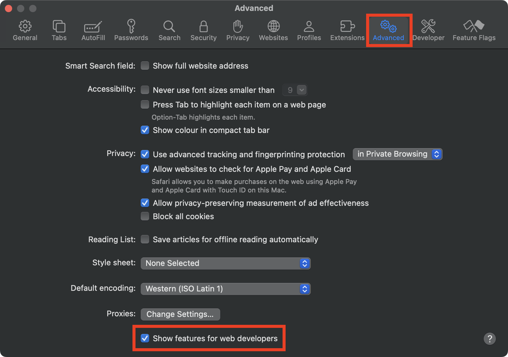
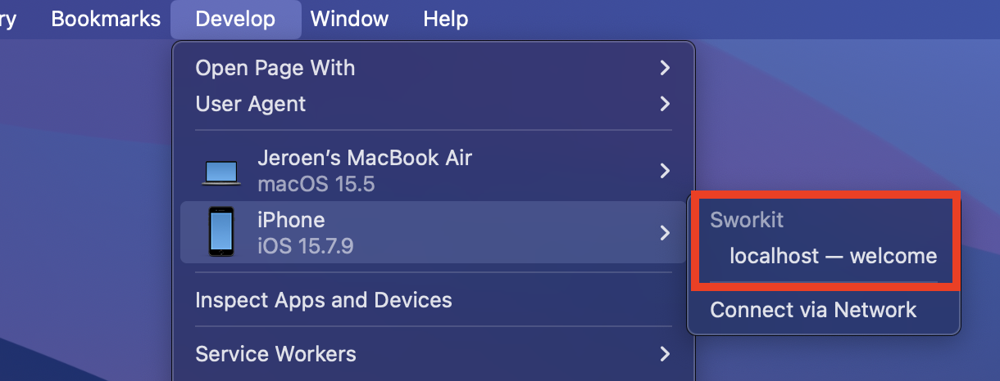
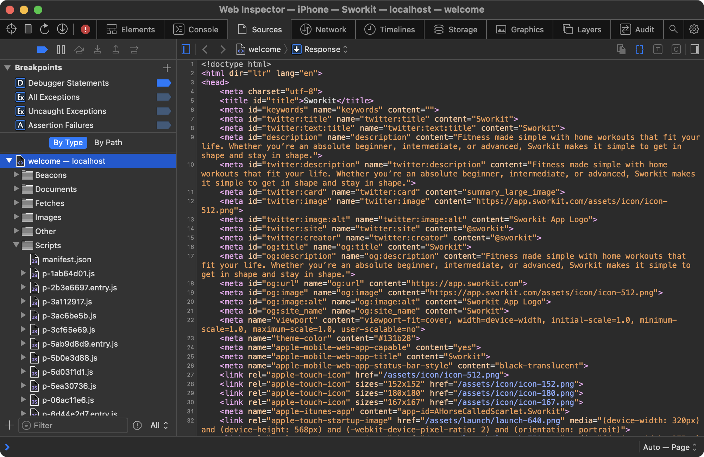

## Safari Web Inspector

iOS で [Safari Web Inspector](https://developer.apple.com/library/archive/documentation/AppleApplications/Conceptual/Safari_Developer_Guide/GettingStarted/GettingStarted.html) を有効にすると、リモートで [macOS デバイスから WebView のコンテンツを検査](https://developer.apple.com/documentation/safari-developer-tools/inspecting-ios) できます。これは、ハイブリッドアプリなど、JavaScript ブリッジを使用してネイティブ API を公開するアプリで特に役立ちます。

iOS 16.4 以降では、アプリは、[`isInspectable`](https://developer.apple.com/documentation/webkit/wkwebview/isinspectable) に `true` を設定することで、`WKWebView` コンテンツの検査を明示的にオプトインする必要があります。

```swift
let webView = WKWebView()
...
if #available(iOS 16.4, *) {
    webView.isInspectable = true
}
```

App Store からインストールされたアプリでも、アプリが `WKWebView.isInspectable = true` を有効にしていれば、検査されます。脱獄済みデバイスでは、[GlobalWebInspect](../../tools/ios/MASTG-TOOL-0137.md) を使用して、自身がオプトインしていないアプリで WebView 検査を強制的に有効にできます。インストール後、Safari Web Inspector はこれらのアプリ内で `WKWebView` ([WebView (WebViews)](../../knowledge/ios/MASVS-PLATFORM/MASTG-KNOW-0076.md)) インスタンスにアタッチできます。

ウェブインスペクションを有効にするには、以下の手順に従います。

1. iOS デバイスで、設定アプリを開きます。**Safari** -> **詳細** に移動して **Web インスペクタ** をトグルします。
2. macOS デバイスで、Safari を開きます。メニューバーで **Safari** -> **設定** -> **詳細** に移動して **Web 開発者向けの機能を表示** を有効にします。
3. iOS デバイスを macOS デバイスに接続して、ロックを解除します。iOS デバイス名が **開発** メニューに現れるはずです。
4. 必要に応じて、macOS の Safari で **開発** -> **'iOS デバイス名'** -> **開発に使用** に移動してデバイスを信頼します。

Web Inspector を開いて WebView をデバッグするには:

1. iOS で、アプリを開き、WebView を含む任意の画面に移動します。
2. macOS の Safari で、**開発** -> **'iOS デバイス名'** に移動し、WebView ベースのコンテキストの名前を表示します。それをクリックして Web Inspector を開きます。

これで、デスクトップブラウザで通常のウェブページと同様に、WebView をデバッグできます。



すべてが正しく設定されていれば、Safari で任意の WebView にアタッチできます。




