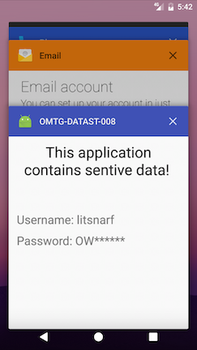

---
masvs_v1_id:
- MSTG-STORAGE-9
masvs_v2_id:
- MASVS-PLATFORM-3
platform: android
title: 自動生成されたスクリーンショット内の機密情報を見つける (Finding Sensitive Information in Auto-Generated Screenshots)
masvs_v1_levels:
- L2
profiles: [L2]
---

## 概要

## 静的解析

Android アプリがバックグラウンドになると、現在のアクティビティのスクリーンショットが撮影され、アプリがフォアグラウンドに戻るときに美観のために表示されます。しかし、これは機密情報を漏洩する可能性があります。

アプリケーションがアプリスイッチャーを介して機密情報を公開する可能性があるかどうかを判断するには、[`FLAG_SECURE`](https://developer.android.com/reference/android/view/Display.html#FLAG_SECURE "FLAG_SECURE Option") オプションが設定されているかどうかを調べます。以下のコードスニペットに似たものがみつかるはずです。

Java の例:

```java
getWindow().setFlags(WindowManager.LayoutParams.FLAG_SECURE,
                WindowManager.LayoutParams.FLAG_SECURE);

setContentView(R.layout.activity_main);
```

Kotlin の例:

```kotlin
window.setFlags(WindowManager.LayoutParams.FLAG_SECURE,
                WindowManager.LayoutParams.FLAG_SECURE)

setContentView(R.layout.activity_main)
```

オプションが設定されていない場合、アプリケーションはスクリーンキャプチャに対して脆弱になります。

## 動的解析

アプリをブラックボックステストしている際、機密情報を含む画面に移動し、ホームボタンをクリックしてアプリをバックグラウンドに送り、アプリスイッチャーボタンを押してスナップショットを見ます。以下に示すように、`FLAG_SECURE` が設定されている場合 (左の画像)、スナップショットは空になります。フラグが設定されていない場合 (右の画像)、アクティビティ情報が表示されます。




[ファイルベースの暗号化 (FBE)](https://source.android.com/security/encryption/file-based "FBE") をサポートするデバイスでは、スナップショットは `/data/system_ce/<USER_ID>/<IMAGE_FOLDER_NAME>` フォルダに保存されます。`<IMAGE_FOLDER_NAME>` はベンダーによって異なりますが、最も一般的な名前は `snapshots` と `recent_images` です。デバイスが FBE をサポートしていない場合は、`/data/system/<IMAGE_FOLDER_NAME>` が使用されます。

> これらのフォルダとスナップショットにアクセスするにはルートが必要です。
