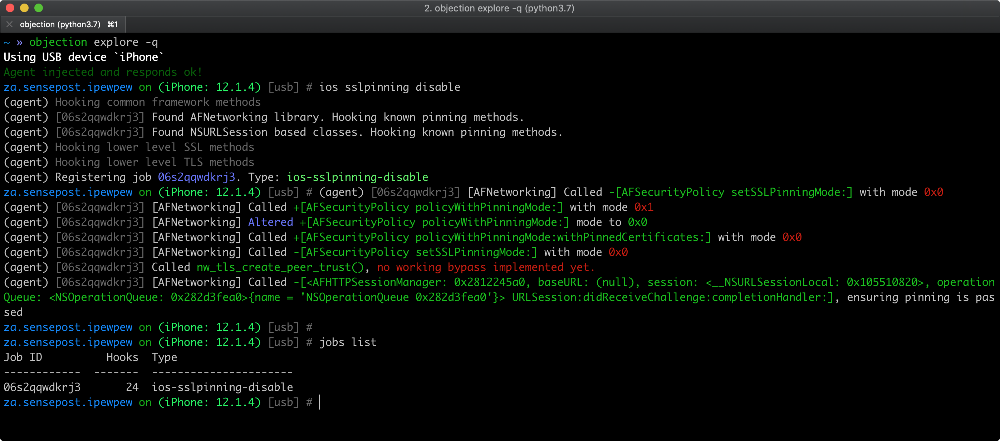

---
masvs_v1_id:
- MSTG-NETWORK-4
masvs_v2_id:
- MASVS-NETWORK-2
platform: ios
title: カスタム証明書ストアおよび証明書ピン留めのテスト (Testing Custom Certificate Stores and Certificate Pinning)
masvs_v1_levels:
- L2
profiles: [L2]
---

## 概要

## 静的解析

サーバー証明書がピン留めされていることを検証します。ピン留めはサーバーが提示する証明書ツリーに関してさまざまなレベルで実装できます。

1. アプリケーションバンドルにサーバーの証明書を含め、接続のたびに検証を行います。これにはサーバー上の証明書を更新するごとに更新メカニズムを必要とします。
2. 証明書発行者をたとえば一つのエンティティに限定し、中間 CA の公開鍵をアプリケーションにバンドルします。こうすることで攻撃対象領域を限定し、有効な証明書を持てます。
3. 独自の PKI を所有し管理します。アプリケーションには中間 CA の公開鍵を含めます。これにより期限切れなどでサーバー上の証明書を変更するたびにアプリケーションを更新する必要がなくなります。独自の CA を使用すると証明書は自己署名となることに注意してください。

Apple が推奨する最新のアプローチは `Info.plist` ファイルの  App Transport Security Settings の下にピン留めされた CA 公開鍵を指定することです。Apple の記事 [Identity Pinning: How to configure server certificates for your app](https://developer.apple.com/news/?id=g9ejcf8y "Identity Pinning: How to configure server certificates for your app") に例があります。

もう一つのアプローチは `NSURLConnectionDelegate` の [`connection:willSendRequestForAuthenticationChallenge:`](https://developer.apple.com/documentation/foundation/nsurlconnectiondelegate/1414078-connection?language=objc "connection:willSendRequestForAuthenticationChallenge:") メソッドを使用して、サーバーから提供された証明書が有効であり、アプリに格納されている証明書と一致するかをチェックすることです。詳細については [HTTPS Server Trust Evaluation](https://developer.apple.com/library/archive/technotes/tn2232/_index.html#//apple_ref/doc/uid/DTS40012884-CH1-SECNSURLCONNECTION "HTTPS Server Trust Evaluation") テクニカルノートを参照してください。

以下のサードパーティライブラリにはピン留め機能が含まれています。

- [TrustKit](https://github.com/datatheorem/TrustKit "TrustKit"): ここでは Info.plist に公開鍵ハッシュを設定するか、辞書にハッシュを提供することでピン留めできます。詳細については README を参照してください。
- [AlamoFire](https://github.com/Alamofire/Alamofire "AlamoFire"): ここではドメインごとに `ServerTrustPolicy` を定義し、それに対して `PinnedCertificatesTrustEvaluator` を定義できます。詳細についてはその [ドキュメント](https://github.com/Alamofire/Alamofire/blob/master/Documentation/AdvancedUsage.md#security) を参照してください。
- [AFNetworking](https://github.com/AFNetworking/AFNetworking "AfNetworking"): ここでは `AFSecurityPolicy` をセットして、ピン留めを設定できます。

## 動的解析

### サーバー証明書ピン留め

[エンドポイント同一性検証のテスト (Testing Endpoint Identity Verification)](MASTG-TEST-0067.md) の指示に従います。これを行ってもトラフィックがプロキシされない場合、証明書ピン留めが実際に実装され、すべてのセキュリティ対策が実施されていることを意味している可能性があります。すべてのドメインで同じことが起こるでしょうか？

簡単なスモークテストとしては、[証明書ピン留めのバイパス (Bypassing Certificate Pinning)](../../../techniques/ios/MASTG-TECH-0064.md) で説明しているように [objection](../../../tools/generic/MASTG-TOOL-0038.md) を使用して証明書ピン留めをバイパスしてみることができます。 objection によってフックされているピン留め関連の API が objection の出力に表示されるはずです。

ただし、以下に注意してください。

- API は完全ではないかもしれません。
- 何もフックされていないとしても、必ずしもアプリがピン留めを実装していないとは限りません。

いずれの場合にも、アプリやそのコンポーネントの一部が [objection の対応](https://github.com/sensepost/objection/blob/master/agent/src/ios/pinning.ts) の方法でカスタムピン留めを実装している可能性があります。具体的なピン留めの指標やより詳細なテストについては静的解析のセクションをご確認ください。

### クライアント証明書バリデーション

アプリケーションによっては mTLS (mutual TLS) を使用します。これはアプリケーションがサーバーの証明書を検証し、サーバーがクライアントの証明書を検証するものです。Burp **Alerts** タブにクライアントが接続のネゴシエーションに失敗したことを示すエラーがあればこれに気づくことができます。

注目すべき点がいくつかあります。

1. クライアント証明書には鍵交換で使用される秘密鍵 (private key) が含まれています。
2. 一般的に証明書を使用 (復号) するにはパスワードも必要です。
3. 証明書はバイナリ本体、データディレクトリ、またはキーチェーンに格納できます。

mTLS を使用する最もありがちで不適切な方法は、クライアント証明書をアプリケーションバンドル内に格納し、パスワードをハードコードすることです。これはすべてのクライアントが同じ証明書を共有することになるため、ほとんど明らかにセキュリティをもたらしません。

二つ目の方法は証明書 (と場合によってはパスワード) を保存するのにキーチェーンを使用することです。最初のログイン時に、アプリケーションは個人証明書をダウンロードし、キーチェーンにセキュアに保存する必要があります。

アプリケーションにはハードコードされた証明書があり、最初のログイン時にそれを使用し、その後、個人証明書がダウンロードされるものがあります。この場合、サーバー接続に '汎用的な' 証明書が依然として使用できるかどうかをチェックしてください。

アプリケーションから (Frida を使用するなどして) 証明書を抽出したら、それをクライアント証明書として Burp に追加すると、トラフィックを傍受できるようになります。
