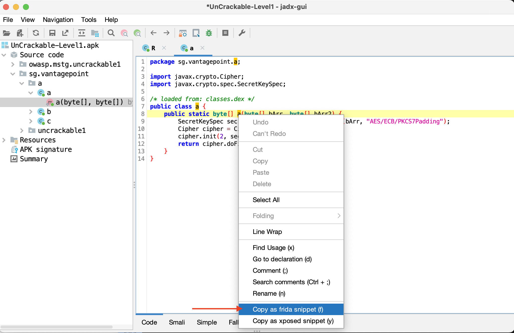

Frida は [Java API](https://www.frida.re/docs/javascript-api/#java "Frida - Java API") を通じて Android Java ランタイムとのインタラクションをサポートしています。プロセスとそのネイティブライブラリ内で Java とネイティブの両方の関数をフックして呼び出すことができます。JavaScript スニペットはメモリにフルアクセスでき、たとえば任意の構造化データを読み書きできます。

Frida API が提供するタスクのうち、Android に関連するものや Android 専用のものをいくつか紹介します。

- Java オブジェクトをインスタンス化し、静的および非静的クラスメソッドを呼び出します ([Java API](https://www.frida.re/docs/javascript-api/#java "Frida - Java API"))。
- Java メソッド実装を置き換えます ([Java API](https://www.frida.re/docs/javascript-api/#java "Frida - Java API"))。
- Java ヒープをスキャンして、特定のクラスのライブインスタンスを列挙します ([Java API](https://www.frida.re/docs/javascript-api/#java "Frida - Java API"))。
- プロセスメモリをスキャンして文字列の存在を探します ([Memory API](https://www.frida.re/docs/javascript-api/#memory "Frida - Memory API"))。
- ネイティブ関数呼び出しをインターセプトして、関数の開始時と終了時に独自のコードを実行します ([Interceptor API](https://www.frida.re/docs/javascript-api/#interceptor "Frida - Interceptor API"))。

Android では、Frida CLI (`frida`)、`frida-ps`、`frida-ls-devices`、`frida-trace` など、Frida のインストール時に提供されるビルトインツールも利用できることを心に留めてください。

Frida は [Xposed](MASTG-TOOL-0027.d) や [LSPosed](MASTG-TOOL-0149.md) とよく比較されます。しかし、両フレームワークは異なる目標を念頭に設計されているため、この比較は公平とは言えません。アプリのセキュリティテスト担当者として、どのような状況でどちらのフレームワークを使うべきかを知るために、これを理解しておくことは重要です。

- Frida はスタンドアロンです。必要なのはターゲットの Android デバイスの既知の場所から frida-server バイナリを実行するだけです (下記の「Fridaのインストール」を参照)。つまり、Xposed とは対照的に、ターゲット OS に _深く_ インストールされるわけではありません。
- アプリのリバースは反復的なプロセスです。前のポイントの結果として、フックを適用したり単純に更新するために (ソフト) リブートする必要がないため、テスト時のフィードバックループがより短くなります。そのため、より永続的なフックを実装する場合には Xposed を使用する方がいいかもしれません。
- プロセスの実行中にいつでもオンザフライで Frida JavaScript コードを注入したり更新できます (iOS の Cycript と同様)。このようにして、Frida にアプリを生成させることで、いわゆる _早期計装_ を実行できます。また、特定の状態にした実行中のアプリにアタッチすることも可能です。
- Frida は Java とネイティブコード (JNI) の両方を処理でき、その両方を変更できます。これは、残念ながら、ネイティブコードのサポートがない Xposed の制限です。

## Android に Frida をインストールする

Android デバイスに Frida をセットアップするには、以下のようにします。

- デバイスがルート化されていない場合は、Frida を使用することもできます。[Termux](MASTG-TECH-0026.md) を参照してください。
- ルート化済みデバイスをお持ちの場合は、[公式の手順](https://www.frida.re/docs/android/ "Frida - Setting up your Android device") に従うか、以下のヒントに従ってください。

ここでは特に断りがない限り、ルート化済みデバイスを想定しています。[Frida リリースページ](https://github.com/frida/frida/releases) から frida-server バイナリをダウンロードします。Android デバイスまたはエミュレータのアーキテクチャ (x86, x86_64, arm, arm64) に適した frida-server バイナリをダウンロードしてください。サーバーバージョン (少なくともメジャーバージョン番号) がローカルの Frida インストールのバージョンと一致することを確認してください。通常 PyPI は最新の Frida をインストールします。どのバージョンがインストールされているかわからない場合は、Frida コマンドラインツールで確認できます。

```bash
frida --version
```

あるいは、以下のコマンドを実行して、Frida のバージョンを自動的に検出し、適切な frida-server バイナリをダウンロードできます。

```bash
wget https://github.com/frida/frida/releases/download/$(frida --version)/frida-server-$(frida --version)-android-arm.xz
```

frida-server をデバイスにコピーして実行します。

```bash
adb push frida-server /data/local/tmp/
adb shell "chmod 755 /data/local/tmp/frida-server"
adb shell "su -c /data/local/tmp/frida-server &" # or if su needs a uid: adb shell "su 0 /data/local/tmp/frida-server &"
```

## Android で Frida を使用する

frida-server が動作していれば、以下のコマンドで実行中のプロセスのリストを取得できるはずです (接続されている USB デバイスまたはエミュレータを使用するように Frida に指示するには `-U` オプションを使用します)。

```bash
$ frida-ps -U
  PID  Name
-----  --------------------------------------------------------------
  276  adbd
  956  android.process.media
  198  bridgemgrd
30692  com.android.chrome
30774  com.android.chrome:privileged_process0
30747  com.android.chrome:sandboxed
30834  com.android.chrome:sandboxed
 3059  com.android.nfc
 1526  com.android.phone
17104  com.android.settings
 1302  com.android.systemui
(...)
```

あるいは、`-Uai` フラグの組み合わせでリストを制限し、接続されている USB デバイス (`-U`) に現在インストールされている (`-i`) すべてのアプリ (`-a`) を取得します。

```bash
$ frida-ps -Uai
  PID  Name                                      Identifier
-----  ----------------------------------------  ------------------------------
  766  Android System                            android
30692  Chrome                                    com.android.chrome
 3520  Contacts Storage                          com.android.providers.contacts
    -  Uncrackable1                              sg.vantagepoint.uncrackable1
    -  drozer Agent                              com.mwr.dz
```

これは、すべての名前と識別子を表示します。現在実行中の場合には、それらの PID も表示します。リストでアプリを検索し、PID またはその名前/識別子を書き留めます。今後はそれらのいずれかを使用してアプリを参照します。PID はアプリを実行するたびに変化するため、識別子を使用することをお勧めします。たとえば、`com.android.chrome` を取得してみましょう。この文字列は Frida CLI、frida-trace、Python スクリプトなど、すべての Frida ツールで使用できるようになりました。

## frida-trace でのネイティブライブラリのトレース

特定の (低レベルの) ライブラリコールをトレースするには、`frida-trace` コマンドラインツールを使用できます。

```bash
frida-trace -U com.android.chrome -i "open"
```

これは `__handlers__/libc.so/open.js` に小さな JavaScript を生成し、Frida がプロセスに注入します。このスクリプトは `libc.so` の `open` 関数へのすべてのコールをトレースします。生成されたスクリプトは必要に応じて Frida [JavaScript API](https://www.frida.re/docs/javascript-api/) で変更できます。

残念ながら、Java クラスの高レベルメソッドのトレースはまだサポートしていません (しかし [将来的には](https://github.com/frida/frida-python/issues/70 "Support for tracing high-level methods of Java Classes via patterns") するかもしれません)。

## Frida CLI と Java API

Frida CLI ツール (`frida`) を使用して、Frida を対話的に操作します。プロセスにフックし、Frida の API へのコマンドラインインタフェースを提供します。

```bash
frida -U com.android.chrome
```

`-l` オプションで、Frida CLI を使用してスクリプトをロードすることもできます。たとえば `myscript.js` をロードします。

```bash
frida -U -l myscript.js com.android.chrome
```

Frida は [Java API](https://www.frida.re/docs/javascript-api/#java "Frida - Java API") も提供しており、Android アプリを扱うのに特に役立ちます。これは Java クラスやオブジェクトを直接操作できます。Activity クラスの `onResume` 関数を上書きするスクリプトを以下に示します。

```java
Java.perform(function () {
    var Activity = Java.use("android.app.Activity");
    Activity.onResume.implementation = function () {
        console.log("[*] onResume() got called!");
        this.onResume();
    };
});
```

上記のスクリプトは `Java.perform` をコールして、コードが Java VM のコンテキストで実行されるようにします。`Java.use` を介して `android.app.Activity` クラスのラッパーをインスタンス化し、`onResume` 関数を上書きします。新しい `onResume` 関数実装は、アプリでアクティビティが再開されるたびに、コンソールに通知を出力し、`this.onResume` を呼び出して、オリジナルの `onResume` メソッドをコールします。

[jadx](MASTG-TOOL-0018.md) はグラフィカルコードブラウザを通じて Frida スニペットを生成できます。この機能を使用するには、`jadx-gui` で APK または DEX を開き、ターゲットのメソッドをブラウズしてメソッド名を右クリックし、"Copy as frida snippet (f)" を選択します。たとえば MASTG [Android UnCrackable L1](../../apps/android/MASTG-APP-0003.md) を使用すると以下のようになります。



上記の手順により、以下の出力がペーストボードに配置され、JavaScript ファイルに貼り付けて `frida -U -l` に渡すことができます。

```javascript
let a = Java.use("sg.vantagepoint.a.a");
a["a"].implementation = function (bArr, bArr2) {
    console.log('a is called' + ', ' + 'bArr: ' + bArr + ', ' + 'bArr2: ' + bArr2);
    let ret = this.a(bArr, bArr2);
    console.log('a ret value is ' + ret);
    return ret;
};
```

上記のコードは `sg.vantagepoint.a.a` クラスの `a` メソッドをフックし、その入力パラメータと戻り値をログ記録します。

Frida はヒープ上にあるインスタンス化されたオブジェクトを検索して操作することもできます。以下のスクリプトは `android.view.View` オブジェクトのインスタンスを検索して、その `toString` メソッドをコールします。結果はコンソールに出力されます。

```java
setImmediate(function() {
    console.log("[*] Starting script");
    Java.perform(function () {
        Java.choose("android.view.View", {
             "onMatch":function(instance){
                  console.log("[*] Instance found: " + instance.toString());
             },
             "onComplete":function() {
                  console.log("[*] Finished heap search")
             }
        });
    });
});
```

出力は以下のようになります。

```bash
[*] Starting script
[*] Instance found: android.view.View{7ccea78 G.ED..... ......ID 0,0-0,0 #7f0c01fc app:id/action_bar_black_background}
[*] Instance found: android.view.View{2809551 V.ED..... ........ 0,1731-0,1731 #7f0c01ff app:id/menu_anchor_stub}
[*] Instance found: android.view.View{be471b6 G.ED..... ......I. 0,0-0,0 #7f0c01f5 app:id/location_bar_verbose_status_separator}
[*] Instance found: android.view.View{3ae0eb7 V.ED..... ........ 0,0-1080,63 #102002f android:id/statusBarBackground}
[*] Finished heap search
```

Java のリフレクション機能を使用することもできます。`android.view.View` クラスのパブリックメソッドをリストするには、Frida でこのクラスのラッパーを作成し、ラッパーの `class` プロパティから `getMethods` をコールします。

```java
Java.perform(function () {
    var view = Java.use("android.view.View");
    var methods = view.class.getMethods();
    for(var i = 0; i < methods.length; i++) {
        console.log(methods[i].toString());
    }
});
```

これは非常に長いメソッドのリストをターミナルに出力します。

```java
public boolean android.view.View.canResolveLayoutDirection()
public boolean android.view.View.canResolveTextAlignment()
public boolean android.view.View.canResolveTextDirection()
public boolean android.view.View.canScrollHorizontally(int)
public boolean android.view.View.canScrollVertically(int)
public final void android.view.View.cancelDragAndDrop()
public void android.view.View.cancelLongPress()
public final void android.view.View.cancelPendingInputEvents()
...
```

より実用的な例については、[Frida ハンドブックの Android セクション](https://learnfrida.info/java/) をご覧ください。
