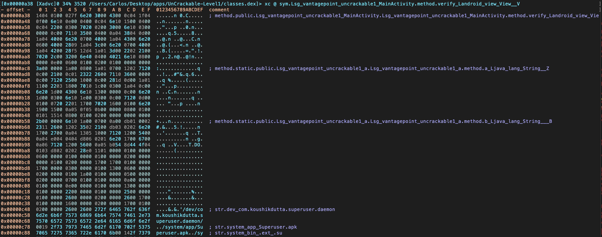
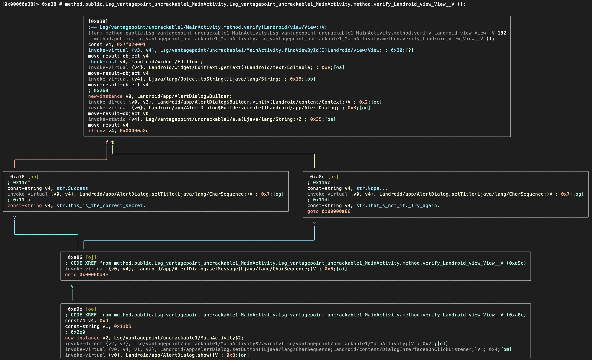

[radare2](https://rada.re/r/ "Radare2 official website") (r2) は、バイナリの逆アセンブル、デバッグ、パッチ適用、解析のための人気のあるオープンソースリバースエンジニアリングフレームワークであり、スクリプト化可能で、Android や iOS アプリを含む多くのアーキテクチャとファイル形式をサポートしています。Android では、Dalvik DEX (odex, multidex)、ELF (実行可能ファイル、.so、ART)、Java (JNI および Java クラス) がサポートされています。また、従来のツールが機能しない場合に役立つ、低レベルの逆アセンブルと安全な静的解析を提供するため、モバイルアプリケーション解析時に役立つ便利なスクリプトもいくつか含みます。

radare2 は前述のタスクを実行できる豊富なコマンドラインインタフェース (CLI) を実装しています。しかし、リバースエンジニアリングに CLI を使うことにあまり慣れていない場合は、Web UI (`-H` フラグを使用) や、[iaito](https://github.com/radareorg/iaito "iaito") と呼ばれるさらに便利な Qt および C++ GUI バージョンを使用することを検討するとよいかもしれません。CLI や、より具体的にはそのビジュアルモードやそのスクリプティング機能 ([r2pipe](https://github.com/radare/radare2-r2pipe "r2pipe")) が radare2 のパワーの中核であり、その使い方を学ぶ価値が間違いなくあることを心に留めてください。

## radare2 のインストール

[radare2 の公式インストール手順](https://github.com/radare/radare2/blob/master/README.md "radare2 installation instructions") を参照してください。radare2 は APT などの一般的なパッケージマネージャではなく、常に GibHub バージョンからインストールすることを強くお勧めします。radare2 は非常に活発に開発されているため、サードパーティのリポジトリは古くなっていることがよくあります。

## radare2 の使用

radare2 フレームワークは一連の小さなユーティリティで構成され、r2 シェルから使用したり、CLI ツールとして単独で使用できます。これらのユーティリティには `rabin2`、`rasm2`、`rahash2`、`radiff2`、`rafind2`、`ragg2`、`rarun2`、`rax2`、そしてもちろんメインの `r2` を含みます。

たとえば、`rafind2` を使用して、エンコードされた Android Manifest (AndroidManifest.xml) から文字列を直接読むこともできます。

```bash
# Permissions
$ rafind2 -ZS permission AndroidManifest.xml
# Activities
$ rafind2 -ZS activity AndroidManifest.xml
# Content providers
$ rafind2 -ZS provider AndroidManifest.xml
# Services
$ rafind2 -ZS service AndroidManifest.xml
# Receivers
$ rafind2 -ZS receiver AndroidManifest.xml
```

また、`rabin2` を使用して、バイナリファイルに関する情報を取得します。

```bash
$ rabin2 -I UnCrackable-Level1/classes.dex
arch     dalvik
baddr    0x0
binsz    5528
bintype  class
bits     32
canary   false
retguard false
class    035
crypto   false
endian   little
havecode true
laddr    0x0
lang     dalvik
linenum  false
lsyms    false
machine  Dalvik VM
maxopsz  16
minopsz  1
nx       false
os       linux
pcalign  0
pic      false
relocs   false
sanitiz  false
static   true
stripped false
subsys   java
va       true
sha1  12-5508c  b7fafe72cb521450c4470043caa332da61d1bec7
adler32  12-5528c  00000000
```

すべてのオプションを表示するには `rabin2 -h` とタイプします。

```bash
$ rabin2 -h
Usage: rabin2 [-AcdeEghHiIjlLMqrRsSUvVxzZ] [-@ at] [-a arch] [-b bits] [-B addr]
              [-C F:C:D] [-f str] [-m addr] [-n str] [-N m:M] [-P[-P] pdb]
              [-o str] [-O str] [-k query] [-D lang symname] file
 -@ [addr]       show section, symbol or import at addr
 -A              list sub-binaries and their arch-bits pairs
 -a [arch]       set arch (x86, arm, .. or <arch>_<bits>)
 -b [bits]       set bits (32, 64 ...)
 -B [addr]       override base address (pie bins)
 -c              list classes
 -cc             list classes in header format
 -H              header fields
 -i              imports (symbols imported from libraries)
 -I              binary info
 -j              output in json
 ...
```

メインの `r2` ユーティリティを使用して **r2 シェル** にアクセスします。他のバイナリと同様に DEX バイナリをロードできます。

```bash
r2 classes.dex
```

`r2 -h` を入力して、利用な可能なすべてのオプションを表示します。非常によく使用されるフラグは `-A` で、ターゲットバイナリをロードした後に解析をトリガーします。しかし、これは非常に時間とリソースを消費するため、控えめに小さなバイナリで使用すべきです。この詳細については [ネイティブコードの逆アセンブル (Disassembling Native Code)](../../techniques/android/MASTG-TECH-0018.md) をご覧ください。

r2 シェルに入ると、他の radare2 ユーティリティが提供する機能にもアクセスできます。たとえば、`i` を実行すると、`rabin2 -I` と同様にバイナリの情報を出力します。

すべての文字列を出力するには、`rabin2 -Z` を使用するか、r2 シェルから `iz` コマンド (またはより詳細ではない `izq`) を使用します。

```bash
[0x000009c8]> izq
0xc50 39 39 /dev/com.koushikdutta.superuser.daemon/
0xc79 25 25 /system/app/Superuser.apk
...
0xd23 44 44 5UJiFctbmgbDoLXmpL12mkno8HT4Lv8dlat8FxR2GOc=
0xd51 32 32 8d127684cbc37c17616d806cf50473cc
0xd76 6 6 <init>
0xd83 10 10 AES error:
0xd8f 20 20 AES/ECB/PKCS7Padding
0xda5 18 18 App is debuggable!
0xdc0 9 9 CodeCheck
0x11ac 7 7 Nope...
0x11bf 14 14 Root detected!
```

たいていの場合、コマンドに特別なオプションを追加できます。たとえば `q` でコマンドを詳細ではなく (静かに) したり、`j` で JSON 形式での出力を得ます (`~{}` を使用して JSON 文字列を整形します)。

```bash
[0x000009c8]> izj~{}
[
  {
    "vaddr": 3152,
    "paddr": 3152,
    "ordinal": 1,
    "size": 39,
    "length": 39,
    "section": "file",
    "type": "ascii",
    "string": "L2Rldi9jb20ua291c2hpa2R1dHRhLnN1cGVydXNlci5kYWVtb24v"
  },
  {
    "vaddr": 3193,
    "paddr": 3193,
    "ordinal": 2,
    "size": 25,
    "length": 25,
    "section": "file",
    "type": "ascii",
    "string": "L3N5c3RlbS9hcHAvU3VwZXJ1c2VyLmFwaw=="
  },
```

r2 コマンド `ic` (_information classes_) でクラス名とそのメソッドを出力できます。

```bash
[0x000009c8]> ic
...
0x0000073c [0x00000958 - 0x00000abc]    356 class 5 Lsg/vantagepoint/uncrackable1/MainActivity
:: Landroid/app/Activity;
0x00000958 method 0 pC   Lsg/vantagepoint/uncrackable1/MainActivity.method.<init>()V
0x00000970 method 1 P    Lsg/vantagepoint/uncrackable1/MainActivity.method.a(Ljava/lang/String;)V
0x000009c8 method 2 r    Lsg/vantagepoint/uncrackable1/MainActivity.method.onCreate (Landroid/os/Bundle;)V
0x00000a38 method 3 p    Lsg/vantagepoint/uncrackable1/MainActivity.method.verify (Landroid/view/View;)V
0x0000075c [0x00000acc - 0x00000bb2]    230 class 6 Lsg/vantagepoint/uncrackable1/a :: Ljava/lang/Object;
0x00000acc method 0 sp   Lsg/vantagepoint/uncrackable1/a.method.a(Ljava/lang/String;)Z
0x00000b5c method 1 sp   Lsg/vantagepoint/uncrackable1/a.method.b(Ljava/lang/String;)[B
```

r2 コマンド `ii` (_information imports_) でインポートされたメソッドを出力できます。

```bash
[0x000009c8]> ii
[Imports]
Num  Vaddr       Bind      Type Name
...
  29 0x000005cc    NONE    FUNC Ljava/lang/StringBuilder.method.append(Ljava/lang/String;) Ljava/lang/StringBuilder;
  30 0x000005d4    NONE    FUNC Ljava/lang/StringBuilder.method.toString()Ljava/lang/String;
  31 0x000005dc    NONE    FUNC Ljava/lang/System.method.exit(I)V
  32 0x000005e4    NONE    FUNC Ljava/lang/System.method.getenv(Ljava/lang/String;)Ljava/lang/String;
  33 0x000005ec    NONE    FUNC Ljavax/crypto/Cipher.method.doFinal([B)[B
  34 0x000005f4    NONE    FUNC Ljavax/crypto/Cipher.method.getInstance(Ljava/lang/String;) Ljavax/crypto/Cipher;
  35 0x000005fc    NONE    FUNC Ljavax/crypto/Cipher.method.init(ILjava/security/Key;)V
  36 0x00000604    NONE    FUNC Ljavax/crypto/spec/SecretKeySpec.method.<init>([BLjava/lang/String;)V
```

バイナリを検査する際の一般的なアプローチは、何かを検索し、そこに移動し、それを視覚化してコードを解釈することです。radare2 を使用して何かを見つける方法の一つは、特定のコマンド出力をフィルタすることです。つまり、`~` (大文字小文字を区別しない場合は `~+`) とキーワードを使用して grep します。たとえば、アプリが何かを検証していることが分かっていれば、すべての radare2 フラグを検査して、"verify" に関連するものが見つかる場所を確認できます。

> ファイルをロードする際、radare2 は見つけることができたものすべてにタグ付けします。これらのタグ付けされた名前や参照はフラグと呼ばれます。それらはコマンド `f` でアクセスできます。

ここでは "verify" というキーワードを使用してフラグを grep してみます。

```bash
[0x000009c8]> f~+verify
0x00000a38 132 sym.Lsg_vantagepoint_uncrackable1_MainActivity.method. \
verify_Landroid_view_View__V
0x00000a38 132 method.public.Lsg_vantagepoint_uncrackable1_MainActivity. \
Lsg_vantagepoint_uncrackable1
        _MainActivity.method.verify_Landroid_view_View__V
0x00001400 6 str.verify
```

0x00000a38 (二回タグ付けされている) に一つのメソッドと 0x00001400 に一つの文字列が見つかったようです。そのフラグを使用してそのメソッドに移動 (シーク) してみましょう。

```bash
[0x000009c8]> s sym.Lsg_vantagepoint_uncrackable1_MainActivity.method. \
verify_Landroid_view_View__V
```

もちろん r2 の逆アセンブラ機能を使用して、コマンド `pd` (またはすでに関数内にいることが分かっている場合は `pdf`) で逆アセンブリを出力できます。

```bash
[0x00000a38]> pd
```

r2 コマンドは通常、オプションを受け入れます (`pd?` を参照)。たとえば、数字 ("N") を追加してコマンド `pd N` にすることで、表示されるオペコードを制限できます。


コンソールに逆アセンブリを出力するだけでなく、`V` をタイプして、いわゆる **ビジュアルモード** に入りたいかもしれません。



デフォルトでは、16進表記で出力します。`p` をタイプすることで、逆アセンブリ表記など、さまざまな表記に切り替えることができます。


radare2 には **グラフモード** があり、コードのフローを追うのに非常に役立ちます。ビジュアルモードから `V` をタイプすることでアクセスできます。



これは Android バイナリから一部の基本的な情報を取得し始めるための radare2 コマンドの一部にすぎません。radare2 は非常に強力で、[radare2 コマンドドキュメント](https://book.rada.re/first_steps/commandline_flags.html) で見つかる多数のコマンドがあります。radare2 は、コードのリバース、デバッグ、バイナリ解析の実行など、さまざまな目的でガイド全体を通して使用されます。また、他のフレームワーク、特に Frida と組み合わせて使用することもあります (詳細については r2frida セクションを参照してください)。

Android での radare2 の詳しい使い方、特にネイティブライブラリを解析する際には、[ネイティブコードの逆アセンブル (Disassembling Native Code)](../../techniques/android/MASTG-TECH-0018.md) を参照してください。また [公式の radare2 ブック](https://book.rada.re/ "Radare2 book") も読みたいと思うかもしれません
