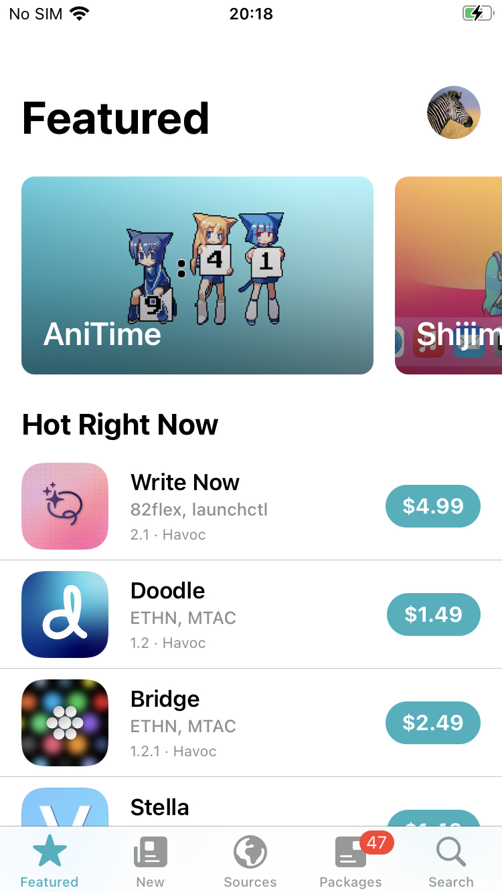

[Sileo](https://getsileo.app) は iOS 12 以降でルート済み脱獄とルートなし脱獄の両方で利用できるサードパーティアプリストアです。`apt/dpkg` を中心としたグラフィカルユーザーインタフェースを提供し、アプリ、バイナリ、Tweak をインストール可能にします。Sileo は Dopamine や palera1n などの人気の脱獄ツールにパッケージ化されています。

!!! 警告 「アプリのインストール」

    Sileo またはその他のサードパーティアプリストア経由でアプリケーションをインストールすると、アプリケーションは Apple によって検証されていないため、リスクが伴います。不明なアプリケーションのインストールには注意してください。

Sileo を使用することで、脱獄済みデバイス上に多くのツールをインストールできます。デフォルトでは、Sileo はすでにいくつかのパッケージリポジトリが設定されています。新しいリポジトリを追加するには **Sources** -> **Edit** に移動し、左上の **Add** をクリックします。

この方法でインストールできる便利なツールをいくつか紹介します。

- [Frida for iOS](MASTG-TOOL-0039.md)
- [SSL Kill Switch 2](MASTG-TOOL-0066.md)
- [GlobalWebInspect](MASTG-TOOL-0137.md)
- [AppSync Unified](MASTG-TOOL-0127.md)

